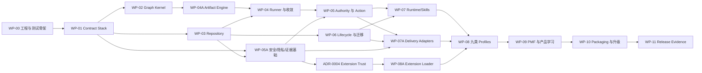

# Graph Engineering Workflow — Implementation Plan

## 1. 文档控制

| 项目 | 内容 |
|---|---|
| 版本 | v1 Reviewed，implementation-alignment revision 23 |
| 状态 | Independent Plan Review PASS；WP-00～04A PASS，WP-04 r3 implementation candidate；Human-approved ADR-0006 r8 additive offline-v2 provenance decision，revision 23 docs architecture R3 review pending |
| 日期 | 2026-08-14 |
| Author | Codex `/root` |
| Authority task | `GEW-PLAN-V1` |
| Intent Baseline | PRD v2 `594b4437301853919ce3b4aa93e703a395ed45bff924ea6266b3a8e202a30be7` |
| Tech Spec | v1 implementation-alignment revision 24（当前文件 digest 由 recovery amendment governing manifest 绑定） |
| Impact | v1 implementation-alignment revision 18（当前文件 digest 由 recovery amendment governing manifest 绑定） |
| ADRs | 0001 `d46dbe9216865029ef544ed17809a1252b5f10ea9d837d9b308192e06c19fa34`；0002 revision 6 `3cd015b6b0527665772a41f736596102d1e8c83c3029e16d8a2888481c8f6191`；0003 `a6a1648bbf8fcccbc5665c7c193cccdab11b3f096f4fb372338093fa4ed4bccf`；0005 recovery-claim compensation（Human Owner accepted，independent review pending）；0006 revision 8 R3 `73512e3c93020879d8ad0fb7098b75c76fe7bb948bcd00bb18cd1122bfe58986` |
| Review lineage | Existing Independent Plan Review PASS remains historical；revision 21 closed `WP08-MIG-DEP-DOCS-ARCH-R1-001`；revision 22 bound cffi path；revision 23 binds Human-approved additive offline-v2 provenance and revises stable `WP08-DEP-OPTION1-DOCS-ARCH-R1-001` for same reviewer R3 |
| 当前授权 | 批准计划内的本仓库可逆实现、测试、证据与独立审核；不授权不可逆动作或外部通信 |

本计划把已批准需求和架构转成可执行工作包。工作包只改变本仓库；旧项目
`agent-engineering-workflow` 不可写、不可复制为隐式依赖、不可成为安装/测试/运行前置。

## 2. 交付策略

采用“先安全内核、再可恢复单路径、再 runtime、再九类扩展、最后发布证明”的垂直切片：

1. 每个切片先提交 contract/schema/fixture 与失败测试，再实现最小行为；
2. 每个切片都必须产生可运行、可重放、可独立审核的增量，不建设未被路径消费的平台层；
3. WP-00～04 的集成场景只允许 deterministic fake adapters；所有真实 runtime/tool/connector
   动作保持禁用，直到 security/privacy/evidence foundation、authority/action/recovery、具体
   delivery adapters 与 target verification gates 全部通过；
4. 九类任务共享底层 primitives，但 completion、rollback 与真实 E2E 逐类独立；
5. Codex/Hermes Skills 是薄入口，核心通过安装包/CLI 提供确定性语义；
6. routine finding 在工作包内自动修订；Intent/Authority/重大新架构才升级 Human。

## 3. 目标仓库结构

ADR-0001 要求发布模块位于唯一命名空间，仓库责任目录映射如下：

| 仓库区域 | 安装模块/责任 |
|---|---|
| `core/` | `graph_engineering.core`：contract、graph、reducer、policy、digest、budget、invalidation |
| `application/` | `graph_engineering.application`：commands、queries、runner、recovery、completion |
| `storage/` | `graph_engineering.storage`：ports、SQLite repository、objects、locks、migration |
| `adapters/` | `graph_engineering.adapters`：Codex、Hermes、Git、tools、secrets |
| `config/` | schemas、registries、graphs、profiles、overlays、policies、defaults；无环境私值 |
| `skills/` | Codex/Hermes Skill assets 与 compatibility manifest |
| `scripts/` | build、doctor、conformance、release-evidence 辅助；不拥有业务规则 |
| `tests/` | unit、contract、integration、conformance、e2e、fixtures |

build backend 必须显式从四个责任 root 收集到 `graph_engineering.*`，源目录不能形成
`core/application/storage/adapters` 等可导入顶层包。CLI 只加载已安装 distribution。

## 4. 工作分解与依赖图

### 4.1 集成切片里程碑

组件 WP 只有被以下 slice 消费并通过 end-to-end scenario 后才算 integrated：

| Slice | Entry dependencies | 可执行端到端场景 | Stop/rollback 与证据 |
|---|---|---|---|
| S1 Discover/Approve/Review | WP-00～04（含 04A）；真实 SQLite repository + fake runtime/action adapters | 自然语言 fixture → discovery → PRD approve → artifact author/review/revise/PASS → durable deterministic snapshot | 不调用真实 runtime/tool；repository replay/invalid authority/independent review evidence |
| S2 Durable Graph/Recovery/Authority | S1、WP-05A、05、06 | 创建 durable task → graph run → prepared fake action → crash/unknown → reconcile → completion | 每 crash point old/new/blocked；rollback 为隔离 repository restore，不消除 audit |
| S3 Runtime/Adapter Parity | S2、WP-07、07A | pre-release wheel fixture + Codex/Hermes adapter → authorized Git/project command → target query/reconcile | 只有通过 action-scoped authority 的 disposable target；两个 runtime contract/rejection evidence；不声称正式安装通过 |
| S4 Profile Expansion | S3、ADR-0004、WP-08A、08 | 九类 × 三路径逐类 materialize/run/review/rollback/target verify | 每类独立 completion/rollback；失败退回 owning Profile/core WP |
| S5 Release Proof | S4、WP-09、10、11 | clean install/upgrade → frozen coverage → Candidate Review → Completion Record | zero waiver；release/push/deploy 仍需 Human action authority |

每个 slice 依次经过 test-first、mechanical verification、独立 review、finding revision、full
regression 和 digest-bound evidence。孤立 component tests 只能满足 G2，不能声称 vertical slice
完成。

## 5. 工作包

### WP-00 — 可复现工程与测试骨架

**目标：**建立不会掩盖 import、依赖或跨平台问题的开发与构建边界。

**产出：**

- `pyproject.toml`、Python 3.12+ constraints、唯一 namespace build mapping、CLI entry point；
- lint/type/test/security/license/SBOM/build/reproducibility 命令；
- unit/contract/integration/conformance/e2e test markers 与 isolated temp-root fixtures；
- macOS/Linux CI matrix 与 wheel-install test，不从 source root 导入产品模块；
- architecture scans：core 禁止 adapter/vendor/environment import，数据逻辑分离扫描。

**退出：**wheel 可在隔离环境安装；仓库内外及 decoy top-level packages 下 import origin 一致；
空测试层可执行；没有旧项目路径或 ambient index/runtime 依赖。

### WP-01 — Deterministic Contract Stack

**需求：**FR-03～08、10～12、14、18；NFR-02～08；ADR-0003。

**产出：**

- strict JSON/I-JSON parser、GEW Schema Profile、closed registry、offline ref loader；
- immutable domain codec、JCS input profile、raw/semantic digest 与 self-digest projections；
- GEEL AST/evaluator、exact result/error records、ErrorRuleRegistry；
- ResourceProfile、CostSchedule、recursive charge trace；
- schema/format/registry/digest/GEEL/cost golden corpora，由 Python 与独立实现交叉验证。

**退出：**所有 golden vectors byte-identical；未知 schema/ref/format/executable fail closed；
budget boundary 在每个 emitted event 前后稳定；core 不含用户阈值或环境值。

### WP-02 — Graph Kernel、状态与失效

**需求：**FR-04～06、09～10、12、14；NFR-02、04、05、07。

**产出：**

- Graph/Node/TypedEdge/Join/Trust/Fallback/LoopBudget schemas 与 loaders；
- TaskSnapshot、NodeRun、Artifact/Evidence refs、dependency index；
- command/event tables 和 pure reducer，非法 transition 默认拒绝；
- deterministic routing/join/completion predicates；
- baseline/project-scope/artifact/evidence dependency invalidation 与漂移分类。

**退出：**状态×命令模型测试覆盖批准表；同一 events 生成唯一 snapshot/decision；语义变化
只失效受影响 descendants，外部已执行动作进入 reconciliation 而非伪装回滚。

### WP-03 — Local Repository、对象与并发

**需求：**FR-03、06～08、11、15～17；NFR-02、03、06～08；ADR-0002。

**产出：**

- backend-neutral ports 与 SQLite DELETE/EXTRA ConnectionFactory；
- event/head/snapshot/catalog/lease/fence/claim/migration schema 与 atomic CAS commit；
- immutable object staging/publication/reader/GC/purge；
- installation/object/resource locks、PID/fork registry、canonical global lock order；
- repository conformance harness、crash/disk-full/corruption/symlink/fork fault injection。

**退出：**所有 durable step 的 crash 只暴露 old/new；committed ref 不缺 object；两个进程、
fork 与相反 resource order 不破坏 exclusivity；未知 action claim 不被 GC/恢复误清。

object publication 的 fresh 与 deduplicated path 使用同一 fail-closed invariant：任何 pathname/
descriptor binding mismatch 都清理未经验证的 final/staging；若已有 `available` metadata，则必须
在当前 transaction 回滚后持久化为 `quarantined`，不能留下 available-to-missing-file 状态。
同 digest publication 从 staging 到 cleanup 全程持有独立 publication lock；它位于全部 action
resource locks 之后、object maintenance 之前，且 publication API 可复用 caller 已持有的
installation scope。cleanup 只移除 mismatch 时观察且在删除时仍为同一 device/inode 的 final，
后续 writer 不得被陈旧 pathname cleanup 删除。

**阶段边界：**WP-03 candidate 必须绑定 live filesystem/VFS/SQLite capability、high-level
durable step schedule、真实 process SIGKILL、corruption/symlink/fork/concurrency 和 exact
dependency evidence。Test Plan 的 syscall/torn/reorder/VM power-cut 与 Linux rejecting/no-op
`xSync` matrix 仍是 release-blocking durability evidence，不能用当前 macOS process-crash
candidate 替代。完整 export/import/activation/restore-gap 状态机属于 WP-06；WP-03 仅建立
其 schema、ledger、lock 与 backend-neutral port foundation。

### WP-04A — ArtifactContract 与逻辑产物生命周期

**需求：**FR-06、09、10、14；NFR-02、07；Spec §10.1。

**产出：**

- versioned ArtifactContract registry、ArtifactRecord state machine、logical artifact identity；
- required semantic fields、input/baseline/target/trace/digest/status/finding/review/approval/exit
  validators 与 author/reviewer independence；
- Positioning、PRD、Tech Spec、Impact、Plan、Test Plan、Implementation、Verification、Candidate
  Review、Completion Record 十个逻辑 contract；
- full 文件与 compact/emergency `LogicalBodyManifest`：selector、non-overlap、canonical extracted
  body digest、独立 metadata/dependencies/invalidation；
- artifact→artifact/evidence/requirement dependency index 与 lifecycle audit events。
- canonical actor identity、authoritative target registry、all-reference exact trace closure；
- authoritative input 的 ref/kind/digest/task/baseline exact tuple binding 与 multi-baseline swap rejection；
- per-entry logical-body digest 与 charged raw/result/temporary/budget boundaries；
- factory-only validation/lifecycle evidence、closed revision predecessor rule 与 gate-bound mutation
  per-assertion subcase manifest。

**退出：**十类 golden/逐 required-field corruption fixtures 与声明的 identity/authority/trace/
lifecycle/resource/invalidation mutation subcases 全部通过；merged physical file 中
一个 logical body 变化只失效其 declared descendants；Runner/Profile/Completion 只能消费
contract-valid、current、reviewed logical artifacts。

### WP-04 — Application Runner 与自主收敛

**需求：**FR-01、04～06、08～10、15；NFR-02、03、07。

**依赖：**WP-02、WP-03、WP-04A。

**产出：**

- create/list/search/show/resume/pause/cancel/archive commands 与 read-only queries；
- scheduler、ready-set、node attempt、author/reviewer lineage、finding ownership/routing；
- digest-progress、重复 finding、冲突 finding、loop budget 与 non-convergence escalation；
- Candidate/Completion Gate，绑定当前 baseline/snapshot/evidence/reviews/target state；
- runtime stop 后不后台推进、同 runtime resume/replay。

**退出：**routine finding 能在预算内闭环；无进展/冲突稳定升级；伪造产物、陈旧证据或
漏掉门槛不能完成；query 永不写状态。

**r1 candidate 对齐：**已实现 application command/query 原子边界、domain/repository revision
分离、same-lineage resume、serial ready-set、candidate→validation→independent review、stable finding
闭环、digest no-progress/non-convergence、declared failure fallback/default block 与两阶段 Completion
Gate。当前候选只接 deterministic fake runtime/validator/reviewer；真实 action、adapter 与安全证据
仍由 WP-05A/05/07 解锁，不因本候选通过而提前启用。

### WP-05A — Action-path Security、Privacy 与 Evidence Foundation

**需求：**FR-06、07、09～12、17、18；NFR-02、05～07；Impact §8.2、Spec §8.3/§10/§15。

**产出：**

- canonical Owner/runtime/target identity、ProjectScope 与 baseline/snapshot/digest binding helpers；
- data classification、secret reference provider port、redaction、quarantine、retention/purge；
- DataDisclosurePlan 与 destination/field allowlist/payload/authority/receipt validators；
- EvidenceRecord freshness/trust/provenance、leakage-safe incident record 与 review trust rules；
- path/symlink/shell/prompt injection、identity/digest/type confusion、extension fail-closed controls。

**退出：**Impact §8.2 的全部控制都有 contract/test evidence；secret value 不进入 state/log/
evidence；未声明 destination、超分类、缺 redaction/authority 拒绝；未通过 ADR-0004 的 non-built-in
executable extension 一律拒绝。在此 gate 前任何 WP 只能使用 deterministic fake adapter，
不能执行真实 runtime/tool/connector path。

### WP-05 — Authority、真实 Action 与恢复

**需求：**FR-07、08、10、11、15、17；NFR-02、03、06、07。

**依赖：**WP-03、WP-04、WP-05A。

**产出：**

- IntentBaseline、AuthorityEnvelope、PreparedAction、ActionJournal、DisclosurePlan contracts；
- prepare → authorize → execute gate → call → receipt → target reconcile；
- runtime/Owner/target/baseline/snapshot/payload/expiry/revocation/lease/fence revalidation；
- idempotency、native precondition/fence 与 call-span lock capability policies；
- non-idempotent crash/timeout `unknown`、durable claim、compensation/manual reconciliation routes。
- ADR-0005 recovery-claim transition：expired lease 下复用 original exact unresolved claim 的同
  task/lease、完整 resources/latest fences；separate rollback authority、完整 call-span locks、
  compensation started/receipt durability 与 fresh target verification 后原子 claim consumption。

**退出：**任何绑定值改变都在 tool call 前拒绝；每个 crash point 不静默 replay；success 必须
由目标状态证明；expired recovery 不授予 normal replacement lease、不创建第二 claim、不释放
未验证的 original claim、不重放 original action；commit/push/merge/deploy/release/外部通信仍需
各自动作授权。

**ADR-0005 实施顺序：**先冻结 recovery request/event/journal/claim schemas 与 negative fixtures；
再扩展 backend-neutral repository port，使 compensation-only started/receipt 能在 exact unresolved
claim/latest fences 下 durable、但不消费 claim；随后接入 application gate 与 deterministic fake
adapter，持锁执行补偿并 fresh verify；最后完成 live/expired/crash/mutation/full-suite evidence 和
独立 review。任一步失败均保留原 claim，路由 target reconciliation/Human manual coordination。

### WP-06 — Project/Task Lifecycle、Export 与 Migration

**需求：**FR-03、08、15、16；NFR-03、07、08；ADR-0002。

**产出：**

- new/existing Git project、多仓库/服务/环境 ProjectScope 和 TargetBinding；
- canonical identity、scope digest、批准后 change classification 与 reapproval/invalidation；
- verified export snapshot/hold/bundle/import/replay/integrity；
- installation manifest、migration/activation/rollback/restore-gap/fencing high-water；
- retention、archive、cancel、revocation 与受控 rollback semantics。

**退出：**迁移每步 crash 恢复 verified active/blocked；stale bundle 不能解锁未知 actions；
scope mismatch fail closed；旧 backend 在失败时仍可执行。

### WP-07 — Runtime Adapters 与 Skill-first 体验

**需求：**FR-01、02、07、08、16；NFR-01、04、08；ADR-0001。

**产出：**

- RuntimeAdapter capability/identity/session/lineage/decision/subagent/tool contract；
- Codex Skill：自然语言 discovery、批准、执行、恢复、状态与升级呈现；
- Hermes Skill：Telegram/Discord pairing/allowlist/channel lineage、长消息 receipt；
- canonical executable locator 与 Skill/core/adapter/schema/repository handshake；
- runtime binding 与 cross-runtime continuation rejection。

**退出：**Codex/Hermes 在 WP-00 build 产生的隔离 pre-release wheel/Skill fixture 环境完成相同
adapter contract、identity、handshake、resume/rejection；其他 user/session/runtime 不能注入批准
或复用 authority；Skill 不包含 reducer/authority/digest/completion 业务逻辑。Hermes Telegram
与 Discord 分别在通用 conformance graph 上通过 create、Owner identity、approval、recovery、
result delivery、unauthorized-user reject，不得用聚合 evidence 替代任一 channel。此 WP 不要求
尚未实现的 full/compact/emergency overlays，也不把 fixture wheel 当正式 clean install evidence。

### WP-07A — Git、Project Command、Target Query 与 Secret Adapters

**需求：**FR-02、07、11、15、17；NFR-03、04、06、08。

**依赖：**WP-05、WP-05A、WP-06；在此之前 action path 只使用 fakes。

**产出：**

- Git adapter：repository/worktree/common-dir identity、read/write operations、expected head/ref
  preconditions、idempotency/failure receipt 与 post-action query；
- structured project-command/tool adapter：argv 无 shell 拼接、cwd/target allowlist、capability、
  timeout/cancel、side-effect/idempotency class、raw receipt；
- target-state query/reconciliation adapter：fresh query identity、expected/actual state、fence/
  precondition support、unverifiable blocked；
- secret-provider adapter：只解析已批准 reference，按 action 最小注入，不写入 state/evidence；
- connector registry 对未实现 vendor integration 给 stable capability mismatch，不做 best-effort。

**退出：**disposable clean Git fixture 通过 concrete adapters 完成一次 authorized mutation 和
target-state reconciliation；precondition/digest/disclosure/secret/idempotency 任一不符时 side-
effect counter 为零；mock/fake evidence 不能满足 real E2E。

### WP-08A — Extension Trust ADR 与 Loader

**需求：**FR-18；NFR-02、04～06、08；Impact §14.2、ADR-0003。

**前置 architecture node：**先编写并独立审核
`docs/adr/0004-extension-source-and-capability-trust.md`，明确 package source/signing/provenance、
installation、capability sandbox/allowlist、adapter/executable trust、revocation 与 update policy。
该 ADR Accepted 前不能实现 non-built-in executable loader；若选择改变批准的本地/Skill-first/
权限边界则升级 Human，否则在既定 Intent 内自主收敛。

**产出：**

- extension manifest/loader、exact version/digest/source verification、compatibility/capability gate；
- ADR-0004 r5 的平台中立 verifier port 与 PyCA `cryptography==50.0.0` adapter；WP-08A 只做离线候选验证，WP-10 负责 ReleaseInstallManifest 的 exact artifact/source/RECORD hash 与 attestation pin；
- ADR-0004 r6 的 PyPA `packaging==26.3` boundary parser，用于离线 wheel filename/tag/PEP 508 requirement 与 closure 验证；WP-10 继续负责其 distribution/wheel/source/RECORD/attestation exact pin，runtime 无 network fallback；
- ADR-0004 r7 的 manifest-bound byte execution protocol 与 physical ZIP/full-closure budget oracle；所有替换、竞态、隐藏成员和预算耗尽均不得发行 record 或产生 install mutation；
- node/edge/policy/template 与 adapter/executable 扩展的分类加载；
- task-start version lock、revocation、conflict/override rejection、diagnostic records。

**退出：**第三方 executable schema/predicate/validator/transform/adapter 在 ADR gate 前全部拒绝；
gate 后只允许来源、签名/provenance、capability 和 compatibility 满足 Accepted ADR 的 package；
扩展不能覆写 core invariant、安全下限或 built-in identity。

### WP-08 — 九类 Profile 与三条风险路径

**需求：**FR-04、05、09、10、14、17、18；全部 v1 release matrix。

**依赖：**WP-04A、WP-05A、WP-06、WP-07、WP-07A、WP-08A、Accepted ADR-0002 revision 6、ADR-0006
revision 8与ADR-0007 decisions，以及各自独立architecture review/schema-conformance gate。migration rehearsal、
dependency graph/remediation与performance authority各自只blocking其明确stable bindings，不可交叉代替。

**产出：**

- Profile schema、materializer、Support Matrix、ReleaseCoverageGate；
- 新项目/功能、Bug、Hotfix、重构、数据库/架构迁移、依赖/安全、性能、发布/运维、事故响应
  九个 versioned Profile；
- `full-planned`/`compact-planned`/`emergency` overlays，安全底线不可被 overlay/项目配置降低；
- 每类标准 artifacts、category completion、rollback、real target verification；
- 九类 fixture projects 与真实工具链 E2E harness；
- dependency-security 使用 ADR-0006 的 installation-pinned offline advisory/source registry、
  WP08A-bound factory-issued closure/applicability/residual observations与final current authority：exact绑定
  same-registry advisory/source、before/after closure、affected/fixed facts并全量计算residual rows/set；
  issue/use/precommit/restart重读current installation，update/revocation generation/high-water单调；
- performance 使用 ADR-0007 的 installation-pinned benchmark registry与parent-owned monotonic observer：
  对每次factory-attested StructuredCommand完整调用计时，child只返回correctness digest；exact environment
  fingerprint、config-owned warmup/odd repetitions、integer median/MAD/noise ceiling与baseline/target/rollback
  integer cross-products进入同一current observation/digest链，禁止cross-hardware normalization；
- migration scenarios使用ADR-0002 revision 6的consumer-local `MigrationRehearsalFactory`：只在disposable
  private root复用existing InstallationMigrationRepository/ledger，forward A→B、monotonic backward B→A、
  partial-data dispositions与crash old-or-new observations进入task-bound current projection；
- dependency-security transitive/fix-unavailable使用ADR-0006 revision 8的installation-pinned advisory/graph/
  remediation registries：transitive只选择config-owned cffi advisory与三节点physical path，unavailable只接受
  explicit current packaging disposition与residual owner route，禁止direct/caller alias、threshold downgrade、
  missing-fix inference或resolver/scanner/network；
- 274 个冻结 binding 各自的 deterministic unique task identity，并绑定 selector/request/
  oracle/plan digest；coverage harness 仅按 Profile 复用 disposable repository/application
  资源，保持独立 task rows/current authorities，real-E2E 逐 Profile 隔离；
- factory-owned、consumer-local coverage authority lifecycle：每个 candidate 只能进入一个单调终态；
  一次 exact combined gate 重验完整 factory-issued record set 后走 finalize，尚未产生 combined gate
  decision 的 uncommitted candidate 只能先由 factory 在 register/gate/finalize 同一锁内冻结 exact
  generation 与完整 current authority/record projection，并原子保存 `abort-prepared` state、frozen snapshot
  与 one-shot capability identity tuple，再走 abort。prepare return 丢失时同一 factory/candidate 只返回
  同一个 stored capability，不重新签发或改变 projection。两者互斥且
  idempotent，分别 revoke execution/observation/record capability 并释放 identity graph；abort 不生成或
  伪造 gate decision。partial/wrong candidate、foreign/clone 与异常切点 fail closed，durable
  task/action/target、immutable record documents 与合法 gate result 不变。

**退出：**九类冻结矩阵全部 required cases 通过；每类至少一个真实项目 E2E；Codex 与
Hermes 各自完成 `full-planned`/`compact-planned`/`emergency` 六格，Telegram/Discord channel contracts 分别通过；
共享 node/runtime/path PASS 不替代类别 completion；combined `ReleaseCoverageGate` 不分片、
不放宽，全部 records 在 use-time 重新验证 currentness，拒绝路径保持 zero-write。fixture
资源复用不得新增 repository/DB/GraphRef lifecycle 边界；coverage authority finalized/aborted 后所有
issue/current/restart/gate/register 入口拒绝。gate/finalize 与 abort 由同一 consumer-local 线性化点
选择唯一分支；in-process injected exception 只由同一 factory 对象幂等继续已选择分支，process
termination 后 authority/capability 不可从 bytes/restart 恢复；focused harness 在 `OK` 后 120 秒内
自然 exit 0。
dependency-security 还必须证明 disposable local A affected closure→B approved fixed closure 的一次
ActionCoordinator/Git mutation、WP08A physical closure revalidation、security regression 与 fresh target；
stale C/unapproved closure、expired/revoked/foreign/coherently-resigned advisory/source/registry、post-observe
replacement 均 zero task/action/Git mutation。DNS/socket/proxy/index 调用 exact 为零，不能以 WP08A
preflight、fixture label 或 command PASS 单独代替 advisory authority，也不能越过 WP10 activation block。

**Dependency-security 最小实现顺序：**

1. ADR-0006 independent architecture review PASS；冻结10组exact source/digest-input schema IDs、nested
   self-digest projections、registry/bootstrap/observation protected-member pins；
2. TDD genesis `(generation=1,previous=null)`、closed sorted/unique high-water与status transitions；new identity
   exact active/status-generation=candidate head，unchanged status保留prior generation，transition使用candidate
   head，且`1 <= status_generation <= head`；拒绝future/stale/bump/wrong generation、
   `not_before <= clock < not_after`、source失活与
   referencing advisory同步失活、source/advisory/registry结构和source checkout/wheel RECORD currentness；
3. 在既有installation-verification boundary实现current→candidate exact+1/previous/high-water比较与
   higher-generation rollback；不新增WP-08 DB/pointer，不激活candidate；
4. 复用 WP08A offline preflight 签发 before/after closure，再以same-factory registry/advisory/source
   签发applicability与全registry residual observations；evaluation universe exact为high-water active set，
   与rows中非inactive identities双向相等；历史inactive rows保留identity，不要求source current且不进入
   residual set；new revision可active，旧superseded/revoked identity不复活；拒绝omit/duplicate/fake-active及
   caller bool/list；
5. 实现 consumer-local final dependency-security observation 与 use/precommit/restart全量重算；
6. 在现有 2 discovered coverage methods 内增加 exact 24 mandatory P/R、12 oracles、Option C unique tasks；
7. 先以 function-level 和 partial P/R candidate 验证 exact abort capability：abort 前无 combined gate
   decision，abort 后 factory/authorities/records-for-use 永久失效且 immutable documents/durable signatures
   不变；foreign/clone/wrong candidate、caller partial selection、并发 gate/finalize 与 in-process exception/
   process-termination cuts fail closed。factory 在 prepare-abort 线性化锁内冻结 candidate generation、
   plan、完整 current issuance graph 与 projection digest，并与one-shot capability identity作为一个tuple
   提交；prepare 后 registration/gate/finalize 拒绝，register 与 prepare 的先后结果 exact。验证tuple前
   exception保持active、tuple后return丢失/retry返回same cap、consume后prepare拒绝且same-cap abort幂等。再以
   serial/private-root 验证 plan `170`、oracle bindings `85`、combined gate
   `170 valid / 104 missing / false`、static `0/274`，对 exact consumed candidate 执行 lifecycle
   finalize/revoke，并要求 abort/finalize 两条分支均 <120s cleanup。

任一步不收敛时回退为不注册 factory、24 IDs 保持 missing；不删除历史 registry/observation/audit，
不联网补证，不修改 WP08A 历史 tuple/gate/evidence，不把 22 generic records 冒充完整 Profile batch。

**Performance 最小实现顺序：**

1. ADR-0007 independent architecture review PASS；冻结9组source/digest-input schema IDs、benchmark registry/
   installation bootstrap/protected-member closure与exact environment fingerprint fields；
2. TDD registry/case/statistics/environment strict schema：config-owned nonnegative warmup、bounded odd
   repetition count、positive integer ratios、command/fixture/sample/source/correctness bindings；拒绝unknown/
   missing/extra/duplicate/reorder/alias、coherent resign与installation replacement；
3. 实现consumer-local registry/clock/observation factory。parent只在每次attested launcher完整调用立即前后取
   `monotonic_ns`，warmup不进入统计，child output exact只有correctness digest；serial/private-root且
   DNS/socket/proxy调用为零；
4. 从ordered positive integer samples重算odd median、MAD与noise cross-product；baseline/candidate exact
   environment相同后按target ratio比较，超noise=`inconclusive-noise`并fail closed；caller timing/PASS、
   float/rounding、outlier deletion与cross-hardware normalization全部拒绝；
5. 按Human-approved Option B冻结现有category assessment 1.0 pair，并增加exact
   `urn:gew:schema:category-completion-assessment:1.1.0` / input 1.1 pair：仅performance
   assessment内嵌closed `performance_evidence_projection`，exact绑定task revision/snapshot/epoch、GraphRef six pins、factory/
   installation/environment/session pins、ordered A→B→A generation/history、samples/statistics/comparisons与final
   observation；非performance禁止该字段，不新增generic task event、DB/storage schema或通用evidence API；
6. assessment issuer从factory-issued seal重算完整projection；TaskApplication在现有category precommit的全部hooks
   后重读current source与pins，并以既有`task.category_assessed` EvidenceRef原子提交单一assessment CAS。
   restart从task唯一current ref以`require_referenced=true`重读、重算且launcher count为零；foreign/clone/stale/
   reorder/coherent resign/alias/CAS replacement拒绝zero write；
7. 复用existing ActionCoordinator/GitNativeAdapter完成disposable A baseline→B candidate一次mutation与fresh
   target；rollback恢复exact A后重新benchmark并通过rollback ratio。stale A/actual C在mutation/launch前拒绝；
8. 在existing 2 coverage methods增加exact24 P/R、12 oracles、Option C unique tasks。验证plan `194`、oracles
   `97`、combined gate `194 valid / 80 missing / false`、static `0/274`，随后复用既有finalize/revoke或
   pre-gate abort lifecycle与<120s teardown。

任一步不收敛时不注册performance factory，24 IDs保持missing；不降级为child自报elapsed/PASS、不新增
benchmark dependency/DB/GraphRef/network，不改变既有170 records或WP08A历史bytes。

**Migration rehearsal scenario 最小实现顺序：**

1. ADR-0002 revision 6 independent architecture review PASS；冻结registry/fixture/transform manifest/bootstrap与7组exact
   source/input schemas、nested digest projections、protected package/source members；
2. 在existing WP08 P/R discovery建立四scenario pairs缺失RED，并对A/B transform、partial dispositions、crash cut
   IDs与Option C task IDs做exact plan/oracle closure；
3. factory只包装existing InstallationMigrationRepository-issued bundle/manifest/ledger/lock/fence。验证forward A→B
   与backward B→A manifest generation/epoch严格递增、唯一transform path、replay/integrity/compatibility；
4. partial-data逐row验证`preserved|defaulted|rejected|owner-route`；crash matrix逐state只接受完整old/new，拒绝
   mixed/verifying exposure、epoch/fence rollback、claim omission与restore-gap auto-clear；
5. 增加category assessment1.2 migration branch，issue/precommit/restart重读task唯一CAS、current repository/
   installation与fresh target，restart migration replay=`0`；foreign/clone/stale/coherent replace/history reorder
   zero writes；
6. strict serial/private root运行四P/R selectors与combined production P，要求plan`216`、oracles`108`、gate
   `216 valid / 58 missing / false`、static`0/274`，随后finalize/revoke或partial abort与<120s teardown。

任一步不收敛时不注册rehearsal factory，不修改repository/DB schema，不真实activate；八IDs保持missing，existing
208 records、final217 bytes与durable state不变。

**Dependency graph/remediation scenario 最小实现顺序：**

1. ADR-0006 revision 8 independent architecture review PASS；冻结revision 7的5组new source/input schemas与
   revision 8唯一bootstrap1.2 source/input pair（dependency增量累计6组）、existing10+new5 bootstrap1.1 closure与
   category assessment1.2 dependency branch；同时冻结
   advisory registry forward generation 2与stable finding `WP08-DEP-OPTION1-DOCS-ARCH-R1-001`：generation-1 registry、
   offline-v1 artifact/attestation/bootstrap/schema bytes不变；新增`source:dependency-advisory:offline-v2@1`完整
   snapshot+attestation，v1 source/packaging revision 1转superseded，v2 source、packaging revision 2与
   `advisory:cffi:security-v1@1` active/status-generation 2；
2. 新current bootstrap1.2与source/input1.2 schema pair建立closed ordered history
   `config/security/dependency-advisory-registry-v1.json↔v1 snapshot`、
   `config/security/dependency-advisory-registry-v2.json↔v2 full snapshot`，两个registry paths无alias，package/source
   同时protect/ship两代registry/artifact/attestation/bootstrap/schema；TDD先对old-source omission、mixed/delta snapshot、
   cross-attestation、history replacement/reorder及coherent re-sign建立zero-write RED；
3. TDD exact METADATA-derived root/nodes/edges、specifier/extras/marker、canonical sorted/unique与closure双向相等；
   missing/extra/reorder/duplicate/wrong parent/cycle alias/caller graph/coherent re-sign全拒绝；
4. transitive P只能选择config-owned cffi advisory，证明ordered exact path
   `graph-engineering-workflow@0.1.0→cryptography@50.0.0→cffi@2.0.0`，最少三节点，并由root
   `cryptography==50.0.0`与cryptography `cffi>=2.0.0` physical METADATA edges连接；before affected与after
   `closure:cffi:2.0.0` fixed closure/regression/fresh target分别current；R broken/foreign/reordered path、raw alias、
   direct packaging substitution、caller advisory/graph或threshold两节点降级在assessment/observation/record前拒绝；
5. fix-unavailable P只消费active packaging revision 2的same-advisory current/time-valid `approved-unavailable` row、完整residual evaluation与
   nonempty owner route；R覆盖missing row、wrong revision、expired/foreign owner与从missing fix推断；
6. use/precommit/restart/coverage每次重读generation-2 advisory/high-water、v2 full snapshot/attestation/history、registries/bootstrap/METADATA/RECORD并
   重建graph/path/disposition，task-bound observation只能从unique current CAS ref恢复；restart zero graph/action replay，
   DNS/socket/proxy/index/scanner exact为零，所有R task/action/target/input writes exact为零；
7. 完成四records后combined plan`220`、oracles`110`、gate`220 valid / 54 missing / false`、static`0/274`；复用
   Option C/finalize/revoke/abort与<120s teardown。

任一步不收敛时不注册graph/remediation factory，不修改existing advisory history或WP08A evidence，不联网补证；
四IDs保持missing，migration的216 records（若已完成）仍immutable/current。

### WP-09 — PMF 与产品学习

**需求：**FR-13；NFR-01、06、07。

**产出：**

- 本地最小 PMF events、假设/反证/实验建议和 no-content aggregate reports。

**退出：**PMF 记录能支持 success/counter-evidence 判断且不保存源码/prompt/secret/body；Human
与 Agent 可共同审阅产品假设、反证和下一实验，指标阈值来自版本化配置而非 engine code。

### WP-10 — Packaging、Doctor、升级与供应链

**需求：**FR-01、16；NFR-01、06、08；ADR-0001。

**产出：**

- exact wheelhouse、managed Python、ReleaseInstallManifest、SBOM/license/vulnerability evidence；
- macOS/Linux install/init/doctor/uninstall；canonical executable/Skill installation；
- isolated candidate install、compatibility/migration dry-run、atomic activation、rollback；
- tamper/untrusted source/unsupported platform/path-shadowing/version mismatch rejection。

**退出：**同一 release input 两次 clean install manifest 相同；每个升级 crash/failure 保留旧
CLI/repository 可用；Codex/Hermes 从 supported clean install 重新执行 adapter/Skill handshake
与代表任务，且安装/运行在旧项目不可访问时完整通过。

### WP-11 — Release Evidence 与 Candidate Review

**需求：**全部 FR/NFR 与 PRD §12。

**产出：**

- 需求→工作包→test case→evidence→candidate trace matrix；
- full clean suite、macOS/Linux、Codex/Hermes、Telegram/Discord、九类与三路径报告；
- security/privacy/supply-chain/crash/migration/performance/PMF counter-evidence；
- independent Candidate Review 与 deterministic Completion Record；
- release notes/known unsupported integrations（不弱化类别核心承诺）。

**退出：**Test Plan 全部 release blockers PASS、零 waiver；六个 runtime/path cells、两个 Hermes
channel contracts、两个 runtime supported clean-install evidence 全部 current；Candidate reviewer
独立；目标状态而非产物清单证明完成。release/deploy/push 等仍等待 Human 单独授权。

## 6. 工作包门禁

每个 WP 依次经过：Test-first contracts/fixtures → Implementation → Mechanical verification →
Independent review → findings revision → evidence digest binding。禁止以“后续补测试”越过。

| Gate | 必须满足 |
|---|---|
| G0 Ready | 上游 digest 有效、依赖 WP PASS、target/authority 明确、test cases 已存在 |
| G1 Implemented | 最小 scope 完成，无未声明依赖、环境值或安全降级 |
| G2 Verified | unit/contract/integration/failure/security relevant suite PASS |
| G3 Reviewed | 独立 reviewer PASS；blocking findings=0；routine findings 已复验 |
| G4 Integrated | 全部已完成 WP regression PASS，evidence/current digest 一致 |

extension trust 必须先走 ADR-0004 author/reviewer loop；只有该 ADR 会改变已批准产品/权限边界
才升级 Human。任何 WP 若引入 daemon/cross-runtime state、多用户、远程存储、新的不可逆
动作类别或改变九类承诺，立即停止并升级 Human；普通实现取舍留在批准 ADR 内。

## 7. 需求覆盖

| 需求 | Work Packages |
|---|---|
| FR-01 | 04, 07, 10 |
| FR-02 | 06, 07, 07A |
| FR-03 | 01, 02, 03, 06 |
| FR-04 | 01, 02, 04, 08 |
| FR-05 | 02, 04, 08 |
| FR-06 | 01, 02, 04A, 04, 05A |
| FR-07 | 01, 05A, 05, 07, 07A |
| FR-08 | 03, 04, 05, 06, 07 |
| FR-09 | 02, 04A, 04, 08, 05A |
| FR-10 | 01, 02, 04A, 04, 05, 08, 05A |
| FR-11 | 03, 05A, 05, 07A |
| FR-12 | 00, 01, 02, 05A |
| FR-13 | 09, 11 |
| FR-14 | 01, 02, 04A, 08, 11 |
| FR-15 | 03, 04, 05, 06, 07A |
| FR-16 | 03, 06, 07, 10 |
| FR-17 | 03, 05A, 05, 07A, 08 |
| FR-18 | 01, 05A, ADR-0004, 08A, 08 |
| NFR-01 | 00, 07, 10 |
| NFR-02 | 01～05, 04A, 05A, 08, 08A, 11 |
| NFR-03 | 03～06, 10 |
| NFR-04 | 00, 02, 07, 07A, 08A |
| NFR-05 | 00～02, 05A, 08, 08A |
| NFR-06 | 03, 05A, 05, 07A, 08A, 09, 10 |
| NFR-07 | 01～06, 04A, 05A, 09, 11 |
| NFR-08 | 01, 03, 06, 07, 07A, 08A, 10 |

## 8. 实施 Authority Envelope 提案

本计划通过审核后，implementation envelope 应只允许：

- 本仓库 `core/ application/ storage/ adapters/ config/ skills/ scripts/ tests/`、ADR-0004 与构建配置；
- 创建/修改本地测试 fixtures 和 `.workflow/delivery/GEW-IMPLEMENTATION-V1/` 证据；
- 运行本地 build/test/lint/type/security/conformance；
- 为跨平台/真实 runtime/E2E 创建候选 action record，但没有单独动作授权不得执行外部副作用。

明确禁止：旧项目写入、用户真实项目写入、真实消息、commit/push/merge/deploy/release、凭据
读取/存储、未列网络访问。计划审核不会自动授予这些动作。

## 9. Plan 退出条件

- 18 FR、8 NFR、九类任务、三风险路径、两个 runtime 均映射；Codex/Hermes 2×3 六格和
  Telegram/Discord 两套 channel contract 均为独立 exit evidence；
- work packages 有依赖、产出、退出、独立审核与回滚/停止边界；
- 与三份 Accepted ADR、Spec 和 Impact 无矛盾；
- Test Plan 可对每个 WP 建立先测试后实现的证据；
- 独立 Plan Reviewer PASS；
- 未扩大 Intent Baseline 或不可逆 Authority。
