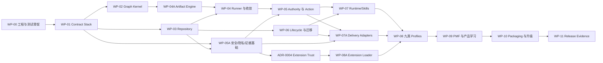

# Graph Engineering Workflow — Implementation Plan

## 2026-09-20 RS-C installation-control read plan — proposed R0

Human update (2026-09-20): the owner replied “确认” to the final one-file
request, approving GEW-REMAINING54-P3-COLD-INSTALLATION-CONTROL-V1. The
append-only p3_restart_cold_installation_control_amendment records this exact
extension. Current boundaries are185 product /195 effective /41 selected
targets. The reviewed proposal below is historical; its implementation scope
and all exclusions remain unchanged. Prior RS-C R2 approval stays valid.

This preparation does not modify `storage/graph_engineering/storage/migration.py`
or enlarge the approved allowlist. Preserve RS-C R2 approval and its completed
prerequisite evidence. Request only the new file boundary described in Spec and
Impact under `GEW-REMAINING54-P3-COLD-INSTALLATION-CONTROL-V1`.

1. Independently review the concrete control-read amendment and persist the
   authority boundary with the existing append-only P3 containers. Stop at the
   Human decision; prerequisite PASS is not file-write authority.
2. After approval, append the exact Human amendment, add only migration.py to
   the active product/effective allowlist and Manifest, and extend the authority
   identity-chain test without rewriting any historical approval.
3. Capture focused RED evidence for active-manifest and locator-registry
   preallocation bounds, nested admission and overlapping closure accounting.
   Implement the private descriptor reader and exact cold owner propagation,
   keeping currentness and non-cold public behavior intact.
4. Refresh only affected installed pins, run the focused serial native cases
   with fresh attestation, and obtain independent implementation review.
5. Resume the already approved C-L/C-E path: common-owner cache adoption,
   streaming installed currentness, physical closure, opaque historical handle
   and fresh-process apply-B/compensated-A recovery. The control-read repair
   alone does not complete cold recovery or authorize Candidate or commit.

## 2026-09-20 RS-C bounded source implementation plan — R2

Human update (2026-09-20): the owner's response “继续” to the final R2
API request authorizes GEW-REMAINING54-P3-COLD-SOURCE-READ-API-V1, recorded
in p3_restart_cold_source_read_api_amendment. The not-yet-authorized wording
in the reviewed proposal below is historical and is superseded only for this
exact API, consumers, resource hardening, tests and independent review.
The184/194 boundaries and all irreversible exclusions remain unchanged.

Dependency: accepted RS-AP R1 and approved P3-RS-A RS-4/RS-5. This refines the
existing plan, retains the184-target boundary and does not consume commit
authority. Sole writer is /root; independent reviewers are read-only.

- [ ] C-D (S): review Spec/Impact/Test Plan RS-C against actual source contracts,
  resolve routine design findings and persist the unchanged independent verdict
  and real reducer. An authority escalation stops implementation while the
  final concrete request is prepared.
- [ ] C-H (XS, after C-D): obtain the single concrete Human decision for
  RS-C-0's bounded task/source query. No allowlist growth, schema or write
  authority is requested; preserve the prior action-only amendment unchanged.
- [ ] C-B (S, after C-H): RED locator/gated/reuse resource failures; implement
  the bounded repository query, captured-journal authority validation and existing
  security SQL bounds, with failing hooks proving legacy reads are unreachable.
  Implement one private owner across nested/outer captures and distinct installed
  contexts; transfer result/handle reservations before releasing scratch.
- [ ] C-P (S, after C-B): RED installed artifact closure and semantic/raw body
  linkage; protect existing read-only contract resources through the approved
  provenance cascade and verify current factory closure.
- [ ] C-S (M, after C-P): RED six-part normal source cases; implement complete
  source reconstruction and coherent-record substitution negatives. Supply
  real committed synthetic bodies using existing durable APIs.
- [ ] C-L (S, after C-S): RED locator/marker admission and lifecycle cases;
  implement exact root lookup, fresh epoch and read-only handle currentness.
- [ ] C-E (M, after C-L): independent producer/consumer exec proof for apply-B
  and completed partial compensation-A, then mandatory rejection/race matrix,
  affected compatibility and installed-wheel checks, independent implementation
  review and actual reducer. No cold completion claim before this step.
- [ ] C-STOP (XS, after C-E): hand off bounded restart evidence at244/122/30.

S/M estimates denote roughly1–2hours/half a day of engineering scope; actual
execution durations are recorded per bounded batch rather than promised.
RS-C Test Plan owns selectors and failfast600second caps. Existing unchanged
evidence may be carried only with its exact input dependency and explicit scope.
Missing authoritative source cannot be repaired by a successful test label.
A failed review changes only in-envelope inputs; real scope/architecture change
uses the existing gate. No cumulative/performance/coverage or external action.

## 2026-09-20 RS-AP authorized read implementation plan — R1

Source: Spec RS-AP, Impact RS-AP, existing approved RS-3 and Human
`p3_restart_action_provenance_amendment`. One additional existing storage
path is authorized; all other selected paths already belong to the prior183.
The task uses three reversible phases: reviewed contract, stored read facts,
then coordinator completion joins and validation. Each exit requires the
mechanically checkable acceptance below; no new Human gate within this scope.

- [x] AP-H (XS, owner /root): preserve the prior54-file accepted bundle/reducer;
  record exact Human approval,184 targets and the active Manifest.
- [x] AP-D (S, depends AP-H): finish Spec/Impact/Plan/Test Plan supplements;
  independent review and actual reducer must permit implementation.
- [x] AP-S (M, depends AP-D): RED provenance tests, then one doctor snapshot
  query and immutable validated data; prove actual outcome/index/reference
  fields, bounded reads, no writes, duplicate/tamper/drift rejection.
  Implement the CAS reader only in repository.py: actual descriptor-size and
  identity preflight, incremental byte ceiling plus one sentinel, aggregate
  retained-byte limit, preserved path/owner/mode/digest checks. Prove oversized
  actual files reject even with falsely small metadata, growth cannot escape
  the ceiling, and exact limits succeed. No unbounded CAS helper is reachable.
- [x] AP-A (M, depends AP-S): RED normal/compensated joins, then private current
  coordinator validator; prove original claim, separate restore journal,
  receipt/CAS references, immutable output and no mutation authority.
- [ ] AP-V (S, depends AP-A): refresh actual affected pins, exact authority
  membership and bounded adjacent tests; independent review and actual reducer.
  Preserve failed runs and actual timings; hand off full RS-3 action facts,
  leaving RS-4/RS-5 assessment/health/exec recovery work explicitly outstanding.

Sizes use the existing XS/S/M convention (roughly30min/1–2h/half-day, estimates
rather than promises); actual native durations go in append-only evidence.
All authoring is /root; independent reviewers are read-only distinct actors.
No parallel writer. Local existing SQLite/CAS/simulator fixtures and installed
WorkContext provide all dependencies; no external dependency or deployment.

Implementation risks are bounded by AP-S first: prove coherent snapshot and
read-only behavior before consumer code, freeze duplicate/shared-reference
cases before joining compensation, and calculate pins from final source bytes.
Use Test Plan RS-AP, serial fresh native fixtures, failfast and600second caps.
A failed selector stops its batch; diagnose and retry only affected inputs.
No staging/commit/rollout, full-suite claim, performance or coverage issuance.

References: [Spec](../specs/graph-engineering-workflow.md),
[Impact](../impact/graph-engineering-workflow.md),
[Test Plan](../test-plans/graph-engineering-workflow.md),
[PRD](../prd/graph-engineering-workflow.md),
[Positioning](../positioning/graph-engineering-workflow.md).

## 2026-09-19 RS-BS authorized prerequisite plan — R0

This supplement supersedes only the historical design-only authority statement
below: Human accepted P3-RS-A R1 and RS-1 was independently accepted. The latest
approval also authorizes Spec RS-BS-1/2 and exactly the two security paths;
no repeated Human gate is required for that same scope. Independent design
review is required before code.

- [x] BS-H (XS): record exact Human amendment and 183-target boundary; preserve history.
- [ ] BS-D (S): complete ADR/Spec/Impact/Plan/Test Plan supplement; independent review and actual reducer.
- [ ] BS-S (S, after BS-D): RED tests, data-only doctor security read and fresh runtime validation, targeted GREEN.
- [ ] BS-T (M, after BS-D): RED bridge tests, preserve exact action snapshots at all write sites, validate dual sequence mapping and both TaskApplication write paths.
- [ ] BS-I (S, after BS-S/BS-T): real same-task producer and legacy compatibility, negative/no-write checks; update only affected provenance and exact authority test.
- [ ] BS-R (S, after BS-I): independent partial implementation review and real reducer, then resume authorized RS-2–RS-5 dependencies below.

Acceptance, data and boundaries are Test Plan RS-BS; implementation follows
Spec RS-BS. Each failed native selector stops its batch; record the failure and
perform only a diagnosed targeted retry. One command at a time, fresh private
fixtures, 600-second native upper bound (the explicit Human boundary overrides
the generic workflow 300-second default). No background/cumulative/performance
runs or monitoring. No time promise or coverage completion inference from this
plan. The next RS-2–RS-5 work remains required after the prerequisite slice.

## 2026-09-19 P3 restart design work package — R1

Current authority is design and independent review only. The task does not
repeat prior PRD/Intent approvals, invalidate the accepted foundation commit or
start a new workflow. P3-RS-A remains a material choice pending Human acceptance;
the two binding schema paths in ADR-0009 require a future exact target addition.
The implementation steps below are **a plan, not permission to execute**.

| Step | Dependency | Work / completion condition |
|---|---|---|
| RS-D | Current approval | Inspect actual restart/lifetime/action/source paths; bind ADR, Spec RS-1–RS-6, Impact and Test Plan; independent design review and real reducer decision |
| RS-H | Reviewed RS-D | Human accepts P3-RS-A and the precise schema target addition, then authorizes only bounded restart implementation/tests/review |
| RS-1 | RS-H | RED identity/format/legacy tests; add closed binding schemas and protected installation closure; no compatible-format rewrite |
| RS-2 | RS-1 | RED retained-lifetime/path/contention tests; implement Spec RS-2 control-scope -> root gate -> per-call repository sequence, retained handles, explicit destruction and read-only opener |
| RS-3 | RS-2 | RED durable action/claim/receipt/compensation tests; add fresh read-only authority, never recreate mutation outcomes |
| RS-4 | RS-3 | RED unique-CAS and six-part normal cold-source validator tests; implement normal-only recovery/counter epoch/repeat-use currentness; reject all other columns |
| RS-5 | RS-4 | Exec-based two-process proof and failure matrix; bounded adjacent compatibility/package checks, then independent source/Candidate review |
| RS-STOP | RS-5 | Hand off verified restart foundation at 244/122/30; no automatic mandatory/scenario/cumulative/monitor/commit continuation |

Each implementation step is a separately verifiable small slice (roughly one
to three focused changes, an estimate rather than a time promise). Stop on the
first failed selector, record it and repair only authorized inputs before a
targeted retry; do not launch a whole suite repeatedly. Serial fresh roots,
at most one open retained binding, native commands bounded to the existing
600-second foundation limit, no background work or monitoring. Do not increase
timeouts, lower currentness checks or substitute a same-process result.

Use existing docs containers for this design's append-only revision chain.
Future implementation evidence needs an explicit record location selected from
the accepted container convention; do not overwrite any foundation attempt.
No code/schema/test/config or installed-pin file changes happen in RS-D.
Structural checks here are JSON validity, exact changed-path membership,
historical-record preservation, digest/reducer binding and documentation
traceability; they are not execution evidence.

After an accepted design, proposed primary source/test targets are exactly the
existing files listed in Impact plus the two explicitly named new schemas.
Protected plan/oracle/Support Matrix and performance workload inputs stay
untouched. Current performance/migration/scenario/dependency bootstrap pin
maintenance follows the exact Impact cascade; it is not workload execution or
a change to benchmark policy/oracle values. Close all five current installed
factories and the 18-member release loader before RS-5 package checks.
Expand conditional provenance consumers only when their actual inputs change
and only within the accepted Envelope; additional files/actions require Human.
Completion of this plan cannot authorize commit, push, merge, release, deploy,
network, WP-10, missing-coverage issuance or cumulative/performance execution.

## 2026-09-18 P3 foundation evidence-path amendment

Human approval `明确批准这五个路径` authorizes
`GEW-REMAINING54-P3-FOUNDATION-RECORDS-WP07A-V1`: the Envelope grows
from 174 to 179 exact targets, adding only
`tests/contract/test_wp07a_action_contracts.py` and the four
`p3-foundation-{source-manifest,state,review-verdict,decision}-r2.json`
records under `.workflow/delivery/GEW-REMAINING54-V1/`. Correct only the
WP07A exact adapter-kind expectation and preserve its substitution tests;
align the existing authority-membership regression with the five-path delta.
Persist bounded verification and independent review using the new paths.
Historical r1 records remain unchanged. The prior exact174 and pending-r2
statements below describe the 2026-09-17 boundary; all other foundation
constraints, including 244 bindings / 122 oracles / 30 missing, still apply.

## 2026-09-10 approved fix-first supplement

Human approval `批准先修复` authorizes the exact174 memory-repair amendment;
prior revision/approval history below is preserved. Execute only this bounded
hotfix: persist authority and design; add failing lossless-trace and fixture
lifetime regressions; implement run storage with live-list materialization and
operation-local fixture contexts; run WP-01/02 contracts and bounded WP-05/08
tests plus isolated memory probes; bind the current source and evidence in
`p2-scenarios-*-r2.json`; obtain independent review and deterministic reduction.
Do not start a cumulative run or restore monitoring. Preserve the previous
owner-aborted outcome and all open Candidate findings. No commit/push/merge,
deploy/release, network or WP-10 authority is granted by this plan.

## 2026-09-17 P3 foundation bounded execution supplement

Human approval `GEW-REMAINING54-P3-FOUNDATION-BOUNDED-V1` authorizes the first
P3 sub-batch against the existing exact174 Envelope. Any exact168 wording in
the historical plan is lineage, not the current gate. Execute RED-first schema,
config, simulator/observer, ActionCoordinator and assessment-1.4 foundation work
only, using strict-serial fresh roots and native commands individually bounded
to 600 seconds. Stop on the first failure. Do not change the execution plan or
oracle manifest: 244 bindings / 122 oracles / 30 missing remains exact and all
release IDs stay missing. Mandatory24, release scenarios, cumulative/performance
runs, monitoring, network, WP-10 and irreversible actions are not authorized.
Do not overwrite F2-owned `p3-foundation-*-r1.json`; persistence of an
independent P3 foundation verdict waits for separate approval of new append-only
record paths.

Implementation order within this sub-batch is: close installed/schema authority;
add the durable one-shot mutation gate; harden descriptor-relative simulator and
typed evidence issuance; prove all five cuts; then prove staged-B compensation,
release-only assessment 1.4, package/source closure and adjacent ActionCoordinator
regressions. Unknown apply is never replayed and cannot be reduced to no-effect
while a staged candidate remains.

Security review corrections are part of this same bounded implementation: move
artifact bytes into the installed fixture registry; split target consume from
coordinator-only gate arming; make outcomes factory-tracked and journal/claim/
receipt-current; derive health and scenario success from typed terminal state;
and reject restart without live target authority. Add direct-arm, arbitrary
artifact, forged outcome, partial-without-rollback, coherent nested re-sign and
destroyed-target restart negatives before requesting another independent review.
Also keep direct construction and `from_documents()` validation-only: only an
exact `from_installation()` result may receive the process-local issuance seal,
and both every production operation and the category oracle must require it.

## 1. 文档控制

| 项目 | 内容 |
|---|---|
| 版本 | v1 Reviewed，implementation-alignment revision 35 |
| 状态 | Historical Independent Plan Review PASS；remaining54 F1 routine source/observation traceability R1 candidate |
| 日期 | 2026-09-06 |
| Author | Codex `/root` |
| Authority task | `GEW-PLAN-V1` |
| Intent Baseline | PRD v2 `594b4437301853919ce3b4aa93e703a395ed45bff924ea6266b3a8e202a30be7` |
| Tech Spec | current governing v1 implementation-alignment revision 36；revision 24 recovery binding仅为historical lineage |
| Impact | current governing v1 implementation-alignment revision 30；revision 18 recovery binding仅为historical lineage |
| ADRs | 0001～0006 historical；current remaining54 suite为0007 revision 13、0008 revision 12、0009 revision 12，须独立architecture review PASS后实施 |
| Test Plan | current governing implementation-alignment revision 43 |
| Review lineage | Existing Independent Plan Review PASS remains historical；revision 24 historically froze P1→P2 sub-slices→P3；revision 25 historically added `pyproject.toml`/R2 links；revision 26 historically recorded R3 exact159/noise authority；revision 27 historically recorded Human-approved `GEW-REMAINING54-ORACLE-REJECTION-INPUT-A` exact164 typed rejection input authority；revision 28 historically closed routine finding `GEW-REMAINING54-ORACLE-CASCADE-A-R1-001`；revision 29 historically recorded Human-approved `GEW-REMAINING54-ACTION-PROVENANCE-B` exact165 one-way action provenance authority；revision 30 historically recorded Human-approved `GEW-REMAINING54-ACTION-RUNTIME-C` exact166 dual-runtime closure and closed `GEW-REMAINING54-ACTION-RUNTIME-CASCADE-B-R1-001`；revision 31 historically recorded Human-approved `GEW-REMAINING54-WP07A-BUILD-BASELINE-D` exact167 test-only baseline authority；revision 32 historically recorded initial Human-approved `GEW-REMAINING54-PROCESS-LOCAL-QUIESCENT-REOPEN-E1` exact167/no-new-target lifecycle authority；revision 33 historically addressed `GEW-REMAINING54-E1-REPOSITORY-ISOLATION-TRACE-R1-001` pending independent review；revision 34 is the independently accepted Human-approved `GEW-REMAINING54-F1-DEPENDENCY-SECURITY-REHYDRATE` exact168 one-target authority；current revision 35 addresses routine findings `GEW-REMAINING54-F1-SOURCE-CLOSURE-TRACE-R1-001` and `GEW-REMAINING54-F1-OBSERVATION-VERSION-TRACE-R1-002` without authority/API/schema/target change |
| 当前授权 | `GEW-REMAINING54-V1` 仅授权本仓库本地/离线实现、测试、证据与独立审核；不授权真实deploy/release、network、WP-10、commit/push/merge/外部通信 |

本计划把已批准需求和架构转成可执行工作包。工作包只改变本仓库；旧项目
`agent-engineering-workflow` 不可写、不可复制为隐式依赖、不可成为安装/测试/运行前置。

## 2. 交付策略

采用“先安全内核、再可恢复单路径、再 runtime、再九类扩展、最后发布证明”的垂直切片：

1. 每个切片先提交 contract/schema/fixture 与失败测试，再实现最小行为；
2. 每个切片都必须产生可运行、可重放、可独立审核的增量，不建设未被路径消费的平台层；
3. WP-00～04 的集成场景只允许 deterministic fake adapters；所有真实 runtime/tool/connector
   动作保持禁用，直到 security/privacy/evidence foundation、authority/action/recovery、具体
   delivery adapters 与 target verification gates 全部通过；
4. 九类任务共享底层 primitives，但 completion、rollback 与真实 E2E 逐类独立；
5. Codex/Hermes Skills 是薄入口，核心通过安装包/CLI 提供确定性语义；
6. routine finding 在工作包内自动修订；Intent/Authority/重大新架构才升级 Human。

## 3. 目标仓库结构

ADR-0001 要求发布模块位于唯一命名空间，仓库责任目录映射如下：

| 仓库区域 | 安装模块/责任 |
|---|---|
| `core/` | `graph_engineering.core`：contract、graph、reducer、policy、digest、budget、invalidation |
| `application/` | `graph_engineering.application`：commands、queries、runner、recovery、completion |
| `storage/` | `graph_engineering.storage`：ports、SQLite repository、objects、locks、migration |
| `adapters/` | `graph_engineering.adapters`：Codex、Hermes、Git、tools、secrets |
| `config/` | schemas、registries、graphs、profiles、overlays、policies、defaults；无环境私值 |
| `skills/` | Codex/Hermes Skill assets 与 compatibility manifest |
| `scripts/` | build、doctor、conformance、release-evidence 辅助；不拥有业务规则 |
| `tests/` | unit、contract、integration、conformance、e2e、fixtures |

build backend 必须显式从四个责任 root 收集到 `graph_engineering.*`，源目录不能形成
`core/application/storage/adapters` 等可导入顶层包。CLI 只加载已安装 distribution。

## 4. 工作分解与依赖图

### 4.1 集成切片里程碑

组件 WP 只有被以下 slice 消费并通过 end-to-end scenario 后才算 integrated：

| Slice | Entry dependencies | 可执行端到端场景 | Stop/rollback 与证据 |
|---|---|---|---|
| S1 Discover/Approve/Review | WP-00～04（含 04A）；真实 SQLite repository + fake runtime/action adapters | 自然语言 fixture → discovery → PRD approve → artifact author/review/revise/PASS → durable deterministic snapshot | 不调用真实 runtime/tool；repository replay/invalid authority/independent review evidence |
| S2 Durable Graph/Recovery/Authority | S1、WP-05A、05、06 | 创建 durable task → graph run → prepared fake action → crash/unknown → reconcile → completion | 每 crash point old/new/blocked；rollback 为隔离 repository restore，不消除 audit |
| S3 Runtime/Adapter Parity | S2、WP-07、07A | pre-release wheel fixture + Codex/Hermes adapter → authorized Git/project command → target query/reconcile | 只有通过 action-scoped authority 的 disposable target；两个 runtime contract/rejection evidence；不声称正式安装通过 |
| S4 Profile Expansion | S3、ADR-0004、WP-08A、08 | 九类 × 三路径逐类 materialize/run/review/rollback/target verify | 每类独立 completion/rollback；失败退回 owning Profile/core WP |
| S5 Release Proof | S4、WP-09、10、11 | clean install/upgrade → frozen coverage → Candidate Review → Completion Record | zero waiver；release/push/deploy 仍需 Human action authority |

每个 slice 依次经过 test-first、mechanical verification、独立 review、finding revision、full
regression 和 digest-bound evidence。孤立 component tests 只能满足 G2，不能声称 vertical slice
完成。

## 5. 工作包

### WP-00 — 可复现工程与测试骨架

**目标：**建立不会掩盖 import、依赖或跨平台问题的开发与构建边界。

**产出：**

- `pyproject.toml`、Python 3.12+ constraints、唯一 namespace build mapping、CLI entry point；
- lint/type/test/security/license/SBOM/build/reproducibility 命令；
- unit/contract/integration/conformance/e2e test markers 与 isolated temp-root fixtures；
- macOS/Linux CI matrix 与 wheel-install test，不从 source root 导入产品模块；
- architecture scans：core 禁止 adapter/vendor/environment import，数据逻辑分离扫描。

**退出：**wheel 可在隔离环境安装；仓库内外及 decoy top-level packages 下 import origin 一致；
空测试层可执行；没有旧项目路径或 ambient index/runtime 依赖。

### WP-01 — Deterministic Contract Stack

**需求：**FR-03～08、10～12、14、18；NFR-02～08；ADR-0003。

**产出：**

- strict JSON/I-JSON parser、GEW Schema Profile、closed registry、offline ref loader；
- immutable domain codec、JCS input profile、raw/semantic digest 与 self-digest projections；
- GEEL AST/evaluator、exact result/error records、ErrorRuleRegistry；
- ResourceProfile、CostSchedule、recursive charge trace；
- schema/format/registry/digest/GEEL/cost golden corpora，由 Python 与独立实现交叉验证。

**退出：**所有 golden vectors byte-identical；未知 schema/ref/format/executable fail closed；
budget boundary 在每个 emitted event 前后稳定；core 不含用户阈值或环境值。

### WP-02 — Graph Kernel、状态与失效

**需求：**FR-04～06、09～10、12、14；NFR-02、04、05、07。

**产出：**

- Graph/Node/TypedEdge/Join/Trust/Fallback/LoopBudget schemas 与 loaders；
- TaskSnapshot、NodeRun、Artifact/Evidence refs、dependency index；
- command/event tables 和 pure reducer，非法 transition 默认拒绝；
- deterministic routing/join/completion predicates；
- baseline/project-scope/artifact/evidence dependency invalidation 与漂移分类。

**退出：**状态×命令模型测试覆盖批准表；同一 events 生成唯一 snapshot/decision；语义变化
只失效受影响 descendants，外部已执行动作进入 reconciliation 而非伪装回滚。

### WP-03 — Local Repository、对象与并发

**需求：**FR-03、06～08、11、15～17；NFR-02、03、06～08；ADR-0002。

**产出：**

- backend-neutral ports 与 SQLite DELETE/EXTRA ConnectionFactory；
- event/head/snapshot/catalog/lease/fence/claim/migration schema 与 atomic CAS commit；
- immutable object staging/publication/reader/GC/purge；
- installation/object/resource locks、PID/fork registry、canonical global lock order；
- repository conformance harness、crash/disk-full/corruption/symlink/fork fault injection。

**退出：**所有 durable step 的 crash 只暴露 old/new；committed ref 不缺 object；两个进程、
fork 与相反 resource order 不破坏 exclusivity；未知 action claim 不被 GC/恢复误清。

object publication 的 fresh 与 deduplicated path 使用同一 fail-closed invariant：任何 pathname/
descriptor binding mismatch 都清理未经验证的 final/staging；若已有 `available` metadata，则必须
在当前 transaction 回滚后持久化为 `quarantined`，不能留下 available-to-missing-file 状态。
同 digest publication 从 staging 到 cleanup 全程持有独立 publication lock；它位于全部 action
resource locks 之后、object maintenance 之前，且 publication API 可复用 caller 已持有的
installation scope。cleanup 只移除 mismatch 时观察且在删除时仍为同一 device/inode 的 final，
后续 writer 不得被陈旧 pathname cleanup 删除。

**阶段边界：**WP-03 candidate 必须绑定 live filesystem/VFS/SQLite capability、high-level
durable step schedule、真实 process SIGKILL、corruption/symlink/fork/concurrency 和 exact
dependency evidence。Test Plan 的 syscall/torn/reorder/VM power-cut 与 Linux rejecting/no-op
`xSync` matrix 仍是 release-blocking durability evidence，不能用当前 macOS process-crash
candidate 替代。完整 export/import/activation/restore-gap 状态机属于 WP-06；WP-03 仅建立
其 schema、ledger、lock 与 backend-neutral port foundation。

### WP-04A — ArtifactContract 与逻辑产物生命周期

**需求：**FR-06、09、10、14；NFR-02、07；Spec §10.1。

**产出：**

- versioned ArtifactContract registry、ArtifactRecord state machine、logical artifact identity；
- required semantic fields、input/baseline/target/trace/digest/status/finding/review/approval/exit
  validators 与 author/reviewer independence；
- Positioning、PRD、Tech Spec、Impact、Plan、Test Plan、Implementation、Verification、Candidate
  Review、Completion Record 十个逻辑 contract；
- full 文件与 compact/emergency `LogicalBodyManifest`：selector、non-overlap、canonical extracted
  body digest、独立 metadata/dependencies/invalidation；
- artifact→artifact/evidence/requirement dependency index 与 lifecycle audit events。
- canonical actor identity、authoritative target registry、all-reference exact trace closure；
- authoritative input 的 ref/kind/digest/task/baseline exact tuple binding 与 multi-baseline swap rejection；
- per-entry logical-body digest 与 charged raw/result/temporary/budget boundaries；
- factory-only validation/lifecycle evidence、closed revision predecessor rule 与 gate-bound mutation
  per-assertion subcase manifest。

**退出：**十类 golden/逐 required-field corruption fixtures 与声明的 identity/authority/trace/
lifecycle/resource/invalidation mutation subcases 全部通过；merged physical file 中
一个 logical body 变化只失效其 declared descendants；Runner/Profile/Completion 只能消费
contract-valid、current、reviewed logical artifacts。

### WP-04 — Application Runner 与自主收敛

**需求：**FR-01、04～06、08～10、15；NFR-02、03、07。

**依赖：**WP-02、WP-03、WP-04A。

**产出：**

- create/list/search/show/resume/pause/cancel/archive commands 与 read-only queries；
- scheduler、ready-set、node attempt、author/reviewer lineage、finding ownership/routing；
- digest-progress、重复 finding、冲突 finding、loop budget 与 non-convergence escalation；
- Candidate/Completion Gate，绑定当前 baseline/snapshot/evidence/reviews/target state；
- runtime stop 后不后台推进、同 runtime resume/replay。

**退出：**routine finding 能在预算内闭环；无进展/冲突稳定升级；伪造产物、陈旧证据或
漏掉门槛不能完成；query 永不写状态。

**r1 candidate 对齐：**已实现 application command/query 原子边界、domain/repository revision
分离、same-lineage resume、serial ready-set、candidate→validation→independent review、stable finding
闭环、digest no-progress/non-convergence、declared failure fallback/default block 与两阶段 Completion
Gate。当前候选只接 deterministic fake runtime/validator/reviewer；真实 action、adapter 与安全证据
仍由 WP-05A/05/07 解锁，不因本候选通过而提前启用。

### WP-05A — Action-path Security、Privacy 与 Evidence Foundation

**需求：**FR-06、07、09～12、17、18；NFR-02、05～07；Impact §8.2、Spec §8.3/§10/§15。

**产出：**

- canonical Owner/runtime/target identity、ProjectScope 与 baseline/snapshot/digest binding helpers；
- data classification、secret reference provider port、redaction、quarantine、retention/purge；
- DataDisclosurePlan 与 destination/field allowlist/payload/authority/receipt validators；
- EvidenceRecord freshness/trust/provenance、leakage-safe incident record 与 review trust rules；
- path/symlink/shell/prompt injection、identity/digest/type confusion、extension fail-closed controls。

**退出：**Impact §8.2 的全部控制都有 contract/test evidence；secret value 不进入 state/log/
evidence；未声明 destination、超分类、缺 redaction/authority 拒绝；未通过 ADR-0004 的 non-built-in
executable extension 一律拒绝。在此 gate 前任何 WP 只能使用 deterministic fake adapter，
不能执行真实 runtime/tool/connector path。

### WP-05 — Authority、真实 Action 与恢复

**需求：**FR-07、08、10、11、15、17；NFR-02、03、06、07。

**依赖：**WP-03、WP-04、WP-05A。

**产出：**

- IntentBaseline、AuthorityEnvelope、PreparedAction、ActionJournal、DisclosurePlan contracts；
- prepare → authorize → execute gate → call → receipt → target reconcile；
- runtime/Owner/target/baseline/snapshot/payload/expiry/revocation/lease/fence revalidation；
- idempotency、native precondition/fence 与 call-span lock capability policies；
- non-idempotent crash/timeout `unknown`、durable claim、compensation/manual reconciliation routes。
- ADR-0005 recovery-claim transition：expired lease 下复用 original exact unresolved claim 的同
  task/lease、完整 resources/latest fences；separate rollback authority、完整 call-span locks、
  compensation started/receipt durability 与 fresh target verification 后原子 claim consumption。

**退出：**任何绑定值改变都在 tool call 前拒绝；每个 crash point 不静默 replay；success 必须
由目标状态证明；expired recovery 不授予 normal replacement lease、不创建第二 claim、不释放
未验证的 original claim、不重放 original action；commit/push/merge/deploy/release/外部通信仍需
各自动作授权。

**ADR-0005 实施顺序：**先冻结 recovery request/event/journal/claim schemas 与 negative fixtures；
再扩展 backend-neutral repository port，使 compensation-only started/receipt 能在 exact unresolved
claim/latest fences 下 durable、但不消费 claim；随后接入 application gate 与 deterministic fake
adapter，持锁执行补偿并 fresh verify；最后完成 live/expired/crash/mutation/full-suite evidence 和
独立 review。任一步失败均保留原 claim，路由 target reconciliation/Human manual coordination。

### WP-06 — Project/Task Lifecycle、Export 与 Migration

**需求：**FR-03、08、15、16；NFR-03、07、08；ADR-0002。

**产出：**

- new/existing Git project、多仓库/服务/环境 ProjectScope 和 TargetBinding；
- canonical identity、scope digest、批准后 change classification 与 reapproval/invalidation；
- verified export snapshot/hold/bundle/import/replay/integrity；
- installation manifest、migration/activation/rollback/restore-gap/fencing high-water；
- retention、archive、cancel、revocation 与受控 rollback semantics。

**退出：**迁移每步 crash 恢复 verified active/blocked；stale bundle 不能解锁未知 actions；
scope mismatch fail closed；旧 backend 在失败时仍可执行。

### WP-07 — Runtime Adapters 与 Skill-first 体验

**需求：**FR-01、02、07、08、16；NFR-01、04、08；ADR-0001。

**产出：**

- RuntimeAdapter capability/identity/session/lineage/decision/subagent/tool contract；
- Codex Skill：自然语言 discovery、批准、执行、恢复、状态与升级呈现；
- Hermes Skill：Telegram/Discord pairing/allowlist/channel lineage、长消息 receipt；
- canonical executable locator 与 Skill/core/adapter/schema/repository handshake；
- runtime binding 与 cross-runtime continuation rejection。

**退出：**Codex/Hermes 在 WP-00 build 产生的隔离 pre-release wheel/Skill fixture 环境完成相同
adapter contract、identity、handshake、resume/rejection；其他 user/session/runtime 不能注入批准
或复用 authority；Skill 不包含 reducer/authority/digest/completion 业务逻辑。Hermes Telegram
与 Discord 分别在通用 conformance graph 上通过 create、Owner identity、approval、recovery、
result delivery、unauthorized-user reject，不得用聚合 evidence 替代任一 channel。此 WP 不要求
尚未实现的 full/compact/emergency overlays，也不把 fixture wheel 当正式 clean install evidence。

### WP-07A — Git、Project Command、Target Query 与 Secret Adapters

**需求：**FR-02、07、11、15、17；NFR-03、04、06、08。

**依赖：**WP-05、WP-05A、WP-06；在此之前 action path 只使用 fakes。

**产出：**

- Git adapter：repository/worktree/common-dir identity、read/write operations、expected head/ref
  preconditions、idempotency/failure receipt 与 post-action query；
- structured project-command/tool adapter：argv 无 shell 拼接、cwd/target allowlist、capability、
  timeout/cancel、side-effect/idempotency class、raw receipt；
- target-state query/reconciliation adapter：fresh query identity、expected/actual state、fence/
  precondition support、unverifiable blocked；
- secret-provider adapter：只解析已批准 reference，按 action 最小注入，不写入 state/evidence；
- connector registry 对未实现 vendor integration 给 stable capability mismatch，不做 best-effort。

**退出：**disposable clean Git fixture 通过 concrete adapters 完成一次 authorized mutation 和
target-state reconciliation；precondition/digest/disclosure/secret/idempotency 任一不符时 side-
effect counter 为零；mock/fake evidence 不能满足 real E2E。

### WP-08A — Extension Trust ADR 与 Loader

**需求：**FR-18；NFR-02、04～06、08；Impact §14.2、ADR-0003。

**前置 architecture node：**先编写并独立审核
`docs/adr/0004-extension-source-and-capability-trust.md`，明确 package source/signing/provenance、
installation、capability sandbox/allowlist、adapter/executable trust、revocation 与 update policy。
该 ADR Accepted 前不能实现 non-built-in executable loader；若选择改变批准的本地/Skill-first/
权限边界则升级 Human，否则在既定 Intent 内自主收敛。

**产出：**

- extension manifest/loader、exact version/digest/source verification、compatibility/capability gate；
- ADR-0004 r5 的平台中立 verifier port 与 PyCA `cryptography==50.0.0` adapter；WP-08A 只做离线候选验证，WP-10 负责 ReleaseInstallManifest 的 exact artifact/source/RECORD hash 与 attestation pin；
- ADR-0004 r6 的 PyPA `packaging==26.3` boundary parser，用于离线 wheel filename/tag/PEP 508 requirement 与 closure 验证；WP-10 继续负责其 distribution/wheel/source/RECORD/attestation exact pin，runtime 无 network fallback；
- ADR-0004 r7 的 manifest-bound byte execution protocol 与 physical ZIP/full-closure budget oracle；所有替换、竞态、隐藏成员和预算耗尽均不得发行 record 或产生 install mutation；
- node/edge/policy/template 与 adapter/executable 扩展的分类加载；
- task-start version lock、revocation、conflict/override rejection、diagnostic records。

**退出：**第三方 executable schema/predicate/validator/transform/adapter 在 ADR gate 前全部拒绝；
gate 后只允许来源、签名/provenance、capability 和 compatibility 满足 Accepted ADR 的 package；
扩展不能覆写 core invariant、安全下限或 built-in identity。

### WP-08 — 九类 Profile 与三条风险路径

**需求：**FR-04、05、09、10、14、17、18；全部 v1 release matrix。

**依赖：**WP-04A、WP-05A、WP-06、WP-07、WP-07A、WP-08A、Accepted ADR-0002 revision 6、ADR-0006
revision 8与ADR-0007 decisions，以及各自独立architecture review/schema-conformance gate。migration rehearsal、
dependency graph/remediation与performance authority各自只blocking其明确stable bindings，不可交叉代替。

**产出：**

- Profile schema、materializer、Support Matrix、ReleaseCoverageGate；
- 新项目/功能、Bug、Hotfix、重构、数据库/架构迁移、依赖/安全、性能、发布/运维、事故响应
  九个 versioned Profile；
- `full-planned`/`compact-planned`/`emergency` overlays，安全底线不可被 overlay/项目配置降低；
- 每类标准 artifacts、category completion、rollback、real target verification；
- 九类 fixture projects 与真实工具链 E2E harness；
- dependency-security 使用 ADR-0006 的 installation-pinned offline advisory/source registry、
  WP08A-bound factory-issued closure/applicability/residual observations与final current authority：exact绑定
  same-registry advisory/source、before/after closure、affected/fixed facts并全量计算residual rows/set；
  issue/use/precommit/restart重读current installation，update/revocation generation/high-water单调；
- performance 使用 ADR-0007 的 installation-pinned benchmark registry与parent-owned monotonic observer：
  对每次factory-attested StructuredCommand完整调用计时，child只返回correctness digest；exact environment
  fingerprint、config-owned warmup/odd repetitions、integer median/MAD/noise ceiling与baseline/target/rollback
  integer cross-products进入同一current observation/digest链，禁止cross-hardware normalization；
- migration scenarios使用ADR-0002 revision 6的consumer-local `MigrationRehearsalFactory`：只在disposable
  private root复用existing InstallationMigrationRepository/ledger，forward A→B、monotonic backward B→A、
  partial-data dispositions与crash old-or-new observations进入task-bound current projection；
- dependency-security transitive/fix-unavailable使用ADR-0006 revision 8的installation-pinned advisory/graph/
  remediation registries：transitive只选择config-owned cffi advisory与三节点physical path，unavailable只接受
  explicit current packaging disposition与residual owner route，禁止direct/caller alias、threshold downgrade、
  missing-fix inference或resolver/scanner/network；
- 274 个冻结 binding 各自的 deterministic unique task identity，并绑定 selector/request/
  oracle/plan digest；Historical pre-E1 Option C曾按Profile复用disposable repository/application资源，但该历史优化
  不适用于E1/current cumulative。E1要求每binding独占fresh private repository root、task、target、branch/ref、
  action root与command root，real-E2E也不跨binding/profile共享；
- factory-owned、consumer-local coverage authority lifecycle：每个 candidate 只能进入一个单调终态；
  一次 exact combined gate 重验完整 factory-issued record set 后走 finalize，尚未产生 combined gate
  decision 的 uncommitted candidate 只能先由 factory 在 register/gate/finalize 同一锁内冻结 exact
  generation 与完整 current authority/record projection，并原子保存 `abort-prepared` state、frozen snapshot
  与 one-shot capability identity tuple，再走 abort。prepare return 丢失时同一 factory/candidate 只返回
  同一个 stored capability，不重新签发或改变 projection。两者互斥且
  idempotent，分别 revoke execution/observation/record capability 并释放 identity graph；abort 不生成或
  伪造 gate decision。partial/wrong candidate、foreign/clone 与异常切点 fail closed，durable
  task/action/target、immutable record documents 与合法 gate result 不变。

**退出：**九类冻结矩阵全部 required cases 通过；每类至少一个真实项目 E2E；Codex 与
Hermes 各自完成 `full-planned`/`compact-planned`/`emergency` 六格，Telegram/Discord channel contracts 分别通过；
共享 node/runtime/path PASS 不替代类别 completion；combined `ReleaseCoverageGate` 不分片、
不放宽，全部 records 在 use-time 重新验证 currentness，拒绝路径保持 zero-write。fixture
Historical pre-E1资源复用不适用于E1/current cumulative；E1的per-binding fresh private root不得新增
repository/DB/GraphRef lifecycle 边界。coverage authority finalized/aborted 后所有
issue/current/restart/gate/register 入口拒绝。gate/finalize 与 abort 由同一 consumer-local 线性化点
选择唯一分支；in-process injected exception 只由同一 factory 对象幂等继续已选择分支，process
termination 后 authority/capability 不可从 bytes/restart 恢复；focused harness 在 `OK` 后 120 秒内
自然 exit 0。
dependency-security 还必须证明 disposable local A affected closure→B approved fixed closure 的一次
ActionCoordinator/Git mutation、WP08A physical closure revalidation、security regression 与 fresh target；
stale C/unapproved closure、expired/revoked/foreign/coherently-resigned advisory/source/registry、post-observe
replacement 均 zero task/action/Git mutation。DNS/socket/proxy/index 调用 exact 为零，不能以 WP08A
preflight、fixture label 或 command PASS 单独代替 advisory authority，也不能越过 WP10 activation block。

**Dependency-security 最小实现顺序：**

1. ADR-0006 independent architecture review PASS；冻结10组exact source/digest-input schema IDs、nested
   self-digest projections、registry/bootstrap/observation protected-member pins；
2. TDD genesis `(generation=1,previous=null)`、closed sorted/unique high-water与status transitions；new identity
   exact active/status-generation=candidate head，unchanged status保留prior generation，transition使用candidate
   head，且`1 <= status_generation <= head`；拒绝future/stale/bump/wrong generation、
   `not_before <= clock < not_after`、source失活与
   referencing advisory同步失活、source/advisory/registry结构和source checkout/wheel RECORD currentness；
3. 在既有installation-verification boundary实现current→candidate exact+1/previous/high-water比较与
   higher-generation rollback；不新增WP-08 DB/pointer，不激活candidate；
4. 复用 WP08A offline preflight 签发 before/after closure，再以same-factory registry/advisory/source
   签发applicability与全registry residual observations；evaluation universe exact为high-water active set，
   与rows中非inactive identities双向相等；历史inactive rows保留identity，不要求source current且不进入
   residual set；new revision可active，旧superseded/revoked identity不复活；拒绝omit/duplicate/fake-active及
   caller bool/list；
5. 实现 consumer-local final dependency-security observation 与 use/precommit/restart全量重算；
6. 在现有 2 discovered coverage methods 内增加 exact 24 mandatory P/R、12 oracles、Option C unique tasks；
7. 先以 function-level 和 partial P/R candidate 验证 exact abort capability：abort 前无 combined gate
   decision，abort 后 factory/authorities/records-for-use 永久失效且 immutable documents/durable signatures
   不变；foreign/clone/wrong candidate、caller partial selection、并发 gate/finalize 与 in-process exception/
   process-termination cuts fail closed。factory 在 prepare-abort 线性化锁内冻结 candidate generation、
   plan、完整 current issuance graph 与 projection digest，并与one-shot capability identity作为一个tuple
   提交；prepare 后 registration/gate/finalize 拒绝，register 与 prepare 的先后结果 exact。验证tuple前
   exception保持active、tuple后return丢失/retry返回same cap、consume后prepare拒绝且same-cap abort幂等。再以
   serial/private-root 验证 plan `170`、oracle bindings `85`、combined gate
   `170 valid / 104 missing / false`、static `0/274`，对 exact consumed candidate 执行 lifecycle
   finalize/revoke，并要求 abort/finalize 两条分支均 <120s cleanup。

任一步不收敛时回退为不注册 factory、24 IDs 保持 missing；不删除历史 registry/observation/audit，
不联网补证，不修改 WP08A 历史 tuple/gate/evidence，不把 22 generic records 冒充完整 Profile batch。

**Performance 最小实现顺序：**

1. ADR-0007 independent architecture review PASS；冻结9组source/digest-input schema IDs、benchmark registry/
   installation bootstrap/protected-member closure与exact environment fingerprint fields；
2. TDD registry/case/statistics/environment strict schema：config-owned nonnegative warmup、bounded odd
   repetition count、positive integer ratios、command/fixture/sample/source/correctness bindings；拒绝unknown/
   missing/extra/duplicate/reorder/alias、coherent resign与installation replacement；
3. 实现consumer-local registry/clock/observation factory。parent只在每次attested launcher完整调用立即前后取
   `monotonic_ns`，warmup不进入统计，child output exact只有correctness digest；serial/private-root且
   DNS/socket/proxy调用为零；
4. 从ordered positive integer samples重算odd median、MAD与noise cross-product；baseline/candidate exact
   environment相同后按target ratio比较，超noise=`inconclusive-noise`并fail closed；caller timing/PASS、
   float/rounding、outlier deletion与cross-hardware normalization全部拒绝；
5. 按Human-approved Option B冻结现有category assessment 1.0 pair，并增加exact
   `urn:gew:schema:category-completion-assessment:1.1.0` / input 1.1 pair：仅performance
   assessment内嵌closed `performance_evidence_projection`，exact绑定task revision/snapshot/epoch、GraphRef six pins、factory/
   installation/environment/session pins、ordered A→B→A generation/history、samples/statistics/comparisons与final
   observation；非performance禁止该字段，不新增generic task event、DB/storage schema或通用evidence API；
6. assessment issuer从factory-issued seal重算完整projection；TaskApplication在现有category precommit的全部hooks
   后重读current source与pins，并以既有`task.category_assessed` EvidenceRef原子提交单一assessment CAS。
   restart从task唯一current ref以`require_referenced=true`重读、重算且launcher count为零；foreign/clone/stale/
   reorder/coherent resign/alias/CAS replacement拒绝zero write；
7. 复用existing ActionCoordinator/GitNativeAdapter完成disposable A baseline→B candidate一次mutation与fresh
   target；rollback恢复exact A后重新benchmark并通过rollback ratio。stale A/actual C在mutation/launch前拒绝；
8. 在existing 2 coverage methods增加exact24 P/R、12 oracles、Option C unique tasks。验证plan `194`、oracles
   `97`、combined gate `194 valid / 80 missing / false`、static `0/274`，随后复用既有finalize/revoke或
   pre-gate abort lifecycle与<120s teardown。

任一步不收敛时不注册performance factory，24 IDs保持missing；不降级为child自报elapsed/PASS、不新增
benchmark dependency/DB/GraphRef/network，不改变既有170 records或WP08A历史bytes。

**Migration rehearsal scenario 最小实现顺序：**

1. ADR-0002 revision 6 independent architecture review PASS；冻结registry/fixture/transform manifest/bootstrap与7组exact
   source/input schemas、nested digest projections、protected package/source members；
2. 在existing WP08 P/R discovery建立四scenario pairs缺失RED，并对A/B transform、partial dispositions、crash cut
   IDs与Option C task IDs做exact plan/oracle closure；
3. factory只包装existing InstallationMigrationRepository-issued bundle/manifest/ledger/lock/fence。验证forward A→B
   与backward B→A manifest generation/epoch严格递增、唯一transform path、replay/integrity/compatibility；
4. partial-data逐row验证`preserved|defaulted|rejected|owner-route`；crash matrix逐state只接受完整old/new，拒绝
   mixed/verifying exposure、epoch/fence rollback、claim omission与restore-gap auto-clear；
5. 增加category assessment1.2 migration branch，issue/precommit/restart重读task唯一CAS、current repository/
   installation与fresh target，restart migration replay=`0`；foreign/clone/stale/coherent replace/history reorder
   zero writes；
6. strict serial/private root运行四P/R selectors与combined production P，要求plan`216`、oracles`108`、gate
   `216 valid / 58 missing / false`、static`0/274`，随后finalize/revoke或partial abort与<120s teardown。

任一步不收敛时不注册rehearsal factory，不修改repository/DB schema，不真实activate；八IDs保持missing，existing
208 records、final217 bytes与durable state不变。

**Dependency graph/remediation scenario 最小实现顺序：**

1. ADR-0006 revision 8 independent architecture review PASS；冻结revision 7的5组new source/input schemas与
   revision 8唯一bootstrap1.2 source/input pair（dependency增量累计6组）、existing10+new5 bootstrap1.1 closure与
   category assessment1.2 dependency branch；同时冻结
   advisory registry forward generation 2与stable finding `WP08-DEP-OPTION1-DOCS-ARCH-R1-001`：generation-1 registry、
   offline-v1 artifact/attestation/bootstrap/schema bytes不变；新增`source:dependency-advisory:offline-v2@1`完整
   snapshot+attestation，v1 source/packaging revision 1转superseded，v2 source、packaging revision 2与
   `advisory:cffi:security-v1@1` active/status-generation 2；
2. 新current bootstrap1.2与source/input1.2 schema pair建立closed ordered history
   `config/security/dependency-advisory-registry-v1.json↔v1 snapshot`、
   `config/security/dependency-advisory-registry-v2.json↔v2 full snapshot`，两个registry paths无alias，package/source
   同时protect/ship两代registry/artifact/attestation/bootstrap/schema；TDD先对old-source omission、mixed/delta snapshot、
   cross-attestation、history replacement/reorder及coherent re-sign建立zero-write RED；
3. TDD exact METADATA-derived root/nodes/edges、specifier/extras/marker、canonical sorted/unique与closure双向相等；
   missing/extra/reorder/duplicate/wrong parent/cycle alias/caller graph/coherent re-sign全拒绝；
4. transitive P只能选择config-owned cffi advisory，证明ordered exact path
   `graph-engineering-workflow@0.1.0→cryptography@50.0.0→cffi@2.0.0`，最少三节点，并由root
   `cryptography==50.0.0`与cryptography `cffi>=2.0.0` physical METADATA edges连接；before affected与after
   `closure:cffi:2.0.0` fixed closure/regression/fresh target分别current；R broken/foreign/reordered path、raw alias、
   direct packaging substitution、caller advisory/graph或threshold两节点降级在assessment/observation/record前拒绝；
5. fix-unavailable P只消费active packaging revision 2的same-advisory current/time-valid `approved-unavailable` row、完整residual evaluation与
   nonempty owner route；R覆盖missing row、wrong revision、expired/foreign owner与从missing fix推断；
6. use/precommit/restart/coverage每次重读generation-2 advisory/high-water、v2 full snapshot/attestation/history、registries/bootstrap/METADATA/RECORD并
   重建graph/path/disposition，task-bound observation只能从unique current CAS ref恢复；restart zero graph/action replay，
   DNS/socket/proxy/index/scanner exact为零，所有R task/action/target/input writes exact为零；
7. 完成四records后combined plan`220`、oracles`110`、gate`220 valid / 54 missing / false`、static`0/274`；复用
   Option C/finalize/revoke/abort与<120s teardown。

任一步不收敛时不注册graph/remediation factory，不修改existing advisory history或WP08A evidence，不联网补证；
四IDs保持missing，migration的216 records（若已完成）仍immutable/current。

#### WP-08 remaining54 — P1/P2/P3 local/offline closure

**Entry baseline：** committed/pushed `cdedf2d461de94b814aa005afbbe1458d1860125` 后的当前可逆工作树；production
execution plan 220、oracle bindings 110、dynamic gate `220 valid / 54 missing / false`。先冻结
`GEW-REMAINING54-V1` Authority Envelope与Human decision record；随后current ADR-0007 r13、ADR-0008 r12、ADR-0009 r12、
Spec r36、Impact r30、Plan r35、Test Plan r43必须作为同一bundle独立architecture review PASS。Historical routine findings
`GEW-REMAINING54-ORACLE-CASCADE-A-R1-001`与`GEW-REMAINING54-ACTION-RUNTIME-CASCADE-B-R1-001`均保持CLOSED；任何后续docs finding只在
envelope内修订；材料性新选择回Human。

当前Candidate `GEW-REMAINING54-P2A-CAND-R1-001`、`GEW-REMAINING54-P2A-CAND-R1-002`、
`GEW-REMAINING54-P2A-CAND-R1-003`、`GEW-REMAINING54-P2A-CAND-R1-004`与
`GEW-REMAINING54-P2A-CAND-R1-005`全部保持OPEN，不得由author自闭合：001 full installed closure、002 exact task
namespace/branch/ref、003 generic assertion evaluator/`required_fact_ids`、005 R task/factory/root attack binding的focused
checks已GREEN；004 executable cumulative selector仍等待D gate、E1 closure及`p2a-cumulative-r2`。只有后续独立Candidate reviewer可关闭
这些stable IDs。

**P1 — performance remaining scenarios（4 records / 2 oracles）：**

1. 在现有discovered tests加入两个oracle member absence/plan count RED，不先改production plan；
2. 保留`profile-coverage-oracle-input-1.0.0.json`byte-identical，新增closed 1.1 schema。1.1在exact 1.0 fields上
   required `rejection_input`，其shape只能为`{kind:"integer-vector",values:[positive safe integers]}`；generic core按
   version验证field/schema/digest，source checkout收录新schema，不解释performance或硬编码sample；同步把1.1 schema ID
   加入`core/graph_engineering/core/profiles.py`的`PROFILE_DOMAIN_SCHEMA_IDS`，registry构造只接受exact 1.0+1.1并拒绝
   missing/extra/version alias；把1.1 schema path加入`config/verification/wp-00-targets.json` exact set，使
   source manifest接受更新set且纳入1.1 schema；
3. 在现有benchmark registry把config-owned noise ceiling由`1/1`收紧为`1/2`，重算registry digest并级联更新
   installation bootstrap的registry raw/semantic pins与bootstrap digest；不新增schema或registry；
4. noise-outlier P只用parent `monotonic_ns`对每次完整`StructuredCommand`（含startup）的真实测量；保存全部samples，
   独立重算后noise/correctness/target/fresh B/current environment必须全部通过；
5. noise-outlier R只从oracle 1.1 typed `rejection_input.values`读取真正numeric `[1,2,100,200,201]`，重算median100、MAD99并断言
   `99*2 > 100*1`得到`inconclusive-noise`；不得把frozen vector注入P或签发performance PASS，并覆盖
   drop/reorder/resample/threshold/float/caller MAD绕过；`reject_error_message`只做diagnostic，任何vector encoding/parsing拒绝；
6. correctness-regression P要求全部candidate correctness digests匹配且target通过；R证明任一mismatch立即阻断
   statistics/target success，expected digest替换、忽略iteration、duration-only与coherent re-sign不能绕过；
7. 顺序重算profile schema registry、generic sources/source manifest、oracle/manifest/plan/app consumers、performance
   bootstrap、dependency current v1.2 bootstrap、migration current v1 bootstrap、pyproject/wheel/RECORD；historical
   dependency v1.1 bytes与1.0 oracle schema禁止修改；
8. strict-serial fresh root运行P/R、currentness/restart-zero-launch、package/static regression；加入4 records/2 oracle后
   exact `224/112/224 valid,50 missing,false`。

**P2 — scenario truth foundation and four sub-slices（20 / 10）：**

1. TDD RED：新增5组schema pairs、scenario policy/fixture/bootstrap与assessment1.3尚不可加载；验证
   missing/extra/reorder/alias/coherent re-sign、dual projection、foreign/clone/stale与zero writes；
2. 实现platform-neutral `scenario_truth` core及application factory；接入profile assessment/coverage/restart，使用task唯一
   referenced CAS；每个binding独占private root、branch/ref与targets，restart mutation/action replay=0；
3. P2a新增packaged sources落盘并冻结final pyproject build projection后，先按C拓扑重签builtin implementation→adapter
   registry→concrete policy→default/local policies→各自default/local security runtime→source/wp-00/current
   bootstraps/package/wheel/RECORD；D仅把历史WP07A test中的旧exact build projection constant更新为current independently
   computed constant，不改任何attack assertion。随后依次运行named WP07A method、WP08 security/evidence/package/wheel及P1
   currentness sibling，全部通过才进入E1。旧default runtime pin或旧WP07A baseline触发的fail-closed必须
   保留，P1未重新通过前P2a不得签发；
4. E1先写valid current API RED，证明close后stale/226 live contexts累积；再实现process-local sealed→quiesced→runtime
   reopened typed lifecycle，在每个issue/use/precommit/gate后requiesce。226-binding GREEN、negative zero-write/replay、
   lifecycle/active-handle counters、FD baseline-return与P1 sibling通过后才运行`p2a-cumulative-r2`；
5. P2a `new-feature/multi-target`：两个roles全部A→B并fresh验证；cumulative完成后`226/113/48 missing`；
6. P2b `hotfix/emergency-baseline`、`production-like-gate`：baseline必须mutation前，local不得提升production；完成后
   `230/115/44`；
7. P2c refactor三场景：ordered behavior vectors→architecture exact edges→config integer nonfunctional target，任一前门
   失败不进入下一门；完成后`236/118/38`；
8. P2d incident四场景：detection→containment→known recovery；unknown-effects P只证明`blocked-owner-route`、不replay/
   recover。scenario recovery oracle用无碰撞文件名；完成后`244/122/30`；
9. 每子批做独立implementation review并冻结exact current manifest；失败保持当前子批全部missing，不污染前批。

**P3 — offline release operations foundation, mandatory and scenarios（30 / 15）：**

1. TDD RED：新增8组schema pairs、release policy/fixture/bootstrap、assessment1.4及local simulator adapter尚不可用；
2. 实现protected artifact manifest、private filesystem apply/query/restore adapter、no-network health observer与release
   observation factory；通过existing ActionCoordinator claim/fence/journal/receipt/reconcile，不启用WP-10；
3. mandatory24先按十二列P/R strict serial运行；real-E2E只真实调用local simulator，R在mutation前拒绝；完成后
   exact `268/134/268 valid,6 missing,false`；
4. 依次完成artifact-provenance、health-gate、partial-deploy P/R。partial P必须query/reconcile/authorized restore A+
   fresh health，不能把partial称success；完成后exact plan274/oracle137；
5. 在同一current source-attested private root构建全部274 records，dynamic combined gate必须
   `274 valid / 0 missing / passed=true`，invalid/stale/duplicate为空；static-only substitute必须仍
   `0 valid / 274 missing / false`；随后验证finalize/revoke terminal、pre-gate abort和<120s teardown。

**共同验证顺序：** schema/config/bootstrap → factory identity/currentness → local truth/action → assessment CAS/precommit/
restart → P/R scenario/mandatory → combined gate → lifecycle → package/clean installed wheel → lint/type/architecture →
independent Candidate review。所有测试strict serial、fresh private roots、stop-on-first；禁止network、用户repo、真实
deploy/release、WP-10、DB/GraphRef变化、monolithic R或未授权full evidence mutation。

package步骤必须先验证Envelope current exact168 unique relative/no-glob targets。Historical A相对historical159只新增：
`config/contracts/schemas/profile-coverage-oracle-input-1.1.0.json`、`core/graph_engineering/core/profile_coverage.py`、
`core/graph_engineering/core/source_checkout.py`、`config/security/dependency-advisory-installation-bootstrap-v1.2.json`、
`config/migration/migration-rehearsal-installation-bootstrap-v1.json`，形成164；Historical B只新增
`config/actions/action-policy-v1.json`并形成165；Historical C只新增`config/security/security-runtime-v1.json`并形成166；
Historical D只新增`tests/security/test_wp07a_action_contract_security.py`并形成167，删除D项必须精确恢复166，且D
authority revision未授权第168项。Current F1只新增`application/graph_engineering/application/dependency_security.py`并形成168；
所有其它affected paths必须来自Spec列出的已在168内exact closure，其中包括
`core/graph_engineering/core/profiles.py`与`config/verification/wp-00-targets.json`。

C重签顺序为final P2 packaged-source declarations/`pyproject.toml` builtin build projection→
`config/contracts/action-adapter-registry-v1.json`→`config/actions/concrete-action-policy-v1.json`→
`config/actions/action-policy-v1.json`与`config/actions/action-policy-local-actions-v1.json`并行分支→
分别进入`config/security/security-runtime-v1.json`与`config/security/security-runtime-local-actions-v1.json`→
source checkout/wp-00 exact set→performance、
dependency current v1.2、migration current v1、scenario-truth current v1、release-operations current v1 bootstraps→pyproject
package/resource pins→现有只读builder digest→wheel archive/unpacked/RECORD。default/local policies互不互引，downstream pins
不反馈进入上游build projection；禁止digest环、fixed-point重签、pin bypass/weakening、ambient fallback或只验证单向。
`scripts/evidence_utils.py`只读消费default runtime并验证current default-policy pin，不在allowlist且不得修改；default policy
重签但default runtime仍旧pin时必须在evidence/action/target write前fail closed。两runtime重签后先运行其currentness test，
再运行P1 currentness sibling，通过后才可恢复P2a scenario issuance。

A schema/package顺序仍按schema/oracle→profile domain/schema registries→wp-00 exact targets/source manifest→oracle
manifest/plan/application→current bootstraps→获批`pyproject.toml`→现有只读builder digest→wheel archive/unpacked/RECORD
执行正反向核验，并携带新增27
oracle vectors、13 schema pairs、新1.1 oracle input schema及相关resources。dependency v1.1和oracle input1.0保持
historical byte-identical；禁止checkout fallback。`scripts/build_backend.py`不在allowed targets，任何修改需新Human
authority。任何
registry missing/extra/version alias、source-manifest set mismatch、action edge/pin mismatch、stale/omit/extra/reorder、
message-encoded vector或digest mismatch都在factory/record issuance前fail closed。C不改变action语义/权限或P1/P2目标；
历史不需变文件一律保持bytes。

D test-only步骤在C chain、factory/WP08 currentness和package/wheel PASS后执行。扩大security run 17/18唯一失败的旧
`b9e8e75bca0436651a723da05d9bcea27f06768666c8c1d9f9fc6b9b80707944`
`_action_build_manifest_digest(pyproject.toml)` expected只能换成current approved projection的exact预计算literal；禁止用
同一runtime调用自算expected、ambient/caller value、prefix/loose compare、skip或删减dependency/import/build-mapping/
entrypoint/registry/provenance attacks。D不改变产品语义，完成后P2a checkpoint仍exact226/113/48、static0/274。

Historical E1不增加allowed target；当时Envelope保持exact167，D仍是相对C唯一新增path，删除D恢复166且E1 revision
未授权第168项。Current F1只增加dependency-security application source形成exact168；E1 lifecycle实现仍只可落在
已经获批的exact closure：

- core typed lifecycle/port：`core/graph_engineering/core/scenario_truth.py`、
  `core/graph_engineering/core/profile_execution.py`、`core/graph_engineering/core/profile_coverage.py`、
  `core/graph_engineering/core/__init__.py`、`core/graph_engineering/__init__.py`；
- application phase wiring：`application/graph_engineering/application/scenario_truth.py`、
  `application/graph_engineering/application/profile_execution.py`、
  `application/graph_engineering/application/profile_coverage.py`、
  `application/graph_engineering/application/profile_coverage_oracle.py`、
  `application/graph_engineering/application/__init__.py`；
- runtime/test reopen adapter与resource counters：`tests/support/wp08_scenario_truth.py`；testability limit仅可来自
  `config/profiles/scenario-truth-policy-registry-v1.json`，不得把机器RSS/FD值写入engine；
- exact tests：`tests/unit/test_wp08_scenario_truth.py`、`tests/contract/test_wp08_remaining54_contracts.py`、
  `tests/integration/test_wp08_scenario_truth.py`、`tests/integration/test_wp08_release_coverage.py`、
  `tests/security/test_wp08_remaining54_authority.py`；
- source/package currentness仍经`core/graph_engineering/core/source_checkout.py`、
  `config/verification/wp-00-targets.json`、`config/performance/performance-benchmark-installation-bootstrap-v1.json`、
  `config/security/dependency-advisory-installation-bootstrap-v1.2.json`、
  `config/migration/migration-rehearsal-installation-bootstrap-v1.json`、
  `config/profiles/scenario-truth-installation-bootstrap-v1.json`、
  `config/release-operations/release-operations-installation-bootstrap-v1.json`、`pyproject.toml`、只读且不在allowlist的
  `scripts/build_backend.py`与wheel/`RECORD`闭包。

实施顺序：先保留现状RED与trigger evidence（first4.086s、second7200s/no receipt、FD4→885/maxRSS7.20GB/teardown4、
same-root plan0.546s/base7.801s/authorities4.904s/observations226.608s/factory1.085ms/issuance114.974s/
dynamic>545.166s/timeout900s）；再实现opaque seal与platform-neutral port；再实现runtime/test adapter的same-root reopen/
handle close；再接issue→use→precommit→gate逐phasereseal/requiesce；最后运行226 positive与完整negative matrix。

每binding继续独占fresh private root/task/target/branch/ref/action/command roots。seal必须绑定current installation/provenance/
source/package/wheel/RECORD、runtime root identity、task/object/target/action/command state及record/observation digests。
quiesce释放repository/object/action/Git/launcher/session/live FDs而保留root bytes。reopen只可process-local、opaque、
strict-serial且同一时间最多一个；先全量重读同一root再验证，结束再次quiesce。serialized/portable/forged/cloned/shared/
replayed seal、wrong root/ref、same-path/coherent/missing/extra tamper、double/concurrent/out-of-order/terminal reopen、symlink/
cross-binding与任何action/mutation replay全部zero write/mutation/replay。finalize/revoke永久关闭。

E1完成门保持226 records、113 unique current oracles、dynamic226/48/false、static0/274/false与P1 sibling current。
positive matrix还必须机械构造repository-root、task、target、branch/ref、action-root、command-root六个identity集合，
每个集合cardinality exact226，combined binding identity tuple cardinality exact226；任意两个bindings（包括跨Profile）
在每一维都不得共享identity。cross-binding/profile substitution negatives保持zero write/mutation/replay。
runtime/heartbeat只由testability config控制且不得抬高掩盖；resource exit以deterministic lifecycle/active-handle counters和FD
baseline-return诊断证明。D验证顺序仍先完成；五个Candidate findings全部OPEN，其中R1-004在E1与cumulative-r2证据后才交
独立Candidate reviewer。E1不新增DB/GraphRef/dependency/daemon/WP10或外部authority。

Stable finding `GEW-REMAINING54-E1-REPOSITORY-ISOLATION-TRACE-R1-001`在本author revision中标记
**ADDRESSED / pending independent reviewer resolution**；只能由独立reviewer resolved。

F1唯一新增可修改路径是`application/graph_engineering/application/dependency_security.py`；必要wiring、tests与cascade
更新仍必须严格限于Envelope现有168个exact targets。从current issued observation机械提取
descriptor与immutable snapshot，不持有live repository/category对象；由runtime-owned opaque generic typed seal/reopen
authority绑定same root/task/category/installed closure。这里的generic不得解释为schema1.0-only：existing exact Observation 1.0
与1.1都须支持；1.0当且仅当factory `_graph is None`，1.1当且仅当factory绑定same-binding exact
`DependencyGraphObservationFactory`。每次issue/use/precommit/gate按fresh registry→physical closure parser
reread→applicability/residual→generic observe顺序exact比较；resolver/network调用必须为0，但不能把它误写成physical closure
reread为0。1.1从issued frozen graph inputs取得唯一advisory selector及graph policy/remediation/installation、before/after graph、
disposition frozen bodies；fresh graph factory重算后执行`from_graph_authorities`→`observe_graph`，全投影exact比较成功才原子
`LIVE`。GraphAssessment保持distinct downstream consumer，不得代替Observation authority。mandatory/scenario/real-E2E的原
candidate、scenario、plan与oracle一律保持；`GEW-PRO-DEPENDENCY-SECURITY-ARTIFACTS-R`仍选FIX-UNAVAILABLE-P并保持
`request_digest=sha256-jcs-v1:e9315eb7ced2072939c95533b7f8aeb53e11e1e1c137d5e462c69c5130a9b938`。既有
`_task_projection` discriminator不放宽。P/R、forged/stale/cross-root/terminal
负向保持zero write/mutation/action replay。

随后按真实成员做currentness验证：new application source先进入`core/graph_engineering/__init__.py::_SOURCE_FILES`与
source-checkout attestation exact set，再由`pyproject.toml` package/protected-source mapping进入archive/unpacked wheel与
`RECORD`。dependency bootstrap1.2没有application source protected-member字段，只在自身actual
schema/registry/source-artifact/source-attestation/history inputs变化时重算；其输入不变则1.2/schema/history保持原bytes/digest。
performance bootstrap仅在实际protected files（含`application/graph_engineering/application/profile_coverage.py`）变化时重算。
pyproject、C双runtime与D baseline始终验证currentness，但仅其actual projection变化时重签；action build projection剔除
dependency-advisory/performance-benchmark tables，不得强制改C/D hash。Routine finding
`GEW-REMAINING54-F1-SOURCE-CLOSURE-TRACE-R1-001`仅作`authority_effect=none`的author勘误，并保持
**ADDRESSED / pending independent reviewer resolution**。
`GEW-REMAINING54-F1-OBSERVATION-VERSION-TRACE-R1-002`同样只纠正agent-added v1.0-only/routing表述，
`authority_effect=none`且保持**ADDRESSED / pending independent reviewer resolution**；不得改scenario/plan/oracle来取PASS。
当前 config-owned cumulative14400s/heartbeat60s 来自 2026-09-10 Human 批准，仅面向未来另行授权运行；旧86400不获追认，不替代lifecycle gates。**Agent audit note（无Human
authority effect）：**index25是plan顺序+stack推定且无完整last-binding日志，不是direct observation；两个dirty且未授权的
support paths保持未修改。

**Exit：** exact 274 binding IDs、274 unique task IDs、137 independent oracle identities全部current；dynamic gate 274/0/
true、static acceptance 0、zero waiver/skip/flaky/open finding；source/package manifests包含全部新增schema/config/code且
wheel RECORD闭合；P/R拒绝与restart保持task/event/snapshot/object/ref/action/target/input零写和network=0。commit/push/
merge/deploy/release仍需分别授权。

### WP-09 — PMF 与产品学习

**需求：**FR-13；NFR-01、06、07。

**产出：**

- 本地最小 PMF events、假设/反证/实验建议和 no-content aggregate reports。

**退出：**PMF 记录能支持 success/counter-evidence 判断且不保存源码/prompt/secret/body；Human
与 Agent 可共同审阅产品假设、反证和下一实验，指标阈值来自版本化配置而非 engine code。

### WP-10 — Packaging、Doctor、升级与供应链

**需求：**FR-01、16；NFR-01、06、08；ADR-0001。

**产出：**

- exact wheelhouse、managed Python、ReleaseInstallManifest、SBOM/license/vulnerability evidence；
- macOS/Linux install/init/doctor/uninstall；canonical executable/Skill installation；
- isolated candidate install、compatibility/migration dry-run、atomic activation、rollback；
- tamper/untrusted source/unsupported platform/path-shadowing/version mismatch rejection。

**退出：**同一 release input 两次 clean install manifest 相同；每个升级 crash/failure 保留旧
CLI/repository 可用；Codex/Hermes 从 supported clean install 重新执行 adapter/Skill handshake
与代表任务，且安装/运行在旧项目不可访问时完整通过。

### WP-11 — Release Evidence 与 Candidate Review

**需求：**全部 FR/NFR 与 PRD §12。

**产出：**

- 需求→工作包→test case→evidence→candidate trace matrix；
- full clean suite、macOS/Linux、Codex/Hermes、Telegram/Discord、九类与三路径报告；
- security/privacy/supply-chain/crash/migration/performance/PMF counter-evidence；
- independent Candidate Review 与 deterministic Completion Record；
- release notes/known unsupported integrations（不弱化类别核心承诺）。

**退出：**Test Plan 全部 release blockers PASS、零 waiver；六个 runtime/path cells、两个 Hermes
channel contracts、两个 runtime supported clean-install evidence 全部 current；Candidate reviewer
独立；目标状态而非产物清单证明完成。release/deploy/push 等仍等待 Human 单独授权。

## 6. 工作包门禁

每个 WP 依次经过：Test-first contracts/fixtures → Implementation → Mechanical verification →
Independent review → findings revision → evidence digest binding。禁止以“后续补测试”越过。

| Gate | 必须满足 |
|---|---|
| G0 Ready | 上游 digest 有效、依赖 WP PASS、target/authority 明确、test cases 已存在 |
| G1 Implemented | 最小 scope 完成，无未声明依赖、环境值或安全降级 |
| G2 Verified | unit/contract/integration/failure/security relevant suite PASS |
| G3 Reviewed | 独立 reviewer PASS；blocking findings=0；routine findings 已复验 |
| G4 Integrated | 全部已完成 WP regression PASS，evidence/current digest 一致 |

extension trust 必须先走 ADR-0004 author/reviewer loop；只有该 ADR 会改变已批准产品/权限边界
才升级 Human。任何 WP 若引入 daemon/cross-runtime state、多用户、远程存储、新的不可逆
动作类别或改变九类承诺，立即停止并升级 Human；普通实现取舍留在批准 ADR 内。

## 7. 需求覆盖

| 需求 | Work Packages |
|---|---|
| FR-01 | 04, 07, 10 |
| FR-02 | 06, 07, 07A |
| FR-03 | 01, 02, 03, 06 |
| FR-04 | 01, 02, 04, 08 |
| FR-05 | 02, 04, 08 |
| FR-06 | 01, 02, 04A, 04, 05A |
| FR-07 | 01, 05A, 05, 07, 07A |
| FR-08 | 03, 04, 05, 06, 07 |
| FR-09 | 02, 04A, 04, 08, 05A |
| FR-10 | 01, 02, 04A, 04, 05, 08, 05A |
| FR-11 | 03, 05A, 05, 07A |
| FR-12 | 00, 01, 02, 05A |
| FR-13 | 09, 11 |
| FR-14 | 01, 02, 04A, 08, 11 |
| FR-15 | 03, 04, 05, 06, 07A |
| FR-16 | 03, 06, 07, 10 |
| FR-17 | 03, 05A, 05, 07A, 08 |
| FR-18 | 01, 05A, ADR-0004, 08A, 08 |
| NFR-01 | 00, 07, 10 |
| NFR-02 | 01～05, 04A, 05A, 08, 08A, 11 |
| NFR-03 | 03～06, 10 |
| NFR-04 | 00, 02, 07, 07A, 08A |
| NFR-05 | 00～02, 05A, 08, 08A |
| NFR-06 | 03, 05A, 05, 07A, 08A, 09, 10 |
| NFR-07 | 01～06, 04A, 05A, 09, 11 |
| NFR-08 | 01, 03, 06, 07, 07A, 08A, 10 |

## 8. 实施 Authority Envelope 提案

本计划通过审核后，implementation envelope 应只允许：

- 本仓库 `core/ application/ storage/ adapters/ config/ skills/ scripts/ tests/`、ADR-0004 与构建配置；
- 创建/修改本地测试 fixtures 和 `.workflow/delivery/GEW-IMPLEMENTATION-V1/` 证据；
- 运行本地 build/test/lint/type/security/conformance；
- 为跨平台/真实 runtime/E2E 创建候选 action record，但没有单独动作授权不得执行外部副作用。

明确禁止：旧项目写入、用户真实项目写入、真实消息、commit/push/merge/deploy/release、凭据
读取/存储、未列网络访问。计划审核不会自动授予这些动作。

## 9. Plan 退出条件

- 18 FR、8 NFR、九类任务、三风险路径、两个 runtime 均映射；Codex/Hermes 2×3 六格和
  Telegram/Discord 两套 channel contract 均为独立 exit evidence；
- work packages 有依赖、产出、退出、独立审核与回滚/停止边界；
- 与三份 Accepted ADR、Spec 和 Impact 无矛盾；
- Test Plan 可对每个 WP 建立先测试后实现的证据；
- 独立 Plan Reviewer PASS；
- 未扩大 Intent Baseline 或不可逆 Authority。

## 2026-09-10 approved Candidate defect repair

Order: record human amendment; add these impact/spec/test requirements; reproduce both defects with focused RED tests; implement bounded repairs and reconcile actual protected-source digests; run bounded GREEN/static checks; freeze a new independently reviewed repair revision without erasing rejected records. Do not launch a cumulative run, restore monitoring or enter P2b. Cumulative acceptance stays pending until separately authorized fresh evidence exists.

Current governing budget: **14400 seconds (4 hours)** for future separately authorized cumulative runs; heartbeat remains 60 seconds. Historical 12600/86400 values and old receipts are retained as history, not current authority. Monitoring remains PAUSED and no automatic rerun is authorized.

### P2b bounded delivery plan — 2026-09-11

Authority: `human-decision-p1-p2-p3-r0.json#p2b_continuation_amendment`.
Entry baseline is the accepted and locally committed P2a checkpoint; only the two
hotfix scenarios advance. The current source-edit Envelope remains exact174.

1. Review this Spec/Impact/Plan/Test Plan refinement independently against approved
   PRD/ADR-0008 before code. Persist scoped P2b state/verdict/decision records as
   append-only entries in existing allowed record files; preserve prior records
   and exact historical bytes in the entry commit.
2. Add focused RED tests for absent guarded baseline/health semantics and absent
   hotfix oracle/plan bindings; distinguish intended failure from stale imports or
   installation setup errors. Do not run a cumulative selector.
3. Implement the config-owned guarded contract, opaque pre-mutation receipt,
   current local controls, minimal-change calculation and actual target health
   predicates. Extend closed proof validation through currentness/CAS/restoration.
4. Add both independent P/R contexts and complete factory-owned rejection vectors;
   use separate fresh private roots and strict serial four-phase lifecycle tests.
   Add the two authorized oracle members and four plan bindings only.
5. Recompute actual changed schema/registry/bootstrap/action/source/package pins
   in dependency order without editing protected support files or weakening pins.
   Run bounded targeted GREEN, P2a retained regression and relevant static/package
   checks. Each native test command has an explicit finite timeout; stop and
   diagnose on failure/timeout rather than blindly repeating the batch.
6. Freeze current source/evidence and obtain fresh independent implementation and
   bounded verification review. Preserve every rejected revision and stable
   finding ID; use the standard reducer and configured three-revision limit.
7. Stop with an implementation/bounded-evidence handoff. Plan 230/oracle115 is not a
   new cumulative 230-valid receipt. Cumulative rerun, monitoring, commit/push,
   P2c/P2d/P3 and irreversible actions require separate authority and stay stopped.

### P2b cumulative entry bounded plan — 2026-09-12

1. Record the Human go-ahead for entry preparation, keep exact174 and prior
   records unchanged, independently review this Spec/Impact/Plan/Test Plan bundle.
2. Add focused RED tests for absent P2b registration, immutable checkpoint
   expectations, preflight rejection and parent/child dispatch without launching
   native cumulative or performance children.
3. Share the existing orchestration with explicit immutable P2a/P2b test-oracle
   data, add the P2b entry and exact receipt validation. Preserve authoritative
   execution, quiescence and terminal cleanup; do not weaken gates or old counts.
4. Verify simulated full success and negative paths (shape/identity/order/gate/
   receipt/cleanup/timeout), then bounded real guarded/P2a lifecycle and package
   checks in strict serial. Each native command is fail-fast, at most 600 seconds.
5. Recompute actual affected pins; freeze source and completed bounded evidence;
   obtain independent implementation, verification, Candidate and technical
   review using the standard reducer and three-revision limit.
6. Hand off entry readiness only. Do not run the cumulative selector, restore
   monitoring, commit/push or start P2c. Those actions require separate authority.

### P2b oracle closure bounded repair plan — 2026-09-12

1. Preserve the failed run and record the focused Human repair approval. Review
   this documentation bundle independently before changing implementation.
2. Make the existing installed-plan contract traverse the real verified loader;
   run that one test RED with a short explicit timeout, preserving its failure.
3. Implement checkpoint-specific independent113/115 identity expectations. Keep
   original P2a identities and pass cumulative identity through the P1 loader.
4. Add genuine cumulative/P1 loader-to-first-workload-boundary tests, old/new
   exact-set and same-count substitution negatives. Forbid workload/process
   launch in those tests. Update simulation signatures and assert routing.
5. Run focused and relevant bounded real regression, offline packaging, static
   and provenance checks in strict serial (each test command at most600s).
   Freeze completed evidence, then independent implementation, verification,
   Candidate and technical review with standard reducer and existing loop budget.
6. Stop at the next authority gate. No commit/push, monitoring restoration,
   performance/cumulative workload, repair-loop rerun or later P2/P3 work.

### P2c bounded delivery plan — 2026-09-14

Authority: `human-decision-p1-p2-p3-r0.json#p2c_continuation_amendment`.

1. Cross-check ADR-0008, Spec, Impact, this Plan and Test Plan; freeze the closed
   config-owned refactor contract, ordered fail-fast gate rules, exact P/R/oracle
   identities and 236/118/38 plan shape. Persist append-only document evidence and
   obtain independent artifact review before code.
2. Add focused RED tests first for absent refactor contracts/proofs/oracles/plan
   bindings, behavior order/equality, exact directed architecture edges, generic
   safe-integer metric comparison, zero later-gate evaluation and currentness.
3. Extend the existing scenario schema/core/application path generically. Populate
   only the three installed fixture contracts and candidate observations from
   config; never embed scenario IDs, vectors, edges, environments or thresholds
   in logic. Add six bindings and three independent oracle members, then reconcile
   only actual downstream digests and package resources.
4. Run strict-serial focused RED/GREEN and retained P2a/P2b regression batches in
   fresh private roots, each native command bounded to at most600 seconds and
   stopped on first failure. Verify exact236/118/38 shape, source/package/current
   pins, restart zero replay, lifecycle closure and protected-file preservation.
5. Freeze an exact current implementation manifest, independent implementation
   review, bounded verification and independent Candidate review in existing
   authorized record containers. Findings follow the deterministic reducer; the
   whole P2c sub-batch remains missing on failure.

Do not launch a cumulative selector or performance workload, restore monitoring,
enter P2d/P3, expand targets/budgets, use network or perform commit/push/merge/
deploy/release/external communication. Stop at the next Human authority gate.

### P2d bounded delivery plan — 2026-09-14

Authority: `human-decision-p1-p2-p3-r0.json#p2d_continuation_amendment`.

1. Cross-check ADR-0008, Spec, Impact, this Plan and Test Plan; freeze the closed
   config-owned incident contract, exact blocked unknown-effects semantics,
   P/R/oracle identities and 244/122/30 plan shape. Persist append-only document
   evidence and obtain independent artifact review before implementation.
2. Add focused RED tests first for absent incident contracts/proofs/oracles/plan
   bindings; signal/scope/freshness; affected/unaffected containment; known,
   authorized and freshly verified recovery; exact unknown blocking; fail-fast
   ordering; mutation accounting; identity/currentness and mandatory-oracle bytes.
3. Extend the existing scenario schema/core/application path generically. Populate
   only the four installed fixture contracts/observations from config; never
   embed scenario IDs, signals, roles, severity, authority/fence, action IDs,
   predicates or routes in logic. Add eight bindings and four independent oracle
   members and reconcile only actual downstream digests/package resources.
4. Run strict-serial focused RED/GREEN and retained P2a/P2b/P2c regressions in
   fresh private roots. Bound every native command to at most600 seconds and stop
   on first failure. Verify exact244/122/30 shape, source/package/current pins,
   zero replay on restart, lifecycle closure and protected-file preservation.
5. Freeze an exact current implementation manifest, obtain independent
   implementation review, run bounded verification and obtain independent
   Candidate and technical reviews in existing authorized record containers.
   Findings follow the deterministic reducer; all eight bindings stay missing on
   failure.

Do not launch cumulative or performance work, restore monitoring, enter P3,
expand targets/budgets, use network or commit/push/merge/deploy/release/external
communication. Stop at the next Human authority gate.

### P3 mandatory24 bounded implementation plan — 2026-09-21

Inputs: the approved PRD/Intent Baseline, ADR-0009,
[Spec mandatory24 contract](../specs/graph-engineering-workflow.md#p3-mandatory24-bounded-contract--2026-09-21),
[Impact](../impact/graph-engineering-workflow.md#p3-mandatory24-impact--2026-09-21)
and [Test Plan](../test-plans/graph-engineering-workflow.md#p3-mandatory24-verification--2026-09-21).
Positioning and PRD remain the upstream approved documents. Root is the sole
writer; independent agents review immutable bundles read-only. Status starts
pending; actual elapsed time is recorded at completion, not estimated as actual.

| Task | Size / estimate | Dependency | Work and files | Exit condition |
|---|---|---|---|---|
| M24-01 | S / 1–2h | authorized proposal | Five design documents and four mandatory workflow containers | Exact digest-bound Spec→Impact→Plan→Test Plan independent decisions ADVANCE. |
| M24-02 | M / half day | M24-01 | Existing release/category modules and release/category tests | RED then GREEN for eight new non-action column joins, normal retained, all reject writes zero. |
| M24-03 | S / 1–2h | M24-02 | Existing category/release modules and release fixtures | Recovery and rollback live/cold joins prove exact original claim, restored A, no second execution. |
| M24-04 | M / half day | M24-03 | Existing release/category/coverage modules and fixtures | Real-e2e live/cold joins; sealed release P delta=1 / R delta=0; Git/caller/clone substitution rejected. |
| M24-05 | M / half day | M24-04 | Existing coverage modules/fixtures, execution plan and twelve authorized oracles | 24 distinct mandatory bindings, exact 268/134 shape, lifecycle and quiescent reopen pass. |
| M24-06 | S / 1–2h | M24-05 | Affected package/bootstrap pins and focused regression tests | Current source/package pins; protected bytes and older profile semantics preserved. |
| M24-07 | S / 1–2h | M24-06 | Mandatory records and detached canonical evidence/Candidate | Independent implementation/verification and Candidate review accepted; stop before commit. |

Each task's executable acceptance is tracked here:

- [ ] M24-01: validate bundle hashes/targets; persist unchanged independent verdicts
  and actual sequential reducer decisions.
- [ ] M24-02: run focused native RED/GREEN tests for boundary, revise, authority,
  drift, invalidation, artifacts, review and target positive cold restoration and
  malformed/missing/duplicate/stale proof rejection; retain normal regression.
- [ ] M24-03: run original/restore provenance and no-replay assertions, including
  both live precommit and fresh-process cold restore.
- [ ] M24-04: run real simulator actions and measured mutation accounting; reject
  forged authority, observer, predecessor and stale before/after evidence.
- [ ] M24-05: execute all 24 new bindings serially in independent roots; verify
  twelve frozen oracle identities, record currentness, cold read and six absent
  scenario bindings without running a cumulative gate. Real bounded candidates
  have no consumed combined-gate decision: finalize must reject, then cleanup
  uses the exact-capability abort path. Separately run the existing synthetic
  test_consumed_cumulative_gate_finalizes_instead_of_aborting regression for
  post-gate finalization routing. Its double is helper-level lifecycle evidence
  only, never a real release record or combined-gate acceptance result.
- [ ] M24-06: run affected prior-profile/native/package/architecture/schema checks
  and compare protected bytes with the baseline.
- [ ] M24-07: stage exact Manifest targets; capture fresh canonical evidence in
  <=300s commands, obtain independent Candidate review, retain the commit boundary.

The tasks form a linear dependency DAG. Each next task is blocked by the previous
exit condition, and each blocks its successor. Native task status and elapsed
time belong in the append-only delivery record; no external Kanban is required.
The graph reducer, not checkbox prose, controls advancement.

Local Python/native tools and installed test fixtures are available. There is no
external-service dependency or staging/production rollout. Implementation remains
local until separately authorized commit; no feature flag or deployment percentage
is relevant. On failed proof/currentness, issue no records and retain existing
configuration evidence as historical; repair and rerun only affected checks.

Development risks: (1) re-signing pins too early causes repeated invalidation;
refresh after the smallest complete input batch; (2) broad native selectors exceed
budget; split serially by concrete methods and fail fast; (3) a helper silently
uses Git or mutable shared roots; verify exact factory identity and use one fresh
task/root per binding. These risks are checked at each corresponding task exit.
No unresolved product/architecture question is assumed. A concrete conflict with
the approved boundary returns to design before dependent implementation.

Plan checklist uses the project's approved scope rather than template example
counts or staged rollout requirements. Estimated time is a sizing guide, not a
runtime-budget change. History: 2026-09-21 — bounded mandatory24 plan added.
### P3 scenario6 bounded implementation plan — 2026-09-22

Implements [scenario6 Spec](../specs/graph-engineering-workflow.md#p3-scenario6-bounded-contract--2026-09-22)
and [Impact](../impact/graph-engineering-workflow.md#p3-scenario6-impact--2026-09-22)
under the approved existing PRD/Positioning and ADR0009. Coordinator owns all
edits; independent reviewers are read-only. Task IDs below are the local work
index. Actual durations and results are recorded in detached execution evidence.

| Task | Size / estimate | Depends on | Owned scope | Exit condition |
|---|---|---|---|---|
| S6-01 | S / 1–2h | approved proposal | Five design documents and exact Manifest | Spec→Impact→Plan→Test Plan independently accepted and reducer advanced. |
| S6-02 | M / half day | S6-01 | Release/category/coverage and focused fixtures/tests | Three scenario P/R runtime paths select exact scenario facts; R fails release authority, not generic facts. |
| S6-03 | S / 1–2h | S6-02 | Private reader, cold recovery and integration tests | P fresh-process typed recovery; all six opaque lifecycle records reopen current with zero replay and closed resources. |
| S6-04 | S / 1–2h | S6-03 | Plan, three oracles and actual package/pin inputs | Exact274/137 shape, original268/134 unchanged, all six installed requests/oracles distinct. |
| S6-05 | S / 1–2h | S6-04 | Focused tests/static/package/protected closure | Required serial critical journeys, attacks and regression checks pass within approved command limits. |
| S6-06 | S / 1–2h | S6-05 | Detached evidence and Candidate | Independent implementation/verification/Candidate reviews complete; stop at commit boundary. |

- [ ] S6-01: freeze/replay exact input digests and independent decisions; no implementation before Test Plan advancement.
- [ ] S6-02: RED tests for scenario dispatch/authority before implementation; GREEN actual provenance, full health and partial-compensation outcomes; canonical R remains state-preserving.
- [ ] S6-03: exercise all six full lifecycle bindings, all three fresh-process P sources, per-scenario cold drift plus R source closure; assert action counts and terminal cleanup.
- [ ] S6-04: verify exact case IDs, oracle selectors/request digests and package pairs; compare old268/134 raw values before any pin refresh.
- [ ] S6-05: run [Test Plan](../test-plans/graph-engineering-workflow.md#p3-scenario6-verification--2026-09-22) critical journeys and compatibility checks serially; stop first failure.
- [ ] S6-06: remove unchanged Manifest targets, stage exact changed set, record passing canonical commands and exact Candidate; persist actual independent review outcomes.

Development risks: scenario setup can diverge from category selector (assert exact
typed joins); pin churn can invalidate upstream tests (freeze actual input closure
before canonical capture); long paired lifecycle tests can exceed300s (split
independent per-role methods, not assertions or budgets). Local repository,
simulator and installed source validation are available; no external dependency
or staging/production rollout is involved. Retain failed attempts. An unexpected
public-contract/target/material-architecture requirement returns to human authority.
No known open design choice blocks these tasks. History: 2026-09-22 — six-scenario
bounded plan, estimated task sizes, evidence-backed actual-duration reporting.

### P3 cumulative274 readiness plan — 2026-09-23

This is the design-only continuation after commit `852b0da`. It implements the
[cumulative274 Spec](../specs/graph-engineering-workflow.md#p3-cumulative274-entry-design--2026-09-23)
and [Impact](../impact/graph-engineering-workflow.md#p3-cumulative274-design-impact--2026-09-23)
under [PRD v2](../prd/baselines/graph-engineering-workflow-v2.md) and
[Positioning](../positioning/graph-engineering-workflow.md). Phase D is authorized;
phases I and R below are concrete proposals, not execution authority.

#### Tasks, dependencies and ownership

Coordinator `/root` is the sole writer. Independent artifact reviewers are
read-only. The table is the local task index; actual elapsed time and decisions
belong in detached records, not estimated checkboxes. Estimates are planning
sizes, not command timeouts. Dependencies are linear and each task blocks the
next; no external Kanban or service is required.

| Task / phase | Size / estimate | Depends on | Owned scope | Exit |
|---|---|---|---|---|
| C274-D1 / design | S / 1–2h | direct design approval | Four approved design docs and detached records | Exact identity/impact inventories, independent Spec→Impact→Plan→Test Plan reviews; stop at implementation authority. |
| C274-I1 / RED | S / 1–2h | D1 plus separate implementation approval | Three test files listed below | Failing exact-closure, receipt, historical and cleanup tests; all launch mocks verified. |
| C274-I2 / entry | M / half day | I1 | Existing test support runner | Explicit selector and independent identity closure, full gate/receipt path, exact terminal and parent cleanup. |
| C274-I3 / verification | S / 1–2h | I2 | Four Python targets and detached checks | Required bounded methods pass serially; protected/configuration/source closure unchanged; no workload launched. |
| C274-I4 / Candidate | S / 1–2h | I3 | Future Manifest, four design docs, four Python targets, detached evidence | Fresh staged-tree evidence and independent Candidate review; stop for commit authority. |
| C274-R1 / launch readiness | XS / 30min | I4 and verified source state | Read-only exact source/Candidate/limits and launch request | Separate owner approval of exact run, including P1 performance sibling and no automatic rerun. |
| C274-R2 / cumulative | M / up to4h workload | R1 | Fresh private offline run roots and detached evidence | Actual274 gate, terminal cleanup and exact receipt, or retained failure with no acceptance claim. |

- [ ] D1: hash exact274/137 identities, record independent verdicts and actual reducer decisions; all four design bytes match reviewed digests.
- [ ] I1: a missing implementation fails tests, while no cumulative/performance child is launched by entry tests.
- [ ] I2: use a distinct `p3-cumulative274-r1` branch; preserve historical selectors and default helper behavior; do not loosen partial receipt validation.
- [ ] I3: cover every Test Plan CUJ; distinguish bounded integration proof from deferred actual full-run proof.
- [ ] I4: build exact Candidate only after input freeze and relevant checks; do not automatically commit.
- [ ] R1: bind run authority to verified code/configuration digests, exact argv, one attempt,14400s/60s and P1 sibling inclusion.
- [ ] R2: independently review actual result/currentness and resource evidence; failed/interrupted runs remain incomplete.

#### Exact proposed implementation target list

An implementation approval would authorize the following tracked files only:

1. `tests/support/wp08_release_coverage.py`
2. `tests/unit/test_wp08_scenario_truth.py`
3. `tests/contract/test_wp08_remaining54_contracts.py`
4. `tests/integration/test_wp08_release_coverage.py`
5. `docs/specs/graph-engineering-workflow.md`
6. `docs/impact/graph-engineering-workflow.md`
7. `docs/plans/2026-08-13-graph-engineering-workflow.md`
8. `docs/test-plans/graph-engineering-workflow.md`
9. `.workflow/manifest.json`

Detached task review/evidence records remain separate. Documentation changes are
limited to routine traceability and testability corrections. No production code,
bootstrap, wheel resource, source list, build/evidence helper, registry limit or
schema change is on this list. Such a need requires an explicit scope decision.
The current design approval authorizes only the four documents, not this future
nine-file list. Keep the existing Manifest unchanged until implementation approval.

#### Verification and development risks

Use the matching [Test Plan](../test-plans/graph-engineering-workflow.md#p3-cumulative274-verification-design--2026-09-23)
for exact proposed test method identities and verified-child harness recipe.
Native tests <=600s; canonical evidence commands <=300s; serial and fail-fast.
Do not run entire scenario/performance suites as a shortcut. Existing evidence
is historical support, not replacement for fresh evidence on changed inputs.
No code/configuration/test/pin changes while any native or canonical command runs.

Local interpreter, attestation issuer and SQLite/CAS fixtures are available.
Implementation and workload authority are the only planned external decisions.
Risks during development: (1) shared helper defaults silently affect historical
selectors—use explicit new branches and legacy rejection tests; (2) tests leak
into real full runs—mock the child boundary and assert zero unmocked launch;
(3) broad attestation repinning hides input drift—compare actual source/resource
closure first and stop on unexpected production changes. A full-run performance
failure cannot be repaired by increasing limits under this proposal.

There is no deployment/rollout percentage. The additive selector remains
unaccepted until tested and reviewed. Revert an unaccepted implementation only
within its authorized files; retain failed records. Unknown target effects after
forced termination are reconciled, not replayed. No open product/architecture
question is assumed; a discovered core/API need is decided before I2.

#### Proposed launch request, not granted

After implementation verification, request one local offline invocation of the
new entry using the project's Python with source roots `core`, `application`,
`storage`, `adapters` and project root. Intended entry call:
`tests.support.wp08_release_coverage._verified_runner_main(["p3-cumulative274-r1"])`.
The reviewed launch argv must call this parent (never `--verified-child`
directly), bind exact source state and capture sanitized progress/receipt.
Include actual P1 sibling performance operations and all274 bindings in the same
14400-second total,60-second heartbeat, strict serial execution and fail-fast
cleanup. Monitoring remains PAUSED; do not schedule or rerun automatically.
A launch request must be concrete against the implemented bytes before approval.

History: 2026-09-23 — design-only readiness, exact future implementation list and
separate launch proposal. Checklist examples about fixed phase counts, rollout
percentages or arbitrary coverage percentages do not override this bounded scope.

### C274-RUN-001 focused repair — 2026-09-25

Direct owner instruction “修复” authorizes this reversible correction and bounded
verification under the existing T2 task. Preserve prior run failure evidence.
1. Independently review this Spec/Impact/Plan/Test Plan correction.
2. Add a real release binding identity regression; retain RED from the current
   generic-root assertion before changing the implementation.
3. Adapt the sealed release identity path without reopening or weakening identity
   uniqueness; exercise actual P/R and scenario bindings plus negative associations.
4. Run focused checks serially (canonical per-command<=300s), verify protected
   non-target bytes, then obtain independent implementation/evidence/Candidate review.
5. Stop before commit and any actual cumulative/performance rerun; those are
   separately authorized. No limit extension, monitoring or automatic retry.

Exact targets: Manifest; the existing Spec, Impact, Plan and Test Plan;
`tests/support/wp08_release_coverage.py`;
`tests/integration/test_wp08_release_coverage.py`;
`tests/unit/test_wp08_scenario_truth.py`. Do not modify the release runtime or core.

### C274-RUN-002 pure reuse implementation plan

Owner confirmation of the reviewed runtime-remediation proposal authorizes its
exact application-layer target expansion and bounded reversible work. Preserve
the preceding source/run history and replayed reducer evidence.

- [ ] RT-01 (XS, estimate20min): independent Spec/Impact/Plan/Test Plan review;
  detailed operation lifetime, full pure key and exception cleanup are explicit.
- [ ] RT-02 (S, estimate45min, depends RT-01): retain unprofiled P/R baseline;
  write failing regressions for within-operation reuse and real mutation rejection.
- [ ] RT-03 (S, estimate45min, depends RT-02): split acquisition/pure parse;
  implement bounded detached memo and per-phase scope, retaining all live checks.
- [ ] RT-04 (S, estimate45min, depends RT-03): focused unit/integration checks,
  P/R/scenario samples, mutation/replay/cleanup regressions and required workflow/
  source hygiene; serial commands<=300s, no full274 or P1 sibling benchmark.
- [ ] RT-05 (XS, estimate20min, depends RT-04): capture staged-tree evidence,
  independent implementation/verification/Candidate review, stop before commit.

Record actual task times/evidence in detached execution records on completion.
Reclassify affected scope and retain T2. Exact targets are those in the approved
C274 runtime-remediation envelope and active Manifest; no implicit extra files.

### C274-RUN-002 revision 4 bounded verification repair

The owner approved one additional revision after the real four-phase P command
failed at 290 seconds. Retain that attempt and the revision-3 E_LOOP decision;
use the task-local approved maximum of 4 without changing repository policy.

RT04 is refined into separate real-path commands: quiescent P issue/close;
normal R all four phases; scenario R all four phases; live P record/gate/abort;
warm-memo physical replacement; generic and real-E2E compatibility; pure units;
source/workflow checks. Keep each native child <=290s and canonical command
<=300s. Fail fast. Do not run the timed-out P combination again unchanged.

Measure memo reuse per actual operation, excluding parser calls outside an
operation. Assert fresh operations, live preflights, generation/purpose, unchanged
action/resolver counters and cleanup. Do not alter opaque seals or advance phases
by hand. Record the coverage partition honestly: P quiescent issue and P live gate
are distinct paths; P quiescent four-phase completion remains unverified. This
bounded repair cannot establish full274 acceptance or its runtime feasibility.

Complete revised Test Plan review before editing tests. Obtain implementation
review only after selected native results establish the revised test design;
then stage, capture canonical evidence, review verification and prepare Candidate.
Record timeout cleanup observations without claiming unavailable finally evidence.

### C274-RUN-003 focused installation repair

Owner instruction “授权这一项修复” authorizes the two performance configuration
files, a packaging regression and necessary Manifest/design/verification records.
This is a newly observed defect after the completed C274-RUN-002 commit, not a
reset of its revision budget; preserve that complete historical chain.
- [ ] PIN01 (XS,20min): review Spec/Impact/Plan/Test Plan; record exact scope.
- [ ] PIN02 (XS,20min; PIN01): add real registry/38-resource packaging regression;
  retain failure, refresh only stale pin and dependent digests, inspect references.
- [ ] PIN03 (S,45min; PIN02): serial bounded checks <=300s: new regression, existing
  five-loader stale-byte contract, physical replacement negative checks and offline
  package closure verification; workflow and exact source-boundary checks.
- [ ] PIN04 (XS,20min; PIN03): stage exact targets, canonical evidence and independent
  implementation/verification/Candidate reviews. Stop before commit or actual run.
Actual results/times and immutable decisions belong in detached task records.
