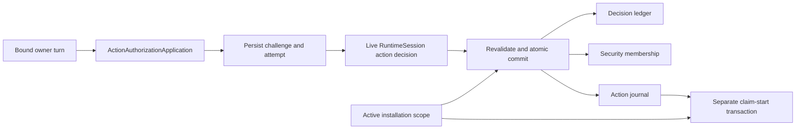

# Action authority registration

## 1. Overview

Detailed design, 2026-10-06; implementation envelope pending. Continues [the approved product Spec](graph-engineering-workflow.md) and its Human action gates without changing the PRD/Intent Baseline. The owner approved the dedicated use case, versioned decision and independent same-repository ledger in `wp09-action-authority-direction-approval-r0.json`; the approved direction has SHA-256 `921662b5b8f00897d2a6af344bdfd96302fda6e10e36a72ee4d790aeee8a5bd9`.

The missing production transition is genuine human decision → durable action authority. Generic escalation currently returns a decision only; test injection of security membership is not this transition.

## 2. Goals

- Exactly one durable approval receipt per request, with all three enforcement/audit surfaces committed together.
- Zero target calls for rejected, stale, forged, expired, revoked or restored authorities.
- Cover every critical journey in the Test Plan, including both orders of real independent-process races.
- Prove a genuine mixed domain/action event chain without making unavailable learning metrics appear observed.

## 3. Non-goals

This increment implements existing product authority semantics; it does not add automatic external actions, a new network service or dependencies. Existing-install upgrades and release remain separate operations. Local configured `human_status=approved` is not a human approval source. Authorized-stage metric availability and other WP09/WP10/WP11 exit evidence remain separate work; the checkpoint is not project completion.

## 4. Architecture

All components run in the existing local process/repository. New core contract module owns closed decision/challenge/receipt/policy records; application owns orchestration; storage owns ledger/CAS; runtime adapters supply actual human invocation provenance. No core adapter dependency. A single writer implements; an independent reviewer reviews immutable artifact/Candidate digests.

`ActionAuthorizationApplication.authorize(session, request)` constructs the challenge from current prepared action and installed policy. It persists challenge plus attempt in a bounded transaction, releases all DB/resource/installation wait locks, calls `RuntimeSession.request_action_decision`, then obtains a fresh current command scope and revalidates session/installation before committing. It never executes a target. Existing generic `request_human` and `escalate` retain their v1 semantics.

Storage provides private connection-bound helpers for membership and journal updates; it exposes no `approve=True` or detached-decision registration API. Public library `ActionCoordinator.authorize` becomes a validation/read path for an already registered authority and cannot write a grant. Move its authorized-row early return after freshness checks. `revoke` must route through the same authenticated revocation service; the old journal-only mutation cannot remain an alternate route.

Three execution entrances need identical enforcement: generic `execute`, concrete Git start and compensation start. `TaskRepository.commit` checks current registration and epoch **inside its write transaction, before changing the task head**, then atomically inserts the claim and starts the journal. Caller-supplied start delta is a precondition, never proof. Receipt/reconciliation of an existing claim retains its original obligations and does not require granting a new action. No lock may remain held during human interaction; no nested independent SQL transaction. The local composition currently captures a long-lived repository in `authorize_task`; replace that capture for this flow with a scope provider that opens/closes a current short-lived repository on each authorization check. Destroy scope-bound repository/object handles before the human wait and rebuild them afterwards. The live runtime session may survive the wait, but its capability/owner/lineage must still pass `require_current` and fresh task authorization; never reuse a closed-scope factory.

## 5. Data model

New component version `action-authority:1.0` is initialized only under the installation-exclusive maintenance path. There is one append-only table `action_authority_events` and indexes, no separate authoritative mutable projection. Primary key `(request_id, sequence)`; indexed `(task_id, action_id)` and `authority_digest`; sequence starts at 1. Each row has request_id, sequence, event_kind, generation, canonical body_json and event_digest. Digest binds previous_event_digest and the closed event body. Request ID is repository-wide and is never reused, even after terminal status. Reads validate the bounded chain and derived state; changing an indexed column without the matching body/digest is corruption.

Closed challenge fields: schema_version `1.0.0`, request_id, task_id, action_id, owner_id, runtime_kind, runtime_lineage_id, prepared_action_digest, action_kind, ordered unique resources, baseline_digest, snapshot_digest, task_revision, journal_revision, security_state_digest, installation_id, repository_id, activation_epoch, policy_digest, created_at_ns, expires_at_ns, challenge_digest. Canonical challenge is immutable. Nanosecond timestamps use canonical unsigned decimal strings (0 through 2^63−1), parsed exactly for comparison: epoch nanoseconds exceed the repository JCS safe-integer range. Revisions/generations remain safe integers. Human-visible action/resources/prepared digest must be derived from it, not arbitrary prompt references.

Each dispatch appends an `attempt` containing generation (previous + 1), fresh 256-bit nonce, session_id, lineage_id, challenge_digest and trusted dispatch time. It supersedes older attempts. Request digest for the human invocation covers the challenge and the attempt fields; it is distinct from stable challenge_digest. Decision contract `ActionHumanDecisionV1` contains schema_version, request_id, task_id, owner_id, decision_kind=`action-authority`, challenge_digest, request_digest, invocation_nonce, invocation_generation, session_id, runtime_lineage_id, status (pending/rejected/approved), decision_ref, decision_digest. Exact closed fields, canonical digest and byte bounds are mandatory. Missing echo fields are never synthesized by the adapter/application.

`created → attempt → pending/attempt/rejected/approved/revoked/expired`; approved may become revoked/expired. Terminal states never become pending/approved. An attempt without a result after a crash is pending. A fresh retry may supersede it; only the newest attempt may commit. Rejected/revoked/expired require a new request ID and human decision for any later grant.

An approval event contains the validated decision, existing `AuthorityEnvelope` v1 body, immutable challenge binding, post-write journal revision and post-write security digest. Authority ID is deterministically derived from the installation/repository/epoch/request tuple; the envelope binds the prepared action and scope as today. A receipt contains schema_version, request_id, task_id, action_id, status, generation, ledger_sequence, event_digest, authority_digest (null without approval), post_security_digest, post_journal_revision, epoch tuple and receipt_digest. Null post fields are permitted only where no grant exists. An unchanged approved retry returns the original receipt plus a current status result; never rewrite its historic digest. Revocation appends a new terminal receipt with the next generation.

Approval transaction CAS checks task revision/baseline/snapshot, prepared digest, journal revision/state, pre-security digest and current attempt generation/nonce. It appends approval, adds membership and calls the locked journal-authorize helper atomically. It does **not** advance task snapshot/revision. Exact retries validate fresh relevant membership, bindings, epoch, expiry and journal state; an unrelated security digest change does not itself invalidate a grant. An executing/completed journal returns non-actionable `already_started` status, never a new execution permit.

Revocation removes membership and appends the terminal marker in the same transaction. A pending request revocation only terminates that challenge; it cannot revoke another request’s grant. For an approved request, require the journal authority to match that request and update an authorized journal to revoked with CAS. If it is executing/unknown/terminal, preserve state/claim/receipts and return `execution_in_progress` or `already_started`. Claim-first may still complete its one committed attempt; revoke-first prevents any claim and target call. Pending revoke prevents any outstanding human result committing.

Initial installed policy proposals: maximum 1,024 request identities per repository, 16 dispatch attempts per request, 40 events per request, 65,536 canonical bytes per event/challenge/decision, 600 seconds maximum validity from challenge creation. These are conservative configurable admission limits, not measured throughput/SLO claims. Reserve two terminal-event slots per live request (approval/rejection then revoke/expiry); admission checks include reserved slots. Existing bounded SQLite busy policy applies. At capacity refuse new work; do not evict identities. This version retains all bounded closed audit bodies and tombstones; **no body compaction/purge API** is introduced. Extending retention requires a separate design. No unbounded scan on an execution start: bounded request chain via indexed authority lookup, with ambiguity rejected.

## 6. API surface

Owner-turn operations (existing owner/runtime/proof envelope remains):

| Operation | Exact payload | Result |
|---|---|---|
| `authorize_action` | request_id, action_id, expected_task_revision, expected_snapshot_digest, expected_security_digest, expected_journal_revision | status + typed receipt, or stable error |
| `revoke_action_authority` | request_id, action_id, expected_generation | terminal receipt + execution status |
| `action_authority_status` | request_id, action_id | current non-capability status + last receipt |

Retry carries the original payload; completed lookup occurs before comparing original pre-write revisions, then validates current relevant bindings. Changed payload for an existing request conflicts. Pending retry uses original challenge, fresh invocation and current preconditions; stale challenges must be terminalized/refused and a fresh request created. Status never grants or refreshes authority.

`RuntimeSession.request_action_decision(ActionHumanRequestV1) -> ActionHumanDecisionV1` requires a live attested session, task-owner binding and advertised capability `human.action-decision.v1`. The adapter has a separate optional invocation port; adapters without it continue generic work but reject this feature. Capability must reflect actual port support, not merely a config string. Default local owner-turn ports expose no action approval capability; configured generic approved status cannot satisfy it. Codex/Hermes port forwarding preserves the exact validated result. Synthetic tests inject only the external human port at the genuine adapter factory boundary.

Private storage operations: create/dispatch, commit-result, revoke, read-current and validate-start-locked; all derive installation identity from the genuine current command scope. No caller tuple can substitute. Explicit maintenance initializer adds this component to an isolated/new repository. Missing/unsupported schema returns upgrade-needed for action registration/start/status validity, without foreground migration. Read-only historic audit and unrelated tasks retain existing guards.

## 7. Error model

`ActionAuthorityError(code)` exposes stable codes through `OwnerTurnError`, without raw decision text. `invalid_request`, `identity_mismatch`, `decision_mismatch`, `request_conflict`, `terminal_request`, `expired`, `epoch_changed`, `stale_binding`, `unsupported_contract`, `upgrade_required`, `capacity_exhausted`, `integrity_error` are fail-closed; callers must fix inputs/environment or seek a new decision, never auto-regrant. `busy` is bounded-retryable; no retry reruns a target. `human_pending` and `human_rejected` are durable statuses, not exceptions. Storage failure emits no success receipt; a retry resolves commit outcome by request identity and fresh validation. Untrusted port exceptions produce a bounded `human_unavailable` error, with persisted attempt still pending.

## 8. Failure modes

| Failure | Detection | Recovery |
|---|---|---|
| Crash after challenge/attempt | Pending ledger without result | New attempt nonce through genuine human port |
| Approved response lost before commit | No approved ledger/membership/journal tuple | Never replay serialized approval; fresh invocation |
| Crash inside commit | SQLite rollback or entire committed tuple | Exact retry inspects current state, zero target calls |
| Revoke races with result/start | Generation CAS and write serialization | Revoke-first rejects; start-first preserves claim |
| Task/security changes during human wait | Full precondition CAS | Refuse stale decision; no silent rebinding |
| Clock unavailable/expiry reached | Trusted-clock check at result/replay/start | Refuse new authority/start; preserve audit/claims |
| Capacity or malformed ledger | Bounds/version/digest-chain checks | Refuse admission; no anti-replay eviction |
| Old backup/import | Active installation epoch mismatch | Old approvals historical; new genuine decision required |

Use existing `InstallationCommandScope` installation_id/repository_id/activation_epoch, validated by `require_current()`, as the authorization epoch. Migration activation increments the active control-plane epoch (verifying and active); restore-gap registration/reactivation also increments it. The tuple is obtained from active control-plane state, **not** the imported database or bundle's source manifest. Import keeps decision audit data but cannot execute it. All grant/start/retry paths compare ledger epoch against current scope. No new counter inside the restorable DB is a rollback defense.

Supported recovery must use the existing control-plane activation/restore-gap APIs; add tests for import/activation, restore-gap clear/recovery, and crashed activation. Copying both the entire installation control plane and DB back in time is not detectable by a local monotonic file chain alone; it is outside the supported restore protocol and must never be advertised as protected. The current installation ID is path-derived, so merely reinitializing the same control path is not a fresh incarnation. Whole-installation disaster recovery needs a separately designed non-restored incarnation or external high-water authority; this increment does not implement or claim it. Existing live claims remain visible for separately authorized reconciliation/compensation, without executing during restore. Ordinary command scopes reject blocked installations. This new action registration API is not a way to bootstrap `clear_restore_gap` authority: the existing separately authorized recovery-control path must provide its own durable proof or remain blocked. Do not inject a digest to report production recovery success. For already-started actions whose membership was removed by revocation, recovery must validate historical ledger/claim binding rather than require reinserting execution membership; fresh recovery authorization remains separately required.

Freeze migration wire compatibility as follows: existing manifest schema_version `1.0` retains its exact namespace set and cannot contain this component, including a stray table in the backup. New manifest schema_version `1.1` retains the existing manifest fields and adds exactly the `action_authority_events` namespace to records, with exact columns request_id, sequence, event_kind, generation, body_json, event_digest. It requires exactly one `action-authority:1.0` schema marker in records and backup; the table may be empty. Export uses `1.1` only when this component is initialized, otherwise unchanged `1.0`. Both readers compare exact backup/records/schema shapes, not just selected known namespaces. New import initializes the component under isolated maintenance and copies its marker/events atomically before verifying the candidate. Repository digest includes a canonical ledger digest only for this component; legacy repository digests remain byte-compatible. This is an all-or-none namespace (schema marker plus events); old bundles with no component remain readable for old tasks, but cannot grant/start these actions until explicit maintenance. Unknown component versions or missing/mismatched rows fail validation. Candidate projection, export/import row shape and repository digest include the ledger. Imported unchanged grants are audit only because active epoch differs. PMF export restrictions remain unchanged.

## 9. Performance budget

No new latency/throughput claims. Human wait time is measured separately from DB work; no held transaction during it. Resource maxima are in §5 and installed policy; admission reserves terminal capacity. Test runner retains 290-second per-selector ceiling and canonical evidence groups 300 seconds. Tests must measure actual elapsed time and timeouts; these are execution safeguards, not product SLOs. Existing project performance targets are unchanged.

## 10. Security & privacy

| Principal | Allowed | Refused |
|---|---|---|
| Current owner + genuine runtime | Request/revoke/read own task authority | Other owner/task/lineage authority |
| Adapter human port | Return exact current action decision | Missing challenge/nonce echoes or config-derived approval |
| Collector/reviewer/tool payload | Read permitted aggregate/audit references | Grant authority or insert membership |
| Installation maintenance | Initialize schema, carry audit through verified migration | Convert imported decision into live authority |

Keep identifiers, references and digests only, not prompt bodies/PII/credentials. Synthetic identity values in tests. Ledger retention is bounded and non-destructive in this increment; existing claims/holds remain protected. Cryptographic self-digests prove consistency, not human provenance. Runtime capability/session issuance and process/thread ownership remain mandatory.

## 11. Open questions

No deferred endpoint or state-transition choice. Implementation is gated on independent review of this package and owner approval of its expanded target/test envelope; deadline is before production code or new test execution. Native Linux and real Codex/Hermes human interaction evidence are release work, not claimed by injected-port tests. Versioned bundle handling is specified in §8. Older binaries do not check the new authorization ledger and may accept legacy membership/journal fields. Running an old binary against a component-enabled DB is unsupported and unsafe, not guaranteed to fail closed. Controlled upgrade/downgrade isolation remains WP10; this source/isolated-test increment never upgrades an existing installation.

## 12. References and history

- [Product PRD](../prd/graph-engineering-workflow.md), [Positioning](../positioning/graph-engineering-workflow.md).
- [Impact](../impact/action-authority-registration.md), [ADR 0011](../adr/0011-action-authority-decision-ledger.md).
- [Implementation plan](../plans/2026-10-06-action-authority-registration.md), [Test plan](../test-plans/action-authority-registration.md).
- 2026-10-06: detailed design from owner-approved direction; no implementation or external-action authorization inferred.
