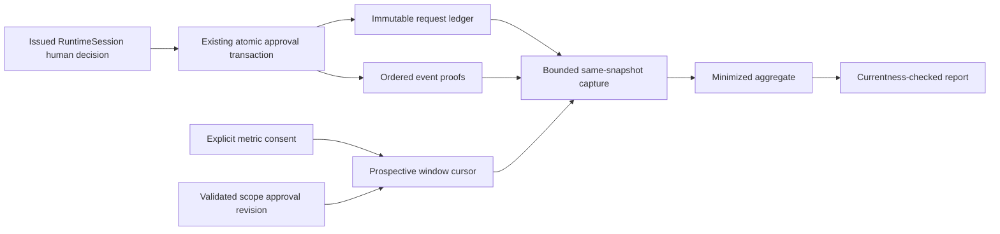

# Authorized stage learning

## 1. Overview

Design revision 1, 2026-10-08. The Owner approved the six-file design stage and the meaning “distinct action categories genuinely approved within the current consent/PRD window” in reply to the reviewed R1 proposal. This implements [PRD FR-13 / US-12](../prd/graph-engineering-workflow.md), building on the receipted `ce476d4` action-authority increment. It is a design, not implementation or installation authority.

## 2. Goals

AS-G1: genuine approvals produce the exact cardinality of configured categories, with zero increments from pending/rejected, request retries or category duplicates. AS-G2: every observed value has a complete prospective window; unknown provenance never produces observed zero. AS-G3: both orders of consent/approval and report/approval races obey SQLite transaction order, with zero stale publication. AS-G4: preserve every existing request event/receipt digest and existing action-start enforcement. Cover all nine Test Plan journeys; retain existing configured 8MiB capture, 16KiB aggregate and 256KiB report limits. These are acceptance budgets, not measured latency claims.

## 3. Non-goals

The [approved product boundary](../prd/graph-engineering-workflow.md) remains unchanged: learning does not replace human action authority, grant execution rights, infer universal action risk ranking or export private observations. This increment has no background/network collector, historical backfill, real-installation upgrade or release rollout. It does not define an experimental success threshold for this count; configured rules without an approved predicate continue to produce insufficient-data. These are delivery boundaries for FR-13, not new product exclusions.

## 4. Architecture

All storage stays in the existing local SQLite repository. Core owns deterministic category/count projection; application owns installed policy and owner/runtime checks; storage owns ordering, window capture and transactional freshness. No adapter owns ordering semantics. Deployment topology remains local foreground processes, including independent processes using the same genuine installation scope.

The recommendation in [ADR 0012](../adr/0012-authorization-learning-window-cursor.md) is an append-only ordering sidecar: original action-authority component remains `1.0`; optional `action-authority-order:1.0` covers existing ledger events without rewriting them. New writes, including challenge, attempt, pending, approval, rejection and terminal events, append exactly one matching order row in the same owned write transaction. Failure rolls back both. No SQL/resource/installation scope is held across a human wait. Reads never install a component.

Consent captures a committed ordering watermark in its existing grant write transaction. Current PRD approval is proved using the existing frozen project-scope transaction and its validated task revision, approval digest and baseline. A challenge must bind that baseline and have task_revision at least the current approved transaction revision. This reuses existing proof rather than imposing a second PRD approval order. PRD reapproval invalidates stale pending challenges through existing CAS; a security-changing regrant likewise requires a fresh request/decision. A waiting request with unchanged preconditions is classified by the final approval commit, not creation/dispatch time.

## 5. Data model

Ordering storage is one new non-PMF table `action_authority_order`, plus its exact schema marker. STRICT columns: order_epoch TEXT; ordinal INTEGER (0..2^53-1); PRIMARY KEY(order_epoch,ordinal); kind TEXT (`anchor` or `event`); request_id nullable TEXT; request_sequence nullable INTEGER; ledger_event_digest nullable TEXT; previous_order_digest nullable TEXT; body_json TEXT; order_digest TEXT. UNIQUE(order_epoch,request_id,request_sequence) for event rows; indexed columns must agree with closed body and digest. The anchor is ordinal 0 with null request fields and previous digest, body `{schema_version:1.0.0,kind:anchor,installation_id,repository_id,activation_epoch,legacy_rows_digest,legacy_row_count}`. Legacy digest is `semantic_record_digest({contract:"action-authority-legacy-seal-v1",columns:["request_id","sequence","event_digest"],rows:[[request_id,sequence,event_digest],...]})`, ordered by request_id using SQLite BINARY collation then ascending integer sequence. The exact row count is bound separately in the anchor. Each event_digest is the original digest, validated against its original body during maintenance. This is an unordered-in-time integrity seal, not historical ordering. Every row order_epoch is the semantic digest of its anchor epoch tuple, derived from the genuine command scope. New event body `{schema_version:1.0.0,kind:event,order_epoch,ordinal,previous_order_digest,request_id,request_sequence,ledger_event_digest}`. Digest is the existing semantic-record digest of that closed body. The anchor digest binds the epoch and legacy inventory.

On installation-exclusive initialization, validate all original request chains with existing limits, preflight total bytes/rows, write anchor and marker atomically. An empty ledger has the digest of an empty canonical projection. Once installed, every later ledger row must have one order row; old rows at initialization are exactly the sealed legacy partition. Foreground metadata validation requires contiguous ordinals, no duplicate/gap/foreign pointer, correct order digests and a complete partition of original metadata rows between legacy seal and ordered references. Compute the current epoch legacy partition by an anti-join of action_authority_events metadata against order rows in that epoch; its exact sorted seal/count must match the anchor. Every ordered pointer must match exactly one ledger metadata row with the same original event_digest. This checks ordering integrity without reading other tasks’ authorization bodies. No rowid, wall time or caller cursor is proof. MAX(ordinal)+1 within the active order_epoch is allocated only inside the owned SQLite writer transaction; no independently persisted counter. Overflow refuses the write.

A watermark is `{order_epoch,ordinal,order_digest,anchor_digest,installation_id,repository_id,activation_epoch}`. After repository activation/restore into another epoch, old order is historic only; a new explicit maintenance transition must reseal all currently validated ledger rows into a new anchor, retaining former epoch rows in the same table as validated migration audit in the bundle. No active old-epoch grant can start. This design does not claim to detect arbitrary rollback of the whole control plane.

PMF marker becomes `1.1.0` under explicit maintenance. Keep the same four PMF tables and retention controls. Observation record `1.1.0` adds nullable `authorization_window` with closed `{schema_version:1.0.0,consent_generation,policy_digest,category_mapping_digest,watermark}`; the field is populated only by a genuine grant selecting authorized_stage with supported order storage. No request/decision/authority bodies or identifiers are copied into PMF. Original observation fields remain. Current PRD revision and baseline are proved at capture; they are not replaced by cursor timestamps.

Derived record `1.1.0` adds nullable `authorization_source` `{window_digest,watermark,prd_revision,baseline_digest,category_mapping_digest}`. It contains an end watermark; the count is a bounded integer 0..64 or null. Reports `1.1.0` add this source to each cohort entry and bind it in cohort_digest. No category names or action IDs appear in public metric output.

Installed learning policy `1.1.0` adds `authorized_action_categories`, a closed bounded mapping of action-kind codes to category codes: 1..64 entries, unique keys, code strings length 1..64 matching `[a-z][a-z0-9._-]*`. Mapping digest and policy digest are source bindings. Map aliases only as explicit configuration. The initial package mapping is an identity map of supported built-in action kinds; unmapped genuinely approved kinds make this metric unavailable, never a partial count or observed zero. Mapping changes require a new policy digest and explicit fresh consent. Existing experiments remain version 1.0.0; loader validates them against their preserved schema rather than conflating them with the new policy schema.

Eligibility: selected live explicit metric consent, genuine owner/runtime/current installation identity, complete observation and PRD proof, supported watermark in the current epoch, unchanged mapping. An approval counts iff its validated historical event is `approved`, has ordinal strictly greater than the grant watermark, matches task/owner/runtime lineage/epoch and current baseline, and its challenge.task_revision >= validated PRD revision. Every matching request chain is validated; terminal revoke/expiry does not erase an earlier approval. Count the set of mapped categories, not latest heads or grants currently executable. Missing old window or absent component returns unavailable; malformed or tampered proofs raise source/integrity error. A complete empty new window is observed 0.

## 6. API surface

Keep all existing `OwnerTurnApplication` v1 six learning operations and action decision/receipt contracts unchanged. `grant_learning` captures the window in the same transaction as consent and aggregate initialization; no caller-supplied watermark. `collect_learning` adds the count to the existing metrics map. `report_learning` publishes it in observations with source bindings; no invented hypothesis interpretation. `action_authority_status` remains the endpoint for current executable authority. Authentication uses existing issued RuntimeSession and genuine owner task authorization.

Internal proposed signatures: `ActionAuthorityLedger._order_watermark_locked(connection, capture_budget) -> watermark`; `_validate_order_locked(connection, capture_budget) -> validated bounded projection`; `_append_order_locked(connection, event) -> watermark` (private owned write transaction only); pure `authorized_category_count(validated_approvals, category_mapping) -> int`. Capture uses the same connection/snapshot as consent, PRD, source events and aggregation. Reader contracts are distinct: installation maintenance may validate full ledger bodies under its explicit exclusive authority; foreground global metadata reader may return only action_authority_events(request_id,sequence,event_kind,generation,event_digest) and the bounded closed ordering rows (which contain only IDs/digests/ordinals), never authorization body_json. A selected-task candidate index query may inspect json_extract(body_json,"$.challenge.task_id") in SQLite to identify matching request IDs, but may return only request ID, sequence and byte lengths until all selected endpoints pass owner/runtime authorization and live authorized_stage consent. Foreground body reader may then materialize body_json only for those matching, explicitly selected task IDs, and must validate complete request chains and task/owner/lineage/epoch bindings before counting. Unselected, foreign-owner, metric-omitted, revoked and expired endpoints receive zero authorization-body materialization. Shared global metadata validation never grants permission to fetch such bodies. No public detached approve/cursor insertion API.

Maintenance adds `InstallationMigrationRepository.initialize_action_authority_order_storage()` under installation-exclusive control, and extends explicit learning maintenance to marker 1.1.0. Idempotent matching initialization returns success; unknown/partial components refuse. These are future implementation contracts; real execution needs separate authority.

Create versioned policy/record/report schema resources 1.1.0; preserve 1.0.0 resources for historical validation. Input schema stays 1.0.0. Bundle format 1.2 carries optional sidecar and its component marker/anchor; read-only/import compatibility for 1.0/1.1 bundles remains. A legacy bundle import has no fabricated order or available new window. Restore validates the sidecar and archive, then requires new-epoch maintenance and fresh consent. PMF-initialized repositories still reject migration export before destination/hold/backup mutation.

## 7. Error model

Use existing stable `LearningError` codes: LEARNING_AUTH for owner/identity mismatch; LEARNING_SOURCE for malformed/gapped/digest-mismatched source; LEARNING_BOUND for preallocation/admission overflow; LEARNING_STALE for changed source/mapping/window; LEARNING_SCHEMA for unsupported PMF format; LEARNING_CONFLICT for generation/replay mismatch. Action order append failures preserve existing `ActionAuthorityError` capacity_exhausted, integrity_error, upgrade_required, epoch_changed and stale_binding. Busy follows existing bounded SQLite retries. No raw bodies in errors. Missing optional ordering provenance yields metric `{value:null,availability:unavailable}` without disabling unrelated task work. Explicit writes with a partial/unknown order marker fail closed; callers repair via maintenance, never downgrade automatically.

## 8. Failure modes

| Scenario | Detection | Recovery |
| --- | --- | --- |
| Crash during anchor/PMF maintenance | Entire old state or valid new marker+schema | Retry explicit maintenance; no foreground repair |
| Approval tuple or order insert fails | No partial ledger/security/journal/order state | Exact request retry, preserving original committed receipt |
| Consent races with approval | SQLite snapshot/write serialization | Approve-first excluded; grant-first included iff preconditions remain valid |
| Capture races with later approval at unchanged task head | End watermark differs at publication/current-derived lookup | LEARNING_STALE and fresh collect; report holds one final write transaction |
| Historical revoked head hides approval | Validated full bounded request chain | Count approved event once; execution start still uses current authority |
| Old component/window | Missing supported anchor/window | Unavailable until explicit upgrade + prospective regrant |
| Source too large or corrupt | Preflight aggregate lengths/counts or proof validation | Refuse; never truncate into zero |

Collect replay must compare authorization_source, not only aggregate_ref/task head. Report validates end watermark and anchor for every contributing task before returning its result and before storing its report receipt. A report may linearize before a later approval; its receipt cannot be reused after source changes. Keep consent, security subject registration, retention bookkeeping and receipts atomic.

## 9. Performance budget

Reuse installed limits: 32 tasks, 10,000 rows/task, 65,536 bytes/row, 8,388,608 capture bytes, 16,384 aggregate bytes, 262,144 report bytes. Action ledger allows at most 1,024 request identities and 40 events/request. These products do not imply that a maximal ledger fits a PMF capture. Count metadata and UTF-8 byte lengths for ordering/ledger/legacy seal and existing source components before fetching bodies; charge duplicate shared evidence once in a cohort capture, using one shared remaining budget. Reserve fixed schema overhead conservatively. Refuse LIMIT+1 row overflow; no unbounded fetchall or truncation. Ordering projection requires a whole-repository metadata/partition check and consented selected-task body checks; charge metadata UTF-8 lengths, sorting/projection overhead, ordering metadata bodies and selected request bodies in the same shared budget. Legacy metadata sealing uses the exact section 5 recipe. Never materialize foreign bodies to recompute that seal. When either projection cannot fit the existing capture budget, reject collection rather than weaken it.

The candidate watermark/vector alternative can require 1,024 request IDs, sequence/digest heads and delimiters: it cannot guarantee the existing 16KiB aggregate budget. A constant-size watermark avoids that stored vector, though it does not eliminate bounded source validation. Action starts retain indexed per-request checks and never perform PMF scans. Latency percentiles/throughput/cost are not release claims for this local increment; tests record group wall time under the project 300s formal command ceiling, child subprocesses <=290s. No external service cost is added. Existing native elapsed provider tests are reused only where inputs changed.

## 10. Security & privacy

Trace [PRD FR-07/FR-13 and US-12](../prd/graph-engineering-workflow.md). Roles × resources:

| Actor | Resource | Allowed |
| --- | --- | --- |
| Bound issued owner runtime | Own consent/collect/report | Existing authorized operations and selected metrics |
| Genuine human action-decision port | Current issued challenge | Existing approve/reject decision; no direct DB write |
| Application write transaction | Ledger/order/security/journal | Atomic validated existing transition only |
| Installation maintenance owner | Optional schema/anchor | Explicit exclusive initialization and validated synthetic upgrade |
| Foreign runtime/caller JSON | Any cursor/grant/source | No insertion or observation authority |

Ledger contains owner/runtime/request IDs, resources, nonces and decision refs; these remain closed local audit bodies under current ledger retention, with no PMF copy. PMF contains minimized digests/counts only and current retention/tombstone enforcement. Global cursor digest equality may conservatively invalidate another task's report; do not expose row bodies or foreign counts. No scan of authorization bodies when metric consent is absent/expired/revoked: minimal consent gate precedes policy/history reads. A cohort validates all selected endpoint authorizations and metric consent gates before any authorization body reader; a task that omitted authorized_stage is not a body source. Global metadata alone cannot classify or validate foreign task decisions. Installation maintenance is the only full-ledger body-validation path. Consent purge affects only PMF, never the independently required action audit; accepted PMF migration-export restriction remains even after purge. Error/report canaries must be absent from logs and serialized outputs.

## 11. Open questions

No unresolved product/architecture choice is delegated to code. Global sidecar is the recommended ADR decision within the Owner-approved design evaluation; independent review can require routine precision changes. Before implementation authority: freeze the exact target inventory and named commands in Plan/Test Plan, mechanically verify all regression selectors and package closure, and resolve any blocking review findings within budget 4. Real installation migration, Linux proof and release acceptance remain later separately authorized milestones, not placeholders in this API.

## 12. References

- [Positioning](../positioning/graph-engineering-workflow.md), [PRD](../prd/graph-engineering-workflow.md), [main Spec](graph-engineering-workflow.md).
- [Action authority Spec](action-authority-registration.md), [ADR 0010](../adr/0010-local-product-learning-storage.md), [ADR 0011](../adr/0011-action-authority-decision-ledger.md), [ADR 0012](../adr/0012-authorization-learning-window-cursor.md).
- Source baseline `ce476d40b18719a153cb23d24a7d4b9cd27bb089`; detached design approval/envelope and source hashes under the current Policy prefix. No external standard is newly introduced.
