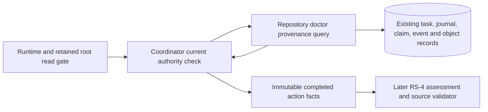

# Graph Engineering Workflow — Tech Spec

## 2026-09-20 RS-C installed currentness implementation detail

The cold operation receives factories already created by the existing installed
bootstrap. Capture only a private path/size/hash read plan from that validated
bootstrap, bind it to the exact original factory inputs, and adopt the complete
plan with the other retained configuration under RS-C-0b. On every cold use,
freshly verify the raw bytes that established those semantics. An unchanged raw
digest proves the previously validated schema, pins and signature still apply;
it does not permit skipping the current reads. Source installations rehash the
closed327-member attestation set twice and its key/attestation three times,
including exact root, lock, descriptor and path checks. The ordinary installed
and validation-only document factory behavior remains available outside cold
operations. Missing factory/context bindings reject before any legacy fallback.

The wheel branch below remains pending independent implementation-choice
review. It must preserve the actual supported interpreter's path-based discovery
semantics, including distribution uniqueness, while avoiding a new unbounded
RECORD, provenance TOML or zip central-directory materialization during cold use.

- Capture the ordered `sys.path`, including duplicate entries and empty/relative
  entries resolved against the original cwd. Revalidate their current resolution
  and filesystem kind; absent roots becoming present or changed roots reject.
  Accept only the standard path-based distribution discovery provider and its
  unchanged implementation. Unsupported custom discovery providers cannot issue
  a cold read plan; ordinary factory construction does not gain a new authority.
- For directory roots, freshly enumerate with installed row, byte and work
  bounds before processing every entry, including filtered non-candidates and
  each repeated sys.path root occurrence. Never list or collect the whole
  directory before admission, and never return a truncated candidate set on
  overflow. Close the iterator on rejection or iteration failure. Compare the
  exact candidate set, covering `*.dist-info`, directory
  and single-file `*.egg-info`, and `*.egg/EGG-INFO`. Read every initial candidate's
  metadata, including non-selected distributions, by bounded streaming hash.
  Preserve `METADATA -> PKG-INFO -> candidate-file` fallback, including absent,
  empty-file and unreadable states under the standard reader's exact behavior;
  a new earlier fallback or an in-place Name change rejects. Directory timestamps
  alone cannot replace this discovery or metadata proof.
- Rehash every archive used as a discovery root, including non-selected archives.
  Verify the selected wheel's complete current bytes and physical identity; raw
  equality preserves the already-validated RECORD entries and central-directory
  uniqueness without rebuilding those collections. For an unpacked wheel, rehash
  its selected RECORD and every member required by the existing module,
  provenance, coverage, adapter and release closure. Bind the loaded module path
  and original resource inputs, including their recorded hashes and sizes.
- Capture and recheck the initial discovery and file identities around plan
  issuance. Repeat current topology, metadata and selected resource proofs before
  returning from a cold check. No discovery callback or path is supplied by the
  cold caller. All plan data, enumerator scratch and hashing buffers join the
  exact common owner before allocation; archive total size is streamed under the
  existing work allowance, never read as one document or used to raise a limit.

This is a private read strategy within the approved installed-currentness scope.
No public API, dependency, installed resource member, schema, write authority or
irreversible action is added by this detail. Complete C-L acceptance still needs
configuration adoption and repeated source/action/security/physical proof.

## 2026-09-20 RS-C installation-control read amendment — proposed R0

Human update (2026-09-20): the owner replied “确认” to the final one-file
request, approving GEW-REMAINING54-P3-COLD-INSTALLATION-CONTROL-V1. The
append-only p3_restart_cold_installation_control_amendment records this exact
extension. Current boundaries are185 product /195 effective /41 selected
targets. The reviewed proposal below is historical; its implementation scope
and all exclusions remain unchanged. Prior RS-C R2 approval stays valid.

Decision requested: `GEW-REMAINING54-P3-COLD-INSTALLATION-CONTROL-V1`.
This is a proposed one-file extension to approved RS-C R2. Implementation of
this extension waits for Human authority; the existing R2 approval remains valid.

Cold source and action reads call `InstallationCommandScope.require_current`,
including each `_connection_opened` callback. In
`storage/graph_engineering/storage/migration.py`, `_require_command_scope`
reaches `_current_manifest` and `_resolve_locator` -> `_load_locators`.
The two control JSON files currently use `read_text()` before any byte or
collection bound. An outer size check cannot bound a later growing-file read,
and omitting nested currentness would remove an existing authority check.

Authorize changes only to these private control-read paths and their private
bounded helper in that file. The cold path must join RS-C-0b's exact installed
reservation owner before its first control-file read and retain that binding
through nested connection admission and each reuse. The lexical carrier may
be a private ContextVar containing the exact installed context; the ledger
remains operation-owned. Match owner, task, command scope, ports, process and
thread; reject missing, foreign, overlapping or changed bindings. Restore the
binding in `finally`. No standalone fallback context is allowed during a cold
operation. Existing public signatures and ordinary command semantics remain.

Open only the configured active-manifest and locator-registry members beneath
the already trusted control root. Check descriptor type, owner, mode, size and
path identity before allocation; admit actual size against installed document
limits and the owner's remaining aggregate allowance. One size-bounded read
and a one-byte growth probe must reject growth, short reads and replacement.
Reserve raw, decoded, parsed, locator and comparison representations for their
actual overlapping lifetimes; bound locator count before constructing locator
objects. Keep the first full recovery closure charged while these reads recur.
Release descriptors and scratch on every success or failure without I/O repair.

Preserve the shared installation lock, exact manifest schema/digest/context,
ordinary-command mode, locator schema/order/uniqueness/digest, repository ID,
root device/inode/path and current-scope comparisons. Continue checking every
connection admission; no memoized PASS can replace a fresh control-file check.
No new control file, public API, persisted schema/event, migration/upgrade
write, locator registration, installation activation or WP-10 behavior is
authorized by this amendment. RS-C's source, action and physical proof and
separate irreversible boundaries remain unchanged.

## 2026-09-20 RS-C cold-source reconstruction detail — R2

Human update (2026-09-20): the owner's response “继续” to the final R2
API request authorizes GEW-REMAINING54-P3-COLD-SOURCE-READ-API-V1, recorded
in p3_restart_cold_source_read_api_amendment. The not-yet-authorized wording
in the reviewed proposal below is historical and is superseded only for this
exact API, consumers, resource hardening, tests and independent review.
The184/194 boundaries and all irreversible exclusions remain unchanged.

This supplement makes RS-4/RS-5's existing source joins and root lookup
implementable under the accepted P3-RS-A architecture. It does not authorize
implementation until its independent review and actual reducer advance.
RS-AP R1 is the accepted action reader. Positioning, PRD Intent Baseline v2,
the184-target Envelope and all earlier irreversible boundaries remain unchanged.

### RS-C-0. Proposed bounded task/source reader and authority gate

R0 review GEW-REMAINING54-RS-C-SOURCE-BOUNDS-R0-001 found that the
existing resolver transitively reads unbounded SQL rows and CAS bytes. The
following repair proposes one additional private storage read API,
`TaskRepository.read_category_recovery_sources(task_id, *, phase)`, in the
already-listed `storage/graph_engineering/storage/repository.py`.
`phase` is the closed discriminator `locator` or `sources`, never a SQL,
path, record kind or caller query. Both return immutable data, no capability.

This API is **proposed, not yet authorized**. Existing Human RS-AP approval is
for action provenance. The RS Impact rule requires a concrete decision for a
new storage API even though the184 file allowlist does not grow. Required
decision: authorize this bounded query and its exact application consumers,
focused RED-first tests, installed pin maintenance and independent review.
No code may implement it before that Human decision.

| Read phase | Bounded source and complete validation |
|---|---|
| Preliminary locator | Doctor-only query of this task's exact wrapper/head, current assessment evidence identity and corresponding same-task reference/object row. Bound SQL bytes before returning text, parse wrapper/evidence under WorkContext, reject duplicate/stale/unsupported assessment selectors, then bounded descriptor-read only that assessment body. Output task/head/ref/CAS identity and target logical ID; no authority or source seal. |
| Gated task/materialization | Requery wrapper, events/transaction heads and task refs/objects in one bounded capture. Validate task snapshot digest, indexed event chain and transaction/revision/head joins; use the captured committed materialization bytes and installed policy's exact MaterializationRecord to validate domain GraphRef. Do not issue a mutable materialization reference or call a legacy resolver. |
| Gated source bodies | Read only the exact task-reference set from the captured metadata, once per raw digest, through the RS-AP bounded CAS descriptor primitive. Preserve raw IDs for assessment, category records, full ArtifactRecords, manifests, raw bodies and prior-review sources. No arbitrary CAS enumeration or unreferenced body lookup. |
| Scope/extension state | Capture this task's project-scope metadata and verify its existing digest/approval-event binding from the same bounded event view. Any project realization requiring an external identity resolver, or extension pin requiring authority unavailable in this closed recovery reader, rejects as unavailable-authority before issuance; never skip the existing check or invoke an unbounded/external resolver. |
| Final capture and every reuse | Invoke the identical bounded `sources` query again; compare full wrapper/head, event/transaction, scope, references and raw object identities, then all RS-C source and RS-AP action/security facts. No old cached bytes, nested repository lock or legacy read follows this capture. |

Inside each query enforce exact current InstallationCommandScope and same
TaskRepository/ObjectRepository/lock/WorkContext identity. Require no existing
repository tokens/transaction, then acquire installation -> object locks once.
Use parameterized fixed SELECT/CTE statements through the existing doctor role.
Use SQL-side byte-length CASE sentinels for every potentially large text/blob
field and bounded result rows (installed array limit plus one overflow sentinel);
never fetch an unbounded row set or materialize an oversized column. Account
for the complete raw SQL field budget before parsing/retaining, including task
snapshot, runner, events, transactions, scope and reference metadata. Optional
source-state rows receive the same bounds, not a separate unchecked query.

Reuse the existing RS-AP `_read_provenance_object` contract rather than
ObjectRepository.get/_verify_file/_read_descriptor. Actual fstat size must fit
the per-document and remaining aggregate allowance before allocation, then
match persisted size. One admitted read plus a one-byte growth probe, exact
short-read rejection, final descriptor/path identity and raw digest checks
apply. Reserve aggregate retained bytes across SQL projections, retained raw
CAS bodies, parsed projections and transient serialization within the installed
temporary/result limits; count overlapping representations, not only their
largest member. Release scratch only after its corresponding data is dropped;
transfer returned-result reservations to the outer owner defined below.
Reject before allocation if the full immutable result cannot fit. A short read or drift rejects
without retry, re-sign, repair or metadata normalization.

Application consumers in existing tasks.py and profile_execution.py validate
the resulting domain/runner state with existing pure validators, installed
materialization and exact runtime owner/kind/lineage. They resolve the unique
assessment from these captured bytes themselves. The caller supplies no
snapshot/projection and cannot substitute a materialization callback. Generic
runtime_show and CategoryAssessmentResolver behavior for other consumers stays
unchanged; the dedicated cold locator/capture path must never call them, nor
TaskRepository.load/replay/referenced_objects/category_source_seal or the
legacy CAS/materialization helpers. Action joins use the accepted RS-AP bounded
capture through the complete action/security route below.

Root scope sequence remains preliminary bounded locator -> release all tokens
-> root gate -> repeated bounded source/action/physical reads. Query failures
release only their tokens/connections; outer recovery revokes/closes its root
handle before returning an error. No durable writes, clock persistence, leases,
mutation results, source-fence capabilities or new persisted records are issued.


### RS-C-0a. Action and security reads within the same bound

R1 findings ACTION-SECURITY-BOUNDS-R1-001 and OUTER-RETENTION-R1-001
apply to the whole cold operation, not just its new task query. In
application/actions.py, cold completion validates current action authority
directly from the exact internally obtained RS-AP journal/index projection.
Reuse current installed policy validators, uniqueness/index checks and the
terminal-state, prepared/authority digest, action kind/resource, issuer,
revocation, owner, lineage, baseline and target checks. Do not re-enter
ActionJournal.load/find_prepared or the legacy _read_action_authority route
from cold recovery. A private pure validator may share those checks with the
existing route; callers cannot supply the projection to the cold entry.
The next complete bounded capture must detect any journal change between
capture and validation. Existing mutation APIs and standalone authorization
semantics remain unchanged; storage/actions.py stays read-only.

In storage/security.py, bound every selected text/blob field and row count
inside the existing load_installed_runtime and _load_task_state statements
before SQLite returns Python values. This includes manifest/state JSON,
identifiers, digests and status/index fields, not only the largest JSON column.
Use installed limits and the outer remaining allowance; validate exact storage
types, sentinel absence, current task revision/snapshot and canonical security
digests before returning. Account for encoding, parsing, freezing and current
manifest comparison, and retain all existing validation. The public method
signatures, doctor role, no-clock read semantics and issued security types do
not change. No new security query API or caller-supplied state is introduced.

This covers SecurityContextIssuer construction, read_task_state,
ReleaseOperationsRegistryFactory._open_retained_storage_query.current and
every admission/reuse callback. Construction's existing local WorkContext bound
must hold before a cold owner exists; its retained installed manifest is
charged when that owner adopts the issuer. During cold reads the security
methods join the same outer budget as task/action/physical captures. Missing,
foreign or changed security authority rejects; no issue_task_context,
trusted_now, renewal, repair or durable write may satisfy the read.

### RS-C-0b. One reservation owner for the complete cold operation

Use one private in-memory reservation ledger implemented in the existing
repository.py; it performs no I/O and grants no authority. The cold factory
creates its owner from the exact installed WorkContext instances of category,
action, security and release readers. Derive aggregate temporary-unit and
retained-result-byte ceilings from the minimum remaining installed allowance
across these contexts, including their pre-existing retained use. Do not merge,
replace, reset or increase any WorkContext's work budget or limits.

A fixed internal lexical scope binds that ledger to the exact task, command
scope, current thread and participating repository/security/factory ports.
No public method gains a budget override, callback or caller projection.
Existing method signatures remain unchanged. Refuse a foreign owner, omitted
participant, overlapping owner, reentry or changed context identity. Remove
the lexical port bindings on every exit; the ledger may outlive a call only
as the private owner of an issued read-only handle's retained data.

Every fixed reader and pure validator uses child reservation frames from this
owner, including both captures inside read_action_provenance and
_read_completed_action_provenance, security callbacks and physical member
reads. Before SQL field return, CAS read, parse, freeze/thaw or serialization,
admit the allocation against both its own installed limits and the remaining
common allowance. Bound SQL lengths/rows without first returning the fields;
use bounded lengths/structural counts to admit parsed and frozen projections.
Count raw SQL/UTF-8/CAS buffers, retained parsed structure units and every live
copy/serialized buffer. Keep byte and structural-unit accounting distinct;
neither a canonical output length nor a maximum single component substitutes
for the aggregate. Existing WorkContext checks and charges still apply.

A child frame transfers ownership of each returned immutable projection to its
caller before return; return does not release that projection's reservation.
Only scratch whose data is no longer retained may release then. The first
complete closure remains charged while nested currentness checks and the
second complete closure allocate. Compare under that same owner, then discard
unneeded closures and release their reservations. No retained bytes disappear
from accounting between scopes or become uncharged because another reader
uses a different WorkContext. Tests observe the owner and local reservations
rather than treating independent query success as composite evidence.

Before publication transfer the minimal historical assessment/identity
projection retained by the handle to its persistent private reservation.
Reuse begins with that reservation already charged, then adds both fresh
closures under the same ceilings. Close/revoke drops all retained projections
and releases their reservations; failure drops all new allocations and closes
the partial handle. A successful temporary read returns to its entry accounting;
an open handle retains exactly its documented projection charge until close.
No persisted budget record, new limit value, global singleton or cross-task
ledger is introduced.


### RS-C-1. Locator and read scope

The application entry remains `restore_current_release_assessment`, supplied
with exact current TaskApplication, RuntimeContext, installed category/release
factories, same-repository object/action ports, runtime-issued retained
namespace, and task ID. A preliminary bounded cold-resolver read defined by RS-C-0 obtains
the unique current assessment CAS identity and target ID only. This is the
locator step in ADR-0009, not evidence or a source seal. It releases all
repository tokens and connections before entering the root gate. Unsupported
schema/Profile/column, missing/duplicate ref or malformed target fails here.

The adapter opens exactly the namespace key for these task/target IDs, using
the existing private directory checks and exclusive nonblocking root gate.
A new internal marker-only admission step reads the fixed protocol marker with
no-follow, exact owner/mode/link/descriptor/path/size checks and installed
WorkContext bounds. It does not scan candidate directories or guess a fixture.
The parsed binding's exact installed fixture ID selects the allowed member set;
validate every member and the complete binding before producing a raw reader.
No caller-provided member selector or callback supplies this authority. Failure
at either step closes the partial lease. Marker-only admission is unavailable
for ordinary member reads and never enables a write.

All authoritative reads then occur under that lease. Use RS-C-0 to resolve the same unique
assessment again and require identical locator/ref/CAS bytes before RS-3–RS-5.
This clarifies RS-2's table: repository reads used as proof occur after the gate;
the preliminary locator retains no repository lock when acquiring it. On every
use, recheck installed scope, task, sources, action history, target and health,
then the whole closure a second time. No retry hides a change.

### RS-C-2. Durable artifact and runner linkage

Keep every task-reference CAS digest, verify each raw body, and parse exact
canonical records. The normal category artifact record has precisely its
existing fields: schema_version, record_kind, task_id, artifact_id, contract_id,
body_digest, author_id, reviewer_id, status, record_digest. Require version1.0.0,
accepted-for-category, canonical distinct actors and installed contract closure.

Join each category record to exactly one same-task committed full
`artifact-record:1.0.0` by task/artifact/contract/body/author/reviewer fields.
Validate the full record's existing schema, semantic artifact digest, installed
contract ID/digest/type, accepted exit status, canonical actors, closed findings
and exact required PASS validation/review records against the same semantic
body. Human-policy records require their recorded approval to bind the task
owner and same body. This is verification of committed acceptance/body/review
facts; it does not rerun semantic validators or issue a new ArtifactRecord
acceptance. Do not call ArtifactValidator.load with known inputs, requirements
or baselines copied from the record itself.

The record's logical_body_ref joins uniquely to a committed existing
LogicalBodyManifest by manifest ID, artifact ID, entry digest and extracted
digest. Its physical_body_digest locates an already same-task referenced raw
CAS object. Reuse LogicalBodyManifest's installed schema, selector, physical,
entry and manifest checks, and recompute semantic_body_digest from verified
bytes and the record's semantic_fields. Record baseline and target bindings
must match current task baseline refs and the already verified durable action
target. Persisted source input/requirement fields remain immutable historical
facts; this recovery does not claim independent reevaluation of the original
authoring requirements. Preserve all joined raw object identities in the
read-only source projection, including historical bodies used by final review.

Runner outputs must have the exact existing RunnerSnapshot shape and installed
required-node closure. Each selected output's semantic body must resolve through
exactly one referenced accepted ArtifactRecord/LogicalBodyManifest with matching
author/reviewer; the output evidence_refs must explicitly include that record's
raw CAS identity. Verify the record before trusting this join. No string-to-CAS
digest conversion is allowed: `sha256-jcs-v1` identifies the validated logical
body; `sha256:` identifies bytes. Existing real NodeCandidate raw bodies are not
relabelled as semantic bodies. A source unable to satisfy the stored category
review contract is ineligible.

Reconstruct final review using the original issuance selection: the last PASS
in verified review history, then the last prior distinct body before that PASS.
Join the PASS to exactly one selected output and the prior review to the same
node/run and a distinct committed validated logical body; enforce canonical
independent actors and monotonic exact-integer attempts. Recompute the exact
six-field category-independent-review digest. Another unrelated PASS or a label
digest cannot replace either linked body. The normal runner fact is recomputed
only after the complete output/body/review closure passes.

Existing synthetic category fixtures lack these sources and remain cold-read
negative fixtures. New synthetic producers publish complete bodies, manifests,
records and runner references through existing CAS/runner-transition APIs before
assessment commit. This proves durable reconstruction, not execution of actual
specialist agents or new mandatory/scenario coverage.

### RS-C-3. Read-only result and physical proof

Return a factory-registered opaque read-only assessment handle with exact
historical assessment bytes/digest, source projection and query/close lifetime.
It is not a CategoryCompletionAssessment issued into a live oracle registry,
ReleaseOperationsEvidence issued into the live registry, or ActionOutcome.
Clones, serialization, foreign ports, closed handles and mutation/commit use
fail. Default restore_projection still rejects absent a resolver-issued binding.
No historical body, reference, phase counter or execution continuation is written.

Read all configured state/active/staged manifest and artifact members. Validate
typed state, artifact sizes/raw hashes/provenance, active/stage pointer agreement,
generation and configured health predicates. Join deployment/rollback fields to
RS-AP's exact prepared/authority/claim/receipt/attempt records. Match historical
before/after digests and phase/fault facts against that committed chain; retain
them as history, without reconstructing last_execution or original_binding.
Normal apply-B and completed partial compensation-to-A are the two positives.
The current typed target contract must describe this same terminal state and
resources. A separate disposable target cannot supply the proof.

Fresh observation revisions start in a new opaque lease epoch, independent of
stored JSON counters. Every successful reuse advances the local revision after
two matching complete source/target/health reads; drift revokes and closes the
handle. Initial/final full source projections include task head, assessment CAS,
each joined source CAS identity, security and action/claim/attempt revisions.
Use exact canonical equality, not bool-equals-int language equality.

RS-6 errors, zero recovery writes/replay/network, budget and trust limits apply.
Remaining open implementation choices must be resolved by independent review
before source changes; any material boundary change follows the existing Human
gate. Schema1.0–1.4 bytes and live completion fences are unchanged.


## 2026-09-20 RS-AP authorized action provenance read contract — R1

Human approval `p3_restart_action_provenance_amendment` authorizes the existing
storage repository source in addition to the prior183 targets (184 total).
This supplement supplies the missing read boundary for RS-3; the approved
Positioning/PRD/Intent and RS-1–RS-6 remain governing. It adds no database
schema, persisted record type, event, dependency or mutation permission.



### RS-AP-1. Repository input and output

`TaskRepository.read_action_provenance(task_id, action_id)` is a data-only
library read for the current command-scoped repository. Exact nonempty IDs are
lookup hints; callers cannot supply journal bodies, claim digests, references
or completion truth. The current exact journal verifier, object repository,
locks and connection factory must share its repository and command scope.
Maintenance, foreign ports and caller-held repository locks/connections reject.
The caller owns any required runtime/retained-root authority before this call.

Return a recursively immutable JSON mapping with `schema_version`, `task`,
`journals`, `claim`, `recovery`, `events`, `references`, `receipt_objects`, and
`source_digest`. Task includes its ID, revision, head sequence/digest and
snapshot digest. Journal entries include their row identities/state/revision,
both persisted digest-index columns and schema/digest-validated prepared,
authority, optional receipt and reconciliation bodies. Claim includes the
actual persisted outcome digest, original action/task/lease/start identity,
state/revision and complete resources/fences. Recovery is null or the actual
attempt including its persisted receipt digest/index and parsed bodies. Events
retain their transaction identity; references retain digest, kind, transaction,
size and availability; receipt objects contain their digest and validated JSON
document. `source_digest` binds this whole returned value except itself.

Capture the selected task, original/restore journals and digest aliases,
claims/resources, recovery attempts, complete task event/transaction history
and task object references in one parameterized SQLite SELECT/CTE/UNION
statement. This avoids composing an apparent snapshot from separate table
reads. Stream a bounded result using the installed WorkContext limits; reject
over-limit strings/row collections before retaining an unbounded result.
Reuse existing event-chain/transaction validation, bounded canonical parsers
and closed journal contracts. CAS verification must use the bounded reader
below. Duplicate candidate rows,
digest aliases, missing index/body matches, blocked tasks and dangling or
foreign transaction references fail closed. Select journals by durable IDs,
not caller projections.

Implement receipt CAS reads within the authorized `repository.py`. Before any
body allocation, open through the existing bound directory with no-follow
semantics and validate the actual descriptor/path identity, regular-file type,
owner, mode and actual `fstat` size. Check actual size against the installed
`raw_document_bytes` limit and remaining aggregate receipt-byte allowance,
then require agreement with persisted object size. Database metadata cannot
establish the bound. Preserve descriptor/path binding checks before and after
reading, require stable size/identity, and verify the resulting object digest.
Enforce the same byte ceiling incrementally if the file grows after inspection:
retain at most the admitted bytes and read at most that allowance plus one
sentinel byte before rejection. Bound all retained receipt bytes across objects
by the installed `result_bytes` and `temporary_units` limits, with duplicates
read/retained only once. Check the final serialized result against result limits.
Do not reach the existing unbounded object verification/read helpers, including
through replay; reuse only pure event validation and bound-directory primitives.
No changes to `objects.py` or `connection.py` are needed or authorized.

Acquire and release installation/object locks within the call, after the root
gate. Use doctor query-only access, no immediate transaction, clock update,
lease renewal, reference insertion, cache repair or normalization write.
Capture and verify again before return; compare complete immutable snapshots
and revalidate command authority. Changes or read errors reject without retry;
all descriptors/connections/tokens unwind. The result is data, never a
durable execution gate, ActionOutcome, recovery issuer or assessment object.

### RS-AP-2. Completed action joins

The coordinator's private `_read_completed_action_provenance(task_id, action_id)`
combines freshly read provenance with current `_read_action_authority`
facts for every involved action. Match prepared/authority bodies and persisted
index digests, task/action/owner/lineage/target/baseline/resource identities and
current authority membership. Repeat the complete provenance/authority read
before return. Historical authorization timestamps remain structurally valid;
do not renew them or compare execution expiry against the current read time.

For ordinary completion require one reconciled original journal, its exact
`claim:<action_id>` in `reconciled_effect_verified`, no recovery attempt, and
unique ordered execution-start, receipt and effect-reconciliation events.
Bind start prepared/authority/snapshot/lease/fences, receipt task/action/claim/
start/payload/target/fence and recorded receipt digest/object, and reconciliation
target/resource/fresh observation/postcondition. Recompute `claim-outcome-v1`
from the recorded reconciliation and compare the persisted claim outcome digest.
An earlier unknown receipt can legitimately end in verified reconciliation;
receipt result alone is not the completion verdict. No-effect and unresolved
histories remain ineligible for this normal-release completion reader.

For compensation require the original journal to be compensated, the same
original claim in `compensation_reconciled`, one reconciled recovery attempt,
and its distinct reconciled restore journal. Bind original started event,
restore action/prepared/authority, target/resources/fences/lease, baseline and
snapshot, unique ordered compensation start/receipt/reconciliation events,
and the exact attempt/restore receipt. Its receipt must succeed; both recorded
reconciliations must be identical and bind that receipt, observation digest,
revision and rollback postcondition. Compare the persisted claim outcome
digest with that exact reconciliation. The original receipt may be absent
only when its history has no receipt event; otherwise validate it as historical
evidence. Never require the original journal to remain reconciled after rollback.

Each receipt needs a current available CAS object, canonical closed bounded
receipt body, matching raw-result/object/receipt digests and committed task
reference. Identical redacted receipt bytes may be reused by several actions:
the reference's transaction must be a verified same-task transaction at or
before the receipt event, not necessarily that receipt event's transaction.
This follows the existing first-reference-preserving insert behavior.

### RS-AP-3. Errors, limits and integration boundary

Use existing RepositoryIntegrityError/RepositoryConflictError/object errors for
missing, corrupt, duplicate or changed durable facts; propagate current-scope
and resource-limit failures. Coordinator semantic/current-authority failures
reject with ValueError. Failure performs no repair, issue, renewal or retry.
Synthetic tests cover normal/compensation, substitution, coherent digest
tampering, shared receipt references, drift and no writes. Existing resource
profiles supply limits; native verification stays serial/failfast/600seconds,
without new latency, benchmark or coverage claims. No deployment topology or
privacy changes: the read uses the same local installed repository and existing
task data. Full assessment recovery and RS-5 fresh-process evidence remain
separate; this result cannot enter live evidence or mutation registries.

References: [Impact](../impact/graph-engineering-workflow.md),
[Plan](../plans/2026-08-13-graph-engineering-workflow.md),
[Test Plan](../test-plans/graph-engineering-workflow.md),
[PRD](../prd/graph-engineering-workflow.md),
[Positioning](../positioning/graph-engineering-workflow.md).

## 2026-09-19 RS-BS prerequisite supplement — R0

Authority: `p3_restart_bridge_security_amendment`; ADR-0009 RS-BS. Pending
independent design review. This refines accepted P3-RS-A R1 without changing
Intent Baseline, durable formats or existing assessment bytes. RS-1 is accepted;
RS-2–RS-5 and cold recovery remain incomplete.

### RS-BS-1. Same-task producer bridge

The existing wrapper remains exactly task_id/revision/domain/runner. Add an
application-owned pure snapshot bridge, used at every ActionCoordinator
snapshot write, including concrete actions and compensation. If either domain
or runner is present, require both and the exact wrapper, matching outer/domain
task identity, positive exact-integer repository/domain counters and domain
last_event_seq == task_revision. Reject any extra action_state or malformed
wrapper before constructing the successor; never silently drop unknown data.
Deep-copy domain and runner byte-equivalent as canonical JSON; increment only
outer revision. The action journal and claim transaction remains unchanged.
For a legacy action-only snapshot (neither domain nor runner), preserve existing
snapshot keys and action_state behavior.

Repository replay already verifies contiguous envelope sequence, digest chain,
transaction grouping/revision, task head and referenced bytes. A TaskApplication
bridge validator additionally joins replay to the loaded view: final transaction
revision equals view.repository_revision; every envelope belongs to that task;
domain event ordinal is its position after excluding the exact existing action
event set. That closed action set comprises action.execution_started,
action.receipt_recorded, action.reconciled_effect_verified,
action.reconciled_no_effect, action.compensation_execution_started,
action.compensation_receipt_recorded and action.compensation_reconciled.
Unknown action events, unknown domain events and mixed action/domain transaction
groups reject. Domain event kinds must be existing TASK_TRANSITIONS or the
application's existing runner/finding kinds. The number of domain events must
equal both snapshot.last_event_seq and snapshot.task_revision. Action groups
are single-event transactions. Ordinary multi-event domain transactions remain
valid. This is sequence mapping validation, not a substitute for the six-part
RS-4 source/artifact validator or a claim of full semantic replay.

Run the validator on normal TaskApplication reads and both domain write paths,
including extension-rebase's explicitly validated replay variant. Read races
between snapshot load and replay fail closed on revision mismatch; do not retry
or conceal drift. New repository envelopes use verified replay head sequence
plus offset, while core DomainEvent retains domain ordinal/revision. Creation
starts both at zero. Repository expected_task_revision remains outer revision;
core reducers keep domain expected_task_revision. Repository CAS still rejects
a change after validation. Do not call repository replay while holding outer
repository locks; existing read methods acquire their own locks.

The positive integration fixture must create the category/domain task first,
then execute a real local simulator action on the same repository and task ID,
and then read/advance it through TaskApplication. Use genuine existing prepared,
authority, lease, security and journal ports; fixture trust setup is explicit
and occurs before execution. No copying an action task's rows or repairing a
snapshot after action. A legacy action-only positive remains a compatibility
check. RS-BS does not by itself prove a completed category assessment or restart.

### RS-BS-2. Read-only current security projection

Add SecurityStateRepository.load_current_task_state_readonly(task_id, context).
Use factory.open("doctor") and the existing _load_task_state SELECT join and
bounded canonical/digest validation; no transaction(), application connection,
trusted_now, clock observation, journal write, lease or repair. Freeze the
complete state recursively (not a shallow MappingProxyType) and return a
distinct immutable storage record with state and state_digest, but no time.

Add SecurityContextIssuer.read_task_state(task_id), returning a distinct frozen
data-only ReadOnlyTaskSecurityProjection. Re-read and validate installed runtime
pins against the issuer's attested runtime on every call; reject replaced
installation. Validate binding with the existing exact SecurityBinding parser,
current schema/runtime membership, and the complete current task security row
(authority digests and destinations/data/evidence/retention registries).
Expose recursively immutable state and validated binding data, state digest and
runtime manifest digest. Never return SecurityBinding with issuer authority or
TaskSecurityContext; the read projection is not a mutation authorization and
has no current_time. No constructor or serialized projection grants authority.

Downstream RS-3/4 must call this read method afresh at entry and final use, bind
the expected repository through its configured issuer/factory, compare task,
owner/runtime lineage, target/baseline/snapshot and current authority membership
to the durable action/CAS. Previously returned data cannot establish currentness
or authorize a write. Revocation between calls must be visible; malformed,
missing, stale, cross-task binding and runtime-pin substitution fail closed.
Expiry decisions cannot be invented without trusted time; this projection only
supplies current durable facts and never replaces mutation-time expiry gates.

These two APIs do not complete retained-root lifecycle, durable cold action
validation, six-part source validation or exec-based recovery proof. Existing
RS-2–RS-5 gates remain required. No new schema/package member/event/API is added;
affected installed raw-source pins must be re-signed only from actual bytes.

## 2026-09-19 P3 restart-safe read-only recovery design — R1

Status: design proposal P3-RS-A under
`human-decision-p1-p2-p3-r0.json#p3_restart_design_amendment`; not accepted
implementation architecture. ADR-0009's same-date supplement owns the material
choice. Earlier foundation behavior remains authoritative until separately
approved implementation is verified. Positioning and PRD Intent Baseline v2
(`594b4437301853919ce3b4aa93e703a395ed45bff924ea6266b3a8e202a30be7`)
are unchanged. All names below describe proposed internal contracts, not APIs
already present. No public CLI, GraphRef, database or repository-event API changes.

### RS-1. Recovery binding and original issuance

A retained namespace is runtime configuration established independently of
stored evidence. Its exact typed runtime authority binds the current repository
and installation command scope; accepting a raw path, duck-typed object or
caller callback is forbidden. OS identity belongs to the local adapter, not
platform-neutral graph logic. The namespace and target directory must be owned
by the runtime user, private, non-symlink directories. Configured fixture names
continue to select stage/active/state members; the existing protocol marker
`.release-simulator-root` carries the new binding only for retained mode.

The proposed closed binding schema has exact fields:

| Field | Meaning / validation |
|---|---|
| `schema_version` | Exact `1.0.0`; duplicate/extra/missing keys rejected |
| `binding_kind` | Exact `retained-local-release-root`; never production evidence |
| `task_id, fixture_id, target_id, resource_id` | Nonempty canonical IDs, exact current task/action/installed fixture membership |
| `repository_scope_digest` | Runtime-attested durable repository-root identity, independent of task-supplied bytes |
| `namespace_identity, root_identity` | Adapter-typed physical identity: kind plus device/inode/owner/birth identity; fresh lstat/fstat equality, no boolean/float integers |
| `root_nonce` | Factory-generated random identity, not a credential or user input; no reuse/adoption |
| `installation_pins` | Exact current installed release bootstrap/policy/fixture/schema/protected closure pins |
| `binding_digest` | Semantic digest of all preceding fields under the new binding input schema |

The schema/input pair is proposed, not yet in allowed_targets. Bound sizes and
parse work use existing installed WorkContext/string/integer/object limits;
all paths, runtime locations and fixture values remain configuration or
runtime inputs, not engine constants. Identity values are opaque to core
algorithms; only the configured adapter validates their physical meaning.

The namespace lookup key is a versioned deterministic encoding of the complete
task/target IDs, with a collision checked against those exact IDs in the binding;
it contains no caller path component. Creation is exclusive and fails if an
entry exists, including malformed/orphan entries. It never truncates a file or
adopts an existing root. The marker and initial target bytes, root directory and
namespace directory are fsynced before returning an actionable live session.

For retained mode only, the internal `local-release-target:2.0.0` digest
projection contains fixture/resource/target/task IDs and `binding_digest`.
The existing disposable `local-release-target:1.0.0` projection is unchanged.
The new digest must appear in the original task security target binding,
prepared action, journal and target contract before apply. No grant is inferred
from a matching root marker alone. Current assessment 1.4 can carry this opaque
digest without adding fields; assessment 1.0–1.4 and release-observation 1.0
schema contracts and previously committed bytes are not rewritten.

### RS-2. Lifecycle, crash and exclusion

Proposed retained state machine:
`LIVE -> QUIESCED -> READ_ONLY_OPEN -> QUIESCED`, with owner-only
`LIVE/QUIESCED -> DESTROYED`. Process exit releases OS handles; it does not
change durable eligibility. Reopening after an unexpected exit is permitted
only for a committed completed assessment after RS-3 through RS-6. An
uncommitted root may remain as an orphan but has no recovery evidence authority.

Legacy session close still cleans its disposable TemporaryDirectory. Retained
close/quiesce closes live mutation/session handles and preserves bytes. A fresh
read-only handle exposes query, health and close only: no mutation target,
execution gate, prepare/authorize/execute/reconcile/compensate or context manager
that implicitly deletes files. A revoked/closed handle cannot be reused.

A runtime-wide, nonblocking exclusive OS lock on the exact retained root is
required even for read-only recovery. Original mutation, lifecycle cleanup and
every recovery reader use that same lock; one opener is admitted, competitors
fail closed rather than wait indefinitely. R1 replaces R0's incompatible order
with **installation command control scope -> retained-root gate -> existing
repository locks**. InstallationCommandScope's `_ControlLockRegistry` token
is distinct from LockedFileRegistry installation/object/resource tokens. The
root gate is an adapter-owned PID/thread-bound process mutex plus OS lock,
outside the repository lock registry. Acquire it only with no repository token
or transaction held. Nested session use validates the same opaque lease, never
reacquires a gate or lets another caller adopt it. Public repository readers
manage their own locks once, in their existing installation -> object -> sorted
resources order. Never wrap `runtime_show`, `referenced_objects`,
`category_source_seal` or journal/claim reads in outer repository tokens.

| Path | Proposed ownership / existing calls / release |
|---|---|
| Create retained root | Enter existing InstallationCommandScope; proposed adapter `create_retained` exclusively creates the child and takes its root gate before coordinator/repository calls; fsync binding/bytes; LIVE session owns that gate |
| Original mutation | Release facade verifies session root lease before ActionCoordinator prepare/authorize/execute/recovery entry. Coordinator then manages existing repository locks and durable-start commit. Target invoke verifies the already-owned lease and consumes the unchanged one-shot gate; it never acquires a root lock under repository locks |
| Assessment commit | LIVE session holds the root lease through CategoryExecutionApplication and TaskApplication completion. Existing source/target fences retain existing repository locking; retained observer only asserts the same lease. No root acquisition/release inside a fence or transaction |
| Cold recovery / reuse | Enter fresh command scope; proposed `open_retained_readonly` takes root gate with no repository tokens. Call resolver/runtime_show/referenced_objects/action readers sequentially; each returns after its own tokens close. Perform RS-4 and final RS-5 rereads in that lease. Returned read-only handle retains the lease; repeat use validates it without reacquisition |
| Close / errors | Close cursors and per-call repository tokens first, revoke handles, release root gate/descriptors, then exit command scope. Failed inner acquisition releases only this attempt's acquired resources |
| Owner destruction | Current command scope, no repository tokens; acquire root gate nonblocking, validate identity/eligibility, durably remove binding and clean exact owned members; release root gate then scope. Never borrow another live lease |

Retained target issuance/use enforces this additional protocol in the already
allowed application/actions.py and adapter file; generic coordinator behavior
and all storage lock APIs/ranks/non-reentrancy rules remain unchanged. If an
entry cannot verify the root lease before its first repository acquisition,
implementation must stop, not acquire inside a target callback. Root busy
rejects immediately; repository busy retains its existing bounded policy and
unwinds this attempt's root lease. No upgrade, lock handoff or recursive root
acquisition is allowed. The read path opens members read-only with
no-follow, rejects nonregular files, hard links, unowned residue, wrong owner/
mode, aliases and all descriptor/path identity changes, and closes all partial
handles on failure. No directory scan, parent traversal or fallback path exists.

Owner destruction first removes and fsyncs the binding under the exclusive
lock, then cleans only the validated owned root. No silent orphan cleanup or
recreation occurs during recovery. Missing/torn markers and interrupted cleanup
are permanently ineligible for that attempt. Removing a currently open root is
prevented by the shared lifecycle lock and additionally detected by final
identity checks. Any runtime without the required primitives must refuse, not
replace them with a process-local mutex. Lock metadata and OS access timestamps
are not product writes; target content, journal, task and CAS writes are forbidden.

### RS-3. Typed read-only authority, not restored mutation authority

The proposed application entry `restore_current_release_assessment` takes
fresh exact TaskApplication/runtime/installed policy/object ports and a
runtime-issued retained-root authority plus task ID. It resolves the current
assessment itself. It cannot take a caller projection as its source of truth.
`ReleaseOperationsRegistryFactory.restore_projection` may consume an opaque
read-only binding issued by that resolver, but its no-authority/default call
continues to reject. Direct factory construction and `from_documents()` remain
validation-only. No old Python object, pickled issuer or inherited descriptor
may establish a cold-process PASS.

A proposed coordinator read-only projection method validates the durable action
bundle but does **not** call `_issue_outcome` or add to `_issued_outcomes`.
It uses current installed action policy/adapter/security bindings and existing
journal/lease/receipt APIs, with exact repository identity. Required joins are:

- Ordinary completion: task/action IDs, prepared and authority digests, target
  ID/digest/resource set/fences, reconciled journal, original claim identity
  `claim:<original action ID>`, resolved claim and exact receipt/digest.
- Completed compensation: original journal is compensated; the same original
  claim is resolved; its unique completed recovery attempt binds original
  started event, compensation action/prepared/authority/target/resources/fences;
  the separate restore journal is reconciled and its receipt is exactly the
  attempt's receipt and recorded rollback observation. The original deployment
  observation is historical, not incorrectly required to remain reconciled.
- Receipt objects and their existing references, reconciliation and authority
  facts must be freshly read and fully digest/schema-validated. Missing,
  duplicate, substituted, unresolved, revoked or changed records reject.
  Historical execution authorization need not be renewed for a read; current
  runtime read authority and all relevant revocation/currentness rules still apply.

The rehydrated evidence is registered only in a fresh factory's **read-only**
identity registry after complete validation. It cannot be passed to live
deployment issuance or any mutation path. An independent fresh call can recover
the same immutable assessment again; the old opaque handle cannot be cloned,
serialized, cross-bound or reused after close. Recovery never issues a new
assessment object, task reference, action receipt or coverage record.

### RS-4. Current assessment and source reconstruction

Resolve exactly one current task-referenced 1.4 CAS body through the existing
CategoryAssessmentResolver. Check raw object digest, schema, assessment and all
nested digests, selector/request digest, release-only projection, profile and
six GraphRef pins, epoch, completed lifecycle and
`current task revision = assessment task revision + 1`, including the exact
committed evidence reference. Arbitrary CAS enumeration, old refs, duplicate
refs and resurrecting an unreferenced object are forbidden.

The first supported positive column is exactly **normal**, for both ordinary
apply-B and completed partial-compensation-to-A histories. The release scenario/
outcome still comes from installed release policy and the terminal action chain,
not a new coverage binding. All other eleven columns, including rollback and
real-e2e, reject at the cold-entry discriminator before source-seal issuance.
Compensation here is release history inside a normal-column assessment, not
implementation of the rollback column or any missing coverage binding.

Existing `require_assessment_evidence`/`_expected_evidence_facts` are useful but
**insufficient**: normal currently checks only runner-output digest, while the
restore helper does not bind the independent review digest or fully validate
artifact/target contracts. A proposed `validate_cold_normal_sources` validator
in the existing application/profile_execution.py must add the following checks
using fresh verified runtime_show/referenced_objects, installed policy and the
read-only release/action binding. It copies no old issuer and issues no live
CategoryFacts or mutation source fence.

1. **Task/authority:** runtime owner/kind/lineage is authorized; completed task
   matches assessment task/epoch/GraphRef and revision+1; exact authority refs
   match snapshot, installed policy and assessment; no open findings or
   unresolved claims. Revalidate RS-3 authority/revocation/resource/fence joins;
   never accept a caller `authority-status=current` string.
2. **Runner:** exact installed required-node closure, with no missing/extra/
   duplicate selected output. Validate node ID, typed body digest, exact
   independently_reviewed trust, PASS and canonical distinct author/reviewer
   identities for every output. Recompute normal's category-runner-outputs
   digest against the unique typed column evidence and its assessment digest.
   Compare assessment.runner_outputs with installed materialization output.
3. **Independent review:** resolve the policy-defined final PASS and distinct
   previous body from verified history; join node/body/reviewer to exactly one
   required output and its author. Rebuild the original full projection
   `{author_id, reviewer_id, trust: independently-reviewed, verdict: PASS,
   body_digest, previous_body_digest}` and require its category-independent-
   review digest equals assessment.review_digest. Changed identities, bodies,
   prior body or linkage reject even if another PASS exists.
4. **Artifacts:** retain object digests from referenced_objects, verify raw CAS
   bodies, exact record schema/version/semantic digest, task, contract ID,
   artifact ID/body digest, accepted-for-category status and canonical actor
   independence. Unique contract closure equals BOTH installed policy and
   assessment.artifact_contract_ids. Resolve required artifact-body/review
   linkage through existing committed source contracts; missing proof rejects,
   never synthesizes it from a label. No unreferenced record, duplicate or
   equal-cardinality substitution may satisfy this closure.
5. **Target/resource:** exactly one verified typed target contract; exact
   task/profile/target/resource IDs, record digest and full expected state.
   Match original durable action target binding, resource/fence set and fresh
   retained release terminal target, including generation and active/staged
   artifacts. Recompute selector/request digest from that target. The generic
   target_observation_digest remains historical in verified CAS; it is not
   recomputed from a fresh counter. RS-5 supplies the separate fresh physical
   proof; neither replaces the other.
6. **Column evidence:** exact fields, task/profile/normal column, original
   assessment revision/snapshot/epoch, installed outcome and required facts;
   record digest equals assessment.column_evidence_digest. Apply the existing
   expected-facts check only AFTER checks 1–5, not as their substitute.

Seal the complete validated projection (object digests, review/runner/artifact/
target/authority fields, task head and action revisions) in a new read-only
registry only after all joins pass. RS-5 rereads compare this full result.
Stability between two reads is not proof of those joins. Whole trusted-repository
coherent replacement remains the ADR's explicit trust limit. New producer
fixtures must provide required sources through existing durable APIs; legacy
evidence lacking them stays unavailable without upgrade. Existing in-process
restart and non-release semantics stay unchanged and do not count as cold proof.
Another column requires its own complete source contract and review, not removal
of the discriminator.

### RS-5. Fresh observation and final fence

Re-read installation policy/fixture/schema/bootstrap, source/build/package/
wheel/RECORD closure at entry and use. Validate the retained binding against
the durable target digest and actual same root. Read complete state, active/
staged manifests and bytes, pointer/generation and configured health predicates.
Compare full current observations to committed terminal evidence. Completed
partial compensation must equal the recorded original A state, including absent
stage and the recorded generation; do not invent a generation increment.

Committed phase history, fault point and before/after digests are historical
facts validated against the committed CAS and durable action chain; do not
repopulate old `last_execution`, `original_binding` or phase counters. Restore
no execution continuation. Fresh observation revision is local to a new opaque
read-only lease epoch: compare state and health semantically, leave the old
projection's revision and digest unchanged, and require strictly newer reads
within the new epoch on every subsequent use. Seeding a counter from JSON or
removing freshness checks on live evidence is forbidden.

Capture source/task/action/claim/recovery-attempt revisions/digests, observe
health and target, then reread the complete durable source bundle and target/
installation identity before publishing the handle. All exact before/after
values must agree, under the runtime's read scope and exclusive root lease.
No retry hides a changed read set. A change rejects and closes the handle.
No caller callback occurs after this final validation. On subsequent use,
perform the same fresh closure, not a cache-only check. This is a current-state
proof at the fenced observation, not a claim that nobody can ever mutate it
after return. A future coverage/precommit consumer must revalidate while its
existing fence is held; the foundation's final completion-binding check after
the generic observer callback must stay intact.

### RS-6. Failure, safety and compatibility contract

Errors are stable categories of existing ReleaseOperationsError/
CategoryExecutionError, proposed labels: unavailable-authority, unsafe-root,
stale-installation, noncurrent-assessment, unresolved-action, inconsistent-
compensation, stale-target, source-currentness and busy-root. They carry
sanitized logical IDs only, not arbitrary paths, credentials or raw artifacts.
Any failure returns no live evidence; use of an already issued stale handle
fails closed. Recovery itself has exactly zero apply, restore, action replay,
task/event/snapshot/object/reference/claim/receipt/target writes and network/
DNS/socket/proxy calls. A preceding mutation during setup or an injected
adversarial mutation is recorded separately, never attributed as zero setup work.

Old installation or format versions fail closed on cold recovery; no automatic
schema/pin upgrade or historical record re-sign. Only the two new binding
schemas and actual affected installed pin/resource projections would be added
after authority. Existing source architecture rules and pre-existing static
finding remain separate; design review is not a whole-project static PASS.
No performance claims are made. Unknown effect recovery continues to route
the configured owner; read-only recovery is not an action-recovery engine.


## 2026-09-18 P3 foundation evidence-path amendment

Human approval `明确批准这五个路径` authorizes
`GEW-REMAINING54-P3-FOUNDATION-RECORDS-WP07A-V1`: the Envelope grows
from 174 to 179 exact targets, adding only
`tests/contract/test_wp07a_action_contracts.py` and the four
`p3-foundation-{source-manifest,state,review-verdict,decision}-r2.json`
records under `.workflow/delivery/GEW-REMAINING54-V1/`. Correct only the
WP07A exact adapter-kind expectation and preserve its substitution tests;
align the existing authority-membership regression with the five-path delta.
Persist bounded verification and independent review using the new paths.
Historical r1 records remain unchanged. The prior exact174 and pending-r2
statements below describe the 2026-09-17 boundary; all other foundation
constraints, including 244 bindings / 122 oracles / 30 missing, still apply.

## 2026-09-10 approved memory-repair supplement

Human approval `批准先修复` and amendment
`GEW-REMAINING54-LOSSLESS-TRACE-MEMORY-REPAIR` govern this bounded repair
(exact174 targets); the revision table below retains the prior F1 baseline.
This supplement changes storage representation, not WP-01 charging semantics.
Before any caller reads `WorkContext.trace`, consecutive charged events may
share one run only when event ID, coefficient, count, multiplier, operation
path and balance continuity all match. Store the full run length and first
balance; reconstruct every individual event and ordinal exactly. Rejections
remain separate attempts without `post_balance`. Never sample, truncate,
disable charging, reset balances, or batch logical events.

On the first `trace` read, materialize a normal Python list once and keep it as
the live trace: indexing, slicing, equality, JSON/freeze encoding, retained
references, mutation and subsequent appends retain the existing list behavior.
Later emits use that same list. Explicit full trace inspection therefore still
costs O(events) memory; uninspected storage costs O(runs), not O(bytes charged).
No machine-specific memory threshold or fixture value enters engine code.

Action document fixture helpers accept an optional caller-owned WorkContext;
otherwise each top-level helper creates a fresh one. Nested construction shares
that operation context. Preserve the exported legacy context for existing tests,
but internal helpers and remaining54 action setup must not accumulate into it.
Real action/schema contexts remain bound to their existing handles; do not reset
them between currentness checks or weaken E1 serial fresh-root isolation.
This is fix-and-review only: the owner-aborted cumulative run has no final
receipt, monitoring stays paused, and no cumulative rerun is launched here.

## 2026-09-17 P3 foundation bounded supplement

Human approval `GEW-REMAINING54-P3-FOUNDATION-BOUNDED-V1` supersedes historical
exact168 wording only for the current P3 foundation execution boundary. The
current Envelope remains exact174 with no new source-edit target. This first
sub-batch implements only the ADR-0009 schemas, installed closed configuration,
protected local artifact authority, private filesystem simulator and no-network
observer, existing ActionCoordinator integration, and release-only assessment
1.4 validation. It does not issue release coverage records: production shape
remains 244 bindings / 122 oracles / 30 missing and every release ID remains
missing. Mandatory24, the three release scenarios, cumulative or performance
execution, monitoring, network, WP-10 and irreversible actions are excluded.
Historical `p3-foundation-*-r1.json` evidence is F2-owned and must not be
overwritten; a later request must authorize new append-only review paths before
this sub-batch's independent verdict can be persisted.

The foundation implementation uses a one-shot coordinator-issued mutation gate,
factory-local manifest/session/evidence ledgers, exact nested schema references,
and descriptor-relative no-follow filesystem operations. Both active-B and
staged-B/active-A executions retain their exact before/after states. Partial
unknown state stays owner-routed and its original claim remains unresolved until
the same-claim compensation verifies the original receipt, generation, staged
artifact and exact restored-A postcondition; apply is never replayed.

The gate's target-visible facet can only consume; arming state remains in the
coordinator-owned registry after the durable start commit. Action outcomes have
no public constructor and release observations accept only outcomes tracked by
that coordinator and rebound to the current journal, claim and receipt. Artifact
issuance accepts fixture/artifact IDs only: bytes, version and distribution
identity come from the raw-pinned installed fixture registry. Their provenance
identifies that deterministic fixture; independent package/source/build pins are
still verified but are not attached to arbitrary caller bytes.
Only an exact factory returned by `from_installation()` receives the opaque
production-issuance seal. Direct construction and `from_documents()` remain
validation-only seams: they cannot issue manifests, sessions, observations or
evidence, and the category oracle rejects them even when caller-owned fixture,
bootstrap and schemas have been coherently re-signed.

Health expectations are derived from the factory-issued terminal deployment or
rollback observation. A manual/partial apply cannot issue passing final evidence
without the configured same-claim rollback and a healthy restored target. Stored
release projections are schema/digest/install checked but fail closed on restart
until a future authorized design can reopen and revalidate the live simulator,
journal, claim, receipt, artifact bytes and health. Foundation work therefore
does not claim portable release-evidence rehydration or any release scenario PASS.

## 1. 文档控制

| 项目 | 内容 |
|---|---|
| 产品 | Graph Engineering Workflow |
| 版本 | v1 Approved，implementation-alignment revision 36 |
| 状态 | Approved baseline；remaining54 F1 routine source/observation traceability R1 candidate；R1/R2/R3/A/B/C/D/E1 and accepted F1 R0 remain historical lineage |
| 日期 | 2026-09-06 |
| Author | Codex `/root` |
| 批准记录 | Human Owner 于 2026-08-13 同意进入下一步 |
| 上游定位 | [Positioning v2 Approved](../positioning/graph-engineering-workflow.md) |
| Intent Baseline | [PRD v2 Approved](../prd/graph-engineering-workflow.md) |
| Positioning digest | `968d4b574008b53ce79f7fe4c1e1b3d5f71d44bca890425848f388577883f799` |
| PRD digest | `594b4437301853919ce3b4aa93e703a395ed45bff924ea6266b3a8e202a30be7` |
| Authority task | `GEW-TECH-SPEC-V2` |
| 架构决定 | backend-neutral event-sourced contract 已冻结；ADR-0002 已接受 SQLite DELETE/EXTRA + filesystem objects；ADR-0005 已接受 exact recovery-claim compensation |
| 当前授权 | `GEW-REMAINING54-V1` 仅授权本仓库本地/离线文档、实现、验证与独立审核；不授权真实部署、发布、网络、WP-10、commit/push/merge/外部通信 |

本文把已批准产品意图转换为可实现的技术设计，不改变九类任务、三条风险路径、
单 Owner、单 runtime、关闭即暂停、同 runtime 恢复或 Skill-first 产品边界。

## 2. 设计目标与非目标

### 2.1 设计目标

1. 用一个平台中立、确定性的本地核心执行真正的 Agent Graph；
2. 让 Codex Skill 与 Hermes Skill 作为完整但轻量的 runtime adapter；
3. 用持久、可重放、可审计的 typed state 和 append-only events 驱动状态转换；
4. 确定性执行 intent、authority、digest、schema、budget、invalidation 和完成门禁；
5. 用共享节点加九类 Profile/子图满足逐类完整验收；
6. 不依赖 daemon，在 runtime 存活期间同步推进，到达稳定边界后返回；
7. 安全恢复被中断的任务，不静默重复未知或非幂等副作用；
8. 保持项目、环境、命令、阈值、拓扑和 adapter 能力配置化。

### 2.2 非目标

- 不设计后台 scheduler、常驻 Graph Core service 或中心数据库；
- 不设计跨 Codex/Hermes 的任务转移、共享状态或授权复用；
- 不设计自动 CI、监控或安全事件监听；
- 不建设九个独立引擎；
- 不支持多 Owner、非 Git VCS、OpenClaw 或软件工程外业务流；
- 不在本文决定具体编程语言、数据库库、CLI 框架或打包工具；这些实现选择由 ADR
  在 Impact 阶段判断并记录；
- 不授权任何实现、commit、push、merge、deploy、release 或会话外通信。

## 3. 架构概览

### 3.1 组件图

```text
Codex Skill ──┐
              ├─ Runtime Adapter ── Application Service ── Graph Kernel
Hermes Skill ─┘                         │                     │
                                       │                     ├─ Reducer
                                       │                     ├─ Policy Engine
                                       │                     ├─ Validator Registry
                                       │                     └─ Invalidation Engine
                                       │
                                       ├─ Agent/Tool Ports ── runtime tools, subagents,
                                       │                     project commands, connectors
                                       │
                                       └─ Local Repository ── snapshot + event stream +
                                                             artifacts + evidence
```

### 3.2 核心决策

| 决策 | 选择 | 理由 |
|---|---|---|
| 产品形态 | 薄 Skill + 可调用的本地核心库/CLI | Skill 提供发现和交互，确定性逻辑不依赖提示词 |
| 执行模型 | runtime 内同步 cooperative runner | 符合关闭即暂停，不引入 daemon |
| 持久化 | backend-neutral event-sourced repository + 可重建 snapshot + 内容寻址对象 | 冻结一致性与恢复契约；具体文件或 SQLite backend 由 ADR 以可靠性证据选择 |
| 并发 | backend-neutral task lease + 资源租约 + compare-and-swap revision | 防止同一任务或共享资源被并发破坏 |
| Graph 定义 | 版本化声明文件，core 按 schema 加载 | 拓扑与数据不写死在引擎逻辑 |
| 节点执行 | Agent Loop 或 deterministic control node | 保持真正 Graph Engineering 语义 |
| 外部动作 | prepare → authorize → execute → reconcile | 把副作用、权限和恢复绑定为显式协议 |
| Reviewer | runtime 提供独立 actor；core 验证身份不同并消费结构化 verdict | 质量判断与权限判断分离 |
| Runtime 归属 | task metadata 永久绑定 runtime kind 与 instance lineage | v1 明确拒绝跨 runtime 接续 |

Human Owner 已批准冻结 backend-neutral event-sourced repository 语义。ADR 只能在
满足第 5 节一致性、耐久性、恢复、并发和审计契约的实现中选择具体 backend；该选择
不改变领域接口。改成非 event-sourced 语义、远程中心服务或后台 daemon 仍属于重大
架构变化，必须重新获得 Human Owner 决策。

### 3.3 分层与依赖规则

```text
skills/                    用户交互、能力发现、结果呈现
adapters/                  Codex/Hermes 与外部工具协议适配
application/               用例编排、runner、命令处理、查询服务
core/                      纯 Graph 语义、状态 reducer、policy、validation
storage/                   event-sourced repository ports 与本地 backend 实现
config/                    graph、profile、policy、schema、adapter capability
```

依赖只能从外层指向内层。`core/` 不导入 Codex、Hermes、Telegram、Discord、GitHub
或云厂商 SDK。用户值、路径、命令、阈值、预算和拓扑只通过配置进入核心。

## 4. 核心领域模型

### 4.1 标识与绑定

| 类型 | 必需字段 | 约束 |
|---|---|---|
| `TaskIdentity` | `task_id`, `owner_id`, `runtime_kind`, `runtime_lineage_id` | 创建后不可变；owner/runtime 不匹配即拒绝 |
| `BaselineRef` | `kind`, `version`, `digest`, `approved_by`, `approved_at` | 语义输入必须绑定 digest |
| `GraphRef` | `graph_id`, `graph_version`, `graph_digest`, `profile_id`, `profile_version`, `risk_path` | 运行期间不静默漂移；同 ID/version 的内容变化也拒绝 |
| `ProjectScopeRef` | `scope_id`, `version`, `digest`, `status` | PRD 批准时冻结；变化触发 intent/authority 检查与失效 |
| `ResourceRef` | `resource_id`, `kind`, `locator_ref` | locator 可脱敏或引用化；不可把秘密放入标识 |
| `ActorRef` | `actor_id`, `actor_kind`, `runtime_session_ref` | author/reviewer 规范化后必须不同 |

`runtime_kind` v1 为 `codex` 或 `hermes`。`runtime_lineage_id` 标识创建任务的 runtime
会话谱系，而不是任意新会话；adapter 必须把平台会话解析为稳定 lineage。Hermes
的 Telegram/Discord channel、thread 和用户 ID 只保存在 adapter binding 中，core
仅处理不透明引用。

### 4.2 Project Scope 与目标绑定

`ProjectScope` 是版本化、digest-bound 的任务输入：

```json
{
  "schema_version": "1.0",
  "scope_id": "...",
  "version": 1,
  "mode": "create-or-attach",
  "repositories": [],
  "services": [],
  "environments": [],
  "target_bindings": [],
  "discovery_digest": "...",
  "scope_digest": "..."
}
```

- `RepositoryBinding`：binding ID、`create_new|attach_existing`、VCS=`git`、locator ref、
  canonical Git common-dir/worktree identity；新项目批准时保存由 canonical parent + basename
  得出的 `planned_target_id`，`realized_git_identity` 初始为空；另含 allowed path boundary、
  default branch ref、规范与工程命令 refs；
- `ServiceBinding`：service ID、所属 repository/component refs、build/test/run capability、
  dependency refs 和 target-state contract ref；
- `EnvironmentBinding`：environment ID/kind、adapter locator ref、关联 service、sensitivity、
  allowed operation classes 和 target-state validator ref；
- `TargetBinding`：PRD target/acceptance ID 到 repository/service/environment/resource refs、
  required final state 和 verification contract 的映射。

在 discovery 中，`bind_project_scope` 只做只读解析并产生 `project.scope_drafted`：
existing repository 必须解析到唯一 Git canonical identity；new repository 只能验证目标
parent boundary、名称冲突和 Git capability，不能创建目录。非 Git repository、无法解析
identity、重复 binding ID、同一 canonical target 的不一致声明、symlink 越界、不同 Owner/
runtime 或超出候选 target allowlist 均拒绝。

`approve_prd` 同一 transaction 冻结 ProjectScope digest、Intent Baseline 和初始 Authority
Envelope，并产生 `project.scope_frozen`。批准后新增/删除 repository、service、environment
或改变 target-state/locator 都是 scope semantic change：先生成新 candidate version，停止
相关节点；新增资源还要求 authority expansion；Human 重新批准后产生
`project.scope_rebased`，递增 invalidation epoch 并按 TargetBinding 依赖图失效下游。仅
locator 的等价规范化更新必须由 adapter 证明 canonical identity 未变，仍记录新 metadata
revision，但不改变 scope digest。

新项目的实际目录、Git 初始化或 scaffold 属于批准后的 Action Journal 动作；既有项目
接入不迁移目录。多仓库/服务/环境通过一个 ProjectScope 原子冻结，资源 lease 与 action
始终引用具体 binding IDs。新项目动作后产生 `project.repository_realized`，把实际 Git
identity 绑定到既有 planned target；实际 path 越界或 identity 冲突则 blocked，这种实现
事实补充不改变 scope digest。恢复时重算可重算的 canonical identities；不匹配则
blocked，不能静默重绑定。

### 4.3 Graph 定义

```json
{
  "schema_version": "1.0",
  "graph_id": "software-delivery",
  "graph_version": "1.0.0",
  "nodes": [],
  "edges": [],
  "completion_policy_ref": "completion/default-v1"
}
```

一个 `NodeDefinition` 至少包含：

- `node_id`、`node_kind`：`agent_loop` 或 `deterministic`；
- `input_schema_ref`、`output_schema_ref`；
- `executor_capability`；
- `authority_requirement` 和 `side_effect_class`；
- `review_policy_ref`、`loop_budget_ref`、`timeout_policy_ref`；
- `artifact_contract_refs`；
- `failure_routes` 和 `invalidation_tags`。

一条 `EdgeDefinition` 至少包含：

- `edge_id`、`from_node`、`to_node`；
- `input_mapping` 和目标 input schema；
- `route_condition`；
- `required_trust` 与 evidence requirement；
- `join_policy`；
- `invalidation_rule`；
- `failure_route`。

`GraphDefinition.registry_pins` 还必须逐一绑定 closed schema、predicate、error-rule、
completion-policy 与 loop-budget registry 的精确 `registry_id + registry_digest`。这些 pin
属于 graph semantic digest projection；加载时任一实际 registry 不匹配即拒绝，不能让
同一 graph ID/version/digest 在不同 registry 内容下产生不同 route、validation、budget
或 completion 语义。

`GraphDefinition.resource_pins` 还必须绑定完整 `ResourceProfile profile_id + body_digest` 与
`CostSchedule schedule_id + body_digest`。profile 的所有 limits/work budget 和 schedule 的
全部 coefficients 都进入各自 identity digest；Graph load 及其后 route/join/completion 必须在
任何收费、验证或求值前比较实际 `WorkContext`。为测试单次余额边界而降低 initial balance
不改变已安装 ResourceProfile，也不改变 pin。

`GraphDefinition` 的 self-digest 必须使用在 closed registry 中分别登记的 source schema 与
digest-input schema；registry build 或 load 时结构证明两者只相差顶层 derived `digest` property、
对应 required entry 与 `$id`。创建与验证都通过同一 `WorkContext` 对 schema、canonicalization
和 digest input bytes 逐 occurrence 收费，不能先计算未收费摘要再补记 trace。
public create/load 建立 root frame；input/source schema validation 与 semantic digest 各自在调用点
分配独立 child frame，semantic digest 再为 canonicalization 和 digest bytes 分配 children。
create 完成 source validation 后直接进入已验证 semantic loader，不能再次执行一条未嵌套的
完整 verification path。

completion-policy 与 loop-budget registry 是 schema-validated、identity-digested 的 closed
configuration；其实际 `registry_digest` 由完整 registry document 通过 charged semantic digest
产生。route、join、completion 与 loop-budget decision 全部编译为 GEEL 并通过调用方提供的
`WorkContext` 执行；不得存在直接 Python predicate、未收费 loader 或 schema-bypass public path。

route condition 使用受限、无副作用的表达式 DSL，只能读取已验证状态；不执行任意
shell 或模型文本。配置加载时检查节点存在、schema 可解析、边类型兼容、起点可达、
循环具有 budget、终点具有 completion policy。正常 edge、node failure route 与 edge
failure route 均属于控制拓扑，统一参与 reachability、dead-end 与 cycle-budget 检查。

v1 typed `input_mapping` 使用 fail-closed exact assignability：source/target path 必须解析到
同一个单一 JSON type，且 `$ref` 完整解析后的 schema fragment canonical-identical。带 sibling
assertion 的 `$ref`、多类型或不能证明 subset 的不同 fragment 均拒绝；不能只比较 primitive
`type`。因此 disjoint const/enum/range、required object member 或 array item contract 在 graph
load 时拒绝。closed registry 中的 schema arrays 冻结为 immutable tuple 后，`required`、
combinator、`prefixItems`、`dependentRequired` 的验证与收费语义必须与原始 JSON array 完全一致。

### 4.4 任务状态

`TaskSnapshot` 是 committed event stream 的物化视图，至少包含：

```json
{
  "schema_version": "1.0",
  "task_revision": 42,
  "identity": {},
  "project_scope_ref": {},
  "baseline_refs": [],
  "graph_ref": {},
  "contract_pins": {
    "schema_registry": {},
    "resource_profile": {},
    "cost_schedule": {}
  },
  "lifecycle": "running",
  "node_runs": {},
  "authorities": [],
  "artifacts": [],
  "evidence": [],
  "resource_leases": [],
  "unresolved_action_claims": [],
  "action_claim_authorities": {},
  "open_findings": [],
  "invalidation_epoch": 3,
  "last_event_seq": 87,
  "desired_state": null,
  "snapshot_digest": "sha256-jcs-v1:..."
}
```

`TaskSnapshot` 同样使用独立登记的 source/digest-input schema pair 和唯一
`snapshot_digest` projection。reducer、command dry-run、snapshot restore 与 coordination
更新必须显式接收 exact `ClosedSchemaRegistry + WorkContext`；每个新物化 snapshot 在发布前
先验证 digest-input schema、charged canonicalize/hash，再验证完整 source schema。`nonexistent`
只作为 revision/event sequence 为零的内部初始 snapshot 状态，首次 `task.created` 后进入公开
生命周期。

`contract_pins` 是 snapshot semantic body 的 required exact member，绑定 closed schema registry
完整 manifest 的 `registry_id + registry_digest`、ResourceProfile `profile_id + body_digest` 与
CostSchedule `schedule_id + body_digest`。restore、replay、command decision 和 coordination update
必须先比较这些 pin；registry 即使只增加无关 schema、同 ID manifest 内容变化、profile limit/
budget 或 schedule coefficient 变化也拒绝。非空 `graph_ref` 必须包含 GraphDefinition 的
`graph_digest`，因此同 ID/version graph content drift 会改变 snapshot digest 或被拒绝。

生命周期状态全集是：

```text
discovering, awaiting_prd_approval, ready, running,
paused, awaiting_human, blocked, failed,
canceling, canceled,
rollback_pending, rolling_back, rolled_back,
completing, completed,
archived
```

规范集合定义为：

- `WAITING = {awaiting_prd_approval, paused, awaiting_human, blocked, failed}`；
- `RESUMABLE = {paused, awaiting_human, blocked, failed}`；
- `CANCEL_DIRECT = {discovering, awaiting_prd_approval, ready, paused, awaiting_human,
  blocked, failed}`，但只适用于无 `UnresolvedActionClaim` 和 node/tool lease；
- `CANCEL_DEFERRED` 包含所有 `running`，以及 `CANCEL_DIRECT` 中仍存在
  `UnresolvedActionClaim` 或 node/tool lease 的状态；
- `ROLLBACKABLE = {paused, awaiting_human, blocked, failed, canceled, completed}`；
- `CLOSED = {canceled, rolled_back, completed}`；
- `ARCHIVABLE = {paused, blocked, failed} ∪ CLOSED`；
- `SCOPE_CHANGE_SOURCE = {ready, paused, awaiting_human, blocked, failed, completed}`；
- `IMMUTABLE = TERMINAL = {archived}`。

`CLOSED` 和 `archived` 的全局 invariant 是不存在 `UnresolvedActionClaim` 或 live
node/tool lease。`archived` 无出边。`canceling`、`rollback_pending`、`rolling_back` 和
`completing` 是内部
过渡态，不接受通用 resume/cancel/rollback/archive。`completed` 必须由 Completion Gate
产生。`failed`、`canceled` 和 `rolled_back` 不是伪完成，必须保存真实副作用、未知状态
及后续路径。`CLOSED` 是交付结果集合而非 terminal：在契约明确列出的 rollback、archive
或 scope rebase 中仍可离开。Authority 的 `active → revoked/expired/superseded` 是独立
状态机。

状态主干与下表使用相同集合：

```text
create → discovering → awaiting_prd_approval → ready → running
                        ↑          │           │       ├→ awaiting_human/blocked/failed
                        └──────────┘           └──────→ paused ──resume──→ ready
                                                       │
CANCEL_DIRECT ──task.canceled──────────────────────────→ canceled
CANCEL_DEFERRED ─→ canceling ──reconcile/release claim→ canceled
ROLLBACKABLE ─→ rollback_pending ─→ rolling_back ─→ rolled_back
running ─→ completing ─→ completed
ARCHIVABLE ─→ archived
SCOPE_CHANGE_SOURCE ──propose_scope_change──→ awaiting_prd_approval
```

Owner/runtime command contract 的每一行产生一个 repository event；未列出的
`state × command` 组合全部非法：

| Command | 精确来源与 action 条件 | Event | 唯一直接目标 |
|---|---|---|---|
| `create` | task ID 不存在；Owner/runtime lineage 有效 | `task.created` | `discovering` |
| `bind_project_scope` | `discovering`；ProjectScope schema、canonical identities、target allowlist 和只读规则有效 | `project.scope_drafted` | `discovering` |
| `request_prd_approval` | `discovering`；ProjectScope candidate 和 PRD candidate 均有效，且无目标项目写入 | `task.prd_approval_requested` | `awaiting_prd_approval` |
| `revise_discovery` | `awaiting_prd_approval`；Owner 未批准或要求修订 | `task.discovery_reopened` | `discovering` |
| `approve_prd` | `awaiting_prd_approval`；无已批准 scope；PRD/baseline/envelope/ProjectScope digests 与 Owner decision 有效 | `project.scope_frozen` + `task.prd_approved` | `ready` |
| `approve_prd` | `awaiting_prd_approval`；存在已批准 scope；新旧 scope diff、PRD/baseline/envelope digests 与 Owner decision 有效 | `project.scope_rebased` + `task.prd_reapproved` | `ready` |
| `propose_scope_change` | 任一 `SCOPE_CHANGE_SOURCE`；无 `UnresolvedActionClaim` 或 live lease，新 scope candidate 与目标差异有效 | `project.scope_change_proposed` + `task.downstream_invalidated` | `awaiting_prd_approval` |
| `run` | `ready`；版本兼容、无 `UnresolvedActionClaim`、所需 leases 可获取 | `task.run_started` | `running` |
| `pause` | `ready`；无 `UnresolvedActionClaim` 或 node/tool lease | `task.paused` | `paused` |
| `pause` | `running`；无 `UnresolvedActionClaim` 且 node/tool lease 已安全结束 | `task.paused` | `paused` |
| `pause` | `running`；有 `UnresolvedActionClaim` 或 node/tool lease | `task.pause_deferred` | `awaiting_human`，并记录 `desired_state=paused` |
| `resume` | 任一 `RESUMABLE`；阻塞/决定已解决、无 `UnresolvedActionClaim`、版本兼容 | `task.resumed` | `ready` |
| `cancel` | 任一 `CANCEL_DIRECT`；无 `UnresolvedActionClaim` 和 node/tool lease | `task.canceled` | `canceled` |
| `cancel` | `running`，或 `CANCEL_DIRECT` 中仍有 `UnresolvedActionClaim` 或 node/tool lease 的状态 | `task.cancel_requested` | `canceling` |
| `revoke` | `ready`；指定 active authority 存在 | `authority.revoked` + `task.paused` | `paused` |
| `revoke` | `running`；指定 active authority 存在且没有绑定它的 `UnresolvedActionClaim` | `authority.revoked` + `task.paused` | `paused` |
| `revoke` | `running`；指定 active authority 已绑定 `UnresolvedActionClaim` | `authority.revoked` + `task.authority_reconciliation_required` | `awaiting_human` |
| `revoke` | `paused/awaiting_human/blocked/failed/canceling`；指定 active authority 存在 | `authority.revoked` | 原状态；禁止后续依赖该 authority 的动作 |
| `revoke` | `rollback_pending/rolling_back/completing`；指定 active authority 存在 | `authority.revoked` + `task.authority_reconciliation_required` | `awaiting_human`；已开始 action 先协调 |
| `rollback` | 任一 `ROLLBACKABLE`；有已执行可补偿动作、无 `UnresolvedActionClaim` 或 live lease、计划和所需授权有效 | `task.rollback_requested` | `rollback_pending` |
| `archive` | 任一 `ARCHIVABLE`；无 `UnresolvedActionClaim` 或 live lease、无需未完成 rollback、retention plan 有效 | `task.archived` | `archived` |

非空 action 条件不能只存在于调用栈中：`request_prd_approval` 事件绑定 PRD candidate ref；
PRD approval 事件绑定 Owner decision ref；`run` 绑定 compatibility evidence 与 lease plan；
`resume` 绑定 resolution evidence 与 compatibility evidence；`rollback` 绑定已执行可补偿
action refs、rollback plan 与 authority ref；`archive` 绑定 retention plan 与 rollback
clearance。payload 必须 exact，且这些引用随 event durable 保存。Application/Repository 在
同一 coordination boundary 内解析并验证引用的当前记录；仅提供一个字符串不能形成信任。

内部 reducer transition contract：

| Transition | 精确来源与条件 | Event | 唯一目标 |
|---|---|---|---|
| runner 等待 Human 决定 | `running` | `task.human_decision_required` | `awaiting_human` |
| runner 遇到外部阻塞 | `running` | `task.blocked` | `blocked` |
| runner 不可自动恢复失败 | `running/rolling_back/completing` | `task.failed` | `failed` |
| 延迟 pause 已协调 | `awaiting_human` 且 `desired_state=paused`，无 `UnresolvedActionClaim` 或 live lease | `task.paused` | `paused` |
| cancel 已协调 | `canceling`；所有 node/tool leases 结束且所有 `UnresolvedActionClaim` 已释放 | `task.canceled` | `canceled` |
| rollback 开始 | `rollback_pending`；补偿 action 通过 Execute Transition Gate | `task.rollback_started` | `rolling_back` |
| rollback 完成 | `rolling_back`；全部补偿已 reconciled/验证且无 `UnresolvedActionClaim` 或 live lease | `task.rollback_completed` | `rolled_back` |
| completion 开始 | `running`；无 open blocker、`UnresolvedActionClaim` 或 live lease | `task.completion_started` | `completing` |
| completion 通过 | `completing`；Completion Gate PASS | `task.completed` | `completed` |
| completion 需重做 | `completing`；routine invalidation/finding | `task.completion_rejected` | `ready` |
| completion 外部阻塞 | `completing`；不可在现有权限内解决 | `task.blocked` | `blocked` |

任务进入 `CLOSED` 时，所有未使用 authority 以 `authority.superseded` 失效。`list/search/
view` 是 TaskCatalog query，不改变 lifecycle；按 Owner/runtime 过滤，敏感 view 另写审计
event。恢复只从持久事实推导，不相信聊天上下文。所有 transition 都校验 Owner/runtime、
expected revision；任何未列组合或条件不满足均 fail closed。

### 4.5 Node Run 状态机

```text
pending → ready → leased → running → produced → validating → reviewing
   ↑        │        │        │          │           │           │
   └────────┴────────┴────────┴── retry/revise ◀─────┴───────────┘
                                  │
                                  ├→ awaiting_human
                                  ├→ invalidated
                                  ├→ blocked
                                  └→ passed
```

每次 Node Run 使用稳定 `run_id` 和递增 `attempt`。任何 transition 都由 command 经
reducer 校验后生成 event；adapter 不直接改 snapshot。Agent 文本只能作为 candidate
output，经过 schema、policy、evidence 和 review 后才成为 trusted output。

## 5. 事件、持久化与事务

### 5.1 Repository contract 与逻辑命名空间

具体本地 backend、根路径和物理布局由配置与 ADR 决定，不进入领域逻辑。所有 backend
必须实现同一组 ports：

```text
TaskRepository       load(task_id), commit(command_batch), replay(task_id)
TaskCatalog          register(identity), query(owner/runtime/filter), update(index_delta)
ResourceLeaseRepo    acquire_many(resources), renew(lease), validate_fence(token),
                     claim_action(action, resources), reconcile_claim(claim, outcome), release(lease),
                     start_claim_compensation(request),
                     record_compensation_receipt(request),
                     reconcile_claim_compensation(request, fresh_observation)
ObjectRepository     put_verified(bytes, digest), get(digest), quarantine(digest), purge(digest)
MigrationRepository  export_bundle(scope), validate_bundle(bundle), import_bundle(bundle)
```

逻辑命名空间包括全局 `catalog`、`resource-leases`、`schema-versions`，每任务 `events`、
`snapshot`、`runtime-binding`、`actions`、`reviews`、`artifact/evidence metadata`，以及共享
的 content-addressed `objects`。TaskCatalog 和 ResourceLeaseRepository 必须位于所有
本地任务共同可见的同一 authority boundary；不能退化为每任务各自判断冲突。
这些 ports 是领域接口，不表示独立事务库；TaskRepository commit 与 lease/action-claim
delta 必须由同一 backend coordination unit 原子提交，或通过一个具有同等原子语义的
repository transaction coordinator 提交。具体实现由 ADR 证明满足该契约。

三个 compensation ports 是 ADR-0005 唯一的 expired-lease mutation surface。每个 request 都含
repository 派生的 `compensation_attempt_id`、stable transaction ID、expected task revision、
expected claim revision、original claim/action、compensation action/authority、same lease、完整
resources/latest fences 与所需 event/payload digest；caller 不能提交时间、删减 claim 或选择替代
lease。它们必须按 §5.4.1 的唯一 transaction table 校验并与 TaskRepository event/snapshot commit
原子组合，不是三个可独立绕过 event/reducer 的数据库写 API。

metadata 和 event 使用 canonical JSON 语义，但 backend 不必用 JSON 文件保存。
artifact/evidence body 以 digest 寻址，metadata 记录媒体类型、来源、敏感级别、
baseline、producer、freshness 和 retention class。秘密本体不得进入 repository。

### 5.2 Event Envelope

```json
{
  "schema_version": "1.0",
  "task_id": "...",
  "sequence": 88,
  "event_id": "...",
  "event_type": "node.output.validated",
  "occurred_at": "...",
  "actor": {},
  "expected_task_revision": 42,
  "baseline_digests": [],
  "payload": {},
  "previous_event_digest": "...",
  "event_digest": "..."
}
```

`TaskRepository.commit` 接受稳定 `transaction_id`、`expected_task_revision`、一个或多个
framed events、reducer 计算的新 snapshot、TaskCatalog index delta、引用的 object digests
和可选 lease delta。协议为：

1. 校验 task lease、CAS revision、event sequence/digest chain、objects 与 schema；
2. 将 referenced objects 写入不可变 staging，并验证实际 digest；
3. 在一个 backend 原子事务中发布 event batch、commit record/head、新 snapshot 与索引；
4. durable commit point 是新 head/commit record 对恢复进程可见且 backend 已保证落盘；
5. `commit()` 仅在 durable 后返回，并以 `transaction_id` 保证相同请求只提交一次。

崩溃后的 `recover(transaction_id)` 必须只有 `NOT_COMMITTED` 或
`COMMITTED(revision, head_digest)` 两种确定结果，不允许 partial visible。event stream 是
权威事实：snapshot 落后时由已提交 events 重建；snapshot 超过 committed head 时丢弃
未提交 snapshot 并重建。只有 committed record 的 digest 链损坏、缺少已引用 object、
或同一 revision 出现冲突事实时才进入 `blocked:state_integrity`。

若 ADR 选择文件 backend，必须使用带 length 与 checksum 的不可变 transaction segment：
写并 `fsync` objects/segment，`fsync` 所在目录，以原子 rename 发布唯一 head，再次
`fsync` head 目录；只有没有被 committed head 引用且 framing 可证明未提交的 tail 才可
隔离或清理。若选择 SQLite，events、head、snapshot 和 indexes 必须在一个启用 durable
同步的数据库事务中提交。两类 backend 都必须通过相同 crash-point conformance suite。

### 5.3 一致性边界

- 单任务写入由 task lease 串行化，`expected_task_revision` 提供 optimistic CAS；读取可并发；
- `ResourceRef` 由确定性 resolver 规范化：repository 使用解析后的 Git common-dir/worktree
  identity，文件使用防 symlink escape 的 canonical target，环境和外部系统使用 adapter
  提供的稳定资源 ID；无法规范化时禁止有副作用的并发执行；
- `acquire_many` 先按 canonical resource ID 排序，再在 ResourceLeaseRepository 的一个
  原子事务内检查整组冲突、为每个资源递增 monotonic fencing token 并同时授予；不能
  获得全组时不保留部分 lease；
- lease 记录 task、run、operation、resource set、issued/expiry、heartbeat revision 和
  fencing tokens；不依赖 daemon，runner 在安全检查点显式 renew；
- Execute Transition Gate 在提交 `action.execution_started` 的同一 repository transaction
  中，为全部 action resources 创建 durable `UnresolvedActionClaim`。claim 记录 action、
  task、resources、fencing tokens 和 started event digest，无 TTL；只有
  `action.reconciled_no_effect`、`action.reconciled_effect_verified` 或
  `action.compensation_reconciled` event 才能原子释放；
- `acquire_many` 同时检查 live leases 和 UnresolvedActionClaims。即使原 lease 过期或
  runtime 崩溃，只要旧 action 仍为 `executing/unknown` 或副作用未协调，相关资源就
  冻结且不能授予其他任务；lease 过期绝不等于 action claim 过期；
- action executor 在产生外部副作用前验证最新 fencing token。支持原生 fencing/条件写
  的 adapter 必须把 token/precondition 传到目标系统；旧、缺失或过期 token 被拒绝；
- 不支持原生 fencing 的 adapter 必须在本地取得覆盖“execution_started 已 durable →
  整个外部调用 → raw receipt 已 durable”的 call-span 排他锁。进程崩溃导致 OS 锁丢失
  时，durable claim 继续冻结资源，直到同 runtime 恢复并完成 action reconciliation；
  若 adapter 无法提供可靠目标状态查询，或本地 repository 无法保证 call-span 排他，
  该资源上的并发副作用 fail closed，不允许仅记录风险后继续；
- 工具返回时若 lease 已过期，receipt 只能作为 reconciliation input 持久化，不能直接
  触发第二次动作或提升完成状态；必须重新验证目标状态并关闭 claim；
- lease 过期后的 compensation 只能使用 ADR-0005 的 recovery-claim transition：复用 original
  exact unresolved claim 的同一 task/lease identity、完整 canonical resource set 与 repository
  latest fences；它不 renew/grant lease、不创建第二 claim，也不能调用 original action。只有
  separate exact rollback authority 通过、call-span locks 已覆盖完整 claimed resources、
  compensation started 已 durable 后才可调用 tool；receipt 在释放 locks 前 durable，原 claim
  仅在 fresh target verification 证明 compensation outcome 后由 reconciliation event 原子消费；
- catalog/lease transaction 损坏时重放 task events 重建候选索引，再与未终结 action
  协调；无法证明唯一持有者时冻结相关资源并升级；
- event stream 只追加；更正通过补偿 event 表达，不覆写已提交历史。

### 5.4 WP-03 concrete backend alignment

ADR-0002 的 v1 backend 通过 backend-neutral ports 暴露，SQLite schema 和物理 object path
不是公开 API。当前实现对齐如下：

#### 5.4.1 ADR-0005 唯一 expired-lease transaction table

`compensation_attempt_id` 不是 caller nonce，而是 repository 对下列 exact tuple 的 semantic digest：

```text
(protocol_version, task_id, original_claim_id, original_action_id,
 compensation_action_id, compensation_authority_digest,
 compensation_prepared_action_digest, lease_id,
 canonical_sorted_full_resources, exact_latest_fencing_tokens,
 original_started_event_digest, start_expected_claim_revision)
```

同一 tuple 在所有恢复中得到同一 ID；任一 action、authority、claim、lease、resource、fence 或
expected claim revision 改变都得到不同 ID，不能继承原 attempt。三个 transaction ID 唯一派生为
`<attempt_id>:start`、`<attempt_id>:receipt`、`<attempt_id>:reconcile`。backend 对相同 transaction
ID + 相同 request digest 返回既有 committed result；相同 transaction ID + 不同 request digest
返回 conflict。application 只能在 fresh start commit 的返回路径调用 compensation tool；读取到
already-committed start 时不得再次调用，只能 query/reconcile/manual。

下表是 ADR-0005 compensation transition 在 expired lease 下可执行的**全部** repository
mutations；不存在第四类 compensation recovery commit。既有 exact target reconciliation 与第三行
同属“fresh-observation reconcile/consume” transaction class，不构成额外 mutation class。除这三类
外，所有 repository commit 继续要求 live lease 与 latest fence，不能把 recovery assertion 用于
普通 action、original replay、lease renewal/grant、second claim、authority issuance 或其他 task
mutation。

| Port / transaction | Expected state 与 revisions | 同 transaction event / payload | Delta、reducer state 与 claim mutation | Exact bindings | Idempotency / recovery | Fail-closed rejection |
|---|---|---|---|---|---|---|
| `start_claim_compensation` / `<attempt_id>:start` | task revision 与 claim revision 都等于 request expected values；original action=`executing/unknown`；claim=`unresolved` 且 recovery substate=`none`；rollback authority current | `action.compensation_execution_started`；payload 精确含 attempt ID、original claim/action/started event、compensation action/authority/prepared digest、task、same lease、full resources/latest fences、target/baseline/snapshot/disclosure digests | 原子追加 event、推进 task revision；action reducer `awaiting_compensation → compensation_executing`；claim identity/resources/fences/state 保持不变，只 CAS recovery substate `none → started` 并记录 attempt/start event；不创建/消费 claim，不 grant/renew lease | attempt tuple 全字段、Owner/runtime/lineage、compensation-only kind、rollback payload/verify/disclosure、same target/task/lease、exact full sorted resources 和 repository latest fences | start 未提交或 transaction=`NOT_COMMITTED`：同 exact request 可重跑；已提交：同 transaction/request 返回原 result，但 application 禁止再次 tool call；distinct attempt/action/authority/start transaction conflict | revision/state/authority 不符，wrong task/lease，missing/extra/duplicate resource/fence，stale fence，second claim/new lease，original/normal action 全拒绝 |
| `record_compensation_receipt` / `<attempt_id>:receipt` | expected task revision 为 committed start 后 revision；expected claim revision 精确匹配；claim lifecycle state 仍为 `unresolved`、recovery-attempt substate=`started`；同 attempt/start event 已 committed | `action.compensation_receipt_recorded`；payload 精确含 attempt ID、start event digest、original claim、compensation action、receipt digest、receipt source（tool return 或 post-crash target query）、target identity、full resources/fences 与 result class | receipt/observation body 先 durable；同 transaction 追加 receipt event、推进 task revision；reducer `compensation_executing → compensation_receipt_recorded` 或 `compensation_unknown`；claim 不消费，只 CAS recovery-attempt substate `started → receipt_recorded` 并绑定 receipt event/body digest | receipt 必须绑定 exact committed attempt/start event、tool target、compensation action、original claim/task/same lease/full fences；不能以 caller receipt 自报 success target state | 相同 receipt transaction/request 返回既有 result；start 后 crash 且无 committed receipt时禁止再次 call，只能 query target，再记录 started-bound query receipt 或 manual；distinct receipt/start/action/authority fail closed | 无 start、wrong attempt/start digest、receipt substitution、revision/state mismatch、claim/resource/fence drift、重复不同 receipt 全拒绝；不得消费 claim |
| `reconcile_claim_compensation` / `<attempt_id>:reconcile` | expected task/claim revisions 精确匹配；claim lifecycle state 仍为 `unresolved`、recovery-attempt substate=`receipt_recorded`；独立 fresh observation revision 新于 start/receipt evidence并满足 rollback postcondition | `action.compensation_reconciled`；payload 精确含 attempt ID、original claim、compensation action、start/receipt digests、fresh observation digest/revision、verified outcome | 同 transaction 追加 event、推进 task revision；reducer `compensation_receipt_recorded/compensation_unknown → compensated`；仅此行将 original claim `unresolved → reconciled/consumed`，并清除资源冻结；journal/action/claim 一次原子收敛 | fresh read-only observer 的 target identity/digest/resource 与 prepared rollback 完全一致；attempt、authority、claim、same lease/full resources/latest fences 仍精确绑定 | 相同 reconcile transaction/request 返回既有 result；crash 前未提交可在重新 fresh query 后以同 exact observation request 重跑；已提交返回既有 consumed result | stale/unverifiable/wrong target/state observation、missing receipt/start、revision/state drift、不同 outcome 或任何提前 claim consumption 全拒绝并保持 claim unresolved |

reducer 的 authoritative recovery states 只有：

```text
awaiting_compensation
  → compensation_executing
  → compensation_receipt_recorded | compensation_unknown
  → compensated
```

`compensation_execution_started` 一旦 committed，任何 process restart 都从
`compensation_executing/compensation_unknown` 进入 target query；没有返回 execute/call edge。
manual route 不修改或消费 claim。只有 fresh observation reconcile transaction 能进入
`compensated`。

`claims.state` 在 start/receipt 阶段始终为 `unresolved`；`acquire_many` 和全部资源冻结查询继续
只依赖 original claim 的 unresolved lifecycle state。`none/started/receipt_recorded` 属于独立的
recovery-attempt row/substate，不能替代、掩盖或缩小 claim。只有 reconcile transaction 同时写入
verified event 时，claim lifecycle state 才原子进入终态。

- `ConnectionFactory` 是唯一数据库入口；构造器和 filesystem capability 均为 factory-only。
  `RepositoryDoctor` 从 live mount、approved filesystem policy、exact SQLite VFS、macOS
  `fullfsync` 与 PRAGMA readback 生成 capability，每次 open 重新探测并与初始化 attestation
  精确比较；调用方不能以配置字典自报“本地且 durable”；
- 初始化在任何 chmod/open/write 之前以 no-follow descriptor 验证已有 root、database、objects、
  staging、locks 与 resource/fanout 路径；不支持的 filesystem 在创建 repository 前拒绝。
  factory 冻结上述目录的 device/inode/owner/mode identity；ObjectRepository 与 lock registry
  绑定这些 directory descriptors，fanout/staging/lock/resource 的 mkdir/open/link/unlink/fsync
  全部使用相对 descriptor 操作并在每次操作前复核 attested identity。新路径只在验证父目录后
  创建，并仅通过已验证 descriptor 执行 `fchmod`；初始化后替换任一 ancestor 为 symlink 也不得
  改变 repository 外部 target 的 node、mode、bytes 或 links；
- object publication 保留已写入并 fsync 的 staging descriptor 直到 metadata 完成；hard-link 前
  staging name 必须仍绑定该 descriptor 的 device/inode，link 后 final no-follow descriptor 必须
  与 retained inode 一致。final owner/mode/size/digest/name-to-inode binding 在 metadata transaction
  前、transaction 内的 explicit pre-commit fault boundary 后和返回前复验；上述任一窗口的
  mismatch 都必须调度错误 final/staging cleanup，不得产生 available metadata。若 digest 已因
  先前成功 publication 存在 `available` metadata，则 pre-transaction 或 transaction-internal
  mismatch 必须先回滚当前 transaction，再以独立 durable transaction 将旧 metadata 改为
  `quarantined`；post-commit mismatch 同样必须持久化 quarantine。任何失败返回都不得留下
  `available` metadata 指向缺失或未经验证的 final；错误 final/staging 必须安全清除；
- 每个 digest 的完整 publication、metadata commit、failure cleanup 持有独立 exclusive
  publication lock；全局顺序固定为 installation shared → 全部 action resource exclusive →
  digest publication exclusive → object maintenance shared。同 digest 的另一 writer 只能在前一
  writer 完成 cleanup 并释放后进入。publication identity 是独立 rank/filename namespace，不是
  隐藏业务 resource，不能依赖 resource ID 字典序；public publication API 在 caller 已持有同一
  registry 的 installation scope 时复用而不重入 acquisition，因此 raw receipt 可在 call-span
  resources 释放前 durable；
  cleanup 还必须记录 mismatch 时观察到的 final device/inode，并只在 cleanup 时 name 仍绑定该
  inode 时 unlink；不得用陈旧 boolean + filename 删除后来安装的不同 inode；
- SQLite URI 显式选择 policy 锁定的 `unix` VFS，DELETE/EXTRA/foreign-keys/NORMAL/finite busy
  timeout 每次设置并回读。Linux 的发布支持仍需 Test Plan 规定的 `xSync`/filesystem
  durability conformance evidence；当前 macOS candidate 不等于 Linux release evidence；
- `doctor` 与 `backup` 使用 SQLite `mode=ro`、`query_only=ON` 和 deny-by-default authorizer；
  `WITH` 前缀的 UPDATE/DELETE/INSERT 与其他 write opcode 必须在 SQLite 执行边界拒绝；
- lease API 接受 TTL 而不接受 caller-provided `issued_at`/`validated_at`。repository 从系统
  wall clock 生成时间，并在同一 SQLite authority boundary 保存 non-decreasing
  `clock_high_water_ns`；系统时间回拨只能延长阻塞，不能复活 stale lease；
- 普通 task commit 要求 live、latest task lease/fence。expired lease 唯一允许 §5.4.1 的三类
  transaction：exact compensation start、started-bound receipt、fresh-observation
  reconcile/consume；既有 exact target reconciliation 是第三类的非 compensation outcome，
  同样要求 event type、payload `claim_id`、同 task/lease/full resources/latest fences 在一个
  transaction 精确绑定，不是第四类。任何未列 commit 仍要求 live lease；
- action claim 在 atomic commit 内必须与 task lease assertion 绑定，并与该 lease 的完整、排序
  resource/fencing-token 集合精确相等；缺少、额外、空集合、stale token 或不同 lease 均拒绝。
  resource lock 的 canonical ID 升序覆盖同线程当前持有与新请求的完整序列，不只约束单次调用；
- event replay 同时验证 canonical body/digest chain、冗余 index columns、transaction identity、
  transaction revision 与 transaction head。`recover(transaction_id)` 返回 committed 前必须将
  transaction row 与其 exact event batch、task history 和 authoritative head 完整重放绑定；
  snapshot 只在 installation exclusive 下、权威 replay 和 head CAS 成功后修复；
- WP-03 只建立 migration ledger/schema/port foundation。ADR-0002 的完整 export/import/
  activation state machine、holds 与 restore-gap 实现在 WP-06，不允许在 WP-03 另造简化路径。

## 6. Graph 执行语义

### 6.1 Runner

`ApplicationRunner.run_until_stable(task_id, runtime_context)` 在当前 runtime 请求内循环：

1. 验证 runtime lineage、Owner 和任务 revision；
2. 恢复或重放 snapshot，协调不确定 action；
3. 计算所有满足依赖、route、trust 和 authority 的 ready nodes；
4. 对独立且资源不冲突的节点请求 runtime 并发能力；能力不足时公平串行执行；
5. 每个输出先持久化为 untrusted candidate，再执行确定性校验和独立审核；
6. reducer 应用 verdict、finding、retry、fallback、invalidation 或 join；
7. 到达 `awaiting_human`、`blocked`、`paused`、budget exhausted、无 ready node 或
   `completed` 时返回稳定结果。

关闭 runtime 不触发新工作。进程被终止时，持久的 lease 与 action journal 让下一次
同 runtime 调用能够协调；产品不依赖 finally hook 才能正确恢复。

### 6.2 Join 与信任

支持的 v1 join policy：

- `all_required`：全部必需输入有效；
- `any_passed`：至少一个受信输入通过；
- `quorum`：仅用于多个独立 Reviewer，数量来自 policy 配置；
- `human_decision`：等待绑定 Owner 的显式决定。

信任等级按 policy 词汇定义，例如 `candidate`、`validated`、`independently_reviewed`、
`human_approved`、`executed_verified`。core 只比较词汇及允许的升级边，不把自然语言
“看起来通过”当作信任提升。

### 6.3 Finding 路由与收敛

Review verdict 必须是 `PASS`、`REVISE`、`ESCALATE` 或 `BLOCKED`，finding 包含稳定
ID、severity、evidence、required change、verification 和 owning node。规则为：

- routine finding 路由到 owning node，revision 增加且 digest 必须变化；
- 修订后由不同 canonical actor 重新审核；
- 同一 finding ID 保留到 verified resolved；
- revision/时间/token/tool-call budget 任一耗尽即 `awaiting_human:non_convergence`；
- reviewer 对阻塞结论冲突时升级，不用多数票掩盖冲突；
- author/reviewer 身份规范化后相同则 fail closed。

### 6.4 Invalidation

每个 artifact/evidence/node output 记录：

- 输入对象 digests；
- baseline digests；
- graph/profile/policy versions；
- producer run 与 validation/review records；
- semantic tags 与 freshness policy。

输入或 baseline 改变时，Invalidation Engine 从显式依赖索引向下游传播：先标记
`invalidated` 并递增 epoch，再撤销依赖它的 ready/passed/completion 状态。若已经发生
外部副作用，不删除事实；创建 reconciliation node，要求复验、补偿或 Human 决策。

### 6.5 完成门禁

Completion Gate 必须确定性证明：

1. 当前 graph/profile/risk path 的所有 required nodes 已通过；
2. 当前 Intent Baseline 与 Authority digests 有效；
3. 所有 Must requirement 有有效 trace 和证据；
4. 项目定义的测试、构建、静态、安全或性能门槛通过；
5. 独立 Candidate Review 为 PASS；
6. 必要外部动作已执行并完成 target-state verification；
7. 当前 ProjectScope digest 有效，全部 TargetBinding 仍匹配 canonical target identity；
8. 无 open blocking finding、未知副作用、未协调失效、`UnresolvedActionClaim` 或 live
   node/tool lease；
9. Completion Record 已生成并绑定当前 snapshot digest。

### 6.6 WP-04 implementation alignment

WP-04 r3 把上述语义落实为以下边界，不改变已批准的产品意图：

- `TaskApplication` 通过 repository/catalog/lease ports 提供封闭 command 与只读 query；一个
  public command 的多个 domain events 在同一 repository transaction 原子提交。domain revision
  按 event 递增，repository revision 按 transaction 递增，两者分别持久化、不得混用；command
  request digest 用作 idempotency identity；list/search/show 不申请写 lease、不生成 event；
- repository snapshot 包含 self-digest `TaskSnapshot` 与 exact `RunnerSnapshot`。RunnerSnapshot
  绑定 runtime lineage、Graph digest、candidate object digests、selected edges、failure routes、
  stable findings 与 review history；恢复时任一 task/Owner/runtime/Graph/snapshot binding 不匹配即拒绝；
- `ApplicationRunner.run_until_stable` 只在当前调用内推进。它按 ready/join/route 顺序创建 node
  attempt，先把输出作为 content-addressed candidate 持久化并引用，再进入 deterministic validation
  与独立 review。正常 route、join、completion、loop budget 继续只调用 WP-02 的 GEEL/WorkContext
  语义；调用返回后没有 daemon 或后台推进；
- routine `REVISE` 以 stable finding ID 路由回 owning node；下一 revision 必须产生 body digest
  progress，PASS review 才能关闭 finding。`REVISE` 后同 body digest 即使 reviewer 返回 PASS，也保持
  finding open 并进入 `awaiting_human`；重复 digest、同 ID 冲突内容、无 loop budget 或 budget
  exhaustion 同样升级；author/reviewer canonical identity 相同直接拒绝；
- runtime 可声明 stable error code。命中 Graph failure route 时持久化 source→fallback 选择并继续
  fallback；未声明错误 fail closed 为 task `blocked`。WP-04 仍只使用 deterministic fake adapters，
  真实 runtime/tool/action 等待 WP-05A、WP-05 与 WP-07；
- completion 使用两阶段边界：Runner 先从真实 `completion_ready` 进入 `completing`，再生成并验证
  Candidate Review 与 Completion Record。Gate 只接受 WP-04A `ArtifactValidator` 实际加载的封闭
  `ArtifactRecord`，并逐项绑定 task/baseline/current snapshot/Graph/requirements/project gates/
  external target verification/TargetBinding/unresolved state。任一缺失返回 `INCOMPLETE` 且不写
  `task.completed`；
- reducer-owned transitions 不属于 `TaskApplication` public API。Runner 每次只能取得绑定当前 task、
  source snapshot、operation 与 exact event types 的 one-use opaque authority，且 authority 永不由
  issuer API 返回给 caller。`ApplicationRunner` 只能由 `TaskApplication.create_runner` 绑定注册 channel；
  generic channel 禁止 `node.review_recorded`、`node.passed` 与 `task.completed`；
- review verdict 先以独立 `node.review_recorded` transaction 持久化。下一 transaction 的
  `node.passed` 只由 semantic review-pass API 从 repository 中已存在的 current run/attempt/body
  PASS record 派生 runner state、finding closure 与 routes，不接收 caller 提供的 PASS state；latest
  review、independent actor、reviewed body digest、trust、digest progress 与 finding-close events
  任一不一致都零写入；
- completion 不提供 authority issuer；唯一 public semantic path 在 application boundary 对 current
  snapshot 重新执行 Completion Gate，只有 PASS 后才在同一路径内部产生一次性 completion authority。
  普通 caller、generic runner channel 或 direct internal call 注入 `task.completed` 必须零写入。

## 7. 九类 Profile 与三条风险路径

### 7.1 组合模型

最终可执行图由三个版本化层合成：

```text
base delivery graph
  + task-category profile
  + risk-path overlay
  + project policy/configuration
  = materialized task graph (digest locked)
```

合成器使用确定性 precedence 和冲突检查。不可变 `CoreInvariantSet` 包含 authority
校验、digest 绑定、schema、有限 budget、invalidation、非幂等重放保护、独立审核和
completion gate；任何 Human 决定、配置、Profile、overlay、Skill、adapter 或 extension
都不能关闭或弱化它们。

Owner 可以通过显式流程扩大 Authority Envelope 的资源或动作范围，也可以调整非底线
task policy。project/task override 只能增加节点、提高验证、缩小资源范围或在仍为有限
值的前提下降低/调整 budget；若请求扩大资源或动作权限则返回 Human authority node，
若请求弱化 CoreInvariantSet 则无条件拒绝。

### 7.2 Profile 契约

| Profile | 必需的专门节点或验证器 |
|---|---|
| `new-feature` | project discovery、目标/验收、实现、回归、目标环境状态 |
| `bug-fix` | reproduction、root-cause boundary、regression guard |
| `hotfix` | impact/containment、minimal change、production verify、rollback readiness |
| `refactor-debt` | behavior baseline、behavior preservation、quality/debt proof |
| `migration` | compatibility matrix、data integrity、sequencing、forward/rollback rehearsal |
| `dependency-security` | applicability/exposure、upgrade/fix、security regression、residual exposure |
| `performance` | repeatable baseline、comparable measurement、correctness/non-target regression |
| `release-operations` | artifact provenance、environment action、health verify、rollback readiness |
| `incident-response` | impact、containment、recovery、service verification、residual risk/postmortem |

`ProfileDefinition` 必须包含：

- `profile_id`、semantic `version`、`schema_version`、canonical `digest`；
- required/optional node 与 edge IDs、route overrides、artifact contract IDs；
- validator IDs、completion predicates、compatible risk paths；
- `rollback_contract`：eligible actions、preconditions、compensation graph、authority、
  verification 和 `rollback_not_possible` 处理；
- required case IDs、category boundary case IDs、real-E2E requirement ID；
- required capabilities、known unsupported integrations 和 evidence policy。

`RiskOverlayDefinition` 包含 overlay ID/version/digest、node/edge additions 或合并规则、
artifact compaction mapping、budget policy、required invariants、entry/exit conditions 和
适用/禁止 Profile。合成后执行 `SafetyMonotonicityValidator`，确保 overlay 没有删除
Profile 或 CoreInvariantSet 的 required semantics。

`SupportMatrixDefinition` 是版本化冻结发布数据，包含九个 required profile IDs、每类
required normal/boundary/failure/authority/drift/invalidation/recovery/artifact/review/
target-state case IDs、至少一个 `real_e2e=true` case、三条风险路径与两 runtime 的代表
coverage，以及每个结果的 evidence refs。共享核心通过不代表 Profile 通过。

`ReleaseCoverageGate` 确定性加载冻结 matrix，逐 case 验证 PASS、evidence digest、
freshness、profile/overlay/runtime version 和真实 E2E 标记。缺一类别、任一 required
case、逐类 rollback contract、三条 overlay contract 或所需 runtime coverage时均失败；
发布时不能修改 matrix 来规避失败。

每个冻结 coverage binding 还必须在 versioned execution plan 中拥有确定性、唯一的
`task_id`。该 identity 是 selector/request/oracle 的一部分，随 plan canonical digest 一起
重新签名；alias、duplicate、顺序漂移、跨 binding substitution 或一致重签后的错误绑定都在
执行前拒绝。Historical pre-E1 Option C测试/coverage fixture曾让同一Profile的独立task rows复用一个
disposable `TaskRepository`/`TaskApplication`资源栈；该历史优化不适用于Human-approved E1或current cumulative。
E1要求每binding独占fresh private repository root、task、target、branch/ref、action root与command root，且
real-E2E Git fixture同样不跨binding/profile共享。这不新增生产repository lifecycle API，不改变
TaskRepository/GraphRef/DB边界，也不允许shard、放宽或替代一次性的combined `ReleaseCoverageGate`
currentness/zero-write验证。

coverage authority 自身使用独立、进程内、consumer-local 的 fail-closed lifecycle。唯一 owner
是签发 `CoverageRecord` 的 factory；每个 candidate 只能选择一个单调终态：
`active-uncommitted → abort-prepared → aborting → aborted`，或
`active-uncommitted → combined-gate-consumed → closing → finalized`（既有 `closed` 语义）。
两个分支共享 factory-local 线性化锁且互斥；不能重新打开、转移、重新注册或从 bytes/restart
恢复 authority。

`ReleaseCoverageGate` 只有在 exact matrix 下成功重验该 factory 已签发的完整、无 duplicate 的
record identity set 后，才把 exact decision identity、assessment digest 和 record projection
绑定回 factory；partial/sharded assessment、foreign/clone decision、少/多/替换 record 或 pre-gate
调用都不能获得 finalize capability。factory 随后可以一次性 finalize：先进入 fail-closed
`closing`，撤销自身 record/observation registry 及每个注册 execution authority 的 issued
identity graph，再进入 `finalized`。finalize/revoke 重复调用幂等；异常切点保持单调关闭并继续
best-effort 撤销剩余本地 authority，绝不恢复为可签发状态。

尚未产生 exact combined gate decision、未进入 `closing/finalized` 的 candidate 可以要求 factory 调用
`prepare_abort_uncommitted_candidate`。factory 在与 register/gate/finalize 共用的锁内冻结 exact current
candidate generation、plan digest、完整 registered-authority/issued-record identity projection 及其 canonical
digest，并把 `(state=abort-prepared, frozen generation/projection, one-shot abort-capability identity)` 作为一个
不可分割 tuple 写入 factory-local closure；只有该 tuple 原子线性化后才向 caller 返回已存 capability。
从该线性化点起禁止新增、删除、替换 record/authority，也禁止 gate/finalize。capability 以对象 identity
绑定 exact factory、candidate、
frozen generation/projection digest；不能序列化、复制、跨 factory/candidate 使用，也不能由 caller
mapping、相等 dataclass、`object.__new__` clone 或部分 record set 推导。调用者不能向 prepare/abort API
提交或覆盖 projection。若 register 先线性化则新 identity 必须进入 frozen snapshot；若 prepare 先线性化
则后续 register 拒绝，因此不存在早期空 projection、可变 capability version 或 caller 选择 partial graph
的分支。

prepare 在 tuple 线性化前发生 injected exception 时不留下任何 snapshot/capability/state，candidate 保持
`active-uncommitted`；tuple 线性化后到 return 之间异常或返回丢失时，同一 factory/candidate 重复 prepare
必须返回 closure 中同一个 capability 对象，不重新签发、不改变 frozen generation/projection，也不生成
第二个 capability。capability 一旦被 abort 原子消费，prepare 永久拒绝；同一个已消费 capability 的 abort
重试仍按下述规则幂等。

`abort_uncommitted_candidate` 只能原子消费该 factory 在 `abort-prepared` 保存的 exact one-shot capability
与 frozen snapshot，并先把状态改为 `aborting`；此后所有 execution/observation/factory/gate/current/restart
与 register/reopen 入口立即 fail closed；cleanup 只撤销上述 factory-owned snapshot 对应的 local
capability/issuance tables 和已注册 authority 强引用，最终进入 `aborted`。abort 不调用或伪造
`ReleaseCoverageGate`，不生成 gate assessment/decision，也不把 partial diagnostic assessment 解释为
combined decision。

同一 exact abort capability 在同一进程/同一 factory 对象的 `abort-prepared/aborting/aborted` 重试为幂等
开始/继续/完成
cleanup；foreign/clone、错误 candidate 或任何 caller-supplied partial selection 始终拒绝且不能撤销正确
candidate。对 injected exception，prepare 线性化点前保持 `active-uncommitted`；prepare 后、abort 消费前
保持 `abort-prepared`，同对象只接受已签发 exact capability；abort 消费后保持 `aborting`，同对象重试只
继续已冻结 snapshot cleanup。真正的 process termination 会销毁
全部进程内 authority/capability，重启后不得从 immutable bytes、record documents 或 digest 重建、重试
或恢复 candidate；OS resource teardown 后只有 durable documents 保持原样、且不具 use authority。
若 exact gate consumption/finalize 与 abort 并发，先取得线性化点者决定唯一分支：gate/finalize 先赢则
abort 拒绝，abort 先赢则 gate/finalize 拒绝；`finalized` 不能 abort，`aborted` 不能 gate、finalize、
re-register 或 reopen。

`finalized/aborted` 后所有 execution/observation/factory/gate/current/restart 检查一律拒绝，且不能产生
新 execution、observation、CoverageRecord 或 gate assessment。已经返回的 immutable record documents
以及已存在的合法 gate decision 仍可作为非权威审计值读取；abort 分支不存在 gate decision。两个分支
都不得改写 durable task/event/snapshot/object/ref/action/target 状态。该 lifecycle 只释放 coverage
authority 的强引用与 capability，不关闭或修改 caller-owned repository/application/target，也不新增
持久 schema、DB、GraphRef、网络或外部 authority 边界。

#### Dependency-security offline advisory authority

`dependency-security` 的 real-E2E 不能把 fixture label、project command 自报 PASS 或 WP-08A wheel
preflight 单独解释为 vulnerability/fix truth。依据 Accepted ADR-0006，v1 使用安装固定、完全离线、
self-digested 的 closed advisory registry，并由 factory-issued、consumer-local opaque authority 把
advisory truth 与真实 offline wheel closure 绑定。

registry root exact order为 schema/registry ID、generation、update kind、previous digest、rollback-of digest、
revocation high-water、source records、advisories、registry digest。genesis exact `(1,genesis,null,null)`；
forward/rollback均只能current+1且previous=current，rollback还必须指向verified historical digest。
high-water exact包含与source/advisory identity set双向相等、canonical sorted unique的state rows；status enum
`active|superseded|revoked`只允许active→superseded/revoked、superseded→revoked及identity transition，
revoked不复活。candidate generation g中，新identity必须active/status_generation=g，unchanged status保留
prior generation，changed status必须status_generation=g，且所有row满足`1 <= status_generation <= g`。
source使用repository clock exact验证`not_before <= clock < not_after`；status只存在
high-water，source/advisory record bytes immutable。

registry/advisory/fixed closure exact绑定source provenance、PyPI distribution、affected specifiers、
applicability kind、name/version/wheel/RECORD pins、residual policy与security-regression command。业务 IDs、
versions、sources、policies、pins和expiry均为versioned config data。source/input schema closure exact为
ADR-0006冻结的10 pairs：source record、fixed closure、advisory record、status high-water、registry、
installation bootstrap、offline closure observation、applicability observation、residual exposure observation、
final security observation；每pair的source与`-input` schema IDs/raw hashes双向登记于Profile schema registry。
每个digest-input只排除自身derived digest，parent仍包含nested child body与child digest，不能只摘要ID。

唯一 registry issuer 从受保护 installation byte pipe 读取 exact bytes，验证 source checkout 或
installed wheel 的 distribution root/RECORD/source-build attestation，并绑定registry/bootstrap、10 schema
pairs、protected-member ordered list/digest，不接收caller path/digest/fallback。registry/bootstrap/schema/
observation member结构或replacement攻击在authority issuance前拒绝。

`DependencyOfflineClosureObservationFactory`位于WP08A build/install/package-verification boundary，复用
ADR-0004 r6/r7 的 `packaging==26.3`、physical ZIP、singular
METADATA/WHEEL/RECORD、open-fd/parent-entry recheck 与 closure-wide wheel/byte/edge/depth/requirement
budgets，并为before/after各签发独立one-use exact closure identity。它只产生package-verification observation，
绝不产生 install、activation、
ReleaseInstallManifest 或 executable authority。core/runtime 不 import `packaging`，也不解析 package index。

同一WP08A boundary的`DependencyApplicabilityObservationFactory`只接受same-factory current registry、selected
advisory/source identities、before/after closure observations与repository clock，以boundary-owned parser计算
before affected match和after approved fixed-closure match。`DependencyResidualExposureFactory`消费同一registry
与closures，按canonical order枚举current registry**全部**advisory/source。evaluation universe exact为
high-water中`status=active`的canonical sorted-unique advisory identity set，必须与rows中非inactive
identities双向相等；active rows逐行计算`not-applicable|fixed|residual`并导出sorted-unique
residual set。row identity set必须与registry全部advisory identities双向相等。superseded/revoked历史
advisory产生`inactive` row、不要求历史source仍active/time-valid且不进入residual set；new
advisory revision可作为candidate generation的new active identity，旧superseded/revoked identity永不复活。
active advisory必须引用active/time-valid source，否则issuance拒绝，source失活update还必须同步
使引用它的active advisories失活。caller bool/list/count/omission、duplicate row、伪造inactive identity
为active、foreign/clone/cross-advisory/source或coherent resign均拒绝。

`DependencySecurityObservationFactory`只消费上述issued authorities、current TaskSnapshot/GraphRef、durable
regression record、target observer、ActionCoordinator facts与clock，绑定test/selector/request/oracle/unique
task、revision/snapshot/epoch/six pins、registry/bootstrap/source/advisory、applicability、fixed closure、完整
residual rows/set/policy、regression、target/action与所有child digests。caller mapping/bytes/self-digest/equality
不能获得authority。

P path 在 disposable local Git/wheelhouse fixture 中证明 A closure 命中 current advisory，expected-ref
mutation 一次切换到 registry 批准的 B fixed closure，security regression PASS，residual exposure empty
或按 exact policy 记录，fresh target 与 B 一致；R path 使用 stale C expected ref 或 unapproved closure，
在 Git/tool/task mutation 前拒绝，随后才允许 isolated rejection oracle 签发 R record。两者都不安装/
激活 dependency，不访问用户 repository，不声称 scanner/deploy/release 能力。

issue、assessment、coverage observe/factory/gate、commit前与restart每次重新读取完整installation bytes，
重新preflight before/after并重算selected applicability与全registry residual rows/set。same-path replacement、
expired/revoked/stale/clock rollback、caller omission、alias/duplicate、foreign/clone/cross-advisory、coherent
re-sign或post-observation replacement均zero issuance/zero mutation。

current→candidate generation/high-water比较归属既有build/install installation-verification boundary；WP-08
不新增head DB/pointer/update transaction，runtime只读current。boundary拒绝downgrade/skip/wrong previous、
high-water decrease/removal/resurrection；rollback也必须current+1并合并保留全部deny。WP-10
ReleaseInstallManifest/activation仍blocked。DNS、socket、proxy、remote advisory/scanner/index fallback永远禁止。
status-generation future value、用旧generation记录transition或无transition推进generation也在candidate
installation mutation前拒绝。

该24-binding batch在Historical pre-E1 Option C中曾复用per-Profile shared repository；该历史复用不适用于E1/current
cumulative。E1下每binding必须使用fresh private repository root并保持unique task/target/branch-ref/action-root/
command-root，coverage lifecycle语义不变；完成后plan为170、oracle bindings为85，combined gate仍为
`170 valid / 104 missing / passed=false`。只有
exact combined gate 后才 finalize/revoke；尚未提交给该 gate 的 partial P/R candidate 用 exact
consumer-local capability abort，不能伪造 gate decision。finalized/aborted 后 registry/closure/observation/
coverage current/restart 入口全部 fail closed，既有 immutable records 与 durable task/action/target 不变。

#### Performance offline benchmark observation authority

`performance` 的 real-E2E 不能把 fixture label、child elapsed/PASS、ambient benchmark output 或 repository
wall clock解释为可信性能结论。依据 Accepted ADR-0007，v1 使用 installation-pinned closed benchmark
registry，并由 parent-owned `PerformanceBenchmarkObservationFactory` 以 `monotonic_ns` 围绕每次
factory-attested `StructuredCommandLauncher.execute` 的完整调用计时；计时窗口包含 process startup、child
execution、bounded output collection 与 process reap。child output exact 只有 `correctness_digest`，不得返回
elapsed、samples、ratio、environment truth 或 verdict。

registry exact绑定 environment policy、statistics policy、benchmark case、command registry/runtime policy、
fixture/sample、baseline/candidate source identities与 expected correctness digest。warmup/repetition及noise/
target/rollback ratios全部是versioned config exact integers；repetition count必须是bounded odd integer且至少3。
engine不含项目阈值、硬件值、路径或样本。Profile schema registry双向exact登记ADR-0007的9组source/
digest-input pairs：benchmark case、registry、installation bootstrap、environment observation、correctness
observation、measurement sample、sample-set observation、statistics observation与final performance observation。
每个input projection只排除自身derived digest，parent保留nested child body/digest；bootstrap固定registry、
schemas、command、fixture/sample、distribution/RECORD/source-build attestation与protected-member closure。

environment fingerprint exact包含OS、architecture、CPU identity/count、Python implementation/version/cache tag/
executable hash、installed distribution/RECORD、command/toolchain、fixture root、locale/timezone和safe static env
projection。baseline、candidate、rollback fingerprints必须byte-exact相等；任何缺失/变化都inconclusive并fail
closed，禁止cross-hardware normalization、字段子集或caller等价声明。

sequence严格serial。每个warmup与measurement invocation前后都重读current registry/bootstrap/case、command
executable/cwd、fixture/sample/source和environment；warmup duration只进入provenance，不进入统计。measurement
sample exact为positive integer nanoseconds并按iteration index `0..n-1`存储。n为odd，因此median取duration
排序后的中间integer；MAD取`abs(duration-median)`排序后的中间integer。每个sample set先验证：

`mad * noise_ceiling_denominator <= median * noise_ceiling_numerator`。

超限outcome exact为`inconclusive-noise`并fail closed；不能删outlier、重抽直到通过、float rounding或自动扩大
阈值。lower-is-better target exact为：

`candidate_median * target_ratio_denominator <= baseline_median * target_ratio_numerator`。

rollback restored exact为：

`restored_median * rollback_ratio_denominator <= baseline_median * rollback_ratio_numerator`。

R3 current statistics registry把noise ceiling配置为numerator=`1`、denominator=`2`；core仍只读取受保护config并执行
通用integer median/MAD与cross-product，不得按Profile/scenario硬编码该ratio。P samples只能来自parent
`monotonic_ns`对每次完整`StructuredCommand`（含startup）的真实测量，并须继续满足完整performance success。
R `noise-outlier`只消费授权oracle JSON冻结的`[1,2,100,200,201]`，独立重算median=`100`、MAD=`99`，以
`99*2 > 100*1`确定性得到`inconclusive-noise`；它只验证fail-closed，不能进入P measurement/projection或冒充PASS。

Human-approved A把该R input从诊断字符串移到typed oracle field。既有
`urn:gew:schema:profile-coverage-oracle-input:1.0.0` raw bytes、registry row、已签oracle与历史验证全部保持不变；新增
closed `1.1.0` schema与digest projection。1.1沿用1.0 exact fields/conditions，并additive允许且只允许current tuple
`(ORA-PROFILE-PERFORMANCE, performance, scenario, boundary, noise-outlier,
GEW-PSC-PERFORMANCE-NOISE-OUTLIER-P)`使用required `rejection_input`：

```json
{
  "kind": "integer-vector",
  "values": [1, 2, 100, 200, 201]
}
```

schema只约束`rejection_input` exact fields=`kind,values`、`kind="integer-vector"`、`values`是non-empty ordered array且
每项为positive JSON safe integer；它不把上述sample values写成schema `const`。真正vector只存在于授权oracle JSON并
进入oracle digest。`reject_error_message`仍是普通non-empty diagnostic ID，不得包含、编码或承载vector；任何尝试从
message parse input都失败。

`core/graph_engineering/core/profile_coverage.py`按declared version选择exact 1.0或1.1 field set、schema ID、digest
projection并验证typed safe integers；它不导入performance implementation，不识别scenario ID的统计含义，也不保存
任何sample literal。`core/graph_engineering/core/profiles.py`的`PROFILE_DOMAIN_SCHEMA_IDS`必须以exact 1.0+1.1 schema ID
构造domain registry，不得接受missing、extra或version alias；`core/graph_engineering/core/source_checkout.py`把1.1 schema与
current generic sources纳入exact source attestation。`config/verification/wp-00-targets.json`的exact target set必须加入
`config/contracts/schemas/profile-coverage-oracle-input-1.1.0.json`，使source manifest接受更新后的exact set并实际纳入
1.1 schema bytes，missing/extra/alias均fail closed。只有
`application/graph_engineering/application/performance_benchmark.py`可在noise-outlier R path读取
integer-vector，并调用既有通用statistics authority独立重算median/MAD和`99*2 > 100*1`；P path拒绝
`rejection_input`替代measurement，仍由parent真实`monotonic_ns`完成全部performance success gates。

statistics observation绑定ordered/sorted samples、median、deviations、MAD、ratios、cross-products与outcome；
caller sample/median/MAD/ratio/PASS不能成为input。wire values受safe-integer schema限制，交叉乘积不得
overflow/truncate/coerce。

baseline/candidate必须same case/fixture/toolchain/policy/correctness/environment，只允许approved A→B source/code
identity变化。P path在disposable local Git project测A，经ActionCoordinator/GitNativeAdapter一次expected-ref
mutation到B后测B；correctness、noise、target与fresh B target observation全部通过，restart只重读durable
evidence/current installation并重算统计，zero benchmark replay。rollback继续走existing action-scoped prepared→
authorized→execute/reconcile恢复exact A，fresh target后重新测restored sequence并通过rollback ratio，才产生
`performance-baseline-restored`。R path的stale A/actual C在mutation与benchmark launch前拒绝；noise超限、
correctness regression、target miss与environment drift另以negative probes证明不能签发P execution。

issue、sequence、assessment、coverage observe/factory/gate、commit前与restart都重读protected installation，
重算ordered samples/statistics并重验TaskSnapshot revision/snapshot/epoch、GraphRef six pins、command results/
object refs与fresh target。foreign/clone/cross-case、clock substitution/rollback、sample omit/add/reorder、warmup
混入、coherent re-sign、post-observation replacement或任何DNS/socket/proxy调用均zero issuance/zero mutation。
process termination后local clock/launcher authority不可从bytes恢复；restart不能自动重跑benchmark。

Human-approved Option B 把 Slice B final observation 放入现有 category completion durable path。每个
performance binding继续产生唯一task，`task.category_assessed` event的exact `EvidenceRef`仍为
`(assessment_digest, category-completion-assessment, assessment_object_digest, assessment_digest,
factory-attested)`；其 `source_ref` 指向包含完整 performance typed projection 的单一immutable assessment CAS
object。不得新增 generic task event、DB/storage schema、GraphRef pin或通用 evidence API。

冻结既有category assessment 1.0 pair供非performance使用，并新增exact
`urn:gew:schema:category-completion-assessment:1.1.0` /
`urn:gew:schema:category-completion-assessment-input:1.1.0` pair作为profile-discriminated演进：仅
`profile_id=performance` 时要求closed `performance_evidence_projection`，其他Profile禁止1.1与该字段。它不
改变ADR-0007的9个benchmark authority schema stems。projection
exact包含task revision/snapshot/invalidation epoch、GraphRef six pins、factory/install/environment/session pins、
ordered A→B→A source generations/history、三阶段warmup/sample/correctness bodies、statistics、target/rollback
comparison与final observation；nested body/digest完整保留，projection自身只排除自身derived digest。A/B/A
generation exact连续`1,2,3`并以previous-observation digest形成链；label-only、同root异bytes、skip/reorder/
duplicate/wrong previous或stale restored A拒绝。

assessment issuance必须消费exact consumer-local projection seal并从ordered evidence重算所有digests、median/MAD/
noise、target/rollback products与outcome。`TaskApplication.complete_category`在现有category transaction/resource
fence中，于全部hooks后、DB COMMIT前重读current TaskSnapshot、GraphRef、installation、environment、session、
command与source target，byte-exact重算assessment projection，再原子提交单一既有event与assessment object
reference。commit前异常zero task/event/snapshot/ref/action/target write；commit后assessment和projection同时可见。

restart只能从current task唯一EvidenceRef以`require_referenced=true`重读assessment CAS，重算CAS digest、
assessment digest、projection/nested digests与statistics/comparisons，并绑定current task/profile/column/pins。
它只重新签发consumer-local use authority，launcher count exact为零。caller mapping/bytes/digest、foreign/clone/
stale、alias、reorder、coherent nested resign、CAS delete/replace或current pin变化全部fail closed。现有
CategoryFacts、Option C per-binding unique task、combined gate、finalize/revoke与pre-gate abort语义不变。

该24-binding batch继续复用Option C、strict serial/private roots和coverage lifecycle。current170增加后plan为
194、oracle bindings为97，combined gate仍为`194 valid / 80 missing / passed=false`，static evidence为
`0/274`。只有exact combined gate后才能finalize/revoke；pre-gate candidate只能走approved one-shot abort。
本authority不新增dependency、DB、GraphRef、category policy、network、deploy/release或WP-10能力。

#### Migration rehearsal observation authority

Human-approved ADR-0002 revision 6在WP-08只授权disposable rehearsal。`MigrationRehearsalFactory`由current
installation bootstrap唯一注册，consumer-local strong ledger绑定existing `InstallationMigrationRepository`、
migration ledger、verified bundle、active manifest、maintenance lock、epoch/fence与fresh target；caller mapping、
self-digest、clone或fixture label不构成authority。protected config exact为
`migration-rehearsal-registry-v1.json`、`migration-rehearsal-fixture-v1.json`、
`migration-rehearsal-transform-manifest-v1.json`与`migration-rehearsal-installation-bootstrap-v1.json`，
registry/bootstrap IDs分别为
`urn:gew:migration-rehearsal-registry:v1`与`urn:gew:migration-rehearsal-bootstrap:v1`。

Profile schema registry双向登记7组source/input pairs：

- `migration-rehearsal-fixture-manifest:1.0.0` / `migration-rehearsal-fixture-manifest-input:1.0.0`；
- `migration-rehearsal-transform-manifest:1.0.0` / `migration-rehearsal-transform-manifest-input:1.0.0`；
- `migration-rehearsal-registry:1.0.0` / `migration-rehearsal-registry-input:1.0.0`；
- `migration-rehearsal-installation-bootstrap:1.0.0` /
  `migration-rehearsal-installation-bootstrap-input:1.0.0`；
- `migration-step-observation:1.0.0` / `migration-step-observation-input:1.0.0`；
- `migration-crash-recovery-observation:1.0.0` /
  `migration-crash-recovery-observation-input:1.0.0`；
- `migration-rehearsal-observation:1.0.0` / `migration-rehearsal-observation-input:1.0.0`。

上述省略前缀均为`urn:gew:schema:`。每个input只排除自身derived digest；bootstrap exact固定registry/
fixture/transform、7 pairs、Profile schema registry、distribution/RECORD、source/build attestation与ordered
protected closure。registry exact固定唯一A→B/B→A transform paths、compatibility、partial-data dispositions与
crash cut IDs；engine不含fixture值或transform选择。

forward rehearsal从current A生成verified export，在isolated repository执行唯一transform/import/replay/
integrity/compatibility并只接受更高generation/epoch的verified B。backward是B→A的新monotonic rehearsal，不能
恢复旧pointer/counter。partial-data逐fixture row产生`preserved|defaulted|rejected|owner-route` exact disposition；
crash cuts逐ledger state只接受完整old A或完整verified new B，mixed/verifying/epoch rollback/restore-gap unlock
拒绝。final observation exact绑定task/revision/snapshot/epoch/GraphRef six pins、factory/installation/registry/
fixture/transform、A/B/A manifests、ordered ledger/history、bundle/object/integrity/compatibility、partial rows、
crash outcome、claims/fences/high-water与fresh target。

issue/use/precommit/restart/coverage每次重读repository与protected installation并byte-exact重算。restart从task唯一
referenced assessment CAS恢复local use authority，migration replay count为0。foreign/clone/stale、wrong root/
transform、history omit/reorder、coherent replace、epoch/fence rollback及post-observation target replacement在commit
前zero task/event/snapshot/ref/action/target/input。它不新增DB schema、GraphRef pin、network、真实activation或WP-10
authority。

#### Dependency graph and unavailable-fix disposition authority

Human-approved ADR-0006 revision 7在既有offline advisory/closure authority上增加两个installation-pinned
registries：`urn:gew:dependency-graph-policy-registry:v1`与
`urn:gew:dependency-remediation-disposition-registry:v1`。graph factory只从current WP08A-verified closure中每个
distribution的exact METADATA `Requires-Dist` rows产生canonical nodes/edges；marker/extras/specifier由固定
environment与`packaging==26.3` boundary求值。nodes exact绑定name/version/wheel/METADATA/RECORD，edges绑定
parent/child/original requirement/normalized requirement digest；root reachable set与closure双向exact，caller
graph、node-set equality或label不能授权。

现有dependency 10 pairs之外增加5组source/input pairs：graph-policy registry、closure-graph observation、
remediation-disposition registry、dependency-security-observation 1.1与dependency-advisory-installation-bootstrap
1.1；full URNs与digest projection以ADR-0006 §7为准。bootstrap 1.1同时固定existing10/new5 schema members、
advisory/graph/remediation registry digests、distribution/RECORD/source-build与protected closure，禁止1.0/1.1
cross-use。

revision 8在上述revision 7五组之外exact只增加bootstrap 1.2 source/input pair，dependency amendment累计六组；
不存在no-new-schema例外或第七组隐式schema。generation-1/current generation-2 registry members分别exact为
`config/security/dependency-advisory-registry-v1.json`与
`config/security/dependency-advisory-registry-v2.json`，两者不得alias。

transitive P要求selected affected distribution由root经长度>1 exact path可达、after closure匹配approved fix、
regression/target current；fix-unavailable P只接受same-advisory/revision、current/time-valid、config-owned
`approved-unavailable` disposition及nonempty residual owner route。missing fix、empty fixed closure、command failure、
network unavailable或caller owner route永远不能推导unavailable。R path在mutation前拒绝broken/foreign path或
missing/wrong/expired disposition。

两个authority共同演进category assessment为exact
`urn:gew:schema:category-completion-assessment:1.2.0` / input1.2 closed union。migration只允许
`migration_rehearsal_projection`；dependency graph scenarios只允许`dependency_graph_projection`；performance
继续1.1，generic继续1.0。1.2仍只使用既有`task.category_assessed`与单一referenced CAS，无新table/event/API。
两种projection都绑定unique task与six pins、factory/install registries、全部nested authority bodies/digests和
fresh target；precommit在hooks后重算，restart从current ref重解且zero action/migration/graph replay。

migration 4 scenario pairs完成后plan/oracle/gate为`216/108/216 valid,58 missing,false`；再完成dependency graph
2 pairs后combined exact为plan`220`、oracles`110`、gate`220 valid / 54 missing / false`、static`0/274`。
Historical pre-E1 Option C的per-Profile shared repository只保留为lineage，不适用于E1/current cumulative。E1要求
每binding unique task/target/branch-ref/action-root/command-root与fresh private repository root，并保持strict serial、
combined gate后的finalize/revoke及pre-gate one-shot abort；terminal后all current/restart/register/gate拒绝且durable state不变。

ADR-0006 revision 8 R2（digest
`73512e3c93020879d8ad0fb7098b75c76fe7bb948bcd00bb18cd1122bfe58986`）进一步关闭transitive advisory
selection与source provenance history。generation-1
registry、offline-v1 artifact/attestation、bootstrap/schema bytes保持exact immutable；generation-2 forward head的
previous digest仍指向该generation-1 registry。新增`source:dependency-advisory:offline-v2@1`及versioned v2
artifact/attestation，v2 artifact是包含packaging revision 2与cffi revision 1的完整snapshot而非delta。
generation-2 high-water把v1 source和packaging revision 1转为superseded/status-generation 2；v2 source、
packaging revision 2与`advisory:cffi:security-v1@1`均active/status-generation 2。每个active advisory必须解析到
same-registry active/time-valid v2 source完整row与byte-matched v2 artifact+attestation；fix-unavailable随之使用
packaging revision 2的additive disposition，旧revision 1 records/history只读保留。cffi row exact配置为pypi/cffi、affected
`>=2.0.0,<3.0.0`、`verified-offline-closure-member`，approved closure `closure:cffi:2.0.0`只固定
`cffi==2.0.0` wheel/RECORD hashes与既有security-regression/residual policies。

current generation-2使用`dependency-advisory-installation-bootstrap-v1.2.json`与exact
`dependency-advisory-installation-bootstrap:1.2.0` / input1.2 schema pair，必须带closed ordered
source-snapshot history，exact映射`config/security/dependency-advisory-registry-v1.json`↔v1
artifact/attestation与`config/security/dependency-advisory-registry-v2.json`↔v2 full snapshot/attestation，并把两代registry、source artifacts、attestations、
历史bootstrap/schema和current graph/bootstrap全部加入source/package protected members。old-source omission、mixed
generation/snapshot、delta v2、artifact-attestation cross-pair、history remove/reorder/replace、same-path replacement或
coherent re-sign均在任何issuance前fail closed；schema branch不能回写或重新解释generation-1 bootstrap bytes。
alternate/alias registry path也必须与history及protected closure不匹配。

transitive P必须由factory从current registry选择cffi advisory，并从physical METADATA重建ordered path
`distribution:graph-engineering-workflow@0.1.0 → distribution:cryptography@50.0.0 →
distribution:cffi@2.0.0`。两条edge exact来自root `cryptography==50.0.0`与cryptography `cffi>=2.0.0`；
path最少三节点且与closure graph双向exact。现有packaging direct path、任何raw/normalized alias、caller advisory/
graph/path、阈值降为两节点都不属于此branch。before independently proves affected；after independently proves
approved fixed closure、regression PASS与fresh target，即使版本相同也不能合并phase/physical identity/digest。

final observation与category assessment 1.2 exact task-bind上述v2 advisory/source/full snapshot/high-water/bootstrap
history、before/after closure、
nodes/edges/path、residual/regression/target及nested digests。use/precommit/restart重新读取安装bytes与task current CAS；
restart graph/action replay=0且network=0。raw advisory alias、direct substitution、foreign/clone/stale graph、edge
omit/duplicate/reorder、source/high-water或fixed-closure pin drift必须先于assessment/observation/record失败，并保持
task/action/target/input zero writes。fix-unavailable仍选择既有packaging advisory/disposition，不得交叉复用cffi row。

#### Remaining54 local/offline authorities

Human-approved P1/P2/P3 保持 Positioning/PRD、DB schema、GraphRef six-pin API 与既有 assessment 1.0～1.2
冻结。Historical Human-approved A author R0 suite为ADR-0007 revision 5、ADR-0008 revision 4、ADR-0009 revision 4、Spec revision 28、
Historical Impact revision 22、Plan revision 27与Test Plan revision 35。Routine finding
`GEW-REMAINING54-ORACLE-CASCADE-A-R1-001`保持**CLOSED**；Historical A R1 suite为ADR-0007 revision 6、
Historical ADR-0008 revision 5、ADR-0009 revision 5、Spec revision 29、Impact revision 23、Plan revision 28与Test Plan revision 36。
Historical Human-approved B suite为ADR-0007 revision 7、ADR-0008 revision 6、ADR-0009 revision 6、Spec
revision 30、Impact revision 24、Plan revision 29与Test Plan revision 37。Routine finding
`GEW-REMAINING54-ACTION-RUNTIME-CASCADE-B-R1-001`由C关闭。Historical Human-approved C suite为
ADR-0007 revision 8、ADR-0008 revision 7、ADR-0009 revision 7、Spec revision 31、Impact revision 25、
Plan revision 30与Test Plan revision 38。Historical Human-approved D suite为ADR-0007 revision 9、
ADR-0008 revision 8、ADR-0009 revision 8、Spec revision 32、Impact revision 26、Plan revision 31与
Test Plan revision 39。Historical initial E1 suite为ADR-0007 revision 10、ADR-0008 revision 9、ADR-0009 revision 9、
Spec revision 33、Impact revision 27、Plan revision 32与Test Plan revision 40。Historical E1 R3 suite为ADR-0007
revision 11、ADR-0008 revision 10、ADR-0009 revision 10、Spec revision 34、Impact revision 28、Plan revision 33与
Test Plan revision 41。Independently accepted F1 R0 suite为ADR-0007 revision 12、ADR-0008 revision 11、
ADR-0009 revision 11、Spec revision 35、Impact revision 29、Plan revision 34与Test Plan revision 42。Current routine
traceability R1 suite为ADR-0007 revision 13、ADR-0008 revision 12、ADR-0009 revision 12、本文Spec revision 36、
Impact revision 30、Plan revision 35与Test Plan revision 43；实现严格串行：

1. P1 复用 performance authority 完成 `noise-outlier`、`correctness-regression` 两对。P仍由parent真实计时且要求
   noise/correctness/target/fresh B/current environment全部通过；R的frozen negative vector只证明超限noise fail-closed，
   correctness R只证明mismatch拒绝，二者均不能冒充performance success；
2. P2增加 installation-pinned scenario policy/fixture/bootstrap、通用 observation factory 与assessment 1.3
   `scenario_truth_projection`，只服务 new-feature multi-target、hotfix两场景、refactor三场景、incident四场景；
3. P3增加 protected artifact/local release policy、filesystem simulator adapter、local health observer 与assessment
   1.4 `release_operations_projection`，只服务release-operations 24 mandatory与三场景。

assessment schema是closed profile-discriminated chain：1.0 generic；1.1 performance；1.2 migration/dependency；1.3
仅P2十场景；1.4仅release-operations。每个新版本只允许其唯一projection，任何dual/cross-profile/cross-version
projection拒绝。所有版本仍只提交现有`task.category_assessed`与单一task-unique referenced CAS，不新增event/table/API。

scenario truth engine只实现config驱动的 exact-set、ordered-transition、digest、integer comparator与状态机逻辑。
P2 policy/fixture拥有target roles、branch isolation、phase/fact IDs、threshold、fault与owner route。每个P/R使用unique
task、fresh private repo/root、unique branch/ref及不共享的mutable targets；multi-target要求两个role全部达到各自B；
emergency baseline必须在mutation前current；production-like只能声明local；refactor先保行为再证明architecture/
nonfunctional；incident按detect→contain→known recovery闭合。`unknown-effects`的正确内层终态固定为
`blocked-owner-route`，不得replay/recover或声称`service-restored`；其P CoverageRecord只证明正确阻断。

release simulator仅允许config-bound apply/query/restore，且沿用既有ActionCoordinator claim/fence/journal/receipt/
reconcile。它只能访问factory创建的private filesystem root，health observer只读local state且DNS/socket/proxy=0。
artifact manifest绑定installed wheel/version/RECORD、source/build attestation与protected closure；partial deploy必须query
中间态并authorized restore A，不能升级为release success。release `real-e2e`指一次真实local simulator action，evidence
kind明确为`authoritative-local-release-simulator`，绝不表示真实staging/production。

P1/P2/P3 observation/assessment issue、use、precommit、restart、coverage逐次重读TaskSnapshot revision/snapshot/epoch、
GraphRef six pins、installation/schema/config/source/package/target bytes和nested digests。precommit在全部hooks后fresh
reobserve；restart只从current task唯一referenced CAS用fresh factory重解，performance launcher、scenario mutation、
release apply/restore replay count均为0。foreign/clone/stale、CAS/config/source/package/branch/target post-observation
replacement、missing/duplicate ref、coherent re-sign与cross-scenario substitution全部fail closed且task/event/snapshot/
object/ref/action/target/input零写。

exact evolution为`220/110/54 missing`→P1 `224/112/50`→P2 `244/122/30`→P3 mandatory
`268/134/6`→final plan274/oracle137/dynamic gate`274 valid,0 missing,passed=true`。static-only candidate保持
`0 valid,274 missing,passed=false`。只有final exact combined decision可finalize/revoke；之前仅允许既有one-shot abort，
不允许shard/waiver。incident scenario recovery oracle使用
`profile-incident-response-scenario-recovery-v1.json`，不得覆盖mandatory recovery oracle。

Historical pre-F1 build/resource closure以exact167-target Envelope为边界；Current F1只增加
`application/graph_engineering/application/dependency_security.py`形成exact168。Historical R1/R3分别把Envelope增至157/159；
Historical A把Envelope增至164且只新增以下五项：

1. `config/contracts/schemas/profile-coverage-oracle-input-1.1.0.json`；
2. `core/graph_engineering/core/profile_coverage.py`；
3. `core/graph_engineering/core/source_checkout.py`；
4. `config/security/dependency-advisory-installation-bootstrap-v1.2.json`；
5. `config/migration/migration-rehearsal-installation-bootstrap-v1.json`。

其余A affected cascade targets当时已在164且当前仍在167内，exact为：

- `config/contracts/profile-schema-registry-v1.json`；
- `config/performance/performance-benchmark-registry-v1.json`；
- `config/performance/performance-benchmark-installation-bootstrap-v1.json`；
- `config/profiles/profile-coverage-execution-plan-v1.json`；
- `config/release-coverage/oracle-manifest-v1.json`；
- `config/test-oracles/profile-performance-noise-outlier-v1.json`；
- `application/graph_engineering/application/performance_benchmark.py`；
- `application/graph_engineering/application/profile_coverage.py`；
- `application/graph_engineering/application/profile_coverage_oracle.py`；
- `core/graph_engineering/__init__.py`；
- `core/graph_engineering/core/profiles.py`；
- `config/verification/wp-00-targets.json`；
- `pyproject.toml`；
- `tests/support/source_checkout_attestation.py`；
- `tests/support/wp08_performance_benchmark.py`；
- `tests/support/wp08_release_coverage.py`；
- `tests/contract/test_wp08_remaining54_contracts.py`；
- `tests/unit/test_wp00_packaging.py`；
- `tests/unit/test_wp08_profile_contracts.py`；
- `tests/integration/test_wp08_release_coverage.py`；
- `tests/security/test_wp08_remaining54_authority.py`；
- `tests/e2e/test_wp00_installed_wheel.py`。

digest order为oracle1.1 bytes/digest→profile domain/schema registries→generic core/source checkout→wp-00 exact targets/
source manifest→noise oracle→oracle manifest/
coverage plan/application consumers→performance bootstrap、dependency current v1.2 bootstrap、migration current v1 bootstrap
各自的schema/source/profile-registry/protected-closure pins与bootstrap digests→pyproject selection→只读builder digest→wheel
archive/unpacked resources/RECORD。dependency v1.1是明确historical bootstrap，bytes与digest禁止修改；1.0 oracle schema也
保持byte-identical。现有`scripts/build_backend.py`只作为current raw-digest-pinned read-only input，不在Envelope内。
所有层必须从source到installed wheel及反向都exact；missing/extra/reorder、version alias、same-ID replacement、stale pin、
message-encoded vector、checkout fallback或archive/unpacked mismatch均在factory issuance前拒绝。特别地，
`PROFILE_DOMAIN_SCHEMA_IDS`必须exact接受1.0+1.1并拒绝missing/extra/version alias；wp-00 target/source-manifest closure必须
exact接受更新set并纳入1.1 schema。Historical A authority lineage为
`GEW-REMAINING54-ORACLE-REJECTION-INPUT-A`，其routine closure
`GEW-REMAINING54-ORACLE-CASCADE-A-R1-001`保持CLOSED。

Historical Human-approved B仅把`config/actions/action-policy-v1.json`加入Envelope，形成exact165 unique
project-relative/no-glob targets；删除该唯一B项必须exact恢复164。B不授权第166个path，也不改变action kind、capability、
operation、adapter、external-action gate、P1/P2目标或任何历史文件。完整action provenance是下列有向无环图：

1. 在P2全部packaged-source declarations落定后，冻结`pyproject.toml`的builtin action implementation build projection，
   由exact builtin module bytes与该projection计算每个implementation digest；
2. `config/contracts/action-adapter-registry-v1.json` exact绑定implementation ref/digest；
3. `config/actions/concrete-action-policy-v1.json` exact绑定adapter registry ID/digest与closed adapter/operation sets；
4. concrete policy/registry分支进入两份current policy：newly authorized
   `config/actions/action-policy-v1.json`与既有`config/actions/action-policy-local-actions-v1.json`，两者各自重算
   `concrete_action_authority` pins与self digest，互不互引；
5. `config/security/security-runtime-local-actions-v1.json` exact绑定local action policy ID/digest；
6. 全部current chain bytes/digests进入既有source/package closure并正反向核验。

P2新增packaged sources会改变步骤1的build projection/implementation provenance，因此步骤2～5必须顺序重签。default
policy若仍指向旧registry/concrete digests，P1 verified child在installation/currentness gate正确fail closed；这是必须保留的
安全结果，禁止通过跳过factory、删除pin、放宽比较、读取ambient checkout、caller override或coherent fake re-sign绕过。

步骤6的exact、already-in-Historical-B-165 downstream closure为：

- `core/graph_engineering/__init__.py`；
- `core/graph_engineering/core/source_checkout.py`；
- `tests/support/source_checkout_attestation.py`；
- `config/verification/wp-00-targets.json`；
- `config/performance/performance-benchmark-installation-bootstrap-v1.json`；
- `config/security/dependency-advisory-installation-bootstrap-v1.2.json`；
- `config/migration/migration-rehearsal-installation-bootstrap-v1.json`；
- `config/profiles/scenario-truth-installation-bootstrap-v1.json`；
- `config/release-operations/release-operations-installation-bootstrap-v1.json`；
- `pyproject.toml`；
- `tests/support/wp08_performance_benchmark.py`；
- `tests/support/wp08_release_coverage.py`；
- `tests/contract/test_wp08_remaining54_contracts.py`；
- `tests/unit/test_wp00_packaging.py`；
- `tests/integration/test_wp08_release_coverage.py`；
- `tests/security/test_wp08_remaining54_authority.py`；
- `tests/e2e/test_wp00_installed_wheel.py`。

Historical B重签拓扑是final P2 source declarations→final upstream pyproject build projection→registry→concrete policy→
two-policy branch→local security runtime→source/wp-00/current bootstraps→仅位于build projection之外的pyproject package/resource pins→只读
`scripts/build_backend.py` digest→wheel archive/unpacked resources/`RECORD`。downstream digest不得反馈进步骤1或任何自身输入，
禁止fixed-point重签；最后反向验证每个source/resource/raw SHA-256/size/semantic digest/RECORD row。某downstream pin按值未变时
仍须重验，但不得为制造变化改历史文件。Historical B要求P2a packaged-source恢复并冻结后先使整链current，再复跑P1 currentness
sibling；该sibling通过后才能继续P2a scenario issuance。Historical B authority lineage为
`GEW-REMAINING54-ACTION-PROVENANCE-B`。

Historical Human-approved C只把`config/security/security-runtime-v1.json`加入Envelope，形成exact166 unique
project-relative/no-glob targets；删除该唯一C项精确恢复B的165，且在C当时不存在第167个path。C保持B shared prefix，但把
policy之后的currentness冻结为两个互不互引的runtime分支：

1. `pyproject.toml` builtin implementation provenance →
   `config/contracts/action-adapter-registry-v1.json` →
   `config/actions/concrete-action-policy-v1.json`；
2. default branch → `config/actions/action-policy-v1.json` →
   `config/security/security-runtime-v1.json`；
3. local branch → `config/actions/action-policy-local-actions-v1.json` →
   `config/security/security-runtime-local-actions-v1.json`；
4. 两份runtime current后共同进入source checkout、`config/verification/wp-00-targets.json`、五份current
   performance/dependency-v1.2/migration/scenario-truth/release-operations bootstraps、pyproject package/resource pins、
   read-only builder、wheel archive/unpacked resources与`RECORD`闭包。

`scripts/evidence_utils.py`只读加载default runtime并核验其default-policy current ID/digest；它不在Envelope allowlist，
不得修改，也不能用consumer rewrite替代default runtime重签。default policy已重签而default runtime仍保留旧pin时，
`evidence_utils`和P1 verified child必须在任何evidence/benchmark/action/target write前fail closed。实现与验证的唯一恢复顺序是：
P2a packaged sources恢复并冻结→shared prefix与两policy重签→两份runtime分别按拓扑重签→
`evidence_utils` default-runtime currentness通过→P1 currentness sibling PASS→继续P2a scenario issuance。
两runtime不得互引，任一下游digest不得反馈上游，禁止digest cycle、fixed-point、pin bypass或pin weakening；每条source/
resource/raw hash/size/semantic/nested digest/RECORD binding都须正向重算及反向exact。C不改变action kind、capability、
operation、external-action gate、P1/P2目标或历史bytes；`scripts/build_backend.py`仍只读且不在allowlist。
`GEW-REMAINING54-ACTION-RUNTIME-CASCADE-B-R1-001`由此**CLOSED**，Historical C authority lineage为
`GEW-REMAINING54-ACTION-RUNTIME-C`。

Historical Human-approved D且仅D把`tests/security/test_wp07a_action_contract_security.py`加入当时的Envelope，形成exact167
unique project-relative/no-glob targets；删除该唯一D项精确恢复C的166，且D revision不授权第168个path。D不允许修改任何implementation、
config或其它test。触发事实是：获批P2a scenario sources与`pyproject.toml`改变了合法builtin build projection；C action
chain完成重签后factory/WP08 currentness与package/wheel均PASS，但扩大security run为17/18，唯一失败来自历史WP07A方法
`WP07AActionContractSecurityTests.test_gew_act_001b_installation_anchor_rejects_re_signed_registry_and_provenance_substitutions`
仍期待旧`_action_build_manifest_digest(pyproject.toml)`常量
`b9e8e75bca0436651a723da05d9bcea27f06768666c8c1d9f9fc6b9b80707944`。

D implementation contract只允许把该旧literal替换为current approved `pyproject.toml` build projection的预先独立计算、
exact完整SHA-256常量。禁止在assertion中调用同一`_action_build_manifest_digest`作为expected、接受ambient/caller expected、
prefix/loose comparison、skip/remove baseline gate或回退合法P2a source。原方法对dependency、declared external imports、
build mapping、entrypoint以及registry/provenance substitution的全部negative vectors与strict rejection必须保留；产品/action
语义、factory authority和C双runtime graph均不改变。

Candidate finding lifecycle在D下不重置、不自闭合：

- `GEW-REMAINING54-P2A-CAND-R1-001`：full installed closure currentness，focused GREEN，仍OPEN；
- `GEW-REMAINING54-P2A-CAND-R1-002`：exact full task namespace/branch/ref，focused GREEN，仍OPEN；
- `GEW-REMAINING54-P2A-CAND-R1-003`：real generic assertion evaluator/`required_fact_ids`，focused GREEN，仍OPEN；
- `GEW-REMAINING54-P2A-CAND-R1-004`：executable cumulative selector与exact dynamic226/48/static0/274，等待D后
  `p2a-cumulative-r2`，仍OPEN；
- `GEW-REMAINING54-P2A-CAND-R1-005`：R task/factory/root attack evidence绑定R record/oracle，focused GREEN，仍OPEN。

只有新的独立Candidate reviewer可关闭这些stable IDs。D后的恢复边必须严格为exact test baseline update→上述WP07A
method→WP08 security/evidence/package/wheel/P1 currentness sibling→`p2a-cumulative-r2`；任何省略、换序或复用旧结果均
fail closed。D不改变P2a完成态plan226/oracle113/dynamic `226 valid / 48 missing / passed=false`，static-only仍
`0 valid / 274 missing / passed=false`。Historical D authority lineage为`GEW-REMAINING54-WP07A-BUILD-BASELINE-D`。

#### Historical E1 process-local sealed/quiescent/reopen architecture retained by F1

Historical E1不新增allowed target：当时Envelope保持exact167 unique project-relative/no-glob，D仍是相对C唯一新增path，
删除D恢复166，且E1 revision不授权第168项。Current F1单独新增dependency-security application source形成exact168，同时
完整保留E1 per-binding隔离：每个binding仍有唯一fresh private repository root、task、target、branch/ref、
action root与command root；root bytes不跨binding/profile共享，也不把226 bindings合并到共享repository。

process-local authority是opaque、non-serializable typed state machine：

```text
OPEN --execution/observation--> SEALED(g)
SEALED(g) --quiesce--> QUIESCED(g)
QUIESCED(g) --runtime reopen(purpose, same root)--> REOPENED(g, purpose)
REOPENED(g, purpose) --fresh compare + phase + reseal--> SEALED(g+1) --quiesce--> QUIESCED(g+1)
QUIESCED/REOPENED --finalize|revoke--> PERMANENTLY_CLOSED
```

`purpose` closed set仅为`issue|use|precommit|gate`。seal generation `g`由runtime创建、consumer-local且single-use，绑定：

- current installation/action provenance/source checkout/package/wheel/`RECORD`完整closure及各nested digests；
- runtime-attested private root identity和binding locator；core不得存储或比较机器absolute path，adapter必须拒绝same-path
  replacement、wrong root/ref和symlink escape；
- exact task revision/snapshot/epoch、referenced object identities/digests、target bytes/state、action claim/fence/receipt状态、
  command identity/result状态；
- current record/observation object identities与digests，以及该binding expected profile/scenario/oracle identity。

`quiesce`必须释放该binding所有repository/object/action/Git/launcher/session handle及live FD，使active-handle counters归零，
但不删除、复制、重建或转移private-root bytes。`RuntimeBindingReopenPort`是core定义的platform-neutral typed port；actual
filesystem/repository/object/action/Git/launcher/session reopen/close属于runtime/test adapter。port只接收runtime拥有的
opaque seal和closed purpose；返回的reopened authority仍consumer-local，不暴露可构造data mapping。

runtime维护deterministic process-local exclusivity guard，同一时刻最多一个reopened binding。reopen必须先用descriptor/
runtime-attested identity打开同一root，再全量重读上述closure和task/object/target/action/command/record/observation状态；
所有比较成功后才允许phase验证。phase不得重执行action、重放mutation或launcher command；完成后从post-phase current
state形成下一opaque generation，撤销旧seal并再次quiesce。missing/extra、same-path/coherent re-sign、wrong root/ref、
foreign/forged/cloned/shared/serialized seal、old generation、double/concurrent/out-of-order reopen、cross-binding/profile reuse、
terminal reopen均在write/mutation/replay前fail closed。进程退出后seal消失且不可portable；existing restart若需继续只能用
现有factory从durable current state建立新process-local authority，仍不得重放已完成action。

finalize/revoke原有GraphRef/coverage lifecycle不变，但会永久关闭该binding全部live和quiesced authority，后续reopen拒绝。
E1不新增DB schema/table、event kind、GraphRef field/API/lifecycle、dependency、daemon、WP10或真实环境authority；core只有
universal state transitions与port contract，路径、runtime/heartbeat limit及诊断策略由testability config/adapter拥有。

触发证据是两次`p2a-cumulative-r2`：first在4.086s因C provenance正确fail closed后已修复；second exact7200s
`TimeoutExpired`且无receipt。retained contexts FD4→885、maxRSS7.20GB，teardown FD4。same-root phase probe为
plan0.546s、base7.801s、226 authorities4.904s、226 observations226.608s、factory1.085ms、issuance114.974s、
dynamic>545.166s且900s timeout，诊断为live resource accumulation加三次currentness passes，不是single binding stuck。
机器RSS/FD值只作diagnostic，不成为engine threshold；不得提高runtime/heartbeat掩盖lifecycle defect。

E1 acceptance先由valid current API RED证明close后stale/226 contexts累积，再在exact226 bindings证明
execute→seal/quiesce→lazy reopen issue/use/precommit/gate→requiesce。最终必须保持113 oracle unique/current、P1 sibling
current，并机械构造六个identity集合与combined tuple：repository-root、task、target、branch/ref、action-root、command-root
的集合cardinality必须各为226，六维combined binding tuple cardinality也必须为226；任意两个bindings（包括跨Profile）
在每一维都不得共享identity。dynamic `226 valid / 48 missing / passed=false`与static
`0 valid / 274 missing / passed=false`保持不变。所有negative vectors
write/mutation/replay=0，resource proof使用deterministic lifecycle/active-handle counters与FD baseline-return。D baseline/
WP07A/WP08/package/wheel/P1顺序不变。五个Candidate findings仍OPEN；`GEW-REMAINING54-P2A-CAND-R1-004`新增E1闭环，
只能由fresh independent Candidate review关闭。Current authority lineage为
`GEW-REMAINING54-PROCESS-LOCAL-QUIESCENT-REOPEN-E1`。

Stable finding `GEW-REMAINING54-E1-REPOSITORY-ISOLATION-TRACE-R1-001`在本author revision中标记
**ADDRESSED / pending independent reviewer resolution**；author不得把它标成resolved或closed。

#### Current F1 dependency-security typed rehydrate/current-seal contract

F1唯一新增exact target是`application/graph_engineering/application/dependency_security.py`，使Envelope从Historical
D/E1 exact167变为current exact168；删除该F1 path精确恢复167，不存在第169项。application层可在既有
`DependencySecurityObservationFactory`上提供generic typed rehydrate/current-seal API。Factory与
`DependencySecurityObservation`是不同类型和身份：factory只重水化同一binding已有typed observation并签发
runtime-owned opaque process-local current seal。descriptor与immutable snapshot只能从current issued
observation机械提取；quiesced authority不保留live repository/category对象。downstream dependency graph/category
assessment仍为独立consumer，不得反向充当factory输入、seal或authority issuer。

seal/reopen必须按issued observation的exact schema区分既有两条合法branch：1.0当且仅当source factory的`_graph`为
`None`；1.1当且仅当`_graph`是同binding exact `DependencyGraphObservationFactory`。1.1 seal从issued frozen graph inputs
机械保存唯一advisory selector、graph policy/remediation/installation、before/after graph与disposition bodies；reopen从fresh
current registry、physical before/after closures、applicability与residual开始，用sealed唯一advisory identity取得fresh graph
factory，重算graph/disposition，再执行`from_graph_authorities`→`observe_graph`。只有factory、observation和完整sealed projection
全部exact比较相等后才能原子进入`LIVE`；失败保持quiesced/fail-closed。既有`_task_projection`的profile/category、task
revision、snapshot与invalidation discriminator不得放宽，既有schemas和graph contract均不变。

rehydrate exact绑定same fresh private root、task revision/snapshot/epoch、`dependency-security` category、P/R identity及
current installed closure。`issue`、`use`、`precommit`、`gate`四个phase各自重新读取bootstrap1.2、new source、
source/package/wheel/`RECORD`与root/task/category state；执行顺序必须是fresh registry→physical closure parser reread→
applicability/residual→generic observe exact compare，不允许cache/skip。resolver/network执行exact0不表示physical parser
reread为0，后者必须真实发生并受current closure约束。mandatory、scenario与dependency-security real-E2E保留原有
candidate/scenario/oracle选择；其current issued source若是exact `DependencySecurityObservationFactory`/Observation，便按1.0或
1.1 schema走typed rehydrate。`DependencyGraphAssessmentFactory`/Evidence仍是distinct downstream consumer，不能替代source
factory、observation、seal或issuer。特别是`GEW-PRO-DEPENDENCY-SECURITY-ARTIFACTS-R`继续选择
`GEW-PSC-DEPENDENCY-SECURITY-FIX-UNAVAILABLE-P`且冻结原
`request_digest=sha256-jcs-v1:e9315eb7ced2072939c95533b7f8aeb53e11e1e1c137d5e462c69c5130a9b938`；不得替换为
`vulnerable-graph`或修改scenario/plan/oracle来让测试通过。forged/cloned/serialized/stale、
P↔R、cross-root/task/category/installation、same-path replacement及terminal seal全部拒绝，resolver/network/action/
command/mutation replay exact0，拒绝前后task/event/snapshot/object/ref/action/target/input zero-write/zero-mutation。

current closure按真实input projection解释：new application source必须同时存在于
`core/graph_engineering/__init__.py::_SOURCE_FILES`与source-checkout attestation exact set，并由
`pyproject.toml` package/protected-source mapping进入archive/unpacked wheel与`RECORD`双向验证。
`config/security/dependency-advisory-installation-bootstrap-v1.2.json`没有application source protected-member字段；它只重读并
验证自身实际schema、registry、source-artifact、source-attestation与history成员，输入未变时其1.2 bootstrap/schema/history
bytes和digests不得伪造变化。performance bootstrap的实际protected files包含
`application/graph_engineering/application/profile_coverage.py`，相关bootstrap只在其真实protected inputs变化时重算。
`pyproject.toml` currentness、C default/local runtime branches与D WP07A baseline必须逐层验证，但只有对应actual projection变化时
才重签；action build projection剔除dependency-advisory与performance-benchmark tables，所以不能强制制造C/D digest变化。
这些要求只关闭routine finding `GEW-REMAINING54-F1-SOURCE-CLOSURE-TRACE-R1-001`的author traceability缺口，
`authority_effect=none`且状态为**ADDRESSED / pending independent reviewer resolution**。
agent-added schema1.0-only/routing限制由routine finding
`GEW-REMAINING54-F1-OBSERVATION-VERSION-TRACE-R1-002`纠正，同样为`authority_effect=none`及
**ADDRESSED / pending independent reviewer resolution**；它不改变authority、API、schema、target、安全底线或coverage输入。
`config/profiles/scenario-truth-policy-registry-v1.json`当前为 Human 在 2026-09-10 批准的14400-second future cumulative limit与
60-second heartbeat。旧 agent-only 86400 不获追认；这些 config-owned 数据不能替代seal/quiesce/reopen、four-phase reread、
exclusive reopen、active-handle或zero-replay gates。

**Agent audit note（无Human authority effect）：**“index25”仅由plan顺序与stack context推定；没有完整last-binding日志，
所以不能声称directly observed binding index或stall location。两个pre-existing dirty且未授权的support test paths保持未修改。

### 7.3 Risk overlay

| 路径 | 变化 | 不可删除的底线 |
|---|---|---|
| `full-planned` | 完整 discovery、PRD、Spec、Impact、Plan、Test Plan 与 review loops | 全部安全、追踪、验证和审核 |
| `compact-planned` | 合并低风险产物、减少非必要节点和 budget | 意图、authority、测试、独立审核、证据、完成门禁 |
| `emergency` | 使用紧急 baseline，先遏制/恢复，再补齐后续分析 | 影响、止损目标、authority、验证、rollback、证据、复盘 |

风险分类器只给出建议；Positioning/PRD 阶段由 Owner 批准最终路径。运行中风险上升
可以自动收紧为更完整路径；降级或删除门槛视为 intent/authority 变化并升级 Owner。

## 8. Authority 与外部动作协议

### 8.1 Authority Envelope

Envelope 至少包含：task/Owner/runtime、goal/non-goals、target allowlist、allowed change
kinds、human-required change kinds、resource scopes、authorized action kinds、expiry 和
baseline digest。缺失权限即拒绝。

PRD 前只允许写产品自身候选文档与 task state；对目标项目和外部资源只读。PRD
批准冻结初始 Envelope，但 commit、push、merge、deploy、release 和会话外通信仍需
针对具体动作分别授权。

### 8.2 Action Journal

任何可能产生副作用的 action 使用稳定 `action_id` 和以下状态：

```text
proposed → prepared → awaiting_authority → authorized → executing
                                              │             │
                                              │             ├→ succeeded → reconciled
                                              │             ├→ failed → reconciled/compensating
                                              │             └→ unknown → awaiting_human
                                              └→ denied/expired
```

`prepared` record 绑定 command/tool、资源、预期前置状态、预期后置状态、idempotency
class、验证计划、rollback plan、impact、baseline/snapshot digest。授权必须绑定该 record
digest；record 改变使授权失效。

### 8.3 Execute Transition Gate

首次执行和恢复执行使用同一个 deterministic gate。在调用任何外部 tool 前，core 必须
在一个 repository transaction 中验证并记录：

1. 请求 actor 与 task 的 Owner、runtime kind 和 lineage 一致；
2. authority kind 覆盖具体 action/resource，未 revoked/superseded/expired；
3. authorized `prepared_action_digest` 与当前 action body 完全一致；
4. 当前 Intent Baseline digest、pre-execution snapshot digest/revision 与授权绑定值一致；
5. adapter 重新读取的资源前置状态满足 prepared precondition；
6. 当前 task/resource leases 有效，fencing token 是 repository 最新值；
7. idempotency class、key 和既有 action journal 不表示已执行或 unknown；
8. 适用的 DataDisclosurePlan 已验证；
9. rollback/verification plan 仍可用，所需 capability 未降低。

全部通过后，transaction 追加 `action.execution_started` 并绑定 authority、action、state、
lease/fence 和 disclosure digests，并创建第 5.3 节的 durable UnresolvedActionClaim；
只有提交成功，且需要的 call-span 排他锁仍被持有，才调用 tool。任一变化在外部调用
前产生 `action.execution_rejected`。调用后用新 transaction 写
`succeeded/failed/unknown` 和 raw receipt digest，再运行 target-state reconciliation；
只有 reconciliation/compensation event 可释放 claim。adapter 无权绕过该 gate。

### 8.4 恢复规则

- `prepared` 但未 `authorized`：可安全重新展示或放弃；
- `authorized` 但未 `executing`：重新运行完整 Execute Transition Gate；
- `executing` 且无终态：查询目标系统；可证明未执行且幂等时才重试；
- 无法证明：标记 `unknown` 并请求 Owner 协调，禁止自动重放；
- rollback 若产生新风险、扩大资源范围或本身不可逆，必须单独授权。

#### 8.4.1 Expired-lease recovery-claim compensation

当 original action 为 `executing/unknown`、其唯一 claim unresolved 且原 lease 已过期时，normal
Execute Transition Gate 继续拒绝任何新 action。只有 ADR-0005 的 compensation-only recovery
transition 可以使用该 expired lease identity。请求必须精确匹配 claim 的 task、lease、original
action、完整 sorted resources 和每项 latest fencing token；missing/extra resource、replacement
lease、renewal、stale fence、second claim 或 original payload replay 一律拒绝。

compensation 必须拥有与 original authority 分离的 current exact rollback authority，并绑定同
task/target/resources、当前 baseline/snapshot、rollback prepared-action/payload、verification 与
disclosure digests。expired lease 下唯一允许的 start、receipt、reconcile/consume transactions、
events、payload bindings、expected revisions、claim mutations 和 rejection conditions，以 §5.4.1
的三行 transaction table 为唯一权威定义；本节不增加其他 commit 例外。

no-auto-replay 状态机为：

```text
exact start NOT_COMMITTED
  └─ same attempt/start transaction + same request digest 可重跑 gate/commit

exact start COMMITTED
  ├─ same transaction/request → 返回既有 committed result（不得再次调用 tool）
  ├─ distinct attempt/start/action/authority → fail closed
  └─ fresh target query → started-bound receipt → fresh verify/reconcile | Human/manual
```

application 只在刚刚成功提交、此前不存在的 start result 上获得一次 compensation call permission。
process crash、timeout 或响应丢失后，即使无法判断 tool 是否被调用，也没有返回 call edge；恢复只
能 query/reconcile/manual。original claim lifecycle state 在 start 与 receipt 后仍为 `unresolved`，
所以资源冻结保持有效；只有 §5.4.1 第三行的 fresh-observation transaction 能消费 claim。任何
verification failure/stale/mismatch 都保留 claim，且永不恢复 original action 的 replay 权限。

## 9. Runtime 与 Skill Adapter

### 9.1 Runtime contract

```text
RuntimeAdapter
  identity() -> RuntimeIdentity
  resolve_owner(input) -> OwnerIdentity
  resolve_lineage(input) -> RuntimeLineage
  discover_capabilities() -> CapabilitySet
  invoke_agent(request) -> AgentResult
  invoke_reviewer(request, independence) -> ReviewResult
  invoke_tool(prepared_action) -> ToolResult
  request_human(decision_request) -> HumanDecision | Pending
  present(status_or_result) -> DeliveryReceipt
```

adapter 输出都经过 schema 校验。core 不假设 runtime 支持真正并行；没有并发能力时
按同一依赖图串行运行。runtime 能力变化会在任务恢复时重新协商；缺少 required
capability 时明确阻塞，不能静默降低安全或跳过节点。

### 9.2 Codex Skill

Codex 入口采用标准 Skill 目录：`SKILL.md` 描述触发条件与交互，`references/` 保存
工作流说明，`scripts/` 调用本地核心，必要时由 Skill 请求独立 subagent。Skill 不
自行持有 Graph 真相或权限。官方 OpenAI 文档确认 Skill 可包含这些组成部分并由
Codex 显式或隐式触发；实现和测试时以当时官方能力为准。

### 9.3 Hermes Skill

Hermes 使用同一工作流 Skill 内容与 Hermes adapter metadata；Telegram/Discord
gateway 负责消息 transport，pairing/allowlist 提供平台身份输入。adapter 必须：

- 把平台 user ID 映射为 Owner reference，拒绝其他用户的正式输入和授权；
- 把 channel/thread/session 映射为稳定 runtime lineage；
- 保证长消息、按钮/文本批准和恢复结果具有明确 delivery receipt；
- 只允许当前绑定会话中的正常回复；向其他 channel/user/system 发送消息走 action
  authority 协议；
- 不把 bot token 或模型凭据写入 Graph State。

Hermes gateway 可以是用户已有的 transport 进程，但 Graph Core 不负责安装或维持
后台任务执行；gateway 存活不意味着任务会自行继续，只有新的 Owner turn 才调用
runner。

### 9.4 Runtime 拒绝规则

任务绑定 `runtime_kind + runtime_lineage_id`。不同 runtime kind、不同 Owner 或无合法
lineage proof 的请求只能获得只读的拒绝说明，不能读取敏感 artifact、继续节点、
批准或复用 authority。v1 不提供 transfer token。

## 10. Artifact、Evidence 与隐私

### 10.1 Artifact contract

`ArtifactContract` 是版本化配置，包含 `artifact_type`、`contract_version/digest`、
`content_schema_ref`、required semantic fields、required trace types、validator IDs、
review policy、approval policy、exit predicate、allowed statuses 和 sensitivity policy。

每个 `ArtifactRecord` 包含 artifact ID/type/contract、revision、author/reviewer、targets、
input/baseline digests、requirement traces、logical body ref、body digest、status、findings、
validation/review records、created_at 和 supersedes。通用状态为：

```text
candidate → validating → under_review → reviewed
    │            │              │          ├→ awaiting_human → approved
    │            │              │          └→ accepted_for_next_node
    └────────────┴──────────────┴────────────→ invalidated

quiescent superseded/invalidated artifact → archived
```

确定性 validator 负责 schema、必填语义字段、targets、input/baseline digests、trace 完整性
和 reviewer independence；Reviewer 判断内容质量。缺少任一项都不能满足 exit predicate。

| 逻辑产物 | 必填语义字段 | Review / exit policy |
|---|---|---|
| Positioning | 市场背景、用户、问题、类别、价值、替代方案、差异化、边界、成功假设、风险、定位与状态 | 定位变化需独立质量审查和 Human approval |
| PRD | JTBD、目标、范围/非目标、User Stories、验收、依赖风险、FR/NFR、追踪与状态 | 独立质量审查后 Human approval；批准冻结 baseline/envelope |
| Tech Spec | 架构、组件、状态数据、接口、流程、安全、可靠性、迁移回滚、替代方案与追踪 | Independent Technical Review PASS 后等待 Human approval |
| Impact | 受影响模块/用户/数据/依赖、兼容性、安全、运行影响、风险与 ADR 判断 | Independent Review PASS 且 ADR disposition 完整 |
| Plan | 工作分解、依赖、责任节点、交付物、风险、检查点、退出条件与需求映射 | Independent Plan Review PASS |
| Test Plan | 策略、追踪、环境、正常/边界/失败/恢复/安全场景、通过标准与证据 | Independent Test Review PASS |
| Implementation | change manifest、代码/配置/迁移 refs、需求映射、项目规范结论、已知偏差 | 实现 validation 通过且独立 code/change review PASS |
| Verification | build/test/static/security/performance 结果、目标状态、证据、偏差与残余风险 | required checks 全部有效；verifier 与实现 author 独立 |
| Candidate Review | 独立 Reviewer、逐项需求结论、findings、意图和证据完整性、交付建议 | 无 open finding 且 verdict PASS |
| Completion Record | 实际变化、目标状态、authorization、actions、副作用、rollback、遗留与审计入口 | 在 `completing` 阶段生成并绑定 current snapshot；deterministic Completion Gate PASS 后接纳并完成 |

WP-04A 的实现对齐冻结以下机械契约：

- `config/contracts/artifact-contracts-v1.json` 是 exact 10-entry、逐 contract digest 和 registry
  digest 绑定的 closed registry；Positioning、PRD、Tech Spec 的 exit 是 Human `approved`，其余
  七类是 Agent `accepted_for_next_node`，十类都要求 author/reviewer 独立；loader 必须接收任务
  已锁定的 expected registry ID/digest，不能信任 registry 自己声明的 self digest；
- `ArtifactRecord` 通过 closed schema 后，依次验证 contract、task/baseline/input/target、三类
  trace、logical-body、semantic fields、findings、validation records、review/approval、status、
  revision/supersedes 和 self digest；record、manifest 与 caller-supplied baseline/input/target maps
  必须在首次 ingress 时递归 snapshot，validator 和最终 frozen record 只消费同一 snapshot；exit
  状态存在任一失败即同时判 `status` failure；
- logical body 同时绑定 `manifest_id + entry_digest + artifact_id + extracted raw digest`；每个
  `entry_digest` 绑定 selector、raw digest、shared section 与 dependencies，记录的 semantic body
  digest 绑定 `{artifact_id, extracted_body_digest, semantic_fields}`。aggregate manifest digest 只证明
  整份物理 manifest 的完整性，不再让无关 gap/其他 logical entry 的变化失效当前 record；
- `LogicalBodyManifest` 在读取 physical bytes 前检查 `raw_document_bytes`，抽取前检查
  `result_bytes`，hash state 受 `temporary_units` 约束，并把 physical/extracted digest 的每个输入
  byte 计入同一 `WorkContext`。随后验证 canonical sorted selectors；selector 只可不重叠，或在
  完全相同区间且同一 non-null shared section ID 时共享；依赖必须已知、无环；
- input refs 以 `ref_id + ref_kind(artifact|evidence) + digest + task/baseline` 绑定，调用方提供的
  authoritative known-input entry 必须逐字段 pin 同一完整 tuple，不能把 input 重关联到任务中
  另一个仍 current 的 baseline；三类 trace
  分别强制每个 requirement→artifact、每个 input→artifact、artifact→每个 target 的 exact closure；
  targets 必须命中调用方提供的 authoritative ID/digest/task binding，允许同类型多条边但拒绝
  duplicate、missing 或 invented edge；
- `ArtifactDependencyIndex` 从已验证 record 的 artifact/evidence input refs 与 requirement traces
  建立最小 descendants，并复验 index 内 artifact 的 current digest；logical body、dependency 或
  shared-section 变化只传播到声明的 consumers；
- actor refs 必须是 ASCII、去空白、case-fold 后不变化的 canonical ID；author 与 reviewer 按
  canonical identity 比较，禁止大小写、Unicode normalization 或空白别名绕过 independence；
- lifecycle transition 使用 closed state table，并通过 factory 产生绑定 artifact digest、body
  digest、revision、前后状态、时间和 event digest 的 immutable audit event，且 bound record 的
  status 必须等于 event current status；validation evidence
  同样只能由 validator factory 产生。revision 必须从 `invalidated/archived` predecessor 开始，
  精确 supersede 前一 revision、产生 body digest progress，并显式关闭上一 revision 的 stable
  open finding ID；
- `config/verification/wp-04a-mutations.json` 冻结 identity、authority/trace、lifecycle、resource
  boundary 与 minimal invalidation 的逐 subcase probes；每个 assertion 只报告自己真实执行的
  subcase，gate 对 declared/executed 做 exact equality，并拒绝无 dispatcher/oracle 的声明。

上述 registry、schema、manifest、record、lifecycle 和 invalidation 都属于 deterministic core；
Runner、文件模板、runtime 命令与项目内容不写入这组引擎逻辑。Artifact sensitivity 沿用
§10.4 的 `public/internal/confidential/secret` vocabulary，v1 built-ins 默认 `confidential`。

阶段模板属于配置/asset，不硬编码篇幅。compact/emergency 可以把多个逻辑 artifact
放进同一物理文件，但必须提供 `LogicalBodyManifest`：每个 artifact ID 映射到不重叠或
明确共享的 section selector、canonical extracted-body digest 和独立 metadata。一个
逻辑 artifact 的输入变化只失效依赖它的 records；不能因为共享文件或另一 artifact
通过而继承 trust。

### 10.2 Evidence contract

Evidence 必须包含：类型、来源、采集动作、目标资源、时间、结果、producer、
baseline/snapshot digest、freshness、sensitivity、redaction 和 content digest。
Completion Gate 只接受当前任务、当前 baseline、未过期且满足 required trust 的证据。

### 10.3 Secret 与泄露处置

- state 仅存 secret provider 与 key reference，不存值；
- agent request 按最小需要解析 secret，默认不回显、不记录；
- stdout/stderr 与 tool result 在持久化前执行结构化过滤和可配置 redaction；
- 发现疑似 secret 时隔离原对象、撤销其 trust、失效下游并生成不复述秘密的报告；
- 删除、轮换或对外通知可能需要额外 authority；core 不自动假设已处置。

### 10.4 数据分类、披露与留存

数据 sensitivity 为 `public`、`internal`、`confidential`、`secret`；unknown 默认按
`confidential` 处理，secret 只允许 provider reference。repository 根目录、transaction
staging、objects、backup 和 export 使用当前 OS 的 owner-only 等效权限；权限无法验证
时禁止写 confidential/secret metadata 并明确阻塞。

每次向模型、runtime tool、connector、目标系统或诊断导出发送本地数据前，生成
`DataDisclosurePlan`，至少包含：disclosure ID、destination identity/trust boundary、
purpose、data/object refs、最高 sensitivity、字段 allowlist、redaction transform、
retention expectation、applicable Authority Envelope、prepared action/snapshot digest 和
审计 receipt requirement。Policy Engine 必须在数据离开本地边界前验证：

- destination 与 purpose 已声明，且 adapter capability 允许该分类；
- 发送内容是完成目的所需最小集合并已经过确定性 redaction；
- confidential 及以上符合 task disclosure policy；secret value 默认禁止；
- 会话外第三方/系统通信或扩大既有披露范围具有动作级 Human authority；
- plan、实际 payload digest 与调用 receipt 可审计绑定。

未经计划的 `invoke_agent`、`invoke_tool`、connector 或 export 一律拒绝。当前任务会话内
回复 Owner 不需要额外通信授权，但仍执行最小化与 redaction。

`RetentionPolicy` 是配置数据，必须为 event metadata、artifact/evidence body、tool raw
output、backup、quarantine 和 PMF aggregate 分别声明 retain-until、purge trigger、legal
hold/rollback dependency 与 tombstone policy。安全默认值为：raw secret 不持久化；原始
tool output 在提取/脱敏后不保留；任务活动期间保留完成与恢复所需事实；archive/cancel
时执行或安排受约束 purge，仍保留不含敏感正文的最小审计 tombstone 与 digest。具体
时长不写死在引擎中。

没有 daemon 时，retention enforcement 在写入、task open/resume、archive/cancel、升级、
doctor 和显式 garbage-collect 命令时运行。purge 不删除未终结 action、rollback/legal
hold 所需对象；清理失败记录为 blocking maintenance finding，不虚假报告已删除。

## 11. 配置与扩展

### 11.1 配置层级

```text
built-in safe defaults
  < installed product config
  < project config
  < task config frozen into GraphRef
```

低层覆盖高层时必须通过 schema 和 monotonic safety check。以下均为数据：graph/profile
拓扑、risk overlay、policy 词汇、budget、timeout、evidence freshness、命令、路径、
平台 capability、模板和集成 locator。

### 11.2 Extension manifest

高级扩展声明：ID/version、node/edge/validator/adapter kind、input/output schemas、所需
capabilities、authority、side effects、failure semantics、verification、compatibility 和
package digest。安装时验证 schema 与来源策略，任务开始后锁定版本；扩展不能覆写
core invariant。在线 marketplace 不在 v1。

ADR-0004 r5 固定 v1 Ed25519 primitive provider 为 PyCA `cryptography==50.0.0`（Python ≥3.12）。core
仅依赖平台中立 verifier port；provider adapter 的 distribution/origin/version/hash/attestation 由
ReleaseInstallManifest exact pin。trust plane 不得联网下载或 fallback；正式 dependency artifact pin 与
升级属于 WP-10 supply-chain/install-manifest transaction。该选择不关闭 ADR-0003 executable gate。
ADR-0004 r6 同时固定 PyPA `packaging==26.3` 作为 wheel filename/tag/PEP 508 requirement 的标准
parser，仅在 build/install/package-verification boundary 使用；core 不依赖它。parser 与 dependency
closure 全程离线，distribution/wheel/source/RECORD/attestation exact pins 仍由 WP-10
ReleaseInstallManifest 管理，缺失或 mismatch 时 mutation 为零且不得 runtime fallback。
ADR-0004 r7 要求 verification child 只执行 descriptor/pipe 传入的 manifest-bound runner/module/callable
bytes，目标代码无 filesystem import fallback，并绑定执行前后 code/source/result digest；wheel preflight
同时按配置限制整个离线 closure，并逐一核对 local header/data descriptor/central directory/EOCD/RECORD
物理成员与 singular METADATA/WHEEL fields。任何竞态、隐藏成员或预算耗尽均 zero-record/zero-mutation。

Accepted ADR-0006 在上述 build/install/package-verification 结果之上定义 WP-08
`dependency-security` 的 offline advisory observation authority。它不改变 ADR-0004 parser boundary：
advisory registry/source/provenance、affected version、approved fixed closure、residual-exposure 与 security-
regression facts 由独立 installation-pinned data authority 提供；WP08A preflight 本身仍不能声称漏洞或
修复结论。registry/currentness/revocation 全程离线，任何 DNS/socket/proxy/index fallback、dependency
activation 或 ReleaseInstallManifest promotion 均拒绝；正式 install/update 仍由 WP-10 单独授权。
WP08A-bound applicability/residual factories必须接收same-factory registry/advisory/source与before/after
closure identity并全量重算current registry residual rows；caller truth/list/omission不得进入结果。
generation/high-water current→candidate比较只发生在既有installation-verification boundary，WP-08不新增
registry head DB或activation pointer。

## 12. 安装、升级与迁移

### 12.1 安装模型

产品安装一份本地核心和一个或多个 Skill adapter。Skill 可调用版本探测命令定位
核心，不依赖旧项目绝对路径。支持 macOS/Linux；Windows 只通过 WSL。安装后运行
read-only doctor，验证 Git、filesystem owner-only 权限、repository backend contract、
runtime adapter 与 schema compatibility。

### 12.2 版本兼容

所有持久对象携带 schema version；core、graph/profile、Skill/adapter 分别声明兼容
范围；Repository backend 另声明 repository contract 与 export bundle 版本。恢复任务前
先做兼容检查，不兼容即停止并给出迁移计划，不能 best-effort 猜测。

### 12.3 升级事务

升级流程：取得 repository 全局升级租约 → 检查 task/resource leases 和 unknown actions →
导出并校验 backend-neutral bundle → dry-run migration → 在隔离 repository 导入并重放 →
全量 integrity/conformance scan → 原子切换 active backend reference → 释放租约。失败时继续
使用旧 backend 与配置；若旧版本不能读取新格式，切换前必须保留可执行回滚包。

文件与 SQLite 等 backend 间迁移只能通过 MigrationRepository export/import，不复制
内部物理文件。切换记录 source/target backend IDs、bundle digest、schema transforms、
验证结果和 rollback reference；进行中任务 graph/profile version 不随 backend 迁移改变。

## 13. 可观测性与 PMF 数据

### 13.1 审计与诊断

本地结构化事件记录状态转换、actor、输入/输出 digest、authority decision、tool action、
validation、review、invalidation 和 completion。默认不记录 prompt body、secret 或完整
源码。诊断导出先生成 manifest 和 redaction preview；会话外发送需授权。

### 13.2 PMF 记录

以任务级最小聚合记录：类别、风险路径、完成/放弃、PRD 后 Human 中断次数与原因、
revision、耗时区间、失败/恢复、重复使用和用户主动授权到达的阶段。产品指标配置与
原始用户内容分离。Agent 可以生成假设与反证报告，不能自行改变产品方向。

## 14. 可靠性与失败处理

| 失败 | 确定性处理 |
|---|---|
| runtime 崩溃或关闭 | 停止推进；下次同 runtime 重放并协调 lease/action |
| snapshot 与 event stream 不一致 | 以 committed head 重建；仅 committed digest/object 损坏时 fail closed |
| Agent 输出 schema 错误 | 不提升 trust；在 budget 内修订 |
| Reviewer 不独立或 verdict 无效 | 拒绝 verdict，重新分配或升级 |
| tool timeout | 查询 action 状态；无法证明时标记 unknown |
| 权限拒绝/过期/digest 变化 | 阻止动作并废弃旧授权；必要时重新请求 |
| 资源冲突 | 排队、暂停或升级；不抢占未知副作用 |
| graph/profile/config 不兼容 | 任务 blocked，提供兼容或迁移路径 |
| evidence 过期或来源失效 | 失效依赖节点并重新验证 |
| budget 耗尽 | 保留全部事实并升级 non-convergence |

## 15. 安全威胁与控制

| 威胁 | 控制 |
|---|---|
| prompt injection 要求绕过权限 | deterministic policy 只接受结构化 command 与有效 authority |
| 伪造 Owner 或跨会话批准 | runtime identity、pairing/allowlist、lineage 和 decision digest 绑定 |
| 路径穿越或越界写入 | canonical target resolver、allowlist、symlink policy、sandbox capability |
| shell 注入 | argv 结构化 action；需要 shell 时显式声明并二次 policy 校验 |
| artifact/evidence 篡改 | content digest、event chain、immutable object、trust invalidation |
| author 自审 | canonical actor independence 和 reviewer policy |
| 恢复时重复外部动作 | action journal、idempotency key、reconciliation、unknown fail closed |
| 恶意扩展 | manifest/schema/source 校验、capability isolation、core invariant 不可覆写 |
| secret 泄露 | provider reference、最小注入、redaction、quarantine 与 evidence invalidation |
| 陈旧 lease 或双任务写同一资源 | 全局 ResourceLeaseRepository、atomic acquire-many、monotonic fencing 与 execute gate |
| 模型或 connector 过度外发 | DataDisclosurePlan、字段 allowlist、redaction、分类 policy 与 payload receipt digest |

## 16. 需求追踪

| PRD | 设计章节 | 主要验证方向 |
|---|---|---|
| FR-01 Skill 入口 | §9 | Codex/Hermes 创建、发现、批准、执行、恢复、结果契约 |
| FR-02 任务归属 | §4.1、§9.4 | runtime/Owner mismatch 拒绝与数据隔离 |
| FR-03 本地状态 | §4.4、§5 | committed event stream/snapshot 重放、损坏检测与恢复 |
| FR-04 图执行 | §4.3、§6 | typed edge、routing、join、fallback、budget |
| FR-05 自动收敛 | §6.3 | finding 回路、digest progress、冲突与 budget |
| FR-06 意图保持 | §4.1、§6.4 | baseline binding、依赖失效、外部副作用协调 |
| FR-07 权限门禁 | §8、§15 | PRD 前只读、action authority、过期和 digest mismatch |
| FR-08 中断恢复 | §5、§6.1、§8.3～8.4 | crash points、execute revalidation、unknown action、non-idempotent replay |
| FR-09 标准产物 | §10.1 | artifact contract、合并产物的逻辑追踪 |
| FR-10 可信完成 | §6.5 | 所有 completion predicates 与虚假完成拒绝 |
| FR-11 隐私证据 | §10、§15 | classification、retention、secret reference、quarantine、disclosure gate |
| FR-12 配置分离 | §3.3、§11 | 不同用户/项目仅改配置；安全单调性 |
| FR-13 产品学习 | §13.2 | 最小指标、反证报告、无内容泄露 |
| FR-14 九类 Profile | §7 | Profile/overlay/matrix schema、rollback 与 ReleaseCoverageGate |
| FR-15 项目与任务生命周期 | §4.2、§4.4、§5.3 | 新建/既有、多仓库/服务/环境绑定；command/query、并发、全局 lease、暂停、取消、撤权、归档、回滚 |
| FR-16 安装升级 | §12 | macOS/Linux、备份、兼容检查、失败回退 |
| FR-17 真实操作 | §6.5、§8 | prepare/authorize/execute/reconcile/target verify |
| FR-18 高级扩展 | §11.2 | manifest、compatibility、malicious extension 拒绝 |
| NFR-01 简单性 | §3、§9、§12 | 无 daemon 的 Skill-first 安装与运行 |
| NFR-02 可靠性 | §6.5、§14 | fail closed、真实完成与明确阻塞 |
| NFR-03 可恢复性 | §5、§8、§14 | 重放、lease/action 协调与未知副作用 |
| NFR-04 平台中立 | §3.3、§9.1 | core dependency scan 与 adapter contract |
| NFR-05 数据逻辑分离 | §3.3、§11 | engine 无环境/用户硬编码扫描 |
| NFR-06 隐私 | §10、§13、§15 | 最小留存、秘密引用、redaction 与隔离 |
| NFR-07 可审计性 | §5、§6、§13 | digest chain、状态重放和决策追踪 |
| NFR-08 兼容性 | §9.1、§12 | capability/schema mismatch 明确阻塞 |

九类发布矩阵与三条风险路径的具体测试用例属于后续 Test Plan，但测试数据结构、
门槛和逐类全部通过语义已由 §7 与 Completion Gate 约束。

## 17. 验证策略

### 17.1 确定性验证

- schema/property tests：Graph、edge、state、event、authority、artifact/evidence、Profile、
  overlay、Support Matrix、DataDisclosurePlan 与 RetentionPolicy；
- reducer model tests：由 §4.4 的状态与 command/transition tables 生成完整笛卡尔测试；
  每个合法组合只产生规定 event 和唯一目标，每个未列组合 fail closed；查询不改变状态；
- project-scope fixtures/application tests：单个新项目及 actual Git realization、既有 Git、
  多仓库、多服务、多环境、重复 binding/canonical target、非 Git、symlink/allowlist 越界、
  不同 Owner/runtime、批准后 scope change/reapproval/invalidation 和恢复 identity mismatch；
- repository conformance：同一 suite 验证任一 backend 的 atomic commit、transaction
  idempotency、old/new 二态恢复、snapshot rebuild、committed corruption fail-closed；
- replay/crash tests：repository 和 action 每个步骤注入崩溃，验证无 partial visible；
- concurrency tests：task lease、atomic acquire-many、相反资源顺序、CAS conflict、lease
  expiry、stale fencing、catalog/lease rebuild；在无原生 fencing adapter 注入长调用、
  TTL 到期、runner 崩溃及 executing/unknown，第二任务必须被 durable action claim 阻止，
  直到第一动作证明未执行、已验证或已补偿；
- action tests：授权后分别改变 action、baseline、snapshot、resource、lease、revocation、
  expiry 和 disclosure plan，必须在 tool call 前拒绝；
- artifact contract fixtures：十类逻辑产物逐项删除必填语义、trace、digest 或 review，
  以及合并文件中单个逻辑 artifact 独立 invalidation；
- release coverage fixtures：九类逐类 rollback、required cases、real E2E、三 overlay 和
  runtime coverage 缺一即失败；
- privacy tests：owner-only permission、retention/purge、archive/cancel、quarantine，及
  未声明 destination、超分类、缺授权或未 redacted 的 disclosure 拒绝；
- security tests：path traversal、shell injection、identity spoof、digest swap、secret leak；
- compatibility tests：core/Skill/adapter/graph/profile/schema 版本矩阵；
- golden trace tests：给定 events 必须产生唯一 snapshot 与 completion decision。

### 17.2 Runtime contract

- Codex：显式/隐式 Skill 触发、项目规范读取、独立 reviewer、恢复和权限拒绝；
- Hermes：Telegram 与 Discord 分别验证 pairing/allowlist、thread lineage、批准、长消息
  delivery receipt、恢复和他人输入拒绝；
- 两 runtime 各自完成 full/compact/emergency 代表任务；
- 尝试跨 runtime 接续必须明确失败且不泄露状态或复用 authority。

### 17.3 九类矩阵

每类 Profile 必须通过正常、类别边界、失败修订、authority failure、intent drift、
invalidation、runtime recovery、标准产物、独立 review、target-state verification 和
真实项目 E2E。共享节点测试只能复用底层证据，不能替代类别完成语义测试。

## 18. 迁移、回滚与兼容

v1 没有已发布运行时，因此首次实现不需要用户数据迁移；但从第一个可运行版本开始，
所有 schema 与 repository bundle 都必须提供 version 和迁移契约。配置、状态或 backend
迁移前必须导出可验证的 backend-neutral bundle，并在隔离 repository 完成 import、重放
和 integrity scan 后才能原子切换。失败时继续使用原 backend；任务 graph/profile version
在完成或显式迁移前保持锁定。

旧项目 `/Users/ezio/Documents/MyProjects/agent-engineering-workflow` 仅可作为只读设计
参考；安装、测试和运行时都必须在其不可访问时仍完整工作。

## 19. 替代方案与取舍

| 方案 | 结论 | 原因 |
|---|---|---|
| 纯 Skill / prompt 实现全部逻辑 | 拒绝 | 无法可信强制 authority、digest、replay 和 completion |
| 常驻 daemon + 中心数据库 | v1 拒绝 | 与关闭即暂停及简单安装的已批准边界冲突 |
| backend-neutral event-sourced repository | 采用 | Human Owner 已批准；冻结一致性、事务与恢复语义，具体 backend 由 ADR 以 conformance 证据选择 |
| SQLite DELETE/EXTRA + filesystem objects | ADR-0002 采用 | 统一 transaction authority、成熟 recovery、短事务；由 capability/crash conformance 控制风险 |
| 纯文件 backend | ADR-0002 v1 拒绝 | 需要自建 transaction coordinator、全局 lease/index/recovery；仍保留 backend-neutral ports |
| 每类任务一个引擎 | 拒绝 | 重复安全语义并增加漂移；共享核心 + Profile 更符合基线 |
| Codex/Hermes 共享任务库 | v1 拒绝 | 与单 runtime 归属冲突，扩大身份与并发复杂度 |
| runtime 自由解释自然语言 graph | 拒绝 | route、trust、budget 和 invalidation 无法确定性复验 |
| 后台 gateway 自动继续 Hermes 任务 | 拒绝 | gateway 仅 transport，不能成为隐藏 scheduler |

## 20. Implementation alignment decisions

ADR-0001 已选 Python distribution/四责任 roots；ADR-0002 已选 SQLite DELETE/EXTRA、filesystem
objects 与 POSIX lock 协议；ADR-0003 已冻结 canonical JSON、schema、GEEL、digest 和 resource
accounting。Codex/Hermes adapter compatibility、secret provider priority 与 extension package
trust 仍由后续 WP/ADR 收敛。若任何后续选择改变无 daemon、单 runtime、本地状态、九类范围、
三条路径、确定性安全底线或 Skill-first 入口，必须返回 Human Owner。

## 21. Candidate 退出条件

本文只有在以下条件满足后才能请求 Human Owner 批准：

- 所有 FR/NFR 有设计映射，无遗漏或与 PRD 冲突；
- 图节点、typed edge、routing、trust、fallback、join、budget 和 invalidation 已定义；
- 本地持久化、runtime 中断恢复、外部副作用和并发语义可测试；
- 九类 Profile 与三条风险路径均有实现契约；
- Codex/Hermes Skill-first 入口不承担确定性安全职责；
- 独立 Technical Reviewer 返回 PASS，或只剩需要 Human 决策的明确事项；
- 本文没有扩大 Authority Envelope 或授权实现。

## 22. 批准状态

本文已通过独立 Technical Review，Human Owner 于 2026-08-13 同意进入下一步，因而
成为 Impact Analysis、ADR 与批准 Plan 的输入。计划内可逆实现由后续批准链授权；本文自身
不授权 commit、push、merge、deploy、release 或会话外通信。


## 2026-09-10 approved Candidate defect repair

Target validation must reject symbolic links before resolution, including every relative directory component, the target and the private root; owner/type/link-count checks apply consistently to execute, target snapshots, currentness and restored evidence. Open file descriptors must use no-follow semantics for reads/writes. Restore revalidates targets on every use. R receipts must be registry-issued from actual failed zero-write attempts, owned by the same scenario factory, ordered exactly as installed fixture rejection expectations, uniquely rooted, and bound to task revision/snapshot/invalidation, graph and installation pins, scenario, test and frozen oracle. A typed opaque aggregate carries the receipt projection digest through the existing coverage execution typed_evidence_object_digest and hence observation/CoverageRecord digests. Issue/use/precommit/gate reread current receipt identity and target bytes; omitted, altered, reordered, stale, foreign or P-substituted evidence fails closed. Existing scenario fixture schema gains only an optional ordered rejection attack-ID closure; no new path, persistence schema or GraphRef API.

Current governing budget: **14400 seconds (4 hours)** for future separately authorized cumulative runs; heartbeat remains 60 seconds. Historical 12600/86400 values and old receipts are retained as history, not current authority. Monitoring remains PAUSED and no automatic rerun is authorized.

### P2b bounded implementation contract — 2026-09-11

This slice implements only ADR-0008 `hotfix/emergency-baseline` and
`hotfix/production-like-gate` from the accepted P2a commit. It does not change
Positioning/PRD intent, add production access, or authorize cumulative execution.

The existing installed fixture row gains an optional closed `execution_contract`
for guarded scenarios. Its data owns environment identity, the explicit
non-production classification, local authority kind, exact impact/containment
roles, private control-resource identities/paths/expected bytes, a safe-integer
minimal-change budget, health predicates, and ordered gate IDs. These values
are never selected by a profile/scenario branch in engine code. Control resources
are installed-fixture copies inside the same fresh private root, not external
credentials or evidence of real emergency/production authority. Each health
predicate selects an exact field from freshly read candidate target JSON and
compares it to its configured expected scalar; malformed/missing fields and
non-exact scalar types fail closed. No caller health boolean is accepted.

A guarded observer exposes `capture_baseline()`, returning a non-serializable,
factory-owned identity receipt. It reads all A targets, current installed
authority/impact/containment/health controls and rollback readiness before any
candidate mutation. The receipt binds the complete task/revision/snapshot/epoch,
GraphRef pins, profile/scenario, installation closure, branch/ref and private-root
identity, baseline/control byte digests and the pre-mutation sequence. It is
issued only when the observer mutation count is zero and all targets equal A;
a baseline from B, after execution, from another observer, cloned/re-signed or
stale against any current control/target is rejected. Factory identity tables
retain the original receipt and immutable projection, not equality-only checks.

`execute(request, baseline_receipt=...)` requires that current receipt for guarded
fixtures; unguarded P2a calls remain unchanged. The guarded request additionally
binds the exact configured environment/classification and ordered gate selection.
All request, baseline, authority, role/scope, rollback and control checks precede
the first patch. The deterministic minimal-change metric is the byte span
remaining after stripping the common prefix and suffix from A and B, counting
removed plus inserted bytes; it must not exceed the config-owned safe integer.
Candidate writes remain the existing fenced private-target writes. After fresh B
reads, execute the complete ordered impact/health/rollback gate and reobserve
controls/targets before issuance. No gate omission, alias, failed/stale health,
production classification elevation or caller-supplied facts may issue evidence.
Unexpected failure after an authorized patch is reported as failure with no
observation/coverage issuance; it is not represented as a zero-write rejection.

The guarded observation includes a closed optional `execution_proof`: exact
contract/environment, complete baseline/control observations, causal phase
sequence, measured change metric and ordered gate results. It is required iff the
installed fixture has `execution_contract`. The proof participates in the
observation and all downstream digests. Existing 1.0 scenario and 1.3 assessment
schema pairs gain this conditional closed shape without changing legacy
unguarded projections or assessment 1.0/1.1/1.2 bytes. Currentness and restoration
must compare installed fixture/policy and complete binding, recompute proof
relationships and fresh target/control predicates, then issue new consumer-local
authority only from the existing unique referenced CAS. Serialized proof bytes
are evidence, never a reusable baseline authority. Restart performs zero patch,
command or action replay.

Each scenario has its own installed complete rejection vector and separate
fresh private root per attack. Factory-issued rejection receipts bind actual
failing operations, arguments, control/target snapshots and zero-write outcome;
the full ordered receipt aggregate participates in execution/coverage currentness.
Dedicated tests also exercise post-patch failures, which must never be mislabeled
as zero-write R receipts. Existing P2a symlink defenses, exact task namespaces,
eight-receipt closure, four-phase quiesce/reopen and terminal invalidation remain.

Add only the two already-authorized oracle paths and four corresponding bindings.
Any source/config change follows the existing exact schema/bootstrap/action pin
cascade using actual changed bytes, including package/source closure. No pinned
digest or validation rule is weakened. This slice reports bounded implementation
evidence and plan 230/oracle115; 230 valid/44 missing is a future cumulative claim,
not established by these isolated tests.

### P2b cumulative entry preparation — 2026-09-12

The Human go-ahead authorizes entry preparation, not execution. The approved PRD
Intent Baseline v2 and ADR-0008 are unchanged. Add `p2b-cumulative-r1` beside
`p2a-cumulative-r2`; preserve the latter's historical 226/113/48 checkpoint.
The new checkpoint expects plan230/oracle115, dynamic230 valid/44 missing/false,
static0 valid/274 missing/false, four new hotfix records and 226 retained records.
These are frozen acceptance-oracle data in the test fixture, not configurable
engine/business logic, and are not evidence until a separately authorized run.

Factor the existing private cumulative orchestration into one checkpoint-driven
helper with immutable test-fixture expectations. Before the performance sibling
or any binding mutation, verify exact plan/oracle counts, unique oracle keys and
all checkpoint-new IDs. Reject unknown checkpoints, shape drift and omitted or
substituted hotfix IDs. P2a must fail fast on the current P2b plan rather than run
the wrong checkpoint. Keep installed plan/source validation authoritative.

Execute every installed binding in order in its own fresh private root. Preserve
the g0→issue→use/precommit→gate quiesce generations, distinct identity vectors,
single reopened binding, actual current observations, one combined dynamic gate,
static-only denial, consumed-gate finalization versus pre-gate abort, reversed
teardown and FD/active-handle baseline return. Do not copy an old cumulative
receipt, filter out old bindings, replay mutations, or shard the combined gate.
Count new/retained records from actual issued IDs and bind the new selector in
the receipt. Validate its closed count/status fields before a parent returns it;
wrong selector, malformed/extra fields, bool-as-count and foreign counts fail.

The P2b parent uses the existing attested fresh-child handoff and immutable
registry testability limits (14400 seconds and 60-second heartbeat), without
changing their values, timeout enforcement or failure propagation. Existing P2a
and other selectors remain registered. No approval is inferred from invocation
availability: actual cumulative execution and monitoring need separate authority.

This slice performs only bounded mocked orchestration/dispatch/failure tests and
selected real hotfix lifecycle regressions. Mocked records never become an
acceptance receipt. No production schema, core API, dependency, adapter or ADR
change is needed; reconcile actual affected source/package pins if required.

### P2b real-entry oracle closure repair — 2026-09-12

The real run failed before any P1 or binding work: the installed115 identities
were compared with a frozen113 expectation. Preserve that failure and prior
review evidence; this bounded repair does not grant another launch. PRD v2 and
ADR-0008 remain unchanged.

Keep the original independent mandatory/scenario fixture identities intact.
Resolve oracle expectations by an explicit cumulative checkpoint: P2a is exactly
the original113 identities; P2b is exactly those113 plus the two approved hotfix
scenario tuples (emergency-baseline and production-like-gate). Compare all five
identity fields, not only counts. Unknown checkpoints, omissions, extras,
duplicates and same-count substitutions fail closed. Never derive the expected
closure from the installed plan being checked.

The expectation helper and installed-plan loader default to the current P2b
checkpoint for existing no-argument current-source callers. Cumulative children
pass their own checkpoint explicitly through plan loading and the P1 sibling's
plan loading. This preserves the P2a113 identity set and226/48 expectations;
P2a against the current115 installation is rejected before expensive work.
No lifecycle, gate, receipt, source attestation, resource or timing rule changes.

Regression must exercise the real installed-plan loader, the actual cumulative
child's loader-to-preflight path and the P1 sibling's loader path. Only the first
expensive boundary is replaced with a distinctive stopping sentinel. Forbid
native subprocess launch and binding/performance operations within those tests.
Reaching that boundary proves loader integration only, never a successful
cumulative receipt or performance measurement.

### P2c bounded refactor-debt contract — 2026-09-14

Authority is `human-decision-p1-p2-p3-r0.json#p2c_continuation_amendment`.
This slice implements only the three ADR-0008 refactor-debt scenarios and does
not change Positioning, PRD intent, ADR choice, Support Matrix, runtime budget or
the exact174 target boundary. The plan shape after this slice is exactly
236 bindings / 118 oracle members / 38 missing; those counts are configuration
shape and are not cumulative acceptance evidence.

The installed fixture row gains an optional closed `refactor_contract` only for
the three refactor-debt rows. All case identities, ordered input digests,
expected output/error/side-effect digests, directed architecture edges, metric
identity, comparator, threshold and environment identity are protected config
data. Engine/application code contains only generic validation, observation and
ordered-gate logic; it must not branch on profile/scenario IDs or embed fixture
values. A refactor target's configured A and B bytes are exact JSON documents
containing its state ID, environment ID, ordered behavior observations, directed
architecture-edge observations and integer metric observations. Unknown fields,
duplicate IDs/edges, noncanonical paths, non-exact scalar types, booleans where
integers are required and unsafe integers fail closed.

`refactor_contract` has an exact ordered `gate_ids` vector and closed data for:

1. `behavior-equivalence`: a nonempty ordered case vector. Each case binds an
   exact `case_id` and `input_digest` to expected output, error and side-effect
   digests. The observer reads A before mutation and B after mutation, preserves
   case order and requires each complete A/B vector to equal the installed
   expectation and each other. Set/count equality, aliasing one expected vector,
   caller equality booleans and omitted/added/reordered cases are invalid.
2. `architecture-invariant`: a nonempty exact directed required-edge vector and
   an exact directed forbidden-edge vector over canonical installed path IDs.
   This gate may appear only after `behavior-equivalence`. Fresh B must contain
   every required edge and no forbidden edge; direction and path identity are
   material, so node-set or edge-count equality is insufficient.
3. `nonfunctional-target`: one config-owned environment, metric ID, comparator
   from the closed generic comparator set and safe integer threshold. This gate
   may appear only after `behavior-equivalence` and, if an architecture gate is
   installed, after it. Fresh B's environment and integer metric observation
   must be exact and must satisfy the comparator. Floats, booleans, hardcoded
   thresholds, caller-supplied results and current-environment drift fail closed.

The three installed gate closures are respectively
`[behavior-equivalence]`, `[behavior-equivalence, architecture-invariant]` and
`[behavior-equivalence, nonfunctional-target]`, matching their ADR meanings.
The executor evaluates the exact vector in order and appends a result only after
that gate succeeds. Any failure raises before a later gate is evaluated. It then
freshly rereads B and the protected installation before issuing a typed
`refactor_proof`; a proof contains the exact A/B observations, ordered successful
gate results, metric comparison inputs when applicable, environment identity and
fresh-B digest. The proof is required iff `refactor_contract` is installed and
participates in observation digesting, factory identity, issue/use/precommit,
CAS restart rehydration and coverage currentness. Unguarded P2a and P2b guarded
proof semantics remain unchanged.

Each scenario gets one independent frozen oracle member and distinct P/R task
bindings. Rejection closure owns the complete installed attack vector: behavior
case omission/addition/reorder, expected alias and delta; architecture forbidden
or missing edge, path alias, count/set-only comparison and skipped behavior gate;
nonfunctional hardcoded/float threshold, environment drift, metric miss and
behavior regression. Pre-mutation invalid request/config failures have zero
target/task/event/CAS/ref/action writes. A fault observed after the fenced B write
must issue no observation/assessment/coverage evidence and must report truthful
nonzero mutation accounting; it may not be mislabeled as a zero-write rejection.
No caller-provided receipt, vector, edge set, metric or pass flag can substitute
for the installed contract plus fresh local observation.

### P2d bounded incident-response contract — 2026-09-14

Authority is `human-decision-p1-p2-p3-r0.json#p2d_continuation_amendment`.
This slice implements only the four ADR-0008 incident-response scenarios and
does not change Positioning, PRD intent, ADR choice, Support Matrix, runtime
budget or the exact174 target boundary. The post-slice plan shape is exactly
244 bindings / 122 oracle members / 30 missing; this is configuration shape,
not a cumulative acceptance result.

The installed fixture gains an optional closed `incident_contract` on exactly
the four incident rows. It owns the exact effect classification, ordered gate
IDs, signal identity and freshness, impact roles and severity, affected and
unaffected roles, authority and fence identities, residual state, compensation
identity, prohibited original action, fresh service predicates, follow-up fact,
unknown claim, allowed/forbidden action vectors, owner route and expected inner
outcome. Scenario target bytes carry closed incident observations. Core and
application code validate these generically and must not branch on profile or
scenario IDs or embed incident values.

The four config-owned closures are cumulative in meaning but independently
evidenced:

1. Detection accepts only the installed fresh signal and its exact impact scope
   and severity; missing, stale or foreign signals, scope substitution and
   caller-provided severity/detection claims fail closed.
2. Containment requires the known detected effect, current authority/fence and
   exact affected isolation, while every unaffected observation remains
   byte-exact and residual state plus owner route remain current. Over/under
   containment, unaffected mutation or stale authority/fence/target fails.
3. Recovery requires a known and contained effect, the authorized compensation
   rather than replay of the original action, fresh complete service predicates,
   and nonempty follow-up/residual facts. Unknown/uncontained, partial/stale
   verification, replay or missing follow-up fails.
4. Unknown-effects has the exact inner outcome `blocked-owner-route`. It retains
   the unknown claim and residual state, performs no target mutation, replay,
   recovery or compensation, emits no `service-restored` claim, and routes the
   config-owned nonempty owner. Its outer P record means only that this blocking
   behavior was correctly proven.

The executor evaluates the configured gate vector in order and appends a result
only after that gate succeeds. A failure prevents every later gate. It issues a
typed `incident_proof` only after fresh target/config reads. The proof binds the
exact incident observation, ordered successful gates and actions, mutation
accounting, unknown-claim disposition, owner route and inner outcome. It is
required iff `incident_contract` is installed and participates in observation
digesting, factory identity, issue/use/precommit, CAS restart rehydration and
coverage currentness. P2a, P2b and P2c proof semantics stay unchanged.

Each scenario receives one independent frozen oracle member and distinct P/R
task bindings. Scenario recovery uses only
`profile-incident-response-scenario-recovery-v1.json`; the mandatory
`profile-incident-response-recovery-v1.json` remains byte-identical. Pre-mutation
invalid request/config failures have zero target/task/event/CAS/ref/action writes.
Any fault after a started write issues no observation/assessment/coverage and
reports truthful nonzero mutation accounting. Unknown-effects positive execution
is a separately proven zero-mutation blocked outcome, not a rejection receipt.

No database/event/GraphRef/API, dependency, daemon, runtime-adapter, network,
real-repository or production-operation change is introduced. Existing
assessment 1.3 and one task-referenced CAS remain the durable carriers. This
refines ADR-0008 without a new ADR. Target expansion, material architecture
change, cumulative/performance execution, P3 or irreversible work returns to
Human first.

### P3 mandatory24 bounded contract — 2026-09-21

Authority is the immutable proposal `GEW-REMAINING54-P3-MANDATORY24-BOUNDED-V1`
and `human-decision-p1-p2-p3-r0.json#p3_mandatory24_bounded_amendments[0]`.
This amendment implements the existing ADR-0009 mandatory semantics. It adds
exactly twelve mandatory P/R pairs and twelve oracle members, with configuration
shape 268 bindings / 134 oracles / six absent release scenario bindings. These
counts are not a cumulative dynamic-gate result. No PRD intent changes.

#### Durable column reconstruction

Every successful column assessment uses the existing closed release-only 1.4
union and exactly one current task-referenced assessment CAS. Reconstruction
retains the RS-C owner-scoped byte/object/depth budgets, two complete captures,
full inventory identity checks and zero writes. No live repository helper may
silently reread sources outside that captured view. Unknown, duplicate, malformed,
oversized or ambiguous candidate controls fail closed before a handle is issued.

The shared join validates task/profile, six GraphRef pins, revision, previous
snapshot and invalidation epoch; the unique final category event and CAS ref;
runner invocations and final independent PASS reviews; every required output's
ArtifactRecord, logical body manifest, raw bytes, validator/contract, baseline
and applicable human approval; category artifacts, target contract and selected
column evidence. Reconstruct the pre-assessment view from captured sources rather
than trusting caller-supplied task data. All digests are recomputed from bodies.
The selected column must belong to the unchanged installed support matrix and
its installed category rule. The release projection selector must equal the
assessment selector and name an installed positive release case.

| Column | Additional authoritative source and reconstruction rule |
|---|---|
| normal | Exact required output vector and its digest, with no missing or extra output. |
| boundary | Exact installed positive boundary case equals column evidence and assessment scenario. |
| revise | Unique revision control with task/profile/revision/snapshot/epoch binding; current and previous distinct body digests join the same runner/review lineage; safe integer iteration budget is positive and at most the installed limit; owner route is exact. |
| authority | Installed authority references equal the reconstructed precommit task authorities; current read authority remains independently valid. |
| drift | Unique drift control with the five task bindings, resolved status and exact target ID / expected-state digest. |
| invalidation | Current non-boolean integer epoch and current status, with no reuse across invalidation. |
| recovery | Unique recovered control with five task bindings and nonempty recovery ID, plus the same-action release query/reconcile/authorized restore proof and fresh restored-A health. |
| artifacts | Complete category contract set and sorted record-digest vector, each joined to its full artifact/body chain. |
| review | Exact final independent PASS author/reviewer/node/run/attempt/body and distinct prior body; no open finding; recomputed review-record digest. |
| target | Exact target ID and expected-state digest join the fresh physical release state; current identity is required. |
| rollback | Exact original apply claim and completed restore journal, authority, receipt and terminal claim; restored-A artifact and health. Category rollback assessment reconstructs PASS / action-coordinator with the actual target observation digest. |
| real-e2e | Sealed local-release predecessor and task-bound before/after facts, joined to actual ActionCoordinator provenance and fresh physical state; successful mutation delta is exactly one. |

The existing normal guard is replaced by this closed dispatch, not merely removed.
Column controls retain their existing private record formats. The cold return is
historical read authority only; it cannot issue live evidence, create sessions,
authorize actions, reopen mutation ownership or replay apply/restore. A rejected
R execution never has a completed P assessment to reconstruct.

#### Release rollback and recovery integration

Recovery and rollback fixtures execute the existing partial-action path: apply
reaches the installed durable partial cut, query determines the exact original
claim state, and an explicitly authorized compensation restores A once. The
original apply and restore action IDs differ and are linked by the existing
recovery provenance. The release factory validates its own opaque outcomes,
sessions, component seals and current journal/claim/receipt before producing the
release projection. Generic recovered controls alone cannot prove restoration.

A private completed-release adoption path in the existing CategoryRollbackBridge
consumes a factory-issued, current release evidence object and the same exact
ActionCoordinator. It records the projection, original action ID, restore action
ID and immutable target binding privately. It rejects other profiles/columns,
foreign or cloned factories/outcomes, an absent recovery link, a wrong logical
rollback mapping or a nonterminal/unhealthy target. It does not prepare, authorize
or execute another action. For this private context, both pre-final and final
evidence checks read the completed restore's journal and original linked claim;
facts retain exactly action-id/action-status/claim-status and must equal the
actual persisted terminal records. No hypothetical future status is accepted.

On rollback assessment, the bridge freshly verifies this context and reobserves
the target, emits PASS / action-coordinator, then rechecks it at precommit. The
generic prepared-action branch remains unchanged. Recovery uses the same release
restoration proof but keeps generic rollback status NOT_REQUESTED because the
selected category column is recovery. Cold reconstruction reproduces the correct
branch from captured source bodies and never calls either live bridge path.

#### Local simulator real execution authority

Use a private opaque authority and observer in existing application modules.
They are issued only by the exact release factory/session/coordinator, registered
by identity, and bound to task, installed policy/fixture pins, action ID, target,
before/after observations and actual mutation accounting. Category facts,
source binding, use/precommit and coverage dispatch accept this exact sealed
release type only for release-operations; existing exact Git authority checks
remain in force for other profiles. Duck-typed read-only flags, caller PASS
values, test doubles or Git predecessors cannot satisfy this release branch.

P uses one authorized simulator apply and fresh query/health, with delta=1.
R uses an actual stale-generation or stale-artifact request which is rejected
before adapter mutation; journal/claim and invocation boundaries plus a fresh
unchanged target prove delta=0. A fault after a write is never counted as such R.
The private predecessor is deterministically derived from the existing action
journal/receipt/claim and the release deployment/current-target projection;
no new database table, event, GraphRef field, public schema or public API is
introduced. Generic real-toolchain-execution column facts keep their existing
five-field contract and digest domain; the release projection separately denotes
authoritative-local-release-simulator. Cold P reconstruction recomputes the
predecessor from captured action provenance and projection. It never mints a
live predecessor/observer authority. No R predecessor becomes a P assessment.

#### Coverage and currentness

Coverage accepts release 1.4 only with the release profile and mandatory selector,
exclusive of every older projection, and exact task/revision/snapshot/epoch/pins,
column/scenario and unique current CAS bindings. Currentness is checked at issue,
use, precommit, quiescent reopen, record verification and finalization. Existing
CoverageRecordFactory revoke/abort/finalized behavior and teardown limits apply.
Each P/R uses distinct task, request, execution, observation, record and private
target identity. R evidence proves its actual expected rejection through the
existing rejection lifecycle; it cannot borrow a positive assessment.

Internal use of an installed positive release scenario to supply mandatory truth
does not issue any of the six scenario CoverageRecords. Publish all 24 mandatory
bindings and twelve independent frozen oracles together; failures do not produce
partial acceptance. Existing records and oracle meanings are unchanged.

Simulator artifacts remain installation-protected fixture bytes. Distribution,
RECORD/source/build and protected resource closure are verified separately; a
fixture is never described as a wheel archive. Update only affected authorized
pins, using existing package/attestation machinery. Keep historical schema bytes,
Support Matrix and performance thresholds exact. No cumulative/performance run,
network, real environment operation, commit or external action is implied.
### P3 scenario6 bounded contract — 2026-09-22

This amendment implements the existing PRD release-operations intent under
`GEW-REMAINING54-P3-SCENARIO6-BOUNDED-V1`, following committed mandatory24
Candidate `a129e2328cad16721ea1548a2dc1ed6fb49fdb12f13f523b94b01fef881a2cb8`.
It supersedes only that batch's six-scenario exclusion. Existing architecture,
public interfaces, schema1.0–1.4, budgets and authority boundaries remain binding.

#### Scope and architecture

Add exactly `artifact-provenance`, `health-gate`, `partial-deploy` × P/R,
using the installed `GEW-PSC-RELEASE-OPERATIONS-<SCENARIO>-<ROLE>` identities.
All are `scenario` selectors on category column `boundary`, with their own task,
private root, branch/ref, candidate request, oracle and action authority.
The existing positive boundary-case ID is selected for the authoritative task;
R identifies a rejected request for that same scenario, not a successful R assessment.

```text
installed fixture + scoped ActionCoordinator -> apply/query/[restore]
 -> release factory: artifact + deployment + full local health joins
 -> opaque release evidence -> category assessment1.4 -> coverage execution
 -> quiesce -> fresh bounded read ports -> currentness + coverage gate
```

Production core retains platform-neutral semantics; actual mutations occur only
through the existing local simulator adapter. Existing source/package attestation
and installation pins remain independent from simulator fixture provenance.
Configured counts become 274 bindings/137 oracles/0 missing selectors. This is
not a dynamically accepted cumulative274 gate; that workload remains excluded.

#### Scenario semantics and rejection

| Scenario | P proof | R authority boundary and additional negative matrix |
|---|---|---|
| artifact-provenance | Actual A→B apply and query, installation-pinned B bytes and complete manifest/provenance; outcome `artifact-provenance-verified` | Caller digest/PASS cannot replace opaque issuer evidence; altered bytes, coherent forged provenance, stale/foreign/cloned evidence fail closed. |
| health-gate | Actual active B, fresh generation/artifact binding and every installed local predicate; outcome `local-health-verified` | Caller PASS without issuer evidence rejects; stale health, missing predicates, staged B presented as active and fabricated success reject. |
| partial-deploy | Durable staged B/active A is first rejected as release success; query/reconcile original claim+receipt, separately authorized restore A, fresh complete health; outcome `partial-deploy-restored` | Caller completion without recovery evidence rejects; apply replay, wrong original claim/generation, missing restore authority, incomplete restore and fabricated success reject. |

Canonical R requests exercise the real category completion gate with no valid
opaque release evidence. The exact expected failure is the release-evidence
authority rejection, not an unrelated missing record or wrong category fact.
Each scenario's installed R oracle binds the exact request and error. Additional
fault tests independently exercise the scenario-specific rejection matrix; a
caller exception string, boolean or configuration count never substitutes for
those actual failing operations. P persists a typed assessment1.4; R persists
no assessment and retains the opaque authority-issued rejection execution record.

The partial P outcome means successful compensation, not successful deployment.
Do not call partial R globally mutation-zero: preparation may have staged B and
restored A. Measure original apply/restore deltas and residual states explicitly;
the rejected completion and every subsequent read/reopen add zero mutations.
Unknown effects route to the existing owner path; no automatic apply replay.

#### Cold recovery and lifecycle

Generalize the existing private release coverage reader from mandatory selectors
to these exact installed scenario selectors only. Check scenario ID, boundary
case, column, task, original execution identity and plan/oracle bindings before
sealing. Cold P reconstructs the complete unique referenced assessment, category
boundary evidence, action/security/journal/receipt closure, installed artifact
bytes and final health. Partial P also joins original partial and restore actions.
Cold R preserves the exact rejected request/record and absence of assessment,
with the existing full bounded source/action/security/physical capture; it never
re-executes a command to rediscover failure. A serialized record cannot mint
an execution authority. Fresh-process tests reconstruct typed read authority
from durable P sources; R coverage lifetime remains opaque process-local while
its underlying source ports are completely closed and freshly opened.

Retain shared pre-allocation resource ownership, exact limits, no-follow file
identity, two-capture consistency, and original sealed history. Wrong task/root,
scenario, installation, generation, CAS/SQL source, cloned handle or same-byte
inode replacement rejects with no additional durable or target mutation.
No new database/event/GraphRef/public port contracts are introduced.

#### Verification and stop conditions

All six actual bindings must pass issue/use/precommit/gate plus quiescent reopen
and terminal lifecycle tests, with native leases/FDs back to baseline. Exercise
all three P scenarios in a fresh interpreter with apply/restore replay forbidden.
Use real local repositories and simulator operations; fault injection is confined
to tests. Command limits remain native≤600s and canonical≤300s, strictly serial
and fail-fast. Preserve existing268 bindings/134 oracle semantics and protected
bytes; change source/package pins only for actual changed inputs. External,
cumulative/performance, monitoring and WP-10 work remain excluded. No open
material architecture choice is introduced; any discovered need for one stops
before implementation of that change. Independent artifact and Candidate
reviews remain required; commit requires separate human authorization.

### P3 cumulative274 entry design — 2026-09-23

#### 1. Overview

Design a new test-only `p3-cumulative274-r1` entry for the complete installed
Profile matrix. This amendment extends the existing offline verification path;
it does not change the approved Intent Baseline or authorize implementation or
execution. Human approval covers these four design documents and independent
review, recorded in `p3-c274-design-approval-r0.json` under the task's detached
records. Base: local commit `852b0dae9b0acde1a1f856c06eb8fc69e574dafa`.

#### 2. Goals

Trace to [PRD](../prd/graph-engineering-workflow.md) FR-06, FR-07, FR-08,
FR-10, FR-12 and FR-14: validate exactly 274 installed case identities and 137
oracle identities; obtain 274 actual current execution records in one child;
accept only an actual combined gate with zero missing, invalid, stale or duplicate
records; close every native resource without replay. Configuration completeness,
a helper double, and a previous bounded PASS cannot satisfy these goals.

#### 3. Non-goals and authority

The current design approval excludes implementation and all workload launches.
Future entry implementation and an actual cumulative launch are separate scopes.
Keep previous P2a/P2b checkpoints, Support Matrix, protected schema versions,
dependencies, public interfaces and thresholds unchanged. No WP10, network,
external target, monitoring, commit or deployment is authorized. These are phase
boundaries under the existing PRD, not new product non-goals.

#### 4. Architecture and ownership

```text
separately authorized parent -> fresh attested child -> exact installed preflight
 -> retained P1 sibling proof -> serial 274 isolated bindings
 -> one CoverageRecordFactory -> actual dynamic ReleaseCoverageGate
 -> static-evidence negative control -> consumed-gate finalization -> receipt
```

Use the existing local interpreter, installation attestation, SQLite/CAS read
ports and simulator/action adapters. The parent owns child lifetime and timeout;
each binding owns its private task/root/target/ref and action/command resources.
The existing deterministic factory and gate own acceptance. No durable service
or engine contract is added. Retain the P1 sibling's actual performance evidence
and attacks within the future cumulative launch, explicitly included in that
launch's authority and total budget; it is not a second acceptance record set.

#### 5. Identity and state model

Freeze the source plan `config/profiles/profile-coverage-execution-plan-v1.json`
at raw SHA-256 `a9817d7d0173f28d23d8fdfe394b96b8894c5cb3922fc7fac7d62c85f34b0bf5`.
The detached `p3-c274-identity-inventory-r0.json` contains all case IDs, all oracle
identity tuples and full binding/oracle rows; raw SHA-256 is
`15fbf96a9d3f672b7d03435d17e7de8fd22abd287f9bd2eabc2265eaa51762a0`.
This is a design input, not a runtime dependency on delivery records. Future
implementation must express independent expected identities using existing
fixture constants and installed schemas; never define expected identities as
whatever the loaded plan supplies. Validate full binding rows and installed
oracle bytes/digests, including P/R request, selector, category boundary, task,
profile, column and scenario. Counts and sets both match, with no duplicates.
Changes to the frozen input require design invalidation before launch.

For each binding use existing lifecycle transitions: quiesced generation0/issue,
1/use, 3/gate after use+precommit, then 4/no-next-purpose after gate. Every read
phase opens fresh bounded sources and closes them before the next binding.
The terminal state is PERMANENTLY_CLOSED. Actual consumed gate identity, not a
non-null decision object or its `passed` flag, controls finalize versus abort.

#### 6. Internal entry and receipt contract

Add `run_p3_cumulative274_r1_verified() -> dict[str, object]`, child dispatch and
CLI selector `p3-cumulative274-r1` only in the test support runner. These are
proposed symbols, not available commands today. Preserve the existing private
child marker and attestation checks. The parent forwards immutable registry
limits to `_run_verified_selector_in_fresh_child` and validates a distinct full
receipt; do not relax `_validate_cumulative_receipt` for old partial selectors.

The new receipt has exactly these fields: `selector`, `plan_bindings`=274,
`oracle_bindings`=137, `dynamic`, `static`, `p1_sibling`, `closure`.
`dynamic` is exactly `{valid:274, missing:0, passed:true, invalid:0, stale:0,
duplicate:0}`; `static` is exactly `{valid:0, missing:274, passed:false,
invalid:0, stale:0, duplicate:0}`. Require exact JSON types (bool is not int),
reject extra or missing fields. `p1_sibling` retains the existing actual P1
receipt and its attack/restart evidence with current 274/137 bindings.
`closure` has exactly `case_ids` (sorted 274 IDs), `oracle_identities` (the 137
five-field tuples sorted by canonical JSON), `plan_digest` (installed plan's
existing digest), `terminal_bindings`=274, `active_handles`=0,
`active_reopened_bindings`=0 and `maximum_active_reopened_bindings`=1.
Parent compares identities to its independently validated installed inputs.
The receipt summarizes actual checks; serialized receipt data never issues an
opaque authority or replaces the gate. No new persistent schema is introduced.

#### 7. Error model

Reuse test-runner AssertionError for unknown selector, preflight mismatch,
wrong receipt, failed child and timeout, preserving the original exception as
cause. Preserve typed underlying authority/currentness errors. Any error is a
failed run with no success receipt, no automatic retry or resume. A subsequent
attempt needs fresh launch authority and fresh roots; retain failed evidence.

#### 8. Failure, terminal handling and recovery

| Failure | Detection | Required handling |
|---|---|---|
| Same-count substituted plan/oracle | Exact identity, row and installed digest preflight | Reject before P1 sibling, binding allocation or action. |
| Drift at issue/use/precommit/gate | Existing fresh bounded currentness joins | No accepted record; terminalize/close all owned objects and fail. |
| Missing/duplicate record or failed full gate | Exact record set and actual gate | No success receipt; finalize only if that exact decision was actually consumed; otherwise existing abort capability. |
| Partial setup or cleanup exception | Owner ledger and resource counters | Close acquired objects in reverse order, retain primary plus cleanup failure; never hide leaks behind a PASS. |
| Timeout/cancel/child crash | Parent deadline, cancellation or nonzero exit | Stop and reap child before removing its control root; no receipt or automatic rerun. |

Do not infer consumption from `dynamic_decision is not None`: existing partial
and static gates can return failed decisions without consuming the dynamic
factory. Test this routing against the actual factory contract. Parent cleanup
must cover cancellation as well as timeout and nonzero exit; forced termination
cannot claim child counters were observed closed. Preserve that distinction in
failure evidence and retain uncertain side effects for owner reconciliation.

#### 9. Runtime and resource budget

Future cumulative execution is serial with one reopened binding at a time.
Read `cumulative_runtime_limit_seconds=14400` and `heartbeat_interval_seconds=60`
from installed scenario-truth policy; the total includes P1 sibling, all four
currentness phases, both gates and terminal cleanup. Do not increase limits to
mask lifecycle cost. Parent termination/reaping is failure cleanup, not extra
successful workload time. Native bounded tests remain <=600s each; canonical
commands <=300s, split by independent test methods. RSS/FD are diagnostics;
deterministic owner/lease counts are required, with platform FD baseline-return
checks where already supported. No unmeasured latency/throughput promise is made.

#### 10. Security and privacy

| Actor | Allowed data/action |
|---|---|
| Design author | Four approved documents and detached evidence only. |
| Independent reviewer | Read artifacts, source and evidence; return verdict. |
| Future authorized runner | Synthetic private local fixtures through existing scoped authorities. |
| Parent/receipt reader | Validate exact current inputs and child result; cannot mint execution evidence. |

No credentials or real PII enter fixtures/receipts. Preserve raw-source and
installed-resource attestation, no-follow identity checks and original evidence
history. Sanitized failures may include selector and test IDs, never environment
dumps. A P compensation outcome remains recovery success, not deployment success;
R setup may mutate private fixtures, while rejection and reread add no mutation.

#### 11. Open decisions and phase exit

No new engine architecture decision is proposed. Exact implementation targets
and focused verification commands are specified in the Plan/Test Plan. A need
for production-core changes, schema changes or broader writes is a new material
choice before implementation. Current phase exits after independent artifact
reviews; the unchanged graph must stop before unauthorized implementation.
A reviewed design is not a tested implementation or cumulative PASS.

#### 12. References

Reuse [Positioning](../positioning/graph-engineering-workflow.md), approved
[PRD v2](../prd/baselines/graph-engineering-workflow-v2.md), ADR0008/0009 and the
preceding scenario6 contract. See the matching cumulative274 sections of
[Impact](../impact/graph-engineering-workflow.md),
[Plan](../plans/2026-08-13-graph-engineering-workflow.md) and
[Test Plan](../test-plans/graph-engineering-workflow.md). Existing whole-document
structure is retained; this amendment adds no public API or external standard.

### C274-RUN-001 release identity repair — 2026-09-25

The authorized actual run reached all274 execution/issue observations but failed
before factory construction: release bindings use a retained release reader, not
generic private repository/action roots. This is an internal test-runner adapter
correction under the existing Intent Baseline; no public API or engine change.

Before the generic-root branch, quiescent release identity projection must verify
exact reader/authority/record/lifecycle types, registered reader context and object
associations, original record issuance, the current process-local lifecycle seal,
and the installed binding's task/profile/column/selector/disposition. Use only
the original reader's sealed recovery binding. Validated JSON is lookup data, not
execution authority; a reconstructed reader or foreign record cannot substitute.

Map repository_root and command_root to the sealed repository_scope_digest
(the release command scope is repository-backed); task to its verified task_id;
branch_ref to the existing logical branch/ref convention for that task; action_root
to namespace_identity; target to root_identity alone so a changed target label
cannot conceal a shared physical target. Return fresh detached data. Preserve
all six cross-binding uniqueness checks; do not mix task labels into physical
identity fields. Identity projection must not run lifecycle phases, reopen ports,
observe current resources, or invoke simulator actions. Existing gate phases
remain responsible for fresh physical currentness. Closed or foreign capability
associations fail closed. The generic and real-E2E branches remain unchanged.
